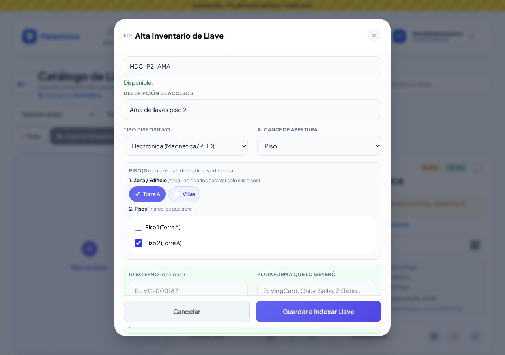
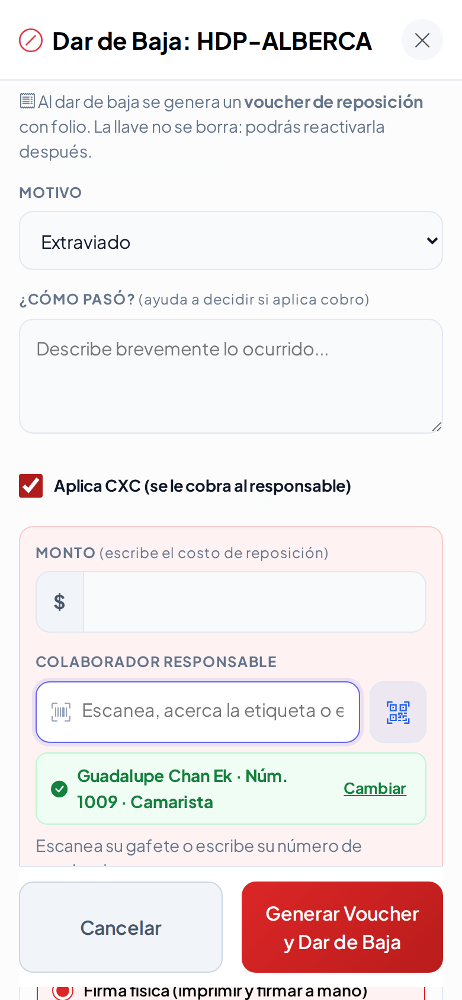
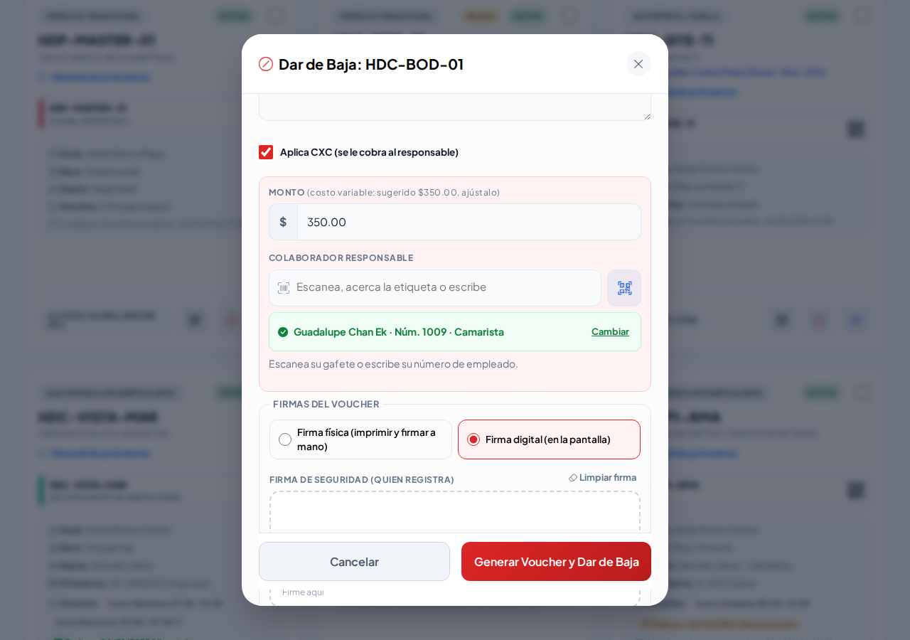
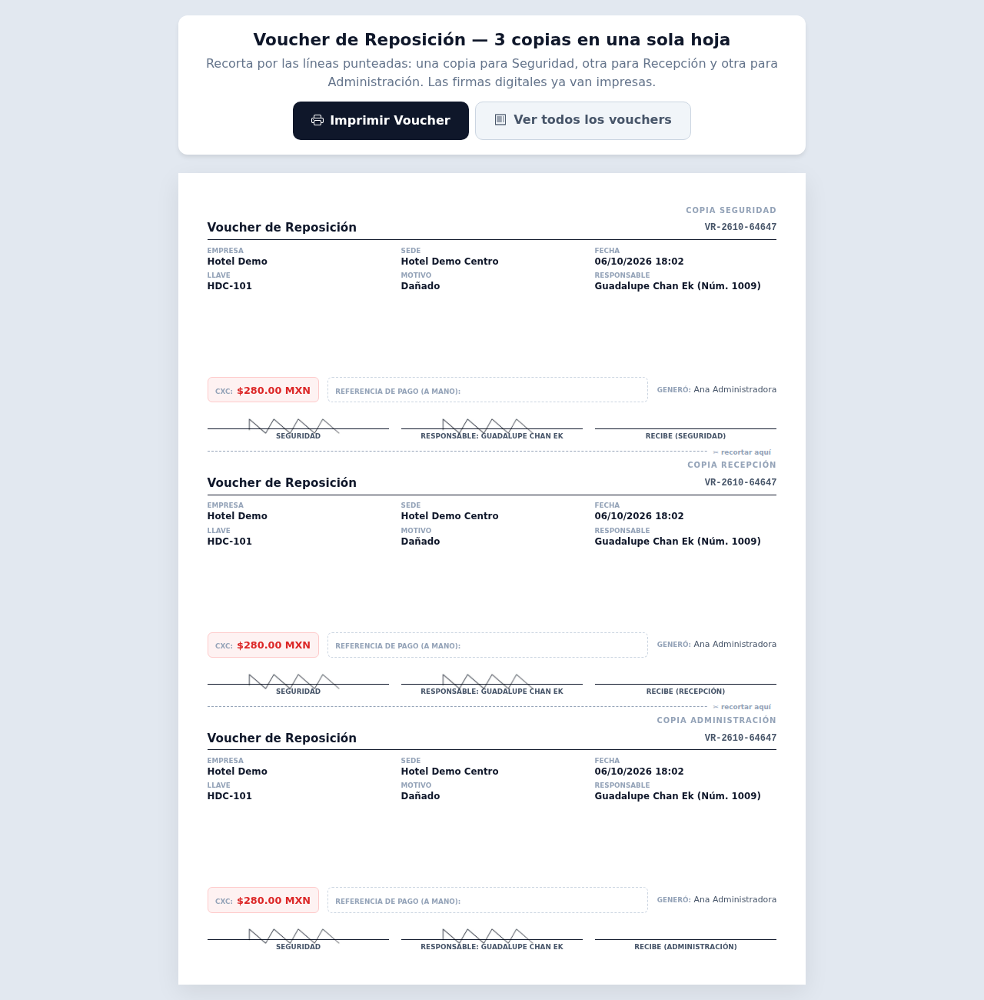
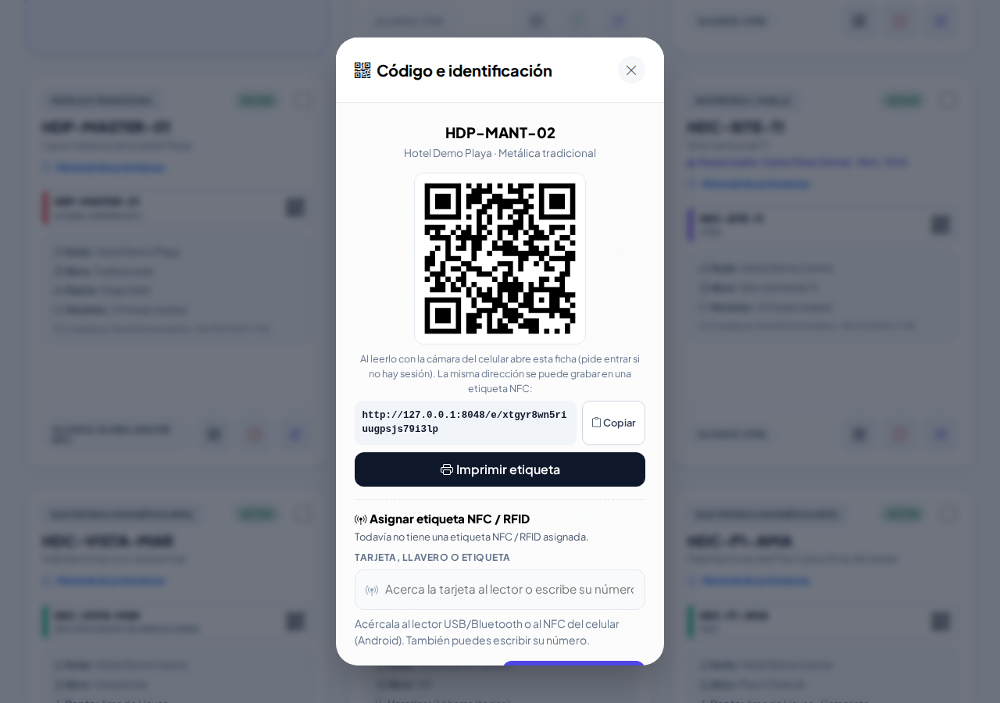
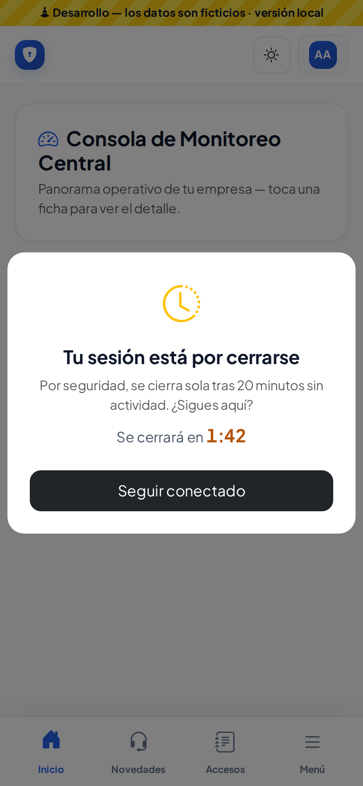

# Lección 28 · Ajustes de la ronda 5 (parte 1): Llaves, QR en ventana, lector y sesión

**Duración:** 25 minutos · **Para:** guardias de caseta, supervisores y administradores.

En esta ronda se atendieron las notas que dejó el dueño al probar la plataforma. Aprenderás:

1. A elegir los lugares de una llave **en cascada**: edificio → piso → cuarto.
2. Que el nombre de una llave se repite **solo por sede**.
3. A buscar a un colaborador **sin presionar Enter**.
4. A dar de baja una llave con **costo fijo o variable** y con **firma digital o en papel**.
5. A usar la ventana **Código e identificación** (QR, imprimir y NFC/RFID) en cualquier ficha.
6. Qué pasa cuando la sesión está por cerrarse.

---

## 1. Lugares en cascada (Catálogo de llaves)

1. Entra a **Padrones → Catálogo de llaves** y toca **Nueva Llave**.
2. Elige la sede **Hotel Demo Centro**.
3. En **Alcance de Apertura** elige **Piso**.
4. Toca la píldora **Torre A**: solo aparecen *Piso 1 (Torre A)* y *Piso 2 (Torre A)*.
5. Marca **Piso 2 (Torre A)**.
6. Ahora cambia el alcance a **Área específica / Cuarto**: toca **Torre A**, luego **Piso 2**. Solo verás los cuartos 201 a 204.

> Si no tocas ninguna píldora, ves todos los lugares de la sede. Puedes tocar varias; lo que ya marcaste nunca se esconde.

**Práctica:** registra `hdc-p2-ama` con alcance Piso, marca *Piso 2 (Torre A)* y un horario «Limpieza» de 08:00 a 16:00. La ficha dirá «Abre: Piso 2 (Torre A)».

## 2. El nombre es único por sede

- `HDC-101` no se puede repetir dentro de **Hotel Demo Centro**.
- Sí puede existir otra `HDC-101` en **Hotel Demo Playa**.
- Mientras escribes, debajo del nombre aparece «Ya existe uno con ese nombre en esta sede.» o «Disponible.».

## 3. Buscar sin Enter

En cualquier campo con el ícono del lector (responsable, colaborador, llave, gafete…), escribe el número de empleado, por ejemplo `1009`. En menos de un segundo aparece solo. Con un lector de tarjetas o de código de barras todo sigue igual: el lector manda su «Enter» y busca al instante.

## 4. Baja con voucher: costo y firmas

1. En la ficha de **HDC-BOD-01** toca el **círculo rojo**.
2. Motivo **Dañado** y marca **Aplica CXC**.
3. El monto viene **sugerido en $350.00**: esta llave tiene **costo variable**, así que puedes ajustarlo. (Una llave con **costo fijo** trae su monto y no se cambia.)
4. Escribe `1009` en el responsable (sin Enter).
5. En **Firmas del voucher** elige:
   - **Firma física**: después imprimes el voucher y firman a mano. En **Vouchers de reposición** tocas **Registrar firma en papel** (con foto de la hoja si quieres).
   - **Firma digital**: firman en la pantalla Seguridad y el responsable.
6. Toca **Generar Voucher y Dar de Baja**.

Las tres copias son para **Seguridad, Recepción y Administración**. El colaborador firma pero **no recibe copia**. Como hay cobro, las copias se envían por correo a las listas de **Configuración → Avisos por correo**.

## 5. Código e identificación

Toca el ícono **QR** de una ficha (vehículo, llave, gafete, equipo, equipo de Protección Civil, colaborador o artículo de Lost & Found). Sin salir de la pantalla verás:

- el **QR** (con la cámara del celular abre la ficha);
- la **dirección** con **Copiar**;
- **Imprimir** (etiqueta, calcomanía o gafete), que sí abre la hoja de impresión;
- **Asignar etiqueta NFC / RFID**: acerca el tag al lector y se guarda solo. Si ya es de otro registro, te dice de cuál.

Al **reactivar** una llave (flecha verde) esta ventana se abre sola, para reimprimir su etiqueta o cambiarle la tarjeta.

## 6. La sesión ya avisa

- Tras 18 minutos sin usar la plataforma aparece **«Tu sesión está por cerrarse»** con la cuenta regresiva. Toca **Seguir conectado**.
- Si tienes varias pestañas, con usar una basta.
- Si el celular se bloqueó y volviste tarde, verás **«Sesión finalizada por seguridad»** al entrar otra vez.

---

## Nota para después (Zonas y áreas · Z-08)

Las **Secciones** de Zonas y áreas se llamarán **Categoría de habitación** (con un costo por categoría) y en Llaves nacerá la **Sección de llaves** (un grupo de cuartos que abre una maestra, sin importar edificio o piso). Todavía no cambia nada en pantalla.

## Repaso

1. ¿Puede haber dos llaves `HDC-101`? *Sí, si son de sedes distintas.*
2. ¿Qué haces si el monto de una baja no se puede cambiar? *Es una llave con costo fijo: el monto lo define su ficha.*
3. ¿Quién recibe copia del voucher? *Seguridad, Recepción y Administración; el colaborador no.*
4. ¿Dónde asignas un tag NFC a un vehículo? *En su ficha, ícono QR → Asignar etiqueta NFC / RFID.*
