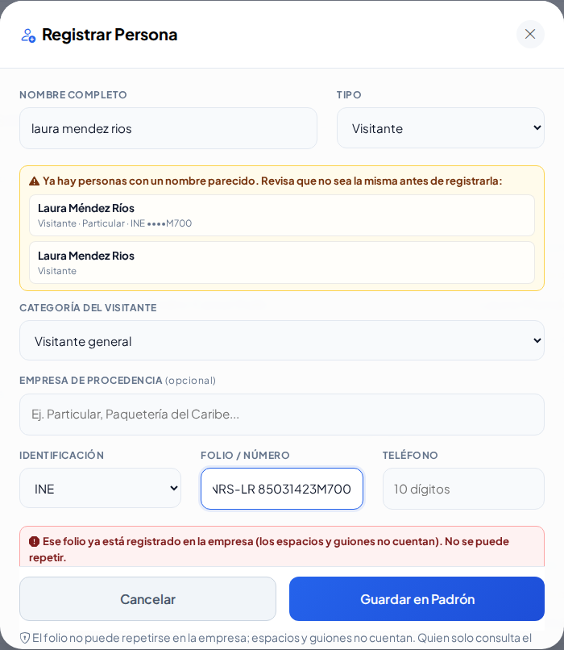
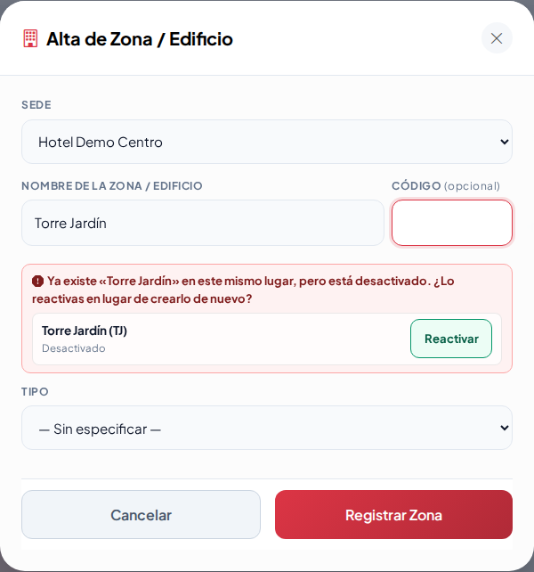

# Lección 30 · Ajustes de la ronda 5 (parte 2): avisos en vivo, empresas y ficha del proveedor

**Duración:** 20 minutos · **Para:** guardias de caseta, supervisores y administradores.

En esta parte se atendieron más notas del dueño. Aprenderás:

1. Que la plataforma te avisa **mientras escribes** si algo ya existe o se parece.
2. Que la **empresa** de una persona depende de su **tipo** (contratista o proveedor).
3. Que al agregar personal o vehículos **desde la ficha de una empresa**, la empresa ya viene puesta y al cerrar regresas a la ficha.
4. La diferencia entre **Categoría** y **Tipo / Estilo** de un vehículo.
5. Que en **Transporte** también aparece «¿Es alguno de estos?».

## Antes de empezar

Entra a QA con **`admin.demo`** (contraseña de la demo). Para el paso 6 usa **`agente.demo`**.

## Práctica

### 1. Folio repetido (Personas)

1. Ve a Padrones → **Padrón de Personas** → **Registrar Persona**.
2. En **Nombre completo** escribe `laura mendez rios`.
   - Aparece una caja **amarilla**: hay personas con un nombre parecido.
3. En **Folio / Número** escribe `MNRS-LR 85031423M700` (con guion y espacio).
   - Aparece una caja **roja**: «Ese folio ya está registrado en la empresa». Los espacios y guiones no cuentan.
4. Toca **Cancelar**. No guardes.

### 2. La empresa según el tipo

1. Abre otra vez **Registrar Persona**.
2. Cambia el **Tipo** a **Contratista**.
   - En **Empresa que representa** solo salen las contratistas (Constructora Maya, Plomería Express Cancún).
3. Cambia el **Tipo** a **Proveedor**.
   - Ahora salen los proveedores, transporte, agencias y taxis.

### 3. Desde la ficha de Constructora Maya

1. Ve a Padrones → **Empresas Externas** → **Constructora Maya** → **Ficha** → **Personal** → **Agregar persona**.
   - La empresa ya viene puesta, con un candado.
2. Toca **Cerrar** (la X).
   - Regresas a la ficha de Constructora Maya, no al Padrón de Personas.
3. Repite con **Flotilla** → **Agregar vehículo**. Al cerrar, también regresas a la ficha.

### 4. Categoría y Tipo / Estilo

1. Ve a Padrones → **Padrón Vehicular**.
2. Mira la línea de filtros: **Categoría** (píldoras) y **Tipo / Estilo** (lista).
3. Elige **Taxis** y luego en Tipo / Estilo elige **SUV / Camioneta**: ves solo los taxis tipo SUV.

Recuerda: **Categoría = de quién es**; **Tipo / Estilo = qué forma tiene**. «Otro» es un Tipo / Estilo.

### 5. Zonas y áreas

1. Ve a Estructura → **Zonas y áreas** → **Nueva Zona / Edificio**.
2. Escribe el nombre `Torre-A` y el código `t-a`.
   - Las dos cajas amarillas dicen que se parecen a **Torre A (TA)**.
3. Borra todo y escribe el nombre `Torre Jardín`.
   - La caja roja dice que ya existe pero está **desactivada** y te ofrece **Reactivar**.
4. Toca **Reactivar**. Torre Jardín vuelve a estar activa.
5. Entra a **Torre A** → **Piso 1** → **101** y abre «¿No encuentras el tipo…?». Elige **Tipo de elemento** y escribe `cama`: te dice que ya existe.

### 6. Transporte (como `agente.demo`)

1. Entra como **`agente.demo`**. Ve a Operación → **Bitácora de transporte** → **Registrar**.
2. En **Placas** escribe `TKH-102`.
   - Aparece **¿Es alguno de estos?** con TKH101 y TKH205.
3. En **Chofer** escribe `JUAN CARLOS POT CHAN`.
   - Aparece **JUAN CARLOS POOT CHAN**. Tócalo: se escribe solo.
4. Toca **Cancelar**.

## Para recordar

- **Rojo** = ya existe: no se guardará. **Amarillo** = se parece: revisa. **Verde** = disponible.
- Si algo ya existe pero está dado de baja, **reactívalo** en vez de crearlo de nuevo.
- Los avisos de la ventana que solo informan (por ejemplo «Úsalo solo si la persona no aparece…» en el registro rápido) ya no desaparecen al cerrar y volver a abrir la ventana.
