# Lección 31 · Ajustes de la ronda 6: avisos en todos los padrones, Etiquetas QR y voucher recuperado

**Duración:** 25 minutos · **Para:** guardias de caseta, supervisores, Recursos Humanos y administradores.

En esta ronda se atendieron más notas del dueño. Aprenderás:

1. Que **todos** los padrones te avisan mientras escribes si algo ya existe o se parece (empresas, placas, colaboradores, gafetes, equipos y etiquetas NFC).
2. A imprimir **muchas etiquetas QR de una vez** en Padrones → **Etiquetas QR**.
3. Qué hacer cuando **aparece** algo que tenía voucher: **Recuperado**.
4. Que las **zonas de descarga** pueden tener capacidad máxima.
5. Detalles de Rutas, Equipos y Gafetes.
6. Que los filtros **empiezan limpios** cada vez que entras.

## Antes de empezar

Entra a QA con **`admin.demo`** (contraseña de la demo). Para el paso 7 usa **`agente.demo`**.

## Práctica

### 1. Empresa que ya existe (Proveedores)

1. Padrones → **Empresas externas** → tarjeta **Registrar** (Nueva Empresa Externa).
2. En **Razón Social** escribe `Abarrotes del Caribe SA`.
   - Aparece una caja **amarilla**: se parece a «Abarrotes del Caribe» y a «Abarrotes del Caribe S.A. de C.V.». No cuentan «S.A. de C.V.» ni los signos.
3. Toca **Cancelar**.

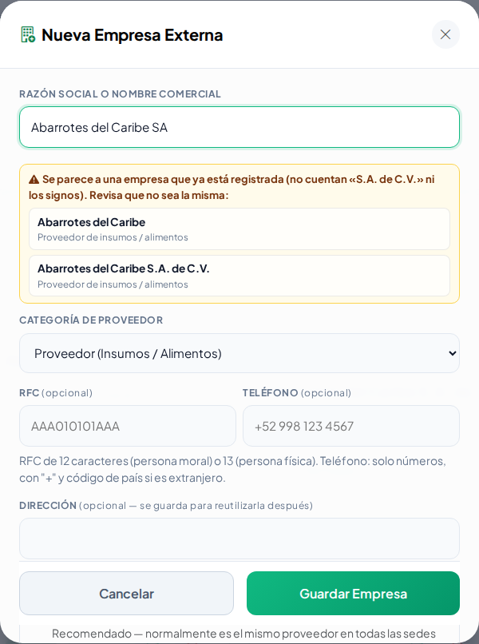

### 2. Placas parecidas (Vehículos)

1. Padrones → **Padrón vehicular** → **Registrar Vehículo**.
2. En **Placas** escribe `ABCI23A` (con la letra I en vez del uno).
   - Caja amarilla: se parecen a **ABC123A**. Si escribes `ABC-123-A`, la caja es **roja**: ya existen.
3. Toca **Cancelar**.

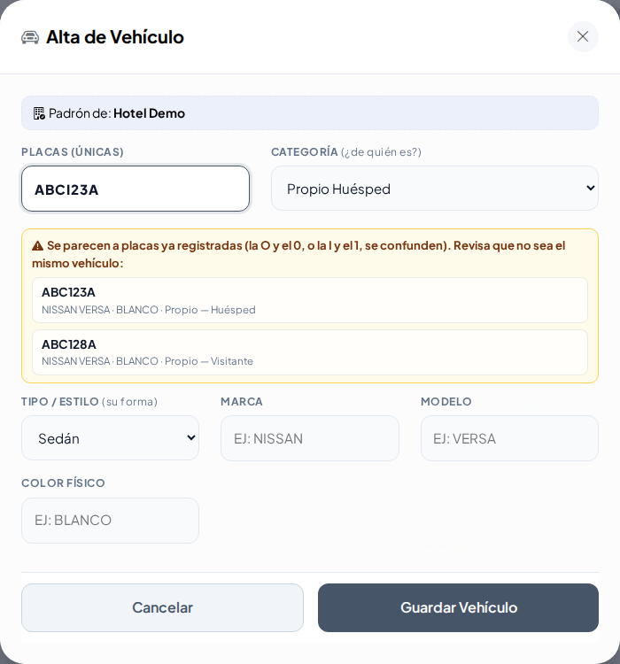

### 3. Colaborador repetido

1. Recursos Humanos → **Colaboradores** → **Alta de Colaborador**.
2. En **Núm. Empleado** escribe `1005`: caja roja, ya lo tiene Roberto Hernández Cruz.
3. Escribe el nombre `Roberto` y los apellidos `Hernández` y `Cruz`: caja amarilla, ya existe alguien con ese nombre.
4. Toca **Cancelar**.

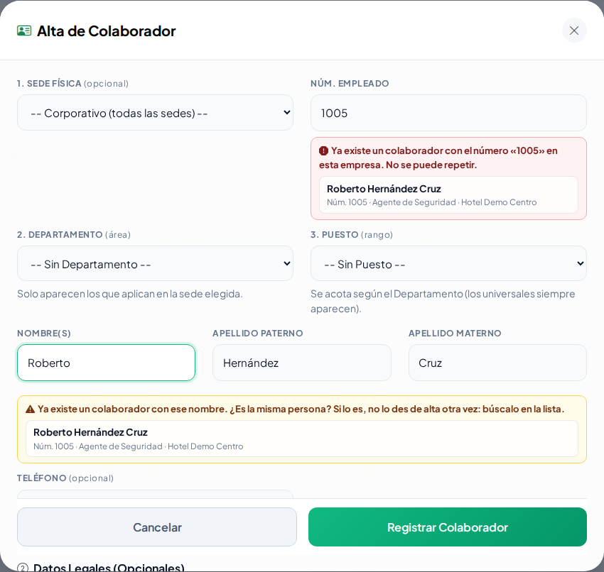

### 4. Etiqueta NFC que ya tiene otro

1. Padrones → **Gafetes**. En cualquier gafete toca el botón **QR** («Código e identificación»).
2. En **Tarjeta, llavero o etiqueta** escribe `04A1B2C3D4` (sin oprimir Enter).
   - Caja roja: «Esa tarjeta o etiqueta ya la tiene la llave «HDC-101»». Así sabes **antes** de guardar.
3. Cierra la ventana.

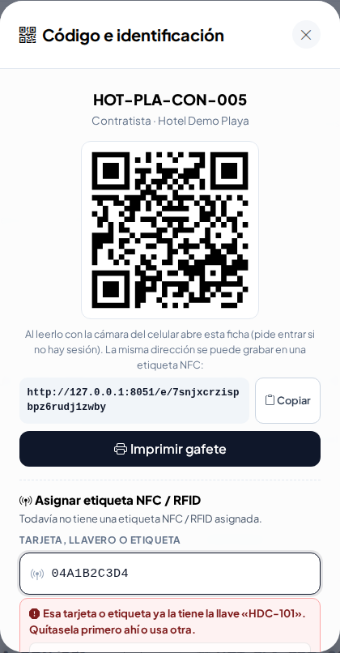

### 5. Imprimir etiquetas QR en bloque

1. Padrones → **Etiquetas QR**.
2. Toca la píldora **Llaves**. El tamaño cambia solo a **Llavero pequeño**.
3. Marca tres llaves (o **Marcar todas**). El botón dice **Imprimir 3**.
4. Toca **Imprimir**: se abre otra pestaña con la hoja. Ahí toca **Imprimir Etiquetas** (en la impresora: tamaño real / 100 %).
5. Regresa y toca **Vehículos**: el tamaño cambia a **Calcomanía vehicular**.

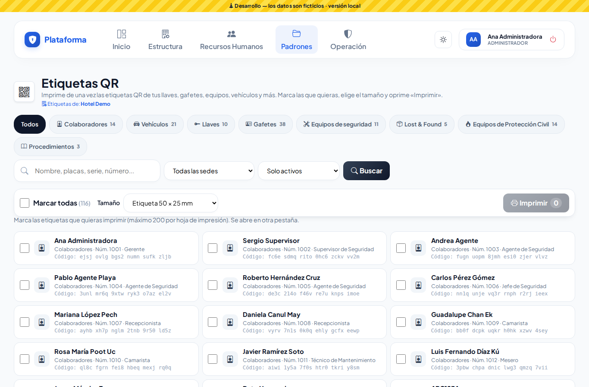
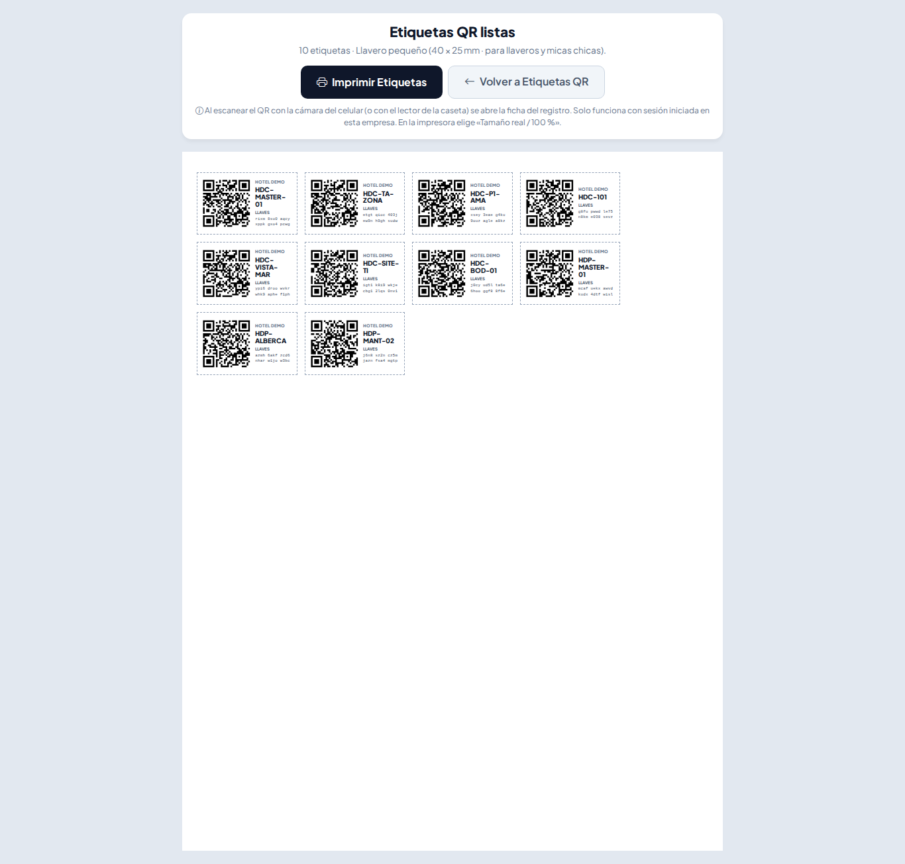

### 6. Voucher recuperado

1. Padrones → **Vouchers de reposición**.
2. En el voucher del gafete **HOT-CEN-VIS-010** (con cobro de $150.00) toca **Recuperado**.
3. Deja **sin marcar** «Ya se le cobró al responsable», escribe `Lo entregó Ama de Llaves` y toca **Confirmar recuperado**.
   - El voucher queda **Cancelado por recuperación** y dice **COBRO CANCELADO**. El gafete vuelve a estar activo en Gafetes.
4. Mira el voucher de la llave **HDP-MANT-02**: está en **Reembolso pendiente** (ya se le había cobrado). Toca **Reembolso entregado** y confirma: queda **Reembolsado**.
5. Con el filtro **Cualquier estado** elige **Reembolsado** para verlo solo.

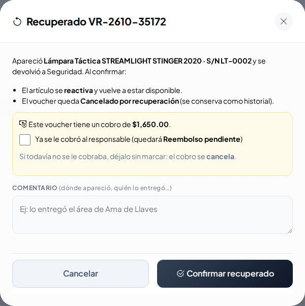

### 7. Lo que ve el Agente

1. Sal y entra como **`agente.demo`**.
2. Padrones → **Etiquetas QR**: solo aparece **Lost & Found** (en los demás padrones el Agente solo consulta).
3. Padrones → **Vouchers**: no aparecen **Recuperado** ni **Reembolso entregado**.

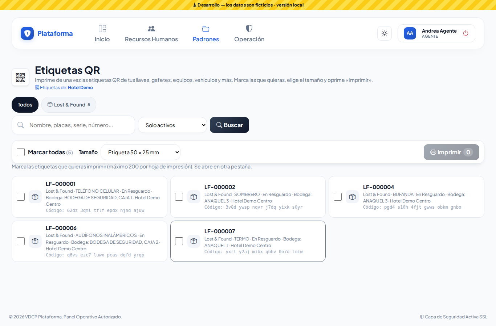

### 8. Zona de descarga con capacidad

1. Padrones → **Estacionamientos**. Mira **Patio de Maniobras**: dice **0 / 4 vehículos**.
2. Toca la tarjeta **Nueva Zona** (con el +), elige **Zona de Descarga**: la **Capacidad máxima de vehículos** es opcional.
3. Toca **Cancelar**.

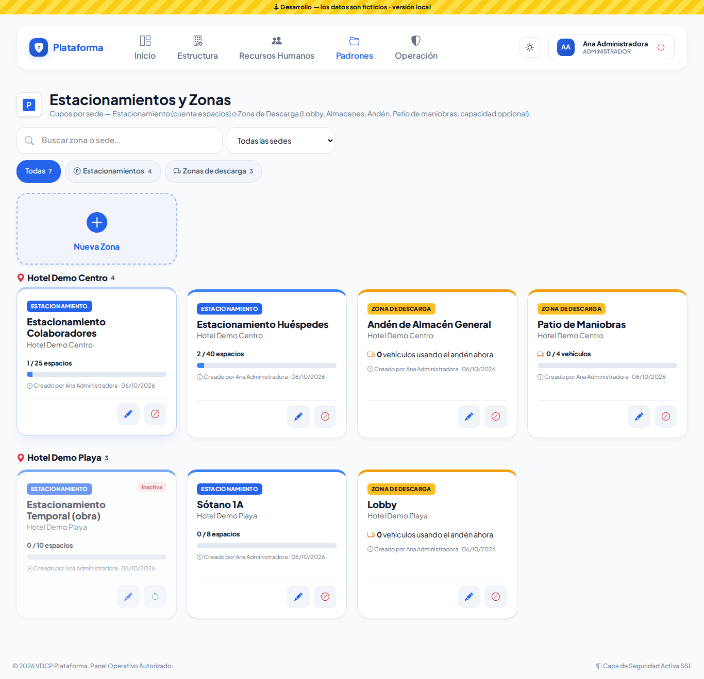

### 9. Rutas, Equipos y Gafetes

1. Padrones → **Rutas de transporte** → **Hotel Demo Centro**: tiene **6 paraderos** activos («PARADERO DE PRUEBA» está desactivado: es el de la lección 26).
2. **Nueva Ruta**: agrega dos paraderos al Horario 1 y toca **Agregar otro Horario**: el Horario 2 ya trae esos paraderos. El diálogo tiene una sola barra para desplazarte.
3. Padrones → **Equipos de seguridad** → edita el **Radio MOTOROLA SL500E** (**Serie: 130TXP1568**): bajo **Estado actual** se explica que, en mantenimiento, solo puede pasar a **Disponible**.
4. Padrones → **Gafetes** → **Generar lote**: bajo **Cantidad a Crear** dice **Máximo 50 por lote**.

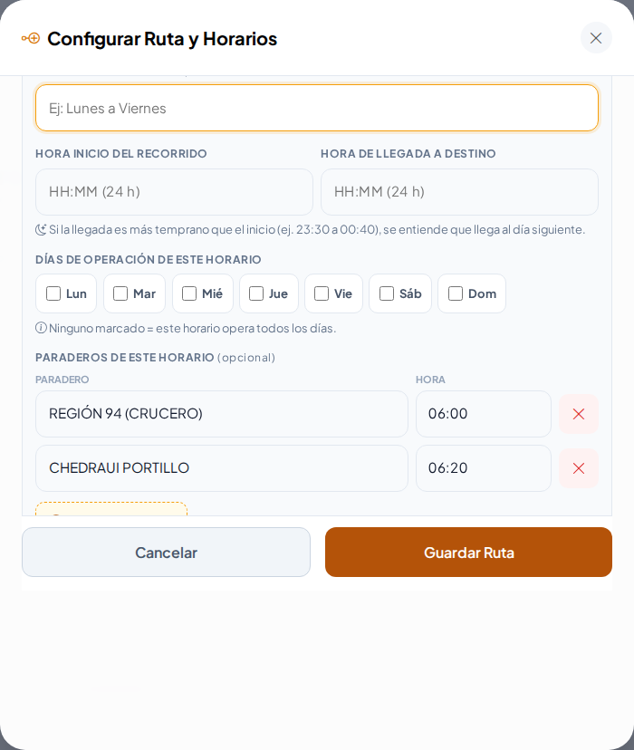
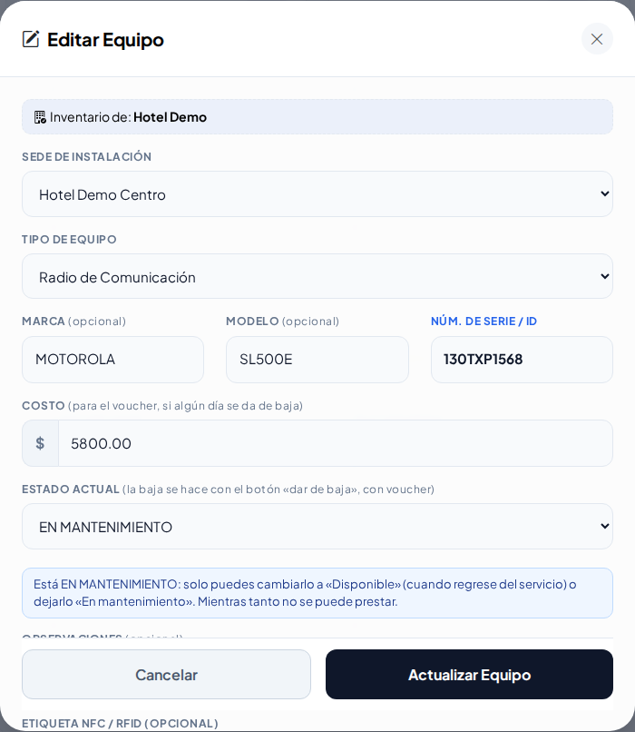

### 10. Filtros limpios al entrar

1. En **Vehículos**, escribe `TKH` en el buscador.
2. Sal (botón de apagado) y entra como **`jefe.demo`** en el mismo navegador.
3. Abre **Vehículos**: el buscador está **vacío**. Lo que dejó otro usuario ya no te afecta.

## Repaso

- Caja **roja** = no se puede guardar así; caja **amarilla** = revisa, puede ser el mismo; verde = disponible.
- **Etiquetas QR** imprime muchas a la vez; la de un solo registro sigue en su botón **QR**.
- **Recuperado** reactiva el artículo y cancela el cobro o lo deja **Reembolso pendiente**.
