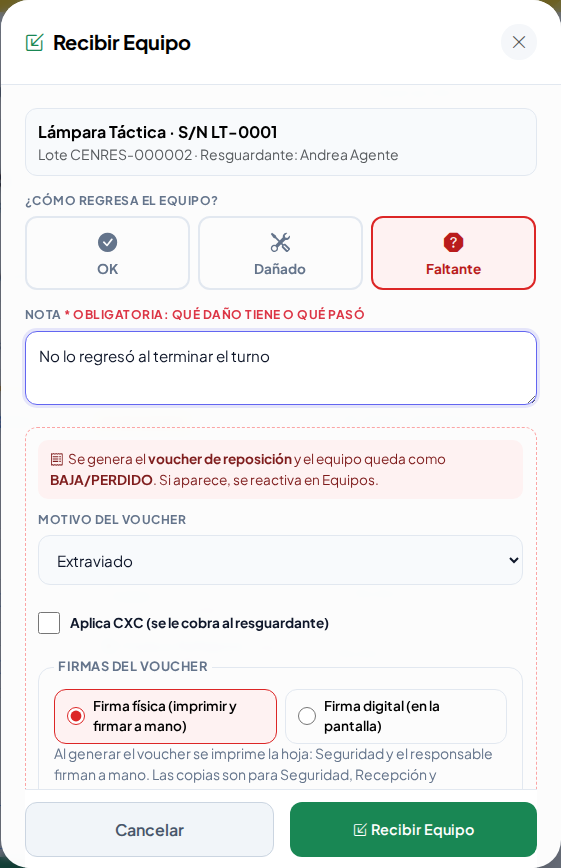
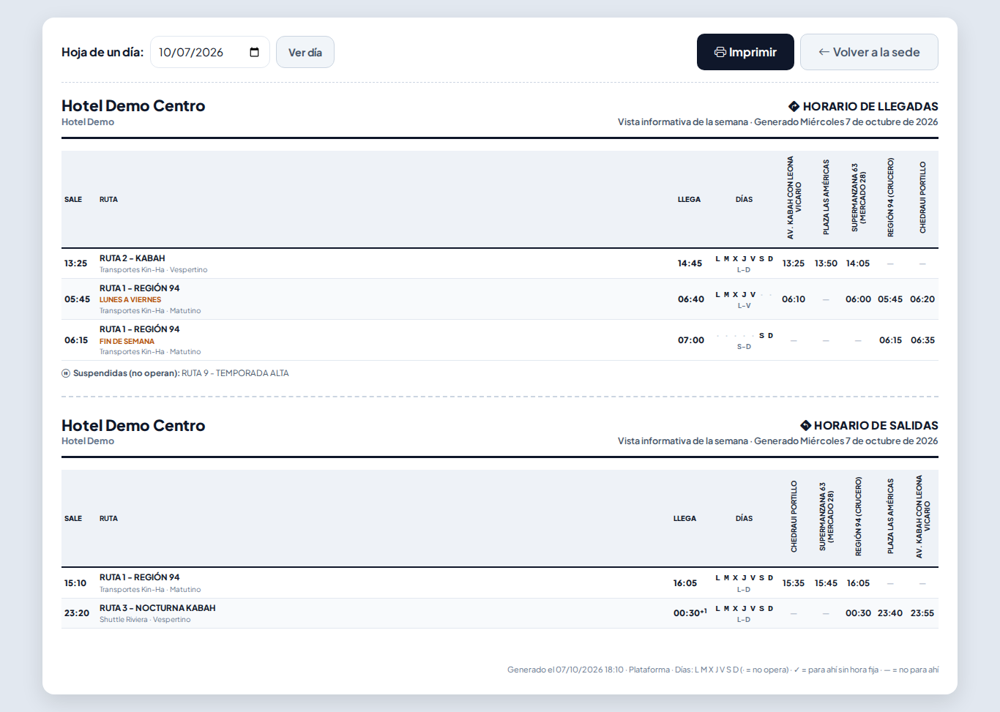
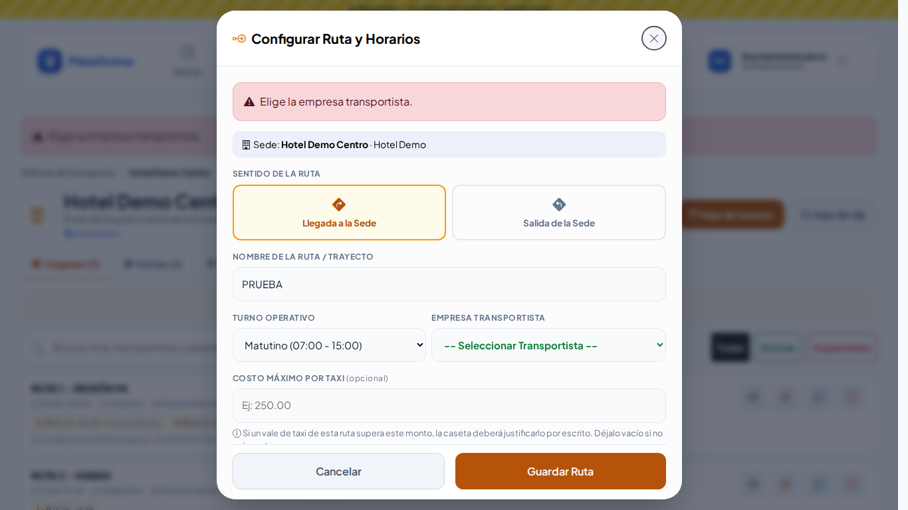

# Lección 34 · Ajustes de la ronda 8: firmas del Accidente, tickets bien clasificados, devolución parcial y horarios de la semana

**Duración:** 25 minutos · **Para:** guardias de caseta, supervisores, jefes de seguridad y administradores.

En esta ronda se atendieron las notas del dueño en el tracker de QA. Aprenderás:

1. Que las **firmas del Accidente** cambian según quién se accidentó (huésped o colaborador).
2. Que un **ticket nuevo** pide su clasificación y solo se canaliza al **personal de Seguridad**.
3. Que los **filtros** de las listas se aplican solos y que los **apartados largos se contraen**.
4. A encontrar a alguien en Accesos por el nombre de su **acompañante**.
5. A **recibir un equipo a la vez** en Responsivas (OK, Dañado o Faltante).
6. A imprimir la **hoja de horarios de la semana** de Rutas (también el Agente).
7. Que las ventanas tienen **una sola barra** de desplazamiento.

## Antes de empezar

Entra a QA con **`admin.demo`** (contraseña de la demo). Para los pasos 6 y 8 usa **`agente.demo`**.

## Práctica

### 1. Firmas de un Accidente de huésped

1. Operación → **Novedades** → en el ticket **#00002** (Accidente / Lesión) toca **Abrir Expediente**.
2. Abre **Firmas Digitales de Cierre**. La lista dice *Huésped / Afectado, Testigo, Agente de Seguridad (Atiende), Supervisor de Seguridad, Médico / Enfermería, Gerente en Turno*.
3. Elige **Testigo**, firma en el recuadro y toca **Guardar Esta Firma** → **Guardar Expediente**.
   - Regresas a la lista con «Expediente #00002 guardado correctamente.»
4. Abre **#00006** y en **Tipo de Afectado** elige *Colaborador Interno*: la lista de firmantes cambia (Colaborador Afectado, Jefe Inmediato, … Recursos Humanos).

### 2. Ticket nuevo sin clasificación

1. **Nuevo Ticket** → escribe quién reporta, la ubicación y qué sucedió, pero deja **Categoría** en «-- Elige la clasificación --» → **Despachar Ticket**.
   - La ventana te pide elegir la clasificación.
2. Elige la sede **Hotel Demo Centro** y abre **¿A quién se canaliza?**: solo aparecen agentes, supervisores, jefes y mandos (no Recursos Humanos).

### 3. Filtros automáticos y apartados que se contraen

1. Operación → **Lost & Found**: escribe `lentes` en la búsqueda y espera un momento; la lista se filtra sola (ya no hay botón «Buscar»).
2. Novedades → abre **#00008** (Robo): los apartados *1. Circunstancias*, *2. Sospechoso*, *3. Testigos* y *4. Canalización* se abren y cierran tocando su título. Cierra el 1 y vuelve a abrir el expediente: la plataforma lo recordó.

### 4. Buscar por acompañante

1. Operación → **Accesos** → en la búsqueda escribe `sofia`.
2. Aparece **LAURA MÉNDEZ RÍOS** con el aviso «Coincide con SOFÍA MÉNDEZ, acompañante de LAURA MÉNDEZ RÍOS».
3. **Nuevo Ingreso → Dar Salida** y escribe `sofia`: también la encuentra y lo avisa.

### 5. Recibir un equipo de un lote

1. Operación → **Responsivas**. El lote **CENRES-000002** ya tiene un equipo **DEVUELTO** y otro en campo.
2. En **PLARES-000003** toca **Recibir** en el radio, deja **OK** y toca **Recibir Equipo**: «Del lote PLARES-000003 falta 1 equipo por regresar.»
3. En el chaleco toca **Recibir** → **Faltante** → escribe «No lo regresó» → motivo **Extraviado** → **Recibir Equipo**.
   - Se genera el voucher de reposición, el chaleco queda de BAJA y el lote pasa a **Historial Devueltos**.
4. Abre la **Hoja** del lote: la columna **Devolución** dice cómo y cuándo regresó cada equipo.

### 6. Hoja de horarios de la semana

1. Padrones → **Rutas de transporte** → **Hotel Demo Centro** → **Hoja de horarios**.
2. RUTA 1 - REGIÓN 94 aparece dos veces: 05:45 de lunes a viernes (`L M X J V · ·`) y 06:15 sábado y domingo (`· · · · · S D`). RUTA 9 sale al pie como **suspendida**.
3. **Hoja del día** con un miércoles: al pie dice «No operan este día: RUTA 1 - REGIÓN 94 06:15 (Sábado y domingo)».
4. Entra como **agente.demo** y repite: también puede abrirla e imprimirla.

### 7. Una sola barra en las ventanas

1. Rutas → Hotel Demo Centro → **Nueva Llegada** → escribe un nombre y toca **Guardar Ruta** sin transportista.
2. El aviso sale dentro de la ventana; solo se desplaza el contenido de la ventana (la página de atrás no se mueve) y los botones quedan fijos abajo.

## Repaso

- El Accidente se firma con los firmantes de **su** tipo de afectado; lo demás del formato no cambió.
- Un ticket siempre lleva clasificación y se canaliza a Seguridad.
- En Responsivas cada equipo se recibe por separado; Dañado y Faltante piden nota y pueden generar el voucher de reposición.
- La hoja de horarios de la semana es la referencia para la caseta; la del día sigue como opción.
