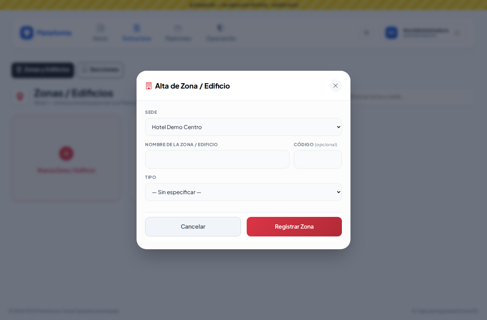
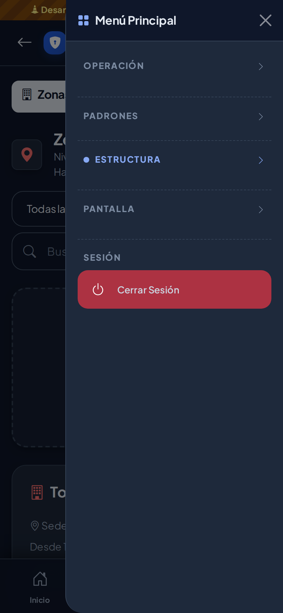

# Acceso, menú y diseño base

Réplica en Laravel de `login.php`, `login_proceso.php`, `logout.php`, `includes/header.php` e `includes/footer.php` de SEGCAT.

## Pantallas y rutas

| Ruta | Nombre | Qué hace |
|---|---|---|
| `GET /login` | `login` | Pantalla de acceso (solo invitados) |
| `POST /login` | `login.iniciar` | Valida usuario o correo y contraseña |
| `POST /logout` | `logout` | Cierra la sesión (antes era un enlace GET) |
| `GET /sesion/latido` | `sesion.latido` | Mantiene viva la sesión mientras hay actividad |
| `GET /sesion/expirada` | `sesion.expirada` | Destino del aviso de inactividad: cierra y avisa |
| `GET /` | `panel` | Consola de Monitoreo Central |
| `GET /modulos/{clave}` | `modulos.pendiente` | Pantalla provisional de un módulo aún no migrado (exige `clave.ver`) |

## Reglas de acceso (iguales a SEGCAT)

- Se entra con **usuario o correo**; solo cuentas activas de empresas activas (o el Super Administrador).
- **5 intentos fallidos** seguidos bloquean la cuenta **15 minutos**; un acceso correcto reinicia el contador.
- **20 minutos** sin actividad cierran la sesión; 2 minutos antes aparece el aviso "¿Sigues aquí?".
- Mientras hay actividad real (teclado, clic, mouse) un latido cada 3 minutos evita perder formularios largos.
- Desactivar a un usuario o a su empresa corta su sesión abierta en la siguiente petición.

Valores en `config/plataforma.php` (`sesion.*`). La inactividad se puede cambiar con `PLATAFORMA_INACTIVIDAD_MINUTOS`.

## Mejoras respecto a SEGCAT (sin cambio visible)

- Los mensajes ya no viajan en la URL (`?error=bloqueado&minutos=…`), sino en la sesión: nadie puede fabricar un aviso falso.
- Límite adicional por equipo (IP): 20 intentos por minuto, sin importar la cuenta.
- Cuando la cuenta no existe se hace igualmente una comprobación de contraseña, para que el tiempo de respuesta no revele qué cuentas existen.
- Al iniciar sesión solo se regresa a una pantalla del mismo sitio (nunca a otro dominio).
- Un formulario abierto demasiado tiempo (token vencido) regresa a la pantalla de acceso con aviso, en lugar del error 419.
- Cerrar sesión es un `POST` con token (un enlace `GET` permitía cerrar la sesión de alguien desde otra página).
- Sin código JavaScript en línea (`onclick`): todo vive en `public/js/plataforma.js`, lo que permite activar una política de seguridad de contenido estricta más adelante.
- Bootstrap 5.3.3, Bootstrap Icons 1.11.3 y la tipografía Plus Jakarta Sans se sirven desde el propio servidor (`public/vendor/`), sin depender de CDN externos.

## Componentes

- `App\Services\Autenticacion\Autenticador`: reglas de acceso; la reutilizará la API de las apps.
- `App\Http\Middleware\ControlarInactividad`: cierre por inactividad del lado del servidor.
- `App\Support\Menu\ConstructorMenu`: arma el menú según configuración y permisos.
- `resources/views/layouts/app.blade.php`: barra superior (PC), cabecera y barra inferior (celular), menú lateral, pie y aviso de sesión.
- `public/css/plataforma.css`: hoja de estilos central (los modos Sol y Noche van en `modos-pantalla.css`); colores como variables (`--color-primario`, `--color-acento`) que llegan de *Identidad de la plataforma*.

## Modos de pantalla: Normal, Sol y Noche (QA M-03)

El botón junto al nombre del usuario (en celular, junto al avatar y en *Menú → Pantalla*) recorre **Normal → Sol → Noche → Normal**. Ícono, `title` y `aria-label` indican el modo actual (`bi-sun`, `bi-brightness-high-fill`, `bi-moon-stars-fill`), p. ej. "Modo de pantalla: Sol".

- `public/js/modo-pantalla.js` se carga en `<head>` (archivo externo, sin JavaScript en línea) y pone la clase `modo-sol` o `modo-noche` en `<html>` antes de pintar, así no hay destello. También aplica en la pantalla de acceso.
- Se recuerda por equipo en `localStorage` (`plataforma_modo_pantalla`), siempre dentro de `try/catch`; sin almacenamiento queda Normal. Quien tenía el alto contraste anterior (`plataforma_alto_contraste = 1`) pasa a **Sol** y la clave vieja se borra.
- `public/css/modos-pantalla.css` (hoja aparte de `plataforma.css`) redefine las variables (`--fondo`, `--texto`, `--texto-suave`, `--borde`…) y ajusta los componentes que tienen colores fijos.
  - **Sol**: fondo blanco puro, texto `#000`, bordes negros de 2 px, botones y etiquetas de color sólido y oscuro, letra más gruesa, sin vidrio (`backdrop-filter`) ni transparencias.
  - **Noche**: fondo `#0f172a`, tarjetas `#1e293b`, texto claro, bordes apagados; el color principal se aclara para textos (`--primario-claro`) y la franja de QA pasa a ámbar oscuro. Activa también `data-bs-theme="dark"` de Bootstrap (alertas, ventanas, menú lateral) y `color-scheme: dark`.
- Para una pantalla nueva: usar las variables y las clases comunes (`.tarjeta`, `.ficha-card`, `.campo`, `.btn-icono`, `.dialogo`…) y no escribir colores fijos en `style="…"`; así hereda los tres modos.

| Normal | Sol | Noche |
|---|---|---|
|  |  |  |
|  |  |  |

## Menú lateral del celular (QA M-04)

Todos los grupos (Operación, Padrones, Estructura, Pantalla) inician **cerrados**: el usuario elige a dónde ir. El grupo que contiene la pantalla actual se resalta (color principal y un punto) pero también inicia cerrado. En PC el menú es distinto (desplegables de la barra superior) y no cambia.

 

## Menú configurable

Tabla `menus` (botones de la barra: Estructura, Padrones, Operación) y, en `modulos`, las columnas `menu_id`, `seccion_menu`, `orden_menu` y `color_icono`.

- Un módulo aparece solo si el usuario puede `modulo.ver` (el motor revisa también que la empresa lo tenga contratado).
- Un menú o una sección sin módulos visibles se oculta.
- En celular los grupos se ordenan por `orden_movil`: Operación primero, como en SEGCAT.
- El nombre visible sale, en este orden, de: el nombre que le dio la empresa (`empresa_modulos.nombre_visible`), la terminología del rubro (en un hotel, "Sedes" se llama "Hoteles") y el nombre del catálogo.
- La barra inferior del celular tiene atajos fijos a Novedades y Accesos si el usuario puede verlos.
- `MenuSeeder` solo acomoda módulos sin menú; lo que se cambie desde la interfaz se respeta.
- Mientras un módulo no tenga `ruta`, su enlace lleva a la pantalla "en migración".

## Pruebas

`tests/Feature/Acceso/InicioSesionTest.php`, `MenuTest.php` y `PantallaYMenuLateralTest.php`.
