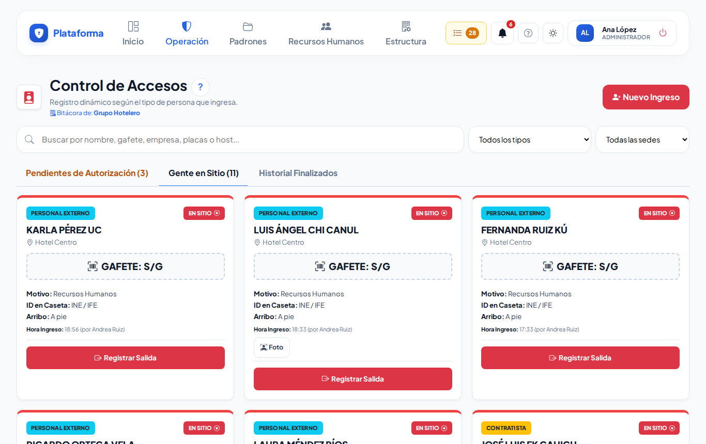
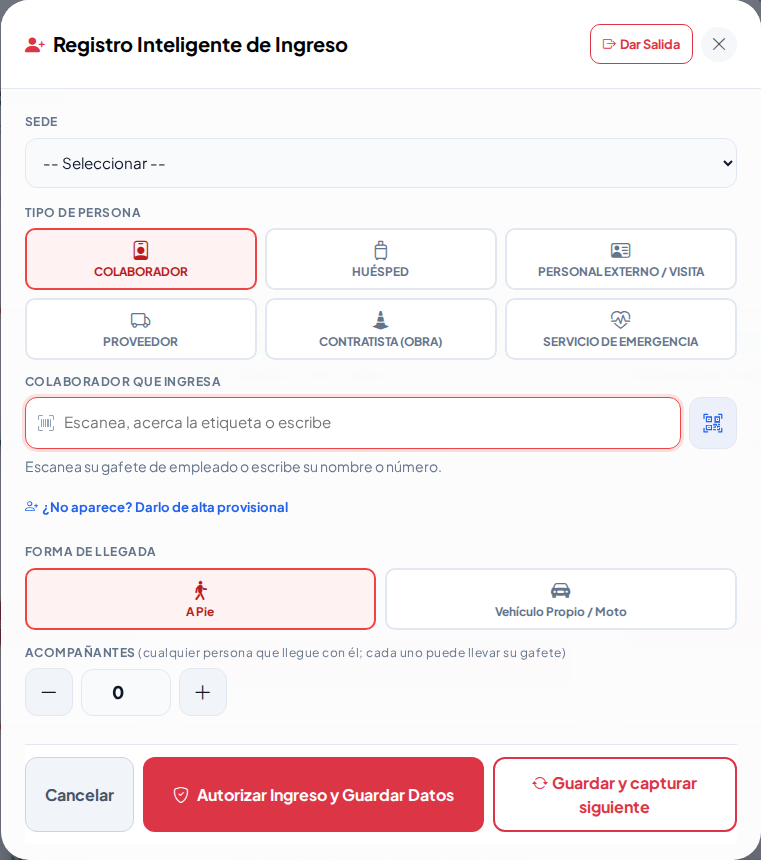
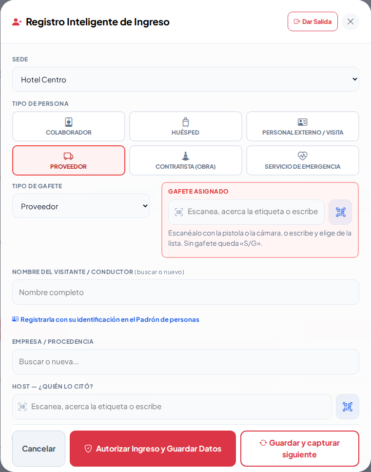
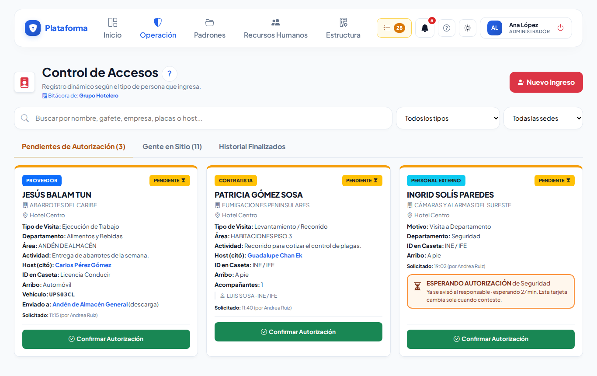
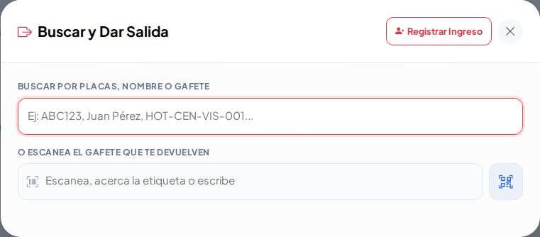
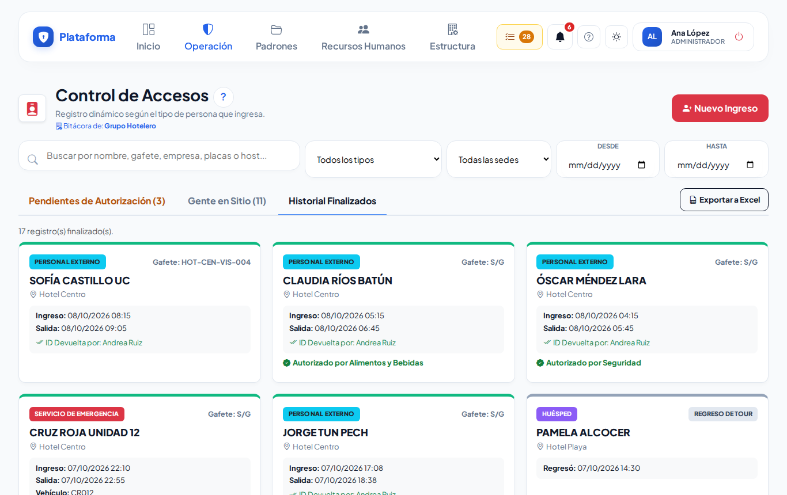
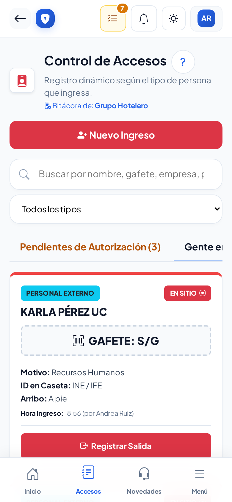
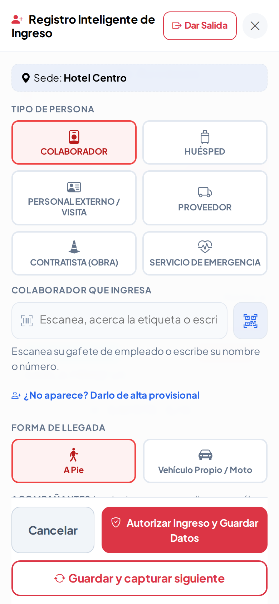
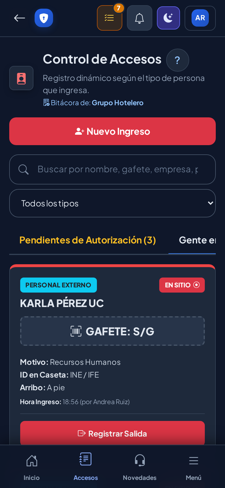
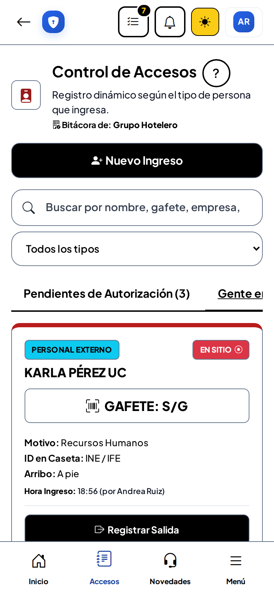

# Bitácora de accesos

**¿Para qué sirve?** Es la pantalla principal de la caseta. Aquí registras a **todas las personas que entran** a la sede (colaboradores, huéspedes, visitas, proveedores, contratistas y servicios de emergencia), ves **quién sigue dentro** y registras su **salida**.

**Antes de empezar:** necesitas que tu rol pueda **ver** y **crear** en Accesos. Si no ves el botón rojo **Nuevo Ingreso**, pide a tu administrador que revise tu rol. Para autorizar proveedores y contratistas se necesita además el permiso **Aprobar** (normalmente supervisores y jefes de seguridad).

## Cómo leer la pantalla

1. Entra a **Operación → Caseta → Bitácora de accesos** (en el celular, el botón **Accesos** de abajo).
2. Arriba están el botón **Nuevo Ingreso**, el buscador y los filtros de **tipo** y **sede**.
3. Abajo hay tres pestañas:

| Pestaña | Qué muestra |
|---|---|
| **Pendientes de Autorización** | Proveedores y contratistas que esperan que quien los citó los autorice. |
| **Gente en Sitio** | Todos los que están dentro ahora. |
| **Historial Finalizados** | Los que ya salieron, con filtro de fechas. |

**Qué debes ver:** una tarjeta por persona con su tipo (color), nombre, sede, **gafete** (o **S/G** si no lleva), motivo, identificación que dejó, cómo llegó y a qué hora entró y quién la registró.

## Cómo registrar un ingreso

1. Toca **Nuevo Ingreso**. Se abre **Registro Inteligente de Ingreso**.
2. Revisa la **Sede**. Si solo trabajas en una, ya viene elegida.
3. Toca el **Tipo de Persona**: Colaborador, Huésped, Personal Externo / Visita, Proveedor, Contratista (Obra) o Servicio de Emergencia. La ventana solo pide lo que hace falta para ese tipo.
4. Llena los datos (ver abajo por tipo).
5. Elige la **Forma de Llegada**: **A Pie** o **Vehículo Propio / Moto**. Con vehículo, escribe o escanea las **placas** y, si aplica, elige la zona de estacionamiento.
6. Si llega con más personas, usa **+** en **Acompañantes** y llena una fila por persona.
7. Toca **Autorizar Ingreso y Guardar Datos**. Si viene más gente detrás, toca **Guardar y capturar siguiente**: guarda y deja la ventana lista con la misma sede y tipo.

**Qué debes ver:** la ventana se cierra (o se limpia, si elegiste capturar siguiente) y la persona aparece en **Gente en Sitio**.

Lo que pide cada tipo:

- **Colaborador:** escanea su gafete de empleado o escribe su nombre o número y elígelo. No lleva gafete de visita. Si no aparece, toca **¿No aparece? Darlo de alta provisional**: se registra y Recursos Humanos lo valida después.
- **Personal Externo / Visita:** gafete (escanéalo o elígelo; solo salen gafetes **libres**), nombre (elígelo del Padrón de personas o escribe uno nuevo), **ID Custodiada** (la identificación que deja) y **Motivo de la Visita**.
- **Proveedor y Contratista (Obra):** además, la **Empresa / Procedencia** y **Host — ¿Quién lo citó?** (obligatorio). Quedan en **Pendientes de Autorización**.
- **Huésped:** nombre, número de habitación y si tiene reserva. No lleva gafete.
- **Servicio de Emergencia:** solo lo mínimo para no hacer esperar: unidad, tipo de emergencia y observaciones.

Si escribes a mano un nombre que ya existe en el Padrón de personas, al guardar sale el aviso rojo «Ya existe una persona registrada con este nombre…»: toca **Sí, es la misma** para usar su registro, o **No, es alguien distinto** para crear otra persona.

## Cómo autorizar a un proveedor o contratista

1. Abre la pestaña **Pendientes de Autorización**.
2. Confirma con quien lo citó (el Host) que lo espera.
3. Toca **Confirmar Autorización** en su tarjeta.

**Qué debes ver:** la tarjeta pasa a **Gente en Sitio** con la hora de autorización. Si no tienes el permiso, la tarjeta dice que tu supervisor confirma la autorización.

## Cómo dar salida

Hay dos formas:

1. En la tarjeta de la persona toca **Registrar Salida** (en huéspedes, **Salida Final**) y confirma.
2. O bien, dentro de **Nuevo Ingreso** toca **Dar Salida**, escribe placas, nombre, gafete o habitación, **o escanea el gafete que te devuelven**, y toca la persona.

**Qué debes ver:** la persona pasa a **Historial Finalizados**. Sus acompañantes salen con ella, su gafete queda libre y su lugar de estacionamiento se libera. **Recoge el gafete y devuelve la identificación.**

Un acompañante puede salir antes con el botón **Salida** de su renglón.

## Cómo registrar una salida temporal o a tour

1. En huéspedes toca **Salida a Tour**; en proveedores y contratistas autorizados, **Salida Temporal**.
2. Si quieres, anota placas, marca y conductor. Guarda.
3. Cuando regrese, toca **Registrar Regreso**.

**Qué debes ver:** mientras está fuera, la tarjeta dice **FUERA EN TOUR** (o **FUERA**) y su gafete sigue reservado.

## Cómo cambiar la zona de estacionamiento

1. En una persona con vehículo toca **Cambiar Zona**.
2. Elige otra zona de la sede, o **Sin asignar (liberar)**. Guarda.

**Qué debes ver:** la tarjeta muestra la zona nueva en **Enviado a**.

## Cómo buscar y exportar el historial

1. Abre **Historial Finalizados**.
2. Escribe en el buscador (nombre, gafete, empresa, placas, host o el nombre de un **acompañante**) y elige tipo, sede y fechas **Desde / Hasta**.
3. Si tienes permiso, toca **Exportar a Excel** para bajar exactamente lo filtrado.

**Qué debes ver:** solo los registros que coinciden. Si buscas a un acompañante, la tarjeta dice «Coincide con …, acompañante de …».

## En el celular y en los modos Sol y Noche

Todo funciona igual en el celular: el botón **Nuevo Ingreso** ocupa todo el ancho y los botones de la ventana quedan abajo, a la mano.

## Si algo sale mal

| Mensaje o síntoma | Qué significa | Qué hacer |
|---|---|---|
| «El gafete … ya está en uso (EN SITIO). Pide que lo devuelvan o elige otro.» | Ese gafete lo tiene alguien que sigue dentro. | Usa otro gafete o da salida a quien lo tiene. |
| «El gafete … está dado de baja.» | El gafete ya no se usa. | Elige otro. |
| «Indica quién citó al proveedor/contratista (Host).» | Falta el Host. | Escribe y elige al colaborador que lo espera. |
| «La empresa «…» está dada de baja (vetada) en Proveedores: no puede ingresar.» | La empresa externa tiene prohibido el acceso. | No lo dejes pasar; avisa a tu supervisor. |
| «El colaborador elegido no existe, está dado de baja o no pertenece a esta sede.» | El colaborador no trabaja en esa sede. | Revisa la sede o usa el alta provisional. |
| «Las placas solo llevan letras y números (de 2 a 20).» | Las placas tienen símbolos o están incompletas. | Escríbelas sin guiones ni espacios. |
| «Este acceso ya no está pendiente de autorización (alguien más lo atendió).» | Otro compañero ya lo autorizó. | Revisa **Gente en Sitio**. |
| No sale el botón **Confirmar Autorización** | Tu rol no puede aprobar. | Pide a tu supervisor que lo autorice. |

## Preguntas frecuentes

- **¿Por qué el proveedor no aparece en Gente en Sitio?** Está en **Pendientes de Autorización** hasta que lo autoricen.
- **El colaborador no está en la lista.** Usa **¿No aparece? Darlo de alta provisional**; Recursos Humanos lo valida después.
- **Me equivoqué de zona.** Usa **Cambiar Zona**.
- **¿Cómo sé quién registró a alguien?** En la tarjeta, junto a la hora de ingreso, dice «por …».
- **¿Puedo usar la cámara del celular para el gafete?** Sí: toca el botón del código QR junto al campo.

## Relacionado

- [Préstamo de llaves](prestamo-llaves.md)
- [Pases de salida](pases-salida.md)
- [Bitácora de novedades](novedades.md)
- [Gafetes](gafetes.md)
- [Padrón de personas](personas.md)
