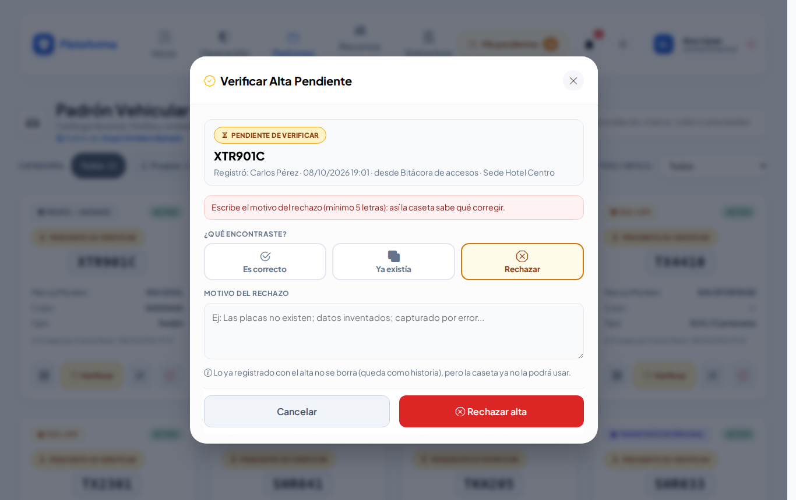

# Altas por verificar

**¿Para qué sirve?** En la caseta a veces llega **un auto, una persona o una empresa que no está en el padrón**. El guardia no puede detener la operación, pero si cada quien registra a su manera, el padrón se llena de repetidos («ABC-123-A» y «ABC123A», «Laura Méndez Ríos» y «LAURA MENDEZ RIOS»). Por eso:

1. Antes de registrar algo nuevo, la plataforma pregunta **«¿Es alguno de estos?»** y muestra lo parecido que ya existe.
2. Si no es ninguno, **se registra y se usa de inmediato**, pero queda **pendiente de verificar**.
3. Quien administra el padrón lo **revisa**: lo acepta, lo une con el registro correcto o lo rechaza.

Aplica al [Padrón vehicular](vehiculos.md), a [Empresas externas](proveedores.md) y al [Padrón de personas](personas.md). Los colaboradores tienen su propia «alta provisional», que valida Recursos Humanos (ver [Colaboradores](colaboradores.md)).

## Antes de empezar

- **Para registrar desde la caseta** basta con poder trabajar en la pantalla de origen (por ejemplo la Bitácora de accesos). No necesitas poder editar los padrones.
- **Para verificar** necesitas poder **editar** ese padrón (por ejemplo el administrador, o el jefe de seguridad en sus sedes). Solo verás las altas de tus sedes.
- Si tú mismo registras algo y puedes editar ese padrón, ya nace verificado.

## Cómo registrar algo nuevo desde la caseta

Lo nuevo se registra desde tu pantalla de trabajo:

| Desde | Puedes registrar |
|---|---|
| [Bitácora de accesos](accesos.md) | el vehículo (escribiendo o escaneando las placas), la persona y la empresa de un proveedor o contratista |
| [Bitácora de transporte](transporte.md) | la unidad y el chofer |
| [Pases de salida](pases-salida.md) | la empresa destino (**Nuevo Proveedor**) |
| [Lost & Found](lost-found-y-robo.md) | a la persona que recibe un objeto (**Registrar en el Padrón**) |

1. Escribe las placas, el nombre o la empresa. Si no aparece igual, la lista te muestra los **parecidos** (marcados con ≈), aunque cambien los acentos, las mayúsculas, los guiones o los espacios, o se confundan la O con el 0.
2. Si **es uno de ellos**, tócalo: queda elegido con sus datos.
3. Si **no es ninguno**, sigue capturando y guarda: se registra como nuevo y queda pendiente de verificar.

En las ventanas de registro rápido (por ejemplo **Registro Rápido de Persona** o **Nueva Empresa Externa**) verás el aviso «Lo que registres aquí se usa **de inmediato** y queda **pendiente de verificar** hasta que quien administra el padrón lo revise.». Al tocar **Registrar**, si hay algo parecido, la ventana pregunta primero **¿Es alguno de estos?**:

- Toca el que corresponde para **usarlo**: la ventana se cierra y queda elegido.
- Si no es ninguno, toca **No es ninguno: registrarlo como nuevo**.

**Qué debes ver:** el registro elegido en tu formulario. En los padrones aparece con la insignia **Pendiente de verificar**; lo puedes usar normalmente.

## Cómo encontrar lo que falta verificar

1. En **Inicio** aparece la tarjeta **«N altas por verificar»**, con un botón por padrón (**Vehículos**, **Empresas externas**, **Personas**). También aparece en **Mis pendientes**.
2. Toca el botón del padrón. Llegas al padrón con la píldora **Pendientes de verificar** encendida: solo se ven las fichas por revisar. Tócala otra vez para ver todas.

**Qué debes ver:** las fichas con el botón amarillo **Verificar**. Además llega un **correo** a quien puede verificar; se puede apagar en [Configuración](configuracion.md) → avisos por correo.

## Cómo verificar una ficha

1. Toca **Verificar** en la ficha. Se abre **Verificar Alta Pendiente**, con quién lo registró, cuándo, desde qué pantalla y en qué sede.
2. En **¿Qué encontraste?** elige una opción:

### Es correcto

1. Revisa los datos y corrige lo que haga falta (por ejemplo el modelo que la caseta no capturó).
2. Toca **Aceptar y verificar**.

**Qué debes ver:** ««XTR901C» quedó verificado en el padrón. Gracias por revisarlo.» Queda como un registro normal.

### Ya existía

1. Elige el registro correcto en **¿Es alguno de estos?**, o búscalo en **¿No está en la lista? Búscalo en el padrón** (escribe al menos 2 letras).
2. Toca **Unir con el elegido**.

**Qué debes ver:** ««…» se unió con «…»: todo lo registrado pasó al registro correcto.» Los accesos, movimientos de transporte, entregas, personal o flotilla del alta pasan al registro correcto.

### Rechazar

1. Escribe el **Motivo del rechazo** (mínimo 5 letras), por ejemplo «Las placas no existen». Así la caseta sabe qué corregir.
2. Toca **Rechazar alta**.

**Qué debes ver:** ««…» quedó rechazado: se conserva como historia y ya no se puede usar en la operación.» Lo rechazado no se borra, pero ya no se puede usar, editar ni reactivar.

### Empresas externas y personas

Funciona igual. En empresas externas reconoce el mismo nombre con o sin «S.A. de C.V.»; en personas, el nombre sin acentos o en otro orden. Al unir personas, si la correcta no tenía identificación, se queda con la que capturó la caseta.

## En el celular y en los modos Noche y Sol

 

## Si algo sale mal

Los mensajes salen en rojo dentro de la ventana.

| Mensaje o síntoma | Qué significa | Qué hacer |
|---|---|---|
| Escribe el motivo del rechazo (mínimo 5 letras): así la caseta sabe qué corregir. | El motivo está vacío o es muy corto. | Escribe por qué se rechaza. |
| El motivo admite máximo 255 caracteres. | El motivo es muy largo. | Resúmelo. |
| Elige un registro activo y ya verificado del padrón (no puede ser el mismo). | Al unir elegiste uno inválido. | Elige el registro correcto de la lista. |
| Este registro ya no está pendiente de verificar (alguien más ya lo revisó). Recarga la pantalla. | Otra persona lo verificó antes. | Recarga la página. |
| «XTR901C» fue rechazado al verificar el Padrón vehicular (motivo: …). Ya no se puede usar: revisa los datos o avisa a tu supervisor. | En la caseta intentaste usar algo rechazado. | Revisa los datos o avisa a tu supervisor. |
| Este registro fue rechazado al verificar el padrón: se conserva solo como historia y ya no se puede reactivar ni editar. | Intentaste editar o reactivar algo rechazado. | Usa o registra el correcto. |
| Lo que aparece «Dado de baja» no se puede elegir. | El registro está de baja. | Pide a tu supervisor que lo reactive. |
| No veo el botón **Verificar**. | No puedes editar ese padrón o el alta no es de tus sedes. | Pide el permiso a tu administrador. |

## Preguntas frecuentes

**¿Puedo usar algo pendiente de verificar?** Sí, desde el momento en que se registra.

**¿Qué pasa con lo ya registrado si rechazo el alta?** Se queda como está: los accesos o movimientos ya capturados no cambian. Solo ya no se podrá usar de nuevo.

**¿Puedo deshacer una unión?** No desde la pantalla. En la [Bitácora de auditoría](auditoria.md) queda qué se movió y a dónde.

**¿Quién recibe el correo?** Los usuarios activos que pueden editar ese padrón en la sede donde se registró el alta.

**Si se unió con el correcto, ¿la caseta tiene que hacer algo?** No. Al escribir las mismas placas o el mismo nombre, la plataforma usa el registro correcto.

## Relacionado

- [Padrón vehicular](vehiculos.md)
- [Empresas externas](proveedores.md)
- [Padrón de personas](personas.md)
- [Colaboradores](colaboradores.md)
- [Bitácora de accesos](accesos.md)
