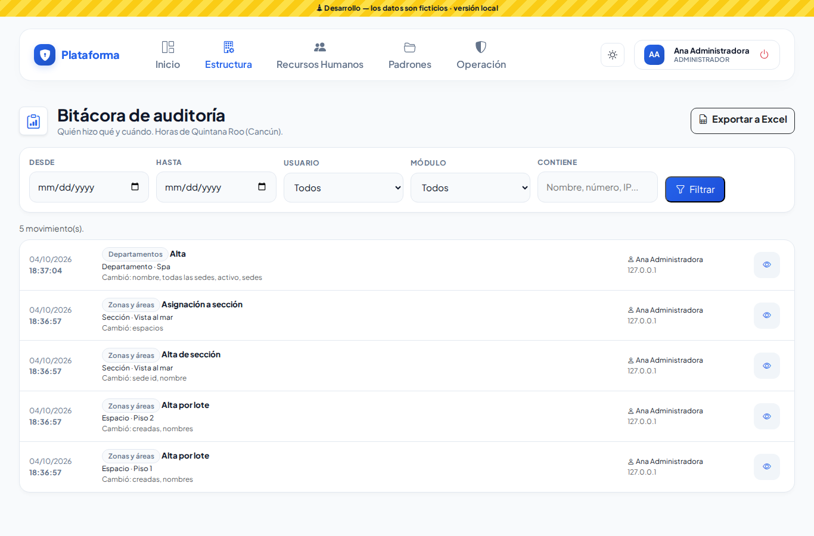
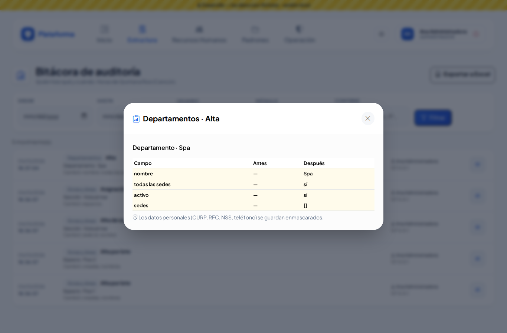
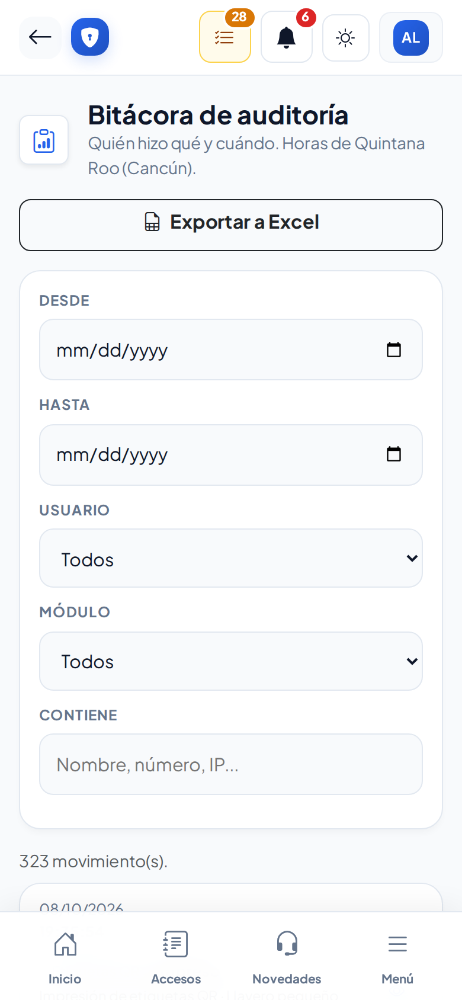

# Bitácora de auditoría

**¿Para qué sirve?** Aquí ves **quién hizo qué y cuándo** en la plataforma: altas, cambios, bajas, permisos, desbloqueos, validaciones, impresiones, uniones de duplicados… Sirve para aclarar dudas («¿quién cambió este dato?») y para revisiones internas. Las horas están en la hora local de la empresa.

## Antes de empezar

- Para ver la bitácora tu rol debe poder consultar *Bitácora de auditoría* (normalmente el administrador y Dirección). Para descargarla necesitas el permiso **Exportar**.
- Si tu rol es de una sola sede, ves únicamente tus propios movimientos.

## Cómo buscar un movimiento

1. Entra a **Estructura → Bitácora de auditoría**.
2. Usa los filtros:
   - **Desde** / **Hasta:** el periodo.
   - **Usuario:** quién lo hizo.
   - **Módulo:** en qué pantalla se hizo.
   - **Contiene:** un nombre, un número o una dirección IP.
3. Toca **Filtrar**. **Limpiar** quita los filtros.

**Qué debes ver:** cuántos movimientos hay y la lista con la fecha y hora, el módulo, qué se hizo, sobre qué registro, qué campos cambiaron y quién lo hizo.

### Qué significa cada acción

La columna de lo que se hizo usa palabras sencillas. Las más comunes:

| Verás | Qué pasó |
|---|---|
| Alta / Edición / Desactivación / Reactivación | Se registró, se cambió, se dio de baja o se volvió a activar un registro. |
| Eliminación definitiva | Se borró para siempre un registro de un catálogo (solo el administrador). |
| Aprobación / Rechazo / Firma | Alguien aprobó, rechazó o firmó un paso (por ejemplo, de un pase de salida o un procedimiento). |
| Acuse de recibo | Un colaborador firmó «Leí y entendí» un procedimiento. |
| Registro de salida / Recepción en destino / Salida de regreso / Regreso | Los pasos de caseta de un pase de salida. |
| Autorización / Negativa de autorización / Respuesta | La respuesta de un departamento a una visita o a un candidato. |
| Publicación / Pausa / Reanudación / Cierre / Reapertura | Cambios de estado de una vacante. |
| Postulación / Captura en el kiosco | Un candidato llenó su solicitud por internet o en la tableta de recepción. |
| Asignación de etiqueta NFC/RFID / Retiro de etiqueta NFC/RFID | Se le dio o se le quitó un gafete o tarjeta a un registro. |
| Creación de respaldo / Descarga de respaldo | El Super Administrador respaldó o descargó la información. |

## Cómo ver el detalle de un cambio

1. Toca el **ojo** (Ver detalle) del movimiento.
2. Se abre una ventana con cada **Campo**, lo que tenía **Antes** y lo que quedó **Después**. Lo que cambió aparece resaltado.

## Cómo exportar a Excel

Toca **Exportar a Excel**: se descarga un archivo de Excel (CSV) con los mismos movimientos filtrados.

## En el celular

## Si algo sale mal

| Mensaje o síntoma | Qué significa | Qué hacer |
|---|---|---|
| No veo los movimientos de otras personas. | Tu rol es de una sola sede: solo ves los tuyos. | Pide al administrador que revise el movimiento. |
| El CURP, RFC, NSS o teléfono se ven con puntos (••••1234). | Los datos personales se muestran ocultos por privacidad. | Es normal; solo se ven los últimos 4 caracteres. |
| No aparece **Exportar a Excel**. | Tu rol no tiene el permiso **Exportar**. | Pídelo a tu administrador. |
| No encuentro un movimiento. | El periodo o los filtros no lo incluyen. | Toca **Limpiar** y amplía las fechas. |

## Preguntas frecuentes

**¿Se puede borrar o modificar la bitácora?** No. Nadie puede cambiarla ni borrarla.

**¿Qué significa «Sistema» en el usuario?** Que el movimiento lo hizo la plataforma sola (por ejemplo, una postulación por internet o un aviso automático).

**¿Por qué algunos movimientos de Candidatos no tienen usuario?** Son los que hizo el propio candidato sin sesión: su postulación por internet o su captura en la tableta de recepción. Aparecen como «Sistema».

**¿Queda registro de las exportaciones con datos personales?** Sí. Cada vez que alguien descarga datos personales queda anotado aquí.

## Relacionado

- [Usuarios](usuarios.md)
- [Roles y permisos](roles-y-permisos.md)
- [Altas por verificar](altas-por-verificar.md)
