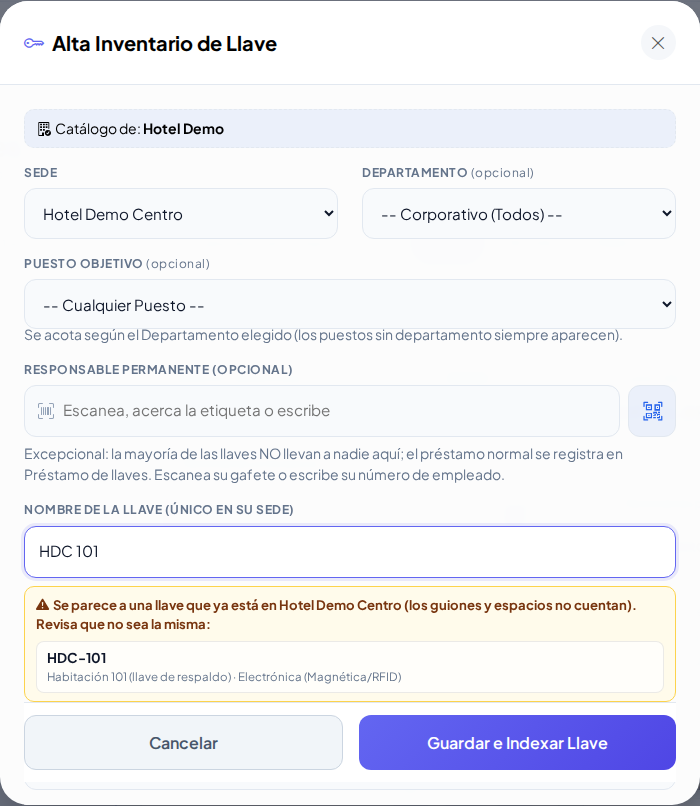
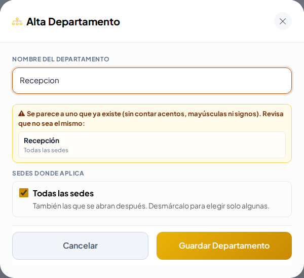
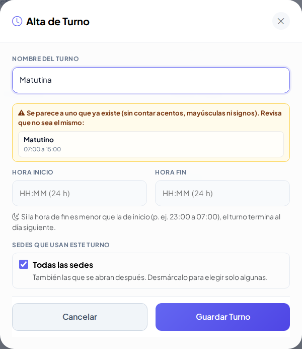
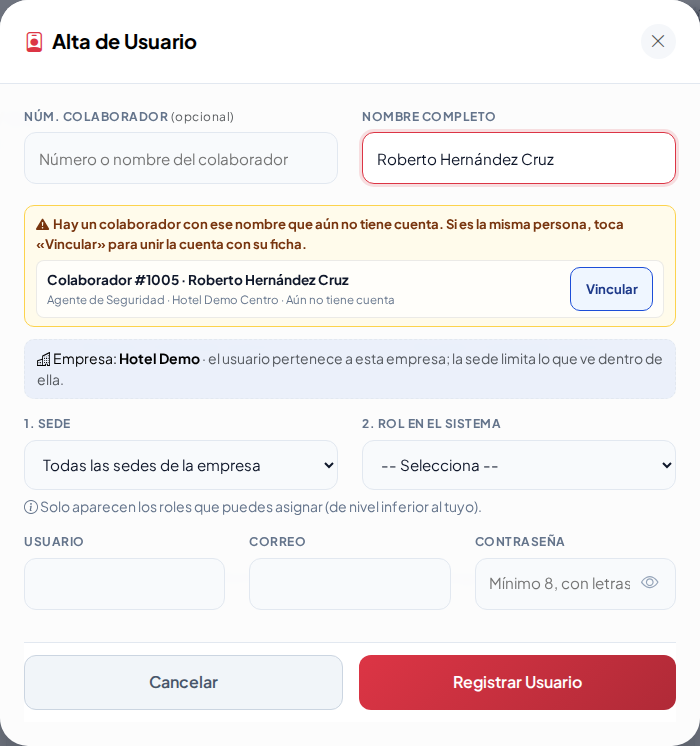
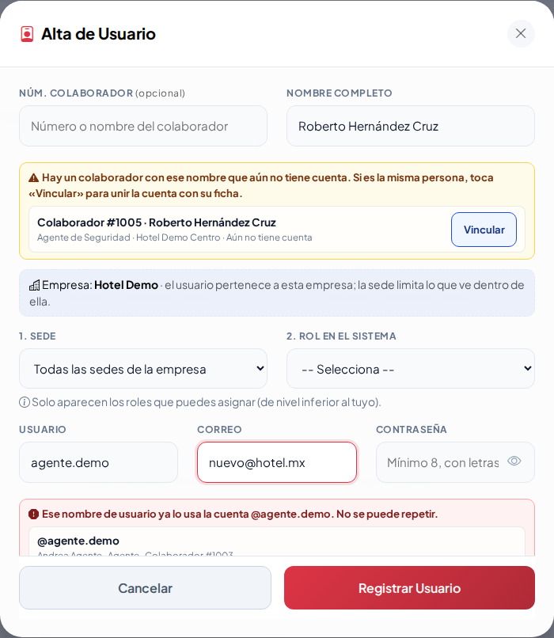

# Avisos de «ya existe» en Llaves, Departamentos, Puestos, Turnos y Usuarios

Desde la Ronda 7 estas pantallas avisan **igual que los demás padrones**: mientras escribes, debajo del campo aparece:

- **Rojo — Ya existe**: no se puede guardar así (el nombre ya está). Si lo que existe está **dado de baja** y tienes permiso, aparece **Reactivar**: úsalo en lugar de crear otro.
- **Amarillo — Se parece**: solo es un aviso; revisa que no sea el mismo.
- **Verde — Disponible**.

## Llaves

El nombre de la llave es único **en su sede**: el aviso revisa la sede que elegiste (si cambias la sede, vuelve a revisar). `HDC 101` se parece a `HDC-101` (los guiones y espacios no cuentan).

## Departamentos, Puestos y Turnos

Avisan si el nombre ya existe en la empresa (sin importar mayúsculas) o si se parece («Recepcion» y «Recepción»).

## Usuarios

- **Usuario** y **correo**: si otra cuenta ya los usa, lo dice al instante (aunque sea de otra empresa, sin mostrar sus datos).
- **Nombre completo**: si ya hay un usuario con ese nombre, pide marcar **«Sí, es otra persona con el mismo nombre»**. Si hay un **colaborador con ese nombre que aún no tiene cuenta**, aparece **Vincular**: un toque y la cuenta queda unida a su ficha.

