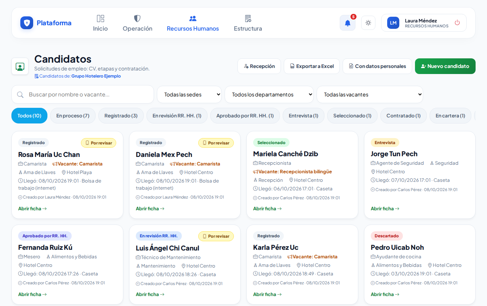
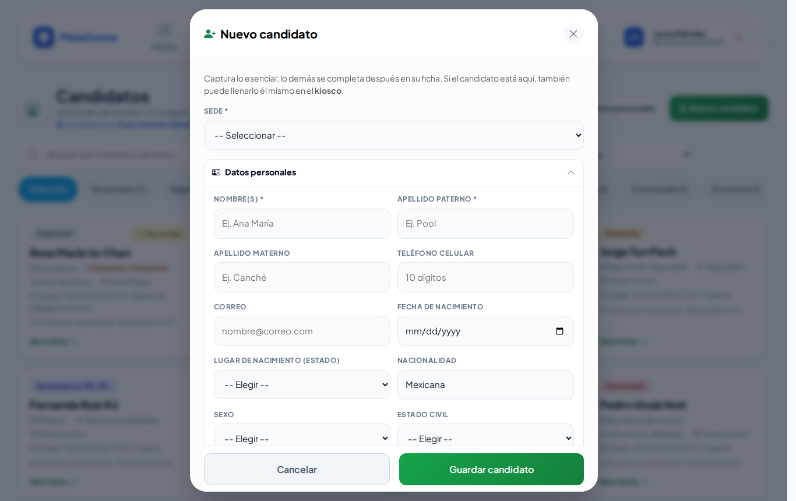
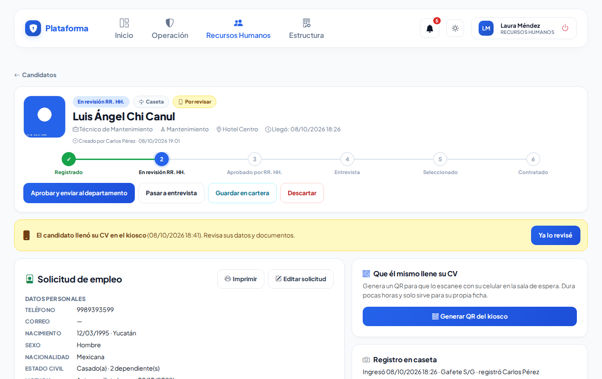
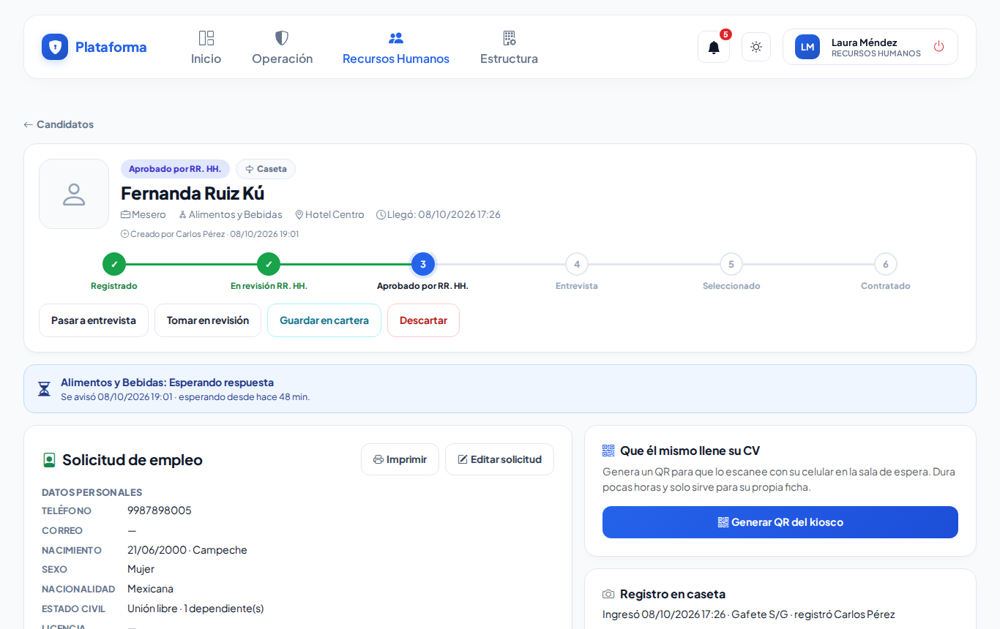
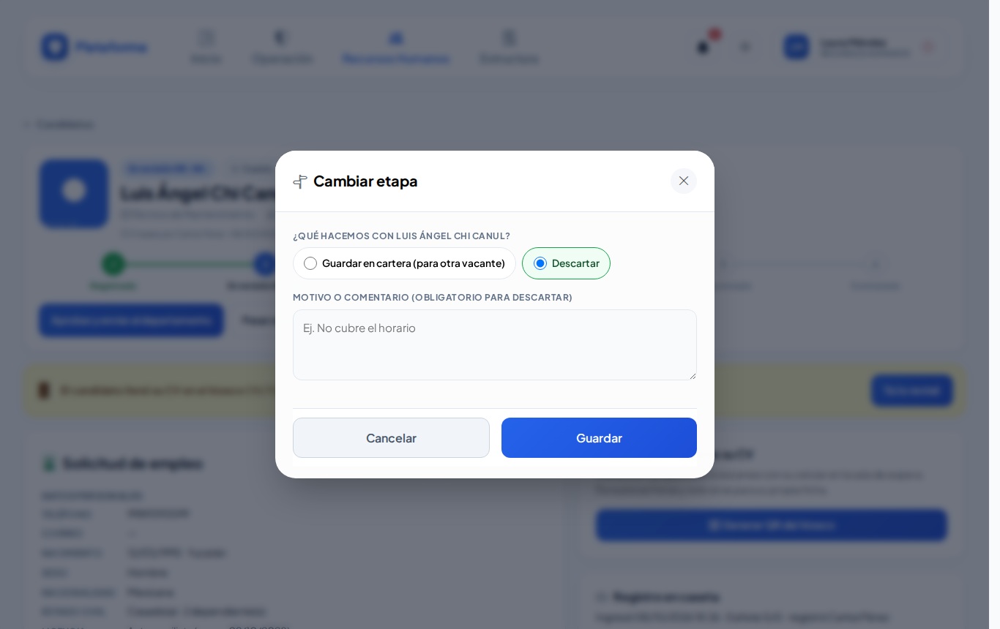
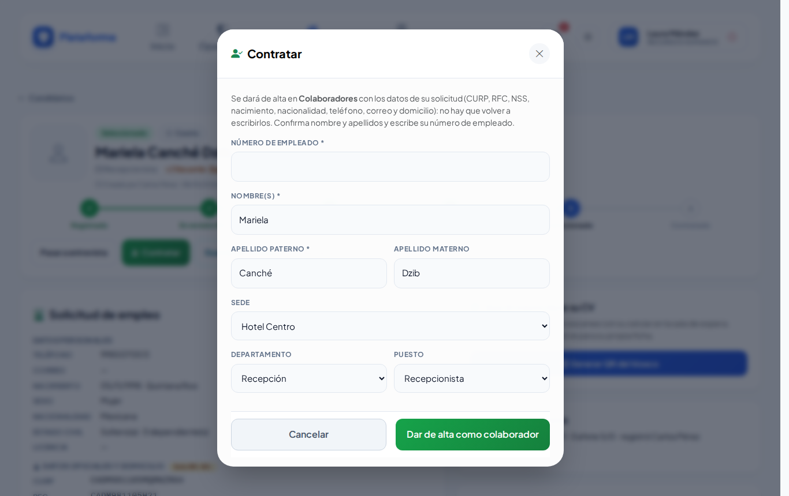
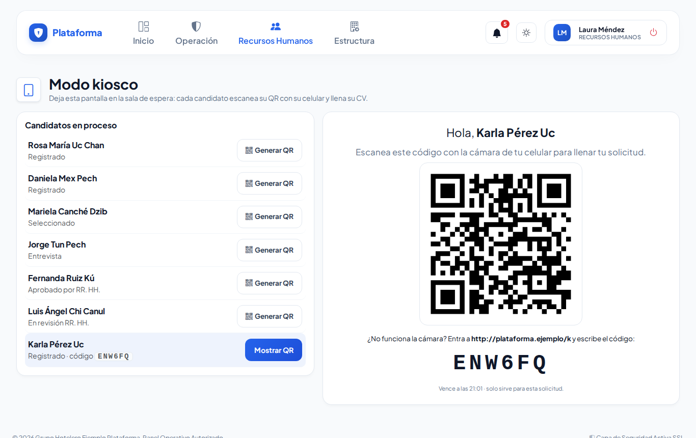
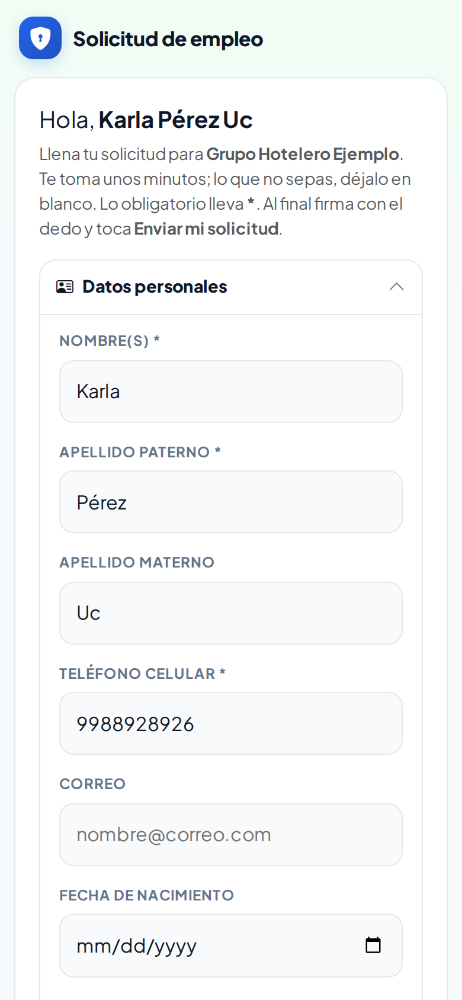
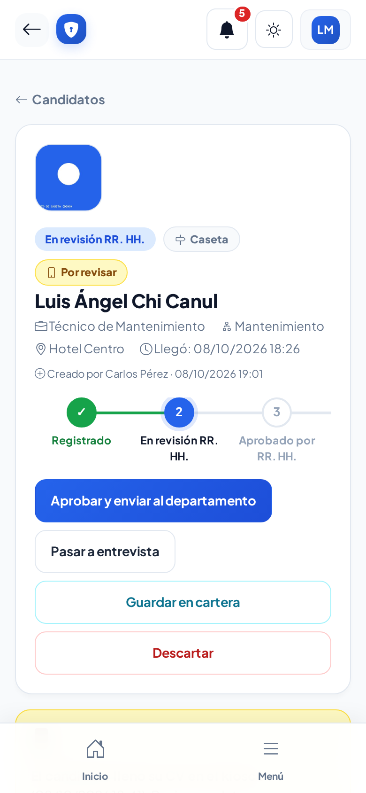
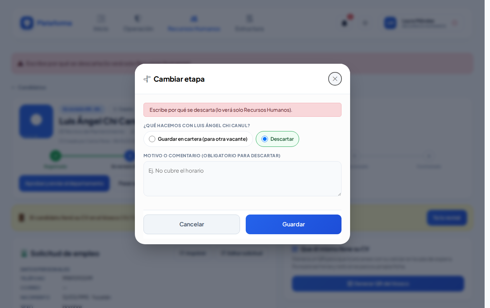

# Candidatos

**¿Para qué sirve?** Cuando alguien llega a pedir trabajo, viene a una entrevista o se postula por internet, Recursos Humanos lleva aquí su solicitud de principio a fin: ficha con su solicitud de empleo, documentos, revisión, aprobación del departamento, entrevista y contratación. Al contratar, la persona pasa sola a [Colaboradores](colaboradores.md).

## Antes de empezar

- Para ver la pantalla tu rol debe poder consultar *Candidatos* (normalmente Recursos Humanos y el administrador). Si no aparece en el menú, pide el permiso a tu administrador.
- Para **contratar** se necesita el permiso **Contratar**; para exportar, **Exportar**.
- La caseta **no ve** los CV: solo registra la llegada del candidato. El responsable del departamento solo ve un **resumen** cuando se le pide su opinión.

## Cómo llega un candidato

Un candidato aparece en la lista por cualquiera de estos caminos:

- **Caseta:** en la [Bitácora de accesos](accesos.md) registra a la persona con motivo **Recursos Humanos** y marca **«Viene como candidato»** (con su vacante, si la eligió). Recursos Humanos recibe el aviso en la campana y en [Recepción](recepcion-y-autorizaciones.md).
- **Bolsa de trabajo por internet:** se postula desde la página de [Vacantes](vacantes.md).
- **Recursos Humanos:** con el botón **Nuevo candidato** (ver abajo).

## Cómo encontrar a un candidato

1. Entra a **Recursos Humanos → Candidatos**.
2. Escribe en **Buscar por nombre o vacante...** y, si quieres, elige **Todas las sedes**, **Todos los departamentos** o **Todas las vacantes**.
3. Toca una etapa: **Todos**, **En proceso** o una en particular (**Registrado**, **En revisión RR. HH.**…). **Limpiar** quita los filtros.
4. Toca la tarjeta para abrir su **ficha**.

**Qué debes ver:** tarjetas con el nombre, la etapa, el puesto, el departamento, la sede y de dónde vino.

## Cómo registrar un candidato desde Recursos Humanos

1. Toca **Nuevo candidato**.
2. Elige la **Sede** (si solo tienes una, ya viene puesta).
3. Captura lo esencial: nombre(s), apellidos y teléfono celular. Lo demás se completa después en su ficha, o lo llena él mismo en el kiosco.
4. Con el candidato presente, marca **Acepto el aviso de privacidad** (sin esa marca no se guarda).
5. Toca **Guardar candidato**.

**Qué debes ver:** «Ficha de … creada. Completa su CV y sus documentos.» y se abre su ficha.

## Cómo usar la ficha del candidato

Arriba ves la etapa, de dónde vino y los pasos del proceso; abajo, su **Solicitud de empleo**, el **Registro en caseta** (con su foto, si se tomó), sus **Documentos**, los **Tiempos** y el **Historial**.

- **Editar solicitud:** abre la solicitud de empleo completa (ver [Solicitud de empleo](solicitud-empleo.md)).
- **Ya lo revisé:** aparece cuando el candidato llenó o cambió su solicitud en el kiosco o por internet (dice **Por revisar**).
- **Documentos:** elige qué documento es, elige el archivo y toca **Subir (PDF, JPG o PNG · máx. 5 MB)**. Son privados.

## Cómo avanzar al candidato por las etapas

Los botones de arriba cambian según la etapa. No se pueden saltar pasos.

| Etapa | Qué significa | Botones para avanzar |
|---|---|---|
| **Registrado** | Llegó (caseta, kiosco, internet o lo capturaste tú). | **Tomar en revisión** |
| **En revisión RR. HH.** | Lo estás atendiendo. | **Aprobar y enviar al departamento** o **Pasar a entrevista** |
| **Aprobado por RR. HH.** | El responsable del departamento recibió un resumen para decidir. | Él responde **Bajar a entrevistar** o **Rechazar** |
| **Entrevista** | Se le va a entrevistar. | **Seleccionar** |
| **Seleccionado** | Se queda con el puesto. | **Contratar** |
| **Contratado** | Ya es colaborador. | — |
| **En cartera** | No ahora, pero se guarda para otra vacante. | **Tomar en revisión** |
| **Descartado** | No sigue (con motivo). | **Tomar en revisión** (si te equivocaste) |

1. Toca el botón de la siguiente etapa y confirma con **Aceptar** si te lo pide (al aprobar: «¿Aprobar y enviar al departamento …? Su responsable recibirá un resumen para decidir.»).
2. Para **Guardar en cartera** o **Descartar** se abre **Cambiar etapa**: elige la opción, escribe el **motivo o comentario** (obligatorio para descartar) y toca **Guardar**.

**Qué debes ver:** la nueva etapa marcada arriba y un renglón nuevo en el **Historial**.

## Cómo contratar a un candidato

1. Con el candidato en **Seleccionado**, toca **Contratar**.
2. Revisa **Nombre(s)**, **Apellido paterno** y **Apellido materno**, y la **Sede**, el **Departamento** y el **Puesto**.
3. Escribe el **Número de empleado**.
4. Toca **Dar de alta como colaborador**.

**Qué debes ver:** «¡Contratado! … ya está en Colaboradores con el número …». El colaborador nuevo ya lleva los datos de su solicitud (CURP, RFC, NSS, nacimiento, teléfono, correo y domicilio).

## Cómo dejar que el candidato llene su solicitud (kiosco)

1. En la ficha, en **Que él mismo llene su CV**, toca **Generar QR del kiosco** (o **QR** en el panel de Recepción).
2. Toca **Mostrar QR**, o abre **Recepción → Modo kiosco** en una tableta de la sala de espera y elige al candidato: aparece su QR en grande y un código de 6 letras.
3. El candidato escanea el QR con su celular (o entra a la dirección que dice la pantalla y escribe el código).
4. En su celular llena **Solicitud de empleo**, firma con el dedo y toca **Enviar mi solicitud**.

**Qué debes ver:** la ficha marcada **Por revisar** con lo que envió. El enlace vence en unas horas y se puede enviar pocas veces (se ajusta en [Recepción → Ajustes](recepcion-y-autorizaciones.md)). **Anular enlace** lo cancela antes de tiempo.

## Cómo exportar a Excel

- **Exportar a Excel:** descarga la lista (con los filtros que tengas puestos) sin datos personales.
- **Con datos personales:** agrega teléfono, correo, CURP, RFC, NSS y domicilio. Te pide confirmar y queda registrado en la [Bitácora de auditoría](auditoria.md). Guarda el archivo en un lugar seguro.

## Cómo borrar los datos de un candidato

Si la persona pide que se borren sus datos, abre su ficha y toca **Eliminar ficha y documentos** al final. Confirma con **Aceptar**. Verás «Se eliminó la ficha de … y sus documentos.». **No se puede deshacer.**

## En el celular

## Si algo sale mal

Los mensajes salen en rojo dentro de la ventana o arriba de la ficha.

| Mensaje o síntoma | Qué significa | Qué hacer |
|---|---|---|
| Escribe por qué se descarta (lo verá solo Recursos Humanos). | Elegiste **Descartar** sin motivo. | Escribe el motivo. |
| Antes de aprobar, indica en la ficha a qué departamento aplica. | El candidato no tiene departamento. | Edita la solicitud y elige el departamento. |
| Escribe tu nombre (o nombres). / Escribe el apellido paterno. / Escribe un teléfono (celular) para poder llamarte. | Faltan datos básicos. | Complétalos. |
| Para guardar, marca «Acepto el aviso de privacidad». | No se marcó el aviso de privacidad. | Léelo con el candidato y márcalo. |
| El archivo pesa más de 5 MB. | El documento es muy pesado. | Toma la foto con menos calidad o reduce el PDF. |
| El archivo debe ser PDF, JPG o PNG. | El tipo de archivo no se acepta. | Conviértelo a PDF o toma una foto. |
| Elige qué documento es. | No elegiste el tipo de documento. | Elige el tipo en la lista. |
| Ese código no existe o ya venció. Pide uno nuevo en recepción. | El candidato usó un código vencido. | Genera un QR nuevo en su ficha. |
| El candidato aparece en Candidatos pero la caseta no puede abrirlo. | La caseta no tiene permiso de ver candidatos. | Es lo correcto: solo Recursos Humanos ve los CV. |

## Preguntas frecuentes

**¿Quién ve los CV?** Solo Recursos Humanos (y el administrador). El responsable del departamento ve un resumen (puesto, escolaridad, experiencia) para decidir.

**Me equivoqué al descartar.** Desde **Descartado** puedes volver a **Tomar en revisión**.

**¿Qué pasa si el departamento rechaza al candidato?** El candidato pasa a **En cartera** y Recursos Humanos recibe el aviso.

**¿Puedo contratar sin pasar por todas las etapas?** No. Debe estar en **Seleccionado**; así queda claro quién decidió en cada paso.

## Relacionado

- [Recepción y autorizaciones](recepcion-y-autorizaciones.md)
- [Solicitud de empleo](solicitud-empleo.md)
- [Vacantes](vacantes.md)
- [Colaboradores](colaboradores.md)
