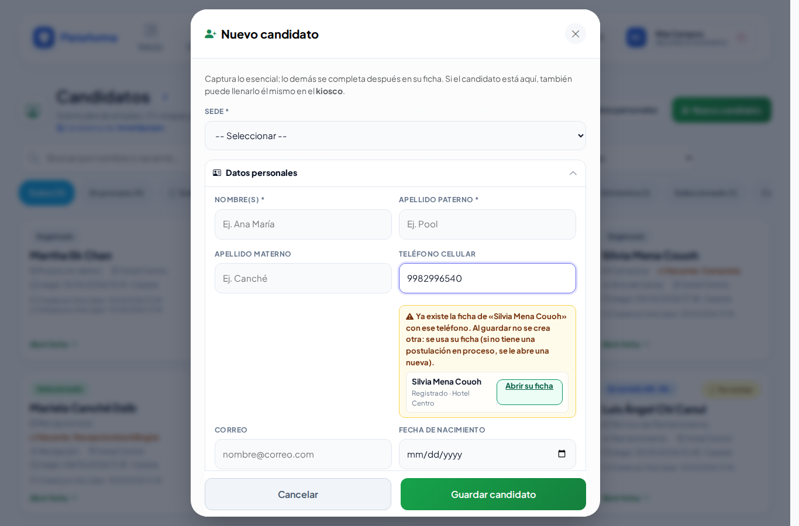
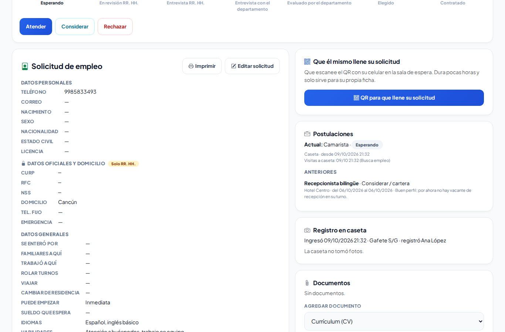
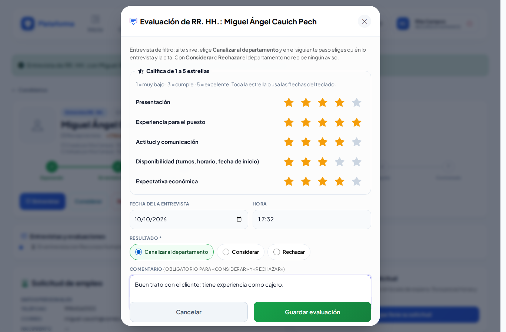
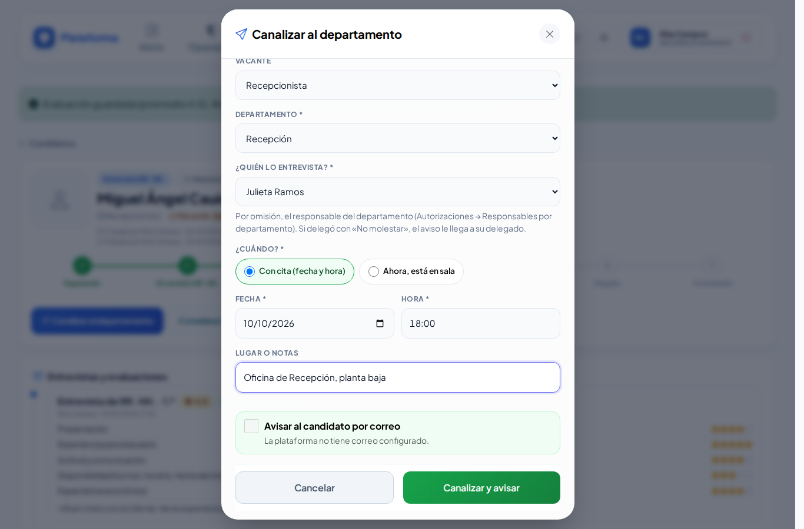
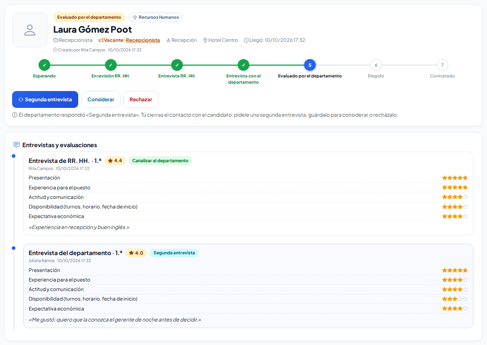
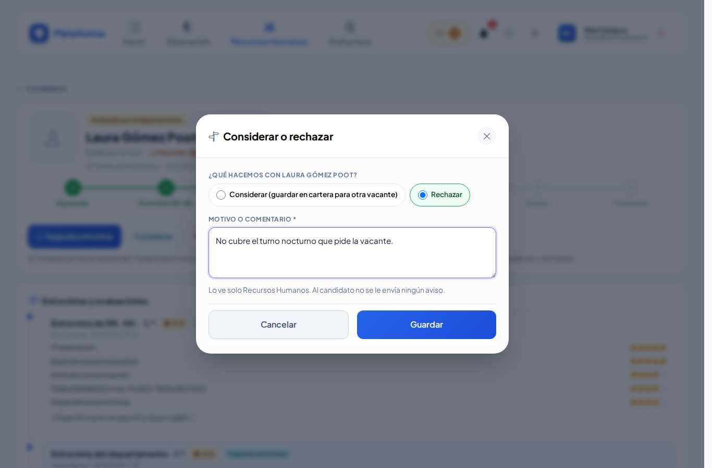

# Candidatos

**¿Para qué sirve?** Cuando alguien llega a pedir trabajo, viene a una entrevista o se postula por internet, Recursos Humanos lleva aquí su solicitud de principio a fin: lo **atiende**, lo **entrevista** y lo califica, lo **canaliza** con cita al jefe del departamento, y cuando el jefe lo **elige**, lo **contrata**. Al contratar, la persona pasa sola a [Colaboradores](colaboradores.md).

Cada persona tiene **una sola ficha** (sus datos, su solicitud, sus documentos y su firma) y una **postulación** por cada vez que aplica. Si vuelve meses después o se postula a otra vacante, se usa su misma ficha y se le abre una postulación nueva; las anteriores quedan a la vista en su ficha.

## Antes de empezar

- Para ver la pantalla tu rol debe poder consultar *Candidatos* (normalmente Recursos Humanos y el administrador). Si no aparece en el menú, pide el permiso a tu administrador.
- Para **contratar** se necesita el permiso **Contratar**; para exportar, **Exportar**.
- Para canalizar a un candidato, el jefe del departamento necesita el permiso **Evaluar** de *Candidatos*. Lo trae el rol **Jefe de departamento** (y Director, Jefe de seguridad y Supervisor). Si no aparece nadie en **¿Quién lo entrevista?**, pide a tu administrador que se lo dé.
- La caseta **no ve** los CV: solo registra la llegada del candidato. El jefe que entrevista solo ve un **resumen** (sin CURP, RFC, NSS, domicilio ni teléfono).

## Las etapas del proceso

| Etapa | Qué significa | Quién sigue | Botones |
|---|---|---|---|
| **Esperando** | Llegó (caseta, kiosco, internet o lo capturaste tú). | Recursos Humanos | **Atender** |
| **En revisión RR. HH.** | Ya lo recibiste. | Recursos Humanos | **Entrevistar** |
| **Entrevista RR. HH.** | Lo estás entrevistando y lo calificas. | Recursos Humanos | **Entrevistar** (calificar) y luego **Canalizar al departamento** |
| **Entrevista con el departamento** | El jefe tiene su cita. | El jefe | **Reprogramar** · **No se presentó** (si ya pasó la hora) |
| **Evaluado por el departamento** | El jefe lo calificó y no lo eligió (pidió considerarlo, una segunda entrevista o lo rechazó). | Recursos Humanos | **Segunda entrevista** |
| **Elegido** | El jefe lo eligió. | Recursos Humanos | **Contratar** |
| **Contratado** | Ya es colaborador. | — | — |
| **Considerar / cartera** | No ahora, pero se guarda para otra vacante. | Recursos Humanos | **Atender** |
| **Rechazado** | No sigue (con motivo). | — | **Atender** (si te equivocaste) |
| **No se presentó** | No llegó a su cita con el departamento. | Recursos Humanos | **Reprogramar** |

**Considerar** y **Rechazar** están en casi todas las etapas. La decisión de **elegir** es del jefe del departamento; tú cierras siempre el contacto con el candidato.

## Cómo llega un candidato

Un candidato aparece en la lista por cualquiera de estos caminos:

- **Caseta:** en la [Bitácora de accesos](accesos.md) registra a la persona con motivo **Recursos Humanos** y elige **¿A qué viene?**: **Busca empleo** (con su vacante, si la sabe), **Entrevista**, **Entrega de documentos** o **Firma de contrato**. Recursos Humanos recibe el aviso en la campana y en [Recepción](recepcion-y-autorizaciones.md), donde le dice **Que pase**.
- **Bolsa de trabajo por internet:** se postula desde la página de [Vacantes](vacantes.md).
- **Recursos Humanos:** con el botón **Nuevo candidato** (ver abajo).

**Una ficha por persona:** antes de crear una ficha, la plataforma busca si la persona ya tiene una (por su registro en el Padrón de personas, su teléfono o su CURP; si viene a una cita, también por su nombre). Si la encuentra, **no crea otra**:

- si tiene una postulación **en proceso**, la visita se suma a esa misma;
- si no tiene ninguna en proceso (por ejemplo, la rechazaron o quedó para considerar), se le abre una **postulación nueva** en su misma ficha.

Si viene a su **Entrevista** con el departamento, a quien lo entrevista le llega el aviso «Juan Pérez ya está en recepción para su entrevista de las 11:00».

## Cómo encontrar a un candidato

1. Entra a **Recursos Humanos → Candidatos**.
2. Escribe en **Buscar por nombre o vacante...** y, si quieres, elige **Todas las sedes**, **Todos los departamentos** o **Todas las vacantes**.
3. Toca un filtro: **Todos**, **En proceso**, **Por entrevistar**, **Solicitudes por revisar** (lo que el candidato llenó en su celular o por internet y aún no revisas) o una etapa en particular. **Limpiar** quita los filtros.
4. Toca la tarjeta para abrir su **ficha**.

**Qué debes ver:** una tarjeta por persona con su nombre y su postulación actual: etapa, puesto, vacante, departamento, sede y de dónde vino.

## Cómo registrar un candidato desde Recursos Humanos

1. Toca **Nuevo candidato**.
2. Elige la **Sede** (si solo tienes una, ya viene puesta).
3. Captura lo esencial: nombre(s), apellidos y teléfono celular. Lo demás se completa después en su ficha, o lo llena él mismo en el kiosco.
4. Si al escribir el **teléfono** o el **CURP** aparece el aviso amarillo «Ya existe la ficha de «…» con ese teléfono…», toca **Abrir su ficha**: es la misma persona y no hace falta capturarla otra vez.

5. Con el candidato presente, marca **Acepto el aviso de privacidad** (sin esa marca no se guarda).
6. Toca **Guardar candidato**.

**Qué debes ver:** «Ficha de … creada. Completa su CV y sus documentos.» y se abre su ficha. Si la persona ya tenía ficha: «… ya tenía ficha: no se creó otra. Revisa su solicitud y su postulación actual.»

## Cómo usar la ficha del candidato

Arriba ves la etapa de su **postulación actual**, los pasos del proceso y los botones de lo que sigue. Debajo, **Entrevistas y evaluaciones** (las calificaciones de cada entrevista y la cita con el departamento) y luego su **Solicitud de empleo**, sus **Postulaciones**, el **Registro en caseta**, sus **Documentos**, los **Tiempos** y el **Historial**.

- **Editar solicitud:** abre la solicitud de empleo completa (ver [Solicitud de empleo](solicitud-empleo.md)).
- **Ya lo revisé:** aparece cuando el candidato llenó o cambió su solicitud en el kiosco o por internet (dice **Por revisar**).
- **Documentos:** elige qué documento es, elige el archivo y toca **Subir (PDF, JPG o PNG · máx. 5 MB)**. Son privados.

## Cómo atender y entrevistar (Recursos Humanos)

1. Con el candidato en **Esperando**, toca **Atender** y confirma con **Aceptar**. Pasa a **En revisión RR. HH.**
2. Cuando lo vayas a entrevistar, toca **Entrevistar**. Pasa a **Entrevista RR. HH.** y se abre **Evaluación de RR. HH.**
3. Al terminar la entrevista, califica cada criterio tocando de **1 a 5 estrellas** (también puedes usar el teclado: tabulador para llegar al criterio y flechas para cambiar la calificación).
4. Revisa la **Fecha y hora de la entrevista** (ya viene la de ahora).
5. Elige el **Resultado**:
   - **Canalizar al departamento:** te sirve y lo mandas con el jefe.
   - **Considerar:** no ahora; se guarda para otra vacante.
   - **Rechazar:** no sigue.
6. Escribe un **Comentario**. Es obligatorio para **Considerar** y **Rechazar**.
7. Toca **Guardar evaluación**.

**Qué debes ver:** con **Canalizar al departamento**, «Evaluación guardada (promedio 4.2). Ahora canalízalo al departamento…» y se abre la ventana para canalizar. Con **Considerar** o **Rechazar**, el candidato queda en esa etapa y **el jefe no recibe ningún aviso**. La evaluación aparece en **Entrevistas y evaluaciones**, con sus estrellas y su promedio.

> Los criterios que se califican los define Recursos Humanos en **Recepción → Ajustes** (ver [Recepción y autorizaciones](recepcion-y-autorizaciones.md)).

## Cómo canalizar al departamento

1. Después de guardar la evaluación con **Canalizar al departamento**, se abre la ventana (o toca el botón **Canalizar al departamento**).
2. Revisa la **Vacante** y el **Departamento** (ya vienen los de su postulación).
3. En **¿Quién lo entrevista?** ya viene el **responsable del departamento**. Si el departamento no tiene responsable, elige a otra persona de la lista **Otras personas que pueden entrevistar**.
4. En **¿Cuándo?** elige **Con cita (fecha y hora)** y escribe la **Fecha** y la **Hora**, o **Ahora, está en sala** si el jefe lo recibe en este momento.
5. Escribe el **Lugar o notas** (por ejemplo «Oficina de Alimentos y Bebidas, planta baja»).
6. Si el candidato tiene correo, deja marcada **Avisar al candidato por correo**: le llega la fecha, la hora, el lugar y a quién buscar.
7. Toca **Canalizar y avisar**.

**Qué debes ver:** «Listo: canalizado al departamento: … ya tiene el aviso con la cita». El candidato queda en **Entrevista con el departamento** y en **Entrevistas y evaluaciones** aparece la cita. A quien entrevista le llega el aviso en la **campana**, en **Mis pendientes** y por **correo**, con un resumen del candidato (sin datos oficiales ni domicilio) y tu evaluación. Si esa persona delegó sus avisos («No molestar»), le llegan a quien la cubre.

## Cómo reprogramar o cambiar a quien entrevista

1. Con el candidato en **Entrevista con el departamento** (o **No se presentó**), toca **Reprogramar**.
2. Cambia la **Fecha**, la **Hora**, el **Lugar o notas** o **¿Quién lo entrevista?**
3. Toca **Guardar y avisar**.

**Qué debes ver:** «Entrevista reprogramada: …». Si cambiaste de persona, a la anterior le llega «Ya no entrevistas a …» y a la nueva el aviso con la cita. Si no, a la misma persona le llega «Se reprogramó la entrevista: …».

## Cómo marcar que no se presentó

1. Cuando ya pasó la hora de la cita, aparece el botón **No se presentó**. Tócalo y confirma con **Aceptar**.
2. El candidato queda en **No se presentó** y a quien lo iba a entrevistar le llega «Se canceló la entrevista de …».
3. Si vuelve a agendar, toca **Reprogramar**: regresa a **Entrevista con el departamento**.

## Qué hacer cuando el departamento responde

Te llega el aviso «El departamento evaluó a …» o «Elegido por el departamento: …» en la campana y en **Mis pendientes** (**Evaluaciones del departamento** o **Elegidos por contratar**). La evaluación del jefe aparece en **Entrevistas y evaluaciones**.

- Si lo **eligió**, el candidato queda **Elegido**: sigue con sus documentos y su contrato y tócale **Contratar** (o **Rechazar** con el motivo, por ejemplo «No entregó documentos»).
- Si pidió **Segunda entrevista** o **Considerar**, toca **Segunda entrevista** para canalizarlo otra vez (es su 2.ª entrevista: puedes elegir a otra persona), o decide **Considerar** o **Rechazar**.
- Si lo **rechazó**, el candidato queda **Evaluado por el departamento**: tú cierras el contacto y lo pasas a **Rechazar** (o a **Considerar** si te sirve para otra vacante).

> Si la vacante tiene **plazas** y el jefe elige a tantas personas como plazas, los demás candidatos de esa vacante que seguían con el departamento pasan solos a **Considerar** con el comentario «Se eligió a otra persona para esta vacante», y te llega el aviso «Vacante cubierta».

## Cómo considerar o rechazar

1. Toca **Considerar** o **Rechazar**.
2. En la ventana elige la opción y escribe el **Motivo o comentario** (es obligatorio).
3. Toca **Guardar**.

**Qué debes ver:** la etapa nueva arriba, con el motivo, y un renglón nuevo en el **Historial**. Al candidato **no se le envía ningún aviso** de rechazo. Si estaba con el departamento, su entrevista se cancela y se le avisa a quien lo iba a entrevistar.

## Cómo contratar a un candidato

1. Con el candidato **Elegido**, toca **Contratar**.
2. Revisa **Nombre(s)**, **Apellido paterno** y **Apellido materno**, y la **Sede**, el **Departamento** y el **Puesto**.
3. Escribe el **Número de empleado**.
4. Toca **Dar de alta como colaborador**.

**Qué debes ver:** «¡Contratado! … ya está en Colaboradores con el número …». El colaborador nuevo ya lleva los datos de su solicitud (CURP, RFC, NSS, nacimiento, teléfono, correo y domicilio).

## Cómo dejar que el candidato llene su solicitud (kiosco)

1. En la ficha, en **Que él mismo llene su solicitud**, toca **QR para que llene su solicitud**. Si ya tiene uno vigente, se muestra el mismo; si no, se crea uno nuevo.
2. Aparece su QR en grande y un código de 6 letras (también puedes abrir **Recepción → Modo kiosco** en una tableta de la sala de espera y elegir al candidato).
3. El candidato escanea el QR con su celular (o entra a la dirección que dice la pantalla y escribe el código).
4. En su celular llena **Solicitud de empleo**, firma con el dedo y toca **Enviar mi solicitud**.

**Qué debes ver:** la ficha marcada **Por revisar** con lo que envió. Si necesitas cancelar el enlace antes de tiempo, toca **Anular enlace**.

## Cómo exportar a Excel

- **Exportar a Excel:** descarga la lista (con los filtros que tengas puestos) sin datos personales, con la etapa y los promedios de RR. HH. y del departamento.
- **Con datos personales:** agrega teléfono, correo, CURP, RFC, NSS y domicilio. Te pide confirmar y queda registrado en la [Bitácora de auditoría](auditoria.md). Guarda el archivo en un lugar seguro.

## Cómo borrar los datos de un candidato

Si la persona pide que se borren sus datos, abre su ficha y toca **Eliminar ficha y documentos** al final. Confirma con **Aceptar**. Verás «Se eliminó la ficha de … y sus documentos.». **No se puede deshacer.**

## En el celular

## Si algo sale mal

Los mensajes salen en rojo dentro de la ventana o arriba de la ficha.

| Mensaje o síntoma | Qué significa | Qué hacer |
|---|---|---|
| Califica «…» de 1 a 5 estrellas. | Faltó calificar un criterio. | Toca las estrellas de ese criterio. |
| Escribe un comentario: es obligatorio para «Considerar» y «Rechazar». | Elegiste Considerar o Rechazar sin comentario. | Escribe el comentario. |
| Escribe el motivo del rechazo (lo verá solo Recursos Humanos). | Tocaste **Rechazar** sin motivo. | Escribe el motivo. |
| Primero registra la evaluación de RR. HH. con el resultado «Canalizar al departamento». | Quisiste canalizar sin evaluar. | Toca **Entrevistar** y guarda la evaluación. |
| Elige quién lo va a entrevistar. | No elegiste a nadie en **¿Quién lo entrevista?** | Elige a una persona de la lista. |
| Esa persona no puede entrevistar en esta sede… | Le falta el permiso **Evaluar** o es de otra sede. | Elige a otra o pide el permiso a tu administrador. |
| Nadie puede entrevistar en esta sede… | Nadie tiene el permiso **Evaluar** en esa sede. | Pide a tu administrador que se lo dé al jefe del departamento. |
| Esa fecha y hora ya pasaron: elige una cita futura. | La cita quedó en el pasado. | Corrige la fecha o elige **Ahora, está en sala**. |
| Todavía no es la hora de su cita (…). | Tocaste **No se presentó** antes de tiempo. | Espera a que pase la hora de la cita. |
| La casilla **Avisar al candidato por correo** está apagada. | No tiene correo o la plataforma no tiene correo configurado. | Captura su correo en **Editar solicitud** o avísale por teléfono. |
| Otra persona acaba de cambiar a este candidato. Revisa su etapa actual. | Alguien más lo movió al mismo tiempo. | Recarga la ficha. |
| Para guardar, marca «Acepto el aviso de privacidad». | No se marcó el aviso de privacidad. | Léelo con el candidato y márcalo. |
| El archivo pesa más de 5 MB. / El archivo debe ser PDF, JPG o PNG. | El documento no se acepta. | Reduce el archivo o conviértelo a PDF. |
| «Esta persona ya tiene una solicitud en proceso en una sede que no tienes a cargo.» | Ese teléfono o CURP ya tiene ficha en otra sede, con un proceso abierto. | Pide a Recursos Humanos de esa sede que la atienda. |

## Preguntas frecuentes

**¿Quién decide a quién se contrata?** El jefe del departamento: él elige en su pantalla **Entrevistar**. Recursos Humanos filtra, canaliza, cierra el contacto con el candidato y contrata.

**¿El jefe ve el CV completo?** No. Ve un resumen (escolaridad, experiencia, disponibilidad y sueldo que espera) y tu evaluación. Ve el CV en PDF solo si la vacante tiene marcado **El jefe puede ver el CV**.

**¿Al candidato le llega algún correo?** Solo si marcas **Avisar al candidato por correo** al canalizar o reprogramar: le llega su cita. Nunca se le envían resultados ni rechazos.

**Me equivoqué al rechazar.** Desde **Rechazado** puedes volver a **Atender**.

**La persona ya vino antes. ¿Le hago otra ficha?** No. La plataforma usa su misma ficha y, si hace falta, le abre una postulación nueva.

**¿Dónde veo lo que tengo pendiente?** En **Mis pendientes**: **Esperando en Recepción**, **Solicitudes por revisar**, **Por entrevistar (RR. HH.)**, **Evaluaciones del departamento** y **Elegidos por contratar**.

## Relacionado

- [Entrevistar y elegir](entrevistar-y-elegir.md)
- [Recepción y autorizaciones](recepcion-y-autorizaciones.md)
- [Solicitud de empleo](solicitud-empleo.md)
- [Vacantes](vacantes.md)
- [Colaboradores](colaboradores.md)
