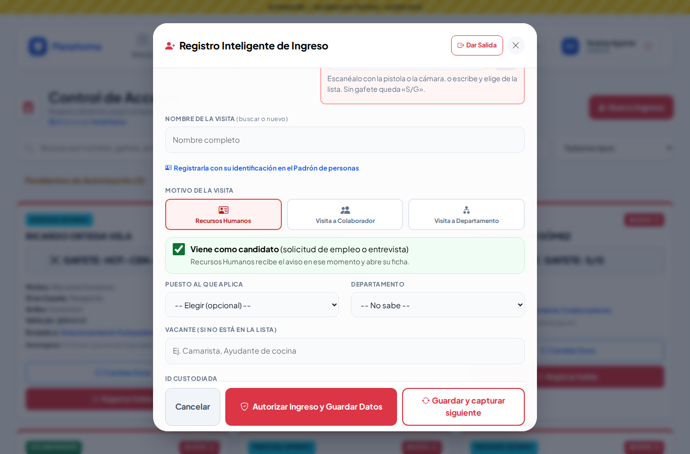
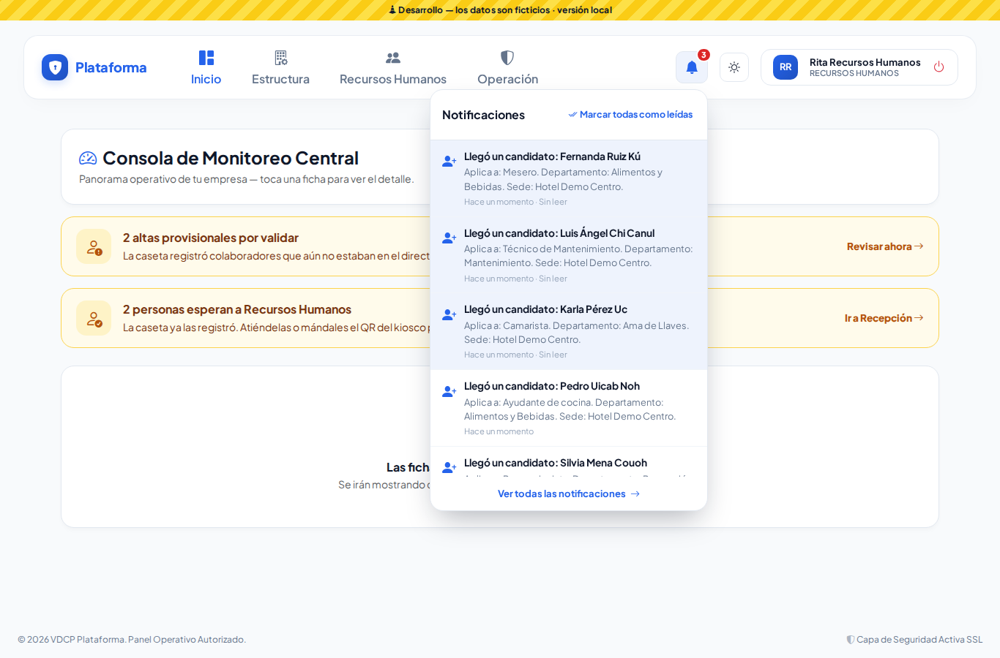
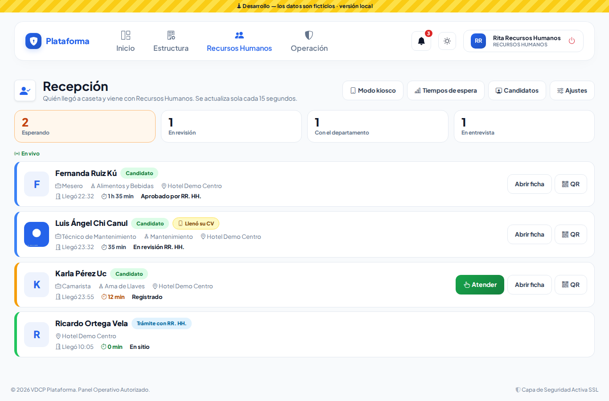
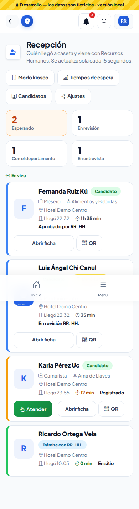
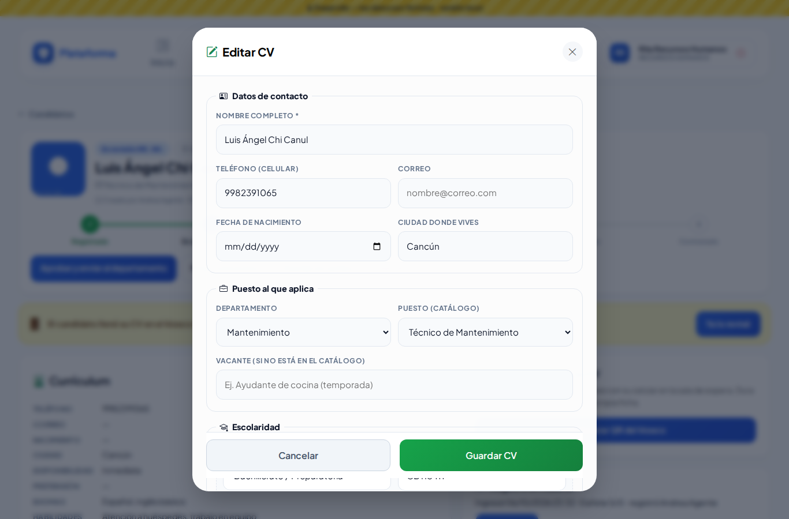
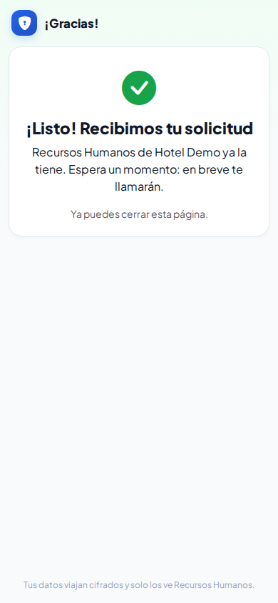
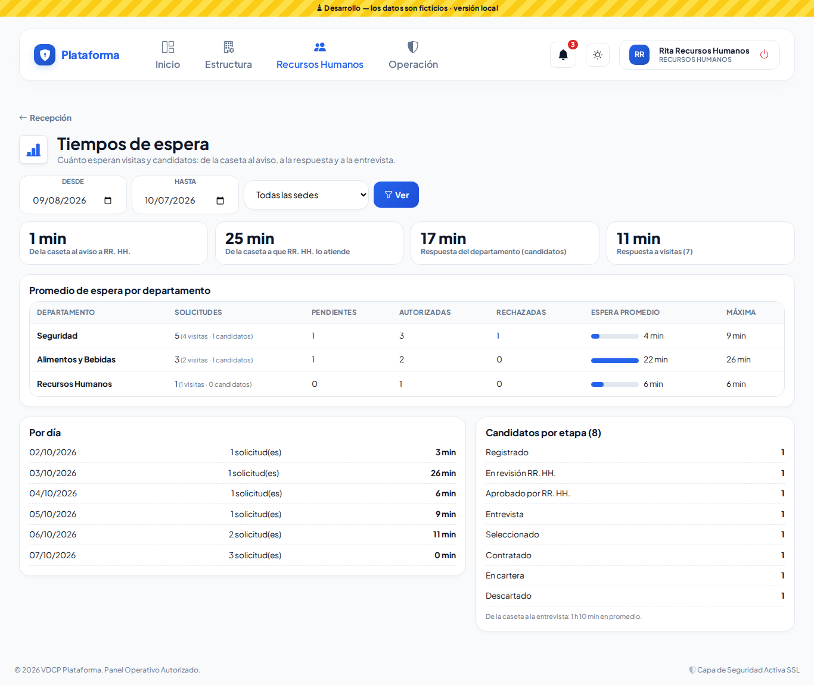
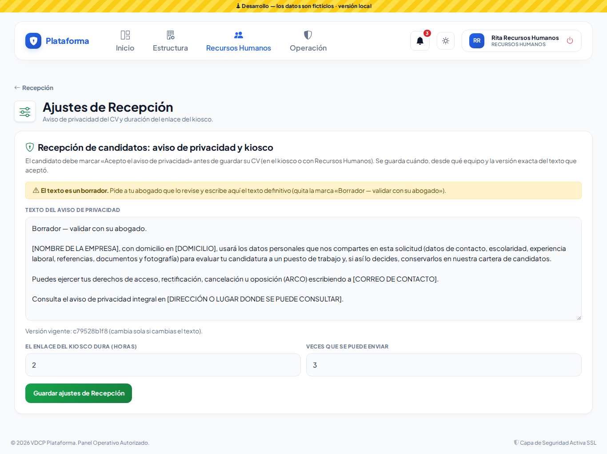

# Candidatos y Recepción de Recursos Humanos

Cuando alguien llega a la caseta a **pedir trabajo o a una entrevista**, Recursos Humanos se entera en ese momento, ve cuánto lleva esperando y lleva su solicitud de principio a fin: CV, revisión, aprobación del departamento, entrevista y contratación.

Lo encuentras en **Recursos Humanos → Recepción y candidatos**.

## 1. La caseta registra al candidato

En **Control de Accesos → Nuevo Ingreso**:

1. Tipo de persona: **Personal Externo / Visita**.
2. Motivo: **Recursos Humanos**.
3. Marca **«Viene como candidato»** y, si lo sabe, el puesto y el departamento.
4. (Opcional) **Fotos**: toca el recuadro y toma la foto de la persona y de su identificación. Se guardan privadas.
5. **Autorizar Ingreso y Guardar Datos**.

> El guardia **no ve** los CV: solo registra. Si entra a Candidatos, le aparece «Sin permiso».

## 2. Recursos Humanos recibe el aviso

En ese momento a Recursos Humanos le llega:

- un aviso en la **campana** (arriba a la derecha, con el número de avisos sin leer), y
- un **correo**, si está encendido en Configuración → Avisos por correo.

## 3. Panel «Recepción»

Muestra a todos los que llegaron y van con Recursos Humanos: a qué vienen, puesto, departamento, hora de llegada y **minutos esperando**. Se actualiza solo cada 15 segundos.

- Borde **verde**: acaba de llegar. **Ámbar**: más de 10 minutos. **Rojo**: más de 20 minutos. **Azul**: ya lo atendiste.
- **Atender**: lo pasa a «En revisión RR. HH.».
- **QR**: para que llene su CV en su celular (ver el punto 5).

En el celular se ve así:

## 4. La ficha del candidato (CV)

En **Candidatos** ves a todos, con filtros por etapa, sede y departamento. Toca uno para abrir su ficha.

La ficha tiene su CV, la foto de caseta, sus documentos, los tiempos y el historial. Arriba ves en qué paso va y los botones para avanzar.

- **Editar CV**: datos de contacto, puesto, escolaridad, experiencia, habilidades, disponibilidad, sueldo esperado y referencias. Toca **Agregar** para más renglones.
- **Documentos**: sube el CV (PDF), la INE o el comprobante (PDF, JPG o PNG de hasta 5 MB). Son privados.
- **Aviso de privacidad**: para guardar el CV, el candidato debe aceptarlo (lo marcas tú con él, o él en el kiosco).

### Los pasos

| Paso | Qué significa |
|---|---|
| **Registrado** | Llegó (caseta, kiosco o lo capturaste tú). |
| **En revisión RR. HH.** | Lo estás atendiendo. |
| **Aprobado por RR. HH.** | Pasó tu filtro y se envió al **responsable del departamento**. |
| **Entrevista** | El departamento pidió entrevistarlo (o tú lo pasaste directo). |
| **Seleccionado** | Se queda con el puesto. |
| **Contratado** | Ya es colaborador. |
| **En cartera** | No ahora, pero se guarda para otra vacante. |
| **Descartado** | No sigue (debes escribir el motivo). |

No se pueden saltar pasos: si algo no aplica, la plataforma te avisa en rojo.

### Contratar

Cuando el candidato está **Seleccionado**, toca **Contratar**, escribe su **número de empleado** y revisa nombre, apellidos, sede, departamento y puesto. Se da de alta en **Colaboradores** con los datos de su CV.

## 5. Que él mismo llene su CV (kiosco)

1. En la ficha (o en el panel) toca **Generar QR del kiosco**.
2. Abre **Modo kiosco** en una tableta de la sala de espera y elige al candidato: aparece su QR en grande y un código de 6 letras.
3. El candidato escanea el QR con su celular (o entra a la dirección y escribe el código) y llena su solicitud.

En su celular ve solo su propio formulario. Al final marca **«Acepto el aviso de privacidad»** y toca **Enviar mi solicitud**.

El enlace **vence en 2 horas** y se puede enviar **3 veces** (se cambia en Ajustes). Lo que envía llega a su ficha marcado **«Por revisar»**: revísalo y toca **Ya lo revisé**.

## 6. Tiempos de espera

**Recepción → Tiempos de espera** muestra cuánto tardan los avisos y las respuestas, por departamento y por día.

## 7. Ajustes

**Recepción → Ajustes** (o Configuración): el texto del aviso de privacidad y cuánto dura el enlace del kiosco.

> El texto que trae la plataforma es un **borrador**. Pídele a tu abogado que lo revise y escribe aquí el texto definitivo.

## Preguntas frecuentes

- **¿Quién ve los CV?** Solo Recursos Humanos (y el Administrador). El responsable del departamento ve un **resumen** (puesto, escolaridad, experiencia) para decidir. El Director ve el panel y los tiempos, no los CV.
- **¿Puedo borrar los datos de un candidato?** Sí, con **Eliminar ficha y documentos** (por ejemplo, si la persona lo pide). No se puede deshacer.
- **Me equivoqué al descartar.** Desde «Descartado» puedes volver a **En revisión**.
