# Colaboradores

El directorio del personal de la empresa: **Estructura → Organización Interna → Colaboradores**. Cada colaborador tiene un número de empleado, una sede física (o es corporativo), un departamento (área) y un puesto (rango).

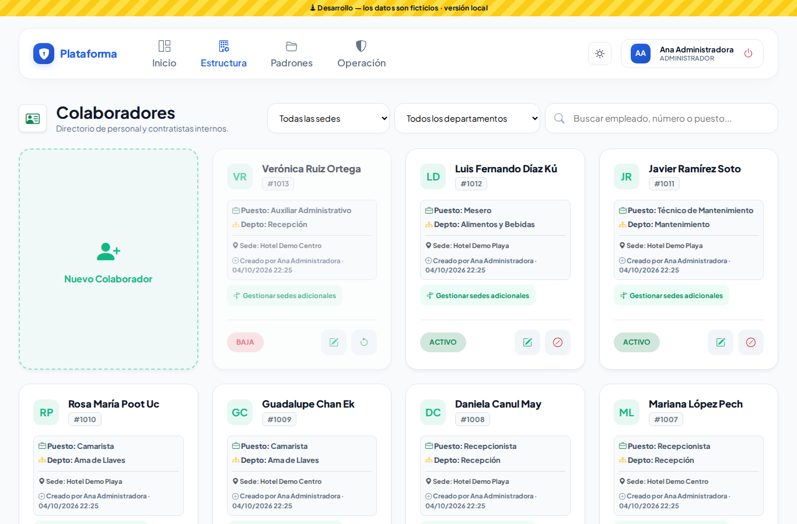

## Buscar

- Escribe en el buscador un nombre, número de empleado, puesto o departamento.
- Filtra por **sede** (incluye a quienes la tienen como sede adicional) y por **departamento**.
- El filtro se mantiene mientras trabajas.

## Dar de alta

1. Toca **Nuevo Colaborador**.
2. **Sede Física:** donde trabaja. Si lo dejas en *Corporativo*, trabaja en todas las sedes. Si tu rol es de una sede, solo puedes elegir las tuyas y es obligatoria.
3. **Núm. Empleado:** mientras escribes te avisa si ya existe en tu empresa.
4. **Departamento:** solo aparecen los que aplican en la sede elegida.
5. **Puesto:** se acota según el departamento. Los puestos sin departamento (por ejemplo, *Gerente*) siempre aparecen.
6. Nombre(s), apellidos y, si quieres, teléfono (10 dígitos; puedes escribir espacios o guiones). Si ya hay alguien activo con el mismo nombre y apellidos, la ventana te avisa en ese momento («Ya existe un colaborador con ese nombre. ¿Es la misma persona?») y te muestra su número, puesto y sede. Si es la misma persona, cancela y búscala en la lista; si es otra, continúa.
7. **Datos Legales (Opcionales):** CURP, RFC, NSS, fecha y estado de nacimiento y nacionalidad. Solo aparecen si tu rol tiene el permiso **Datos personales**.
8. Toca **Registrar Colaborador**.

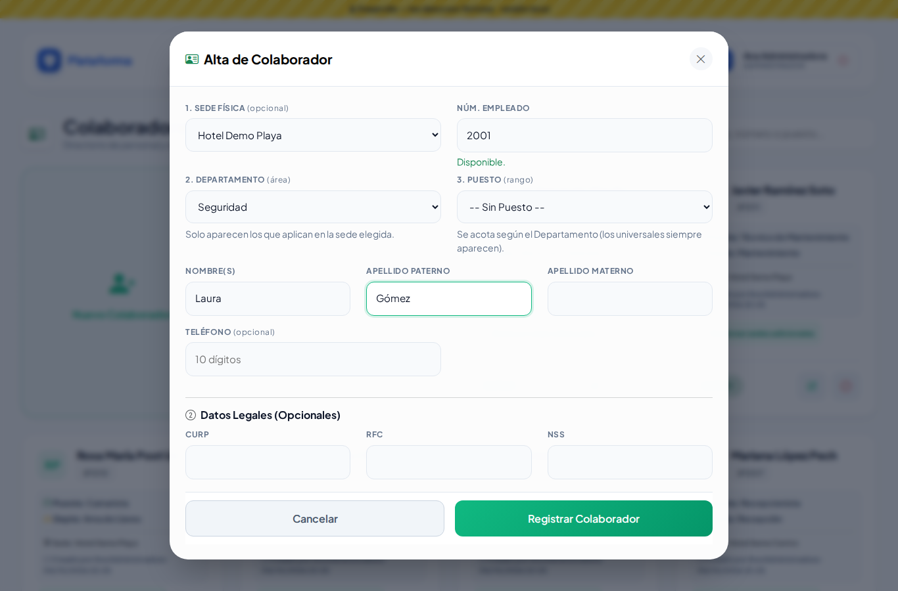

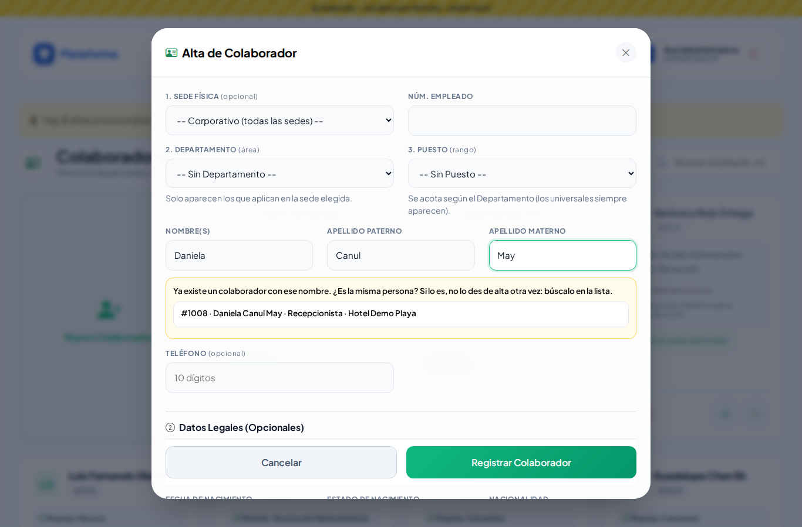

Si el CURP, RFC o NSS no tienen el formato correcto, o ya los tiene otra persona de tu empresa, te lo dice junto al aviso. El CURP y el RFC se pasan a mayúsculas solos.

## Editar

Toca el **lápiz**. Además de lo del alta, aquí se capturan el **correo personal** y la **dirección completa**. Los datos legales se cargan al abrir el diálogo.

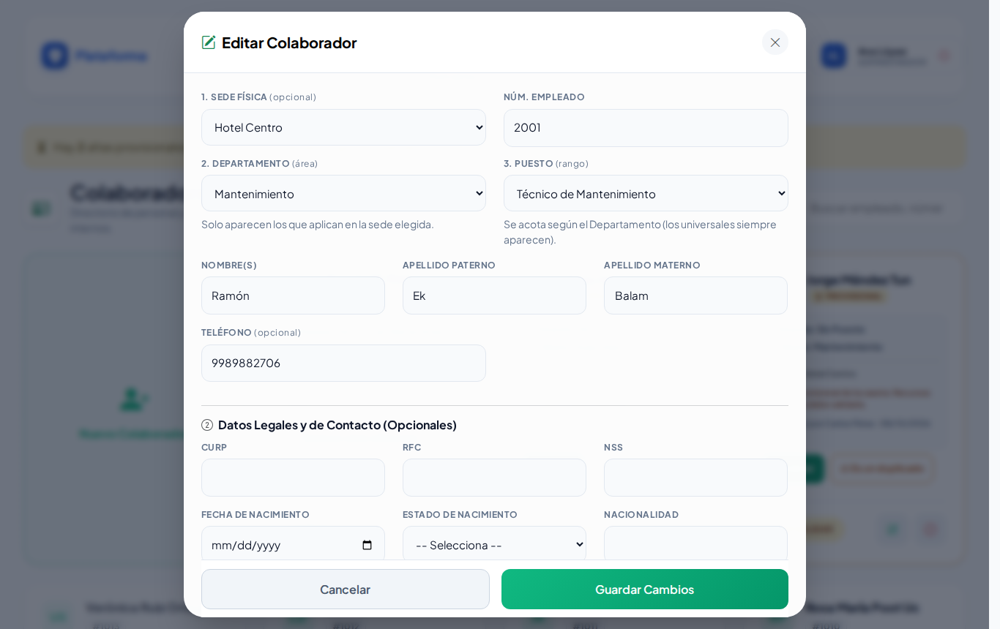

## Sedes adicionales

Si alguien trabaja en más de una sede (por ejemplo, un agente que cubre turnos en la playa):

1. Toca **Gestionar sedes adicionales** en su ficha.
2. Marca las sedes donde **también** tiene presencia, además de la principal.
3. Toca **Guardar Sedes**. La ficha dirá "+1 sede adicional" y aparecerá al filtrar por esa sede.

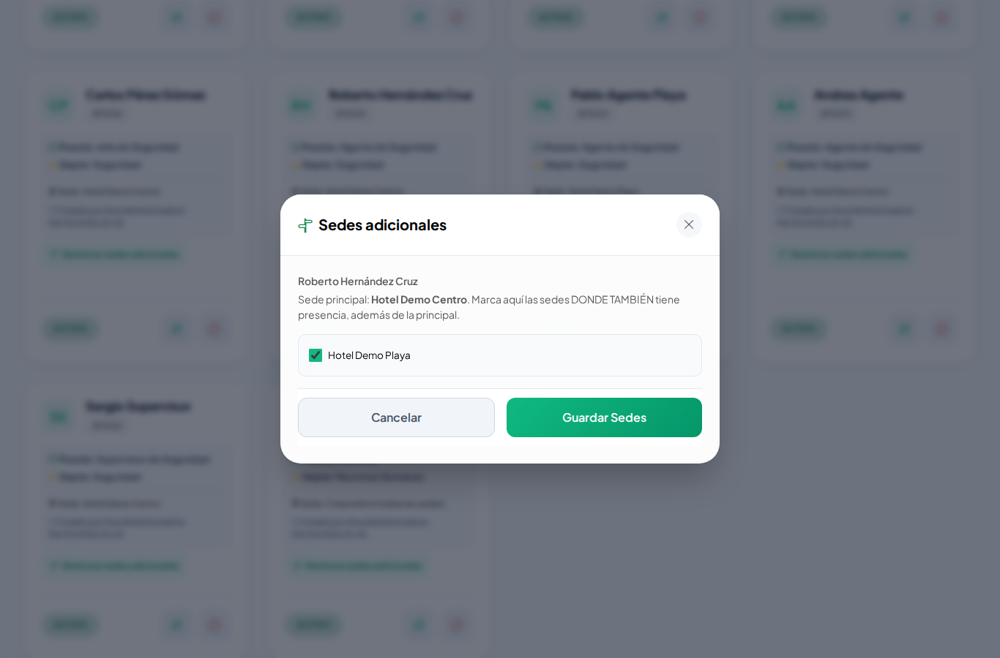

Si tu rol es de una sede, solo ves tus sedes; las demás sedes adicionales del colaborador se conservan.

## Dar de baja o reingresar

- El botón **⊘** da de baja al colaborador. La ficha dice **BAJA** y ya no aparece al buscar colaboradores desde otros módulos (por ejemplo, Usuarios).
- El botón **↺** lo reingresa.

No se borra a nadie, para conservar su historial en bitácoras, pases y responsivas.

## Altas provisionales (caseta)

Si en la caseta necesitas registrar a alguien que **no aparece** al buscarlo:

1. Toca **Alta provisional**. Más adelante también aparecerá dentro de los formularios de accesos, préstamos y pases.
2. Escribe nombre, apellidos y sede. El número de empleado solo si lo sabes.
3. Si ya hay alguien con ese nombre, la plataforma te lo muestra: tócalo para usarlo o elige **Es otra persona: registrarla**.

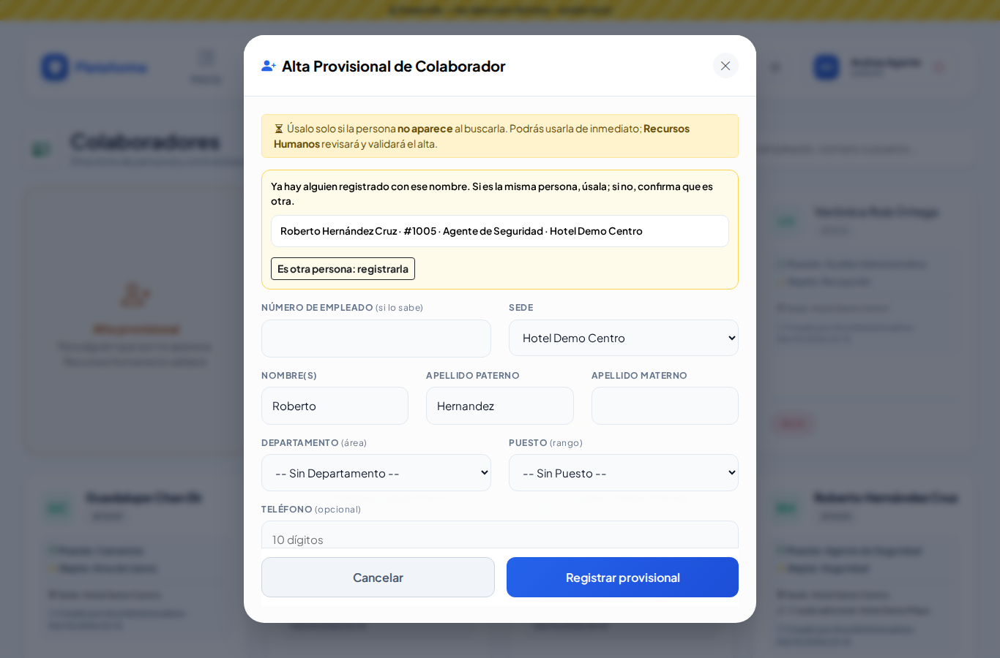

La persona queda marcada **PROVISIONAL / POR VALIDAR** y ya puedes usarla.

## Validar altas provisionales (Recursos Humanos)

En el **Inicio** aparece una tarjeta "N altas provisionales por validar"; tócala y llegas directo a la lista filtrada. Dentro de Colaboradores también verás el aviso.

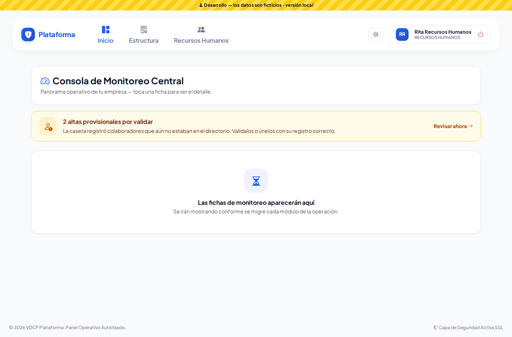

 Elige **Por validar** en el filtro.

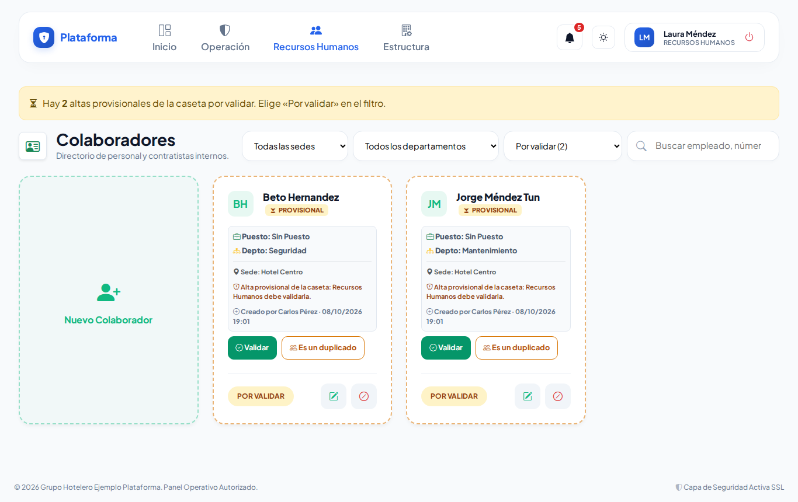

- **Validar:** revisa y corrige los datos, asigna su **número de empleado** y guarda. Desde ese momento es un colaborador normal.
- **Es un duplicado:** si la persona ya estaba registrada (por ejemplo, "Beto Hernandez" es Roberto Hernández), elige su registro correcto. Todo lo que la caseta registró con el provisional pasa a ese colaborador y el provisional queda dado de baja.

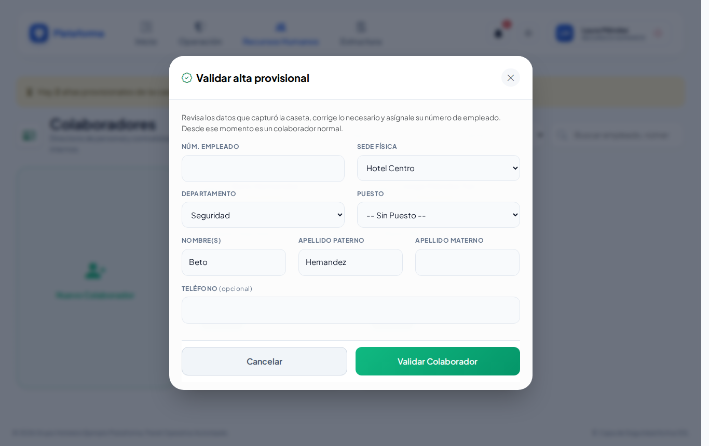

## Datos personales

CURP, RFC, NSS, fecha y estado de nacimiento, nacionalidad, correo personal y dirección solo los ve y captura quien tiene el permiso **Datos personales** (por omisión, el Administrador). Nunca aparecen en las fichas de la lista y en la bitácora de auditoría quedan ocultos (solo los últimos 4 caracteres).

## En el celular y de noche

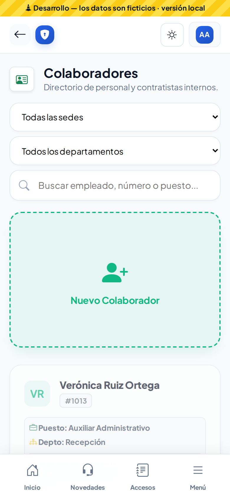

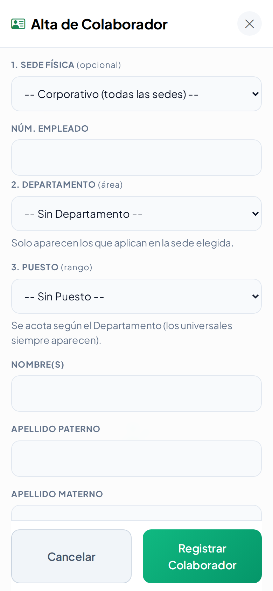

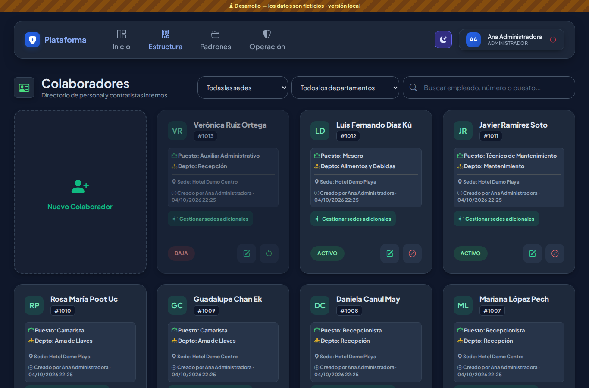
