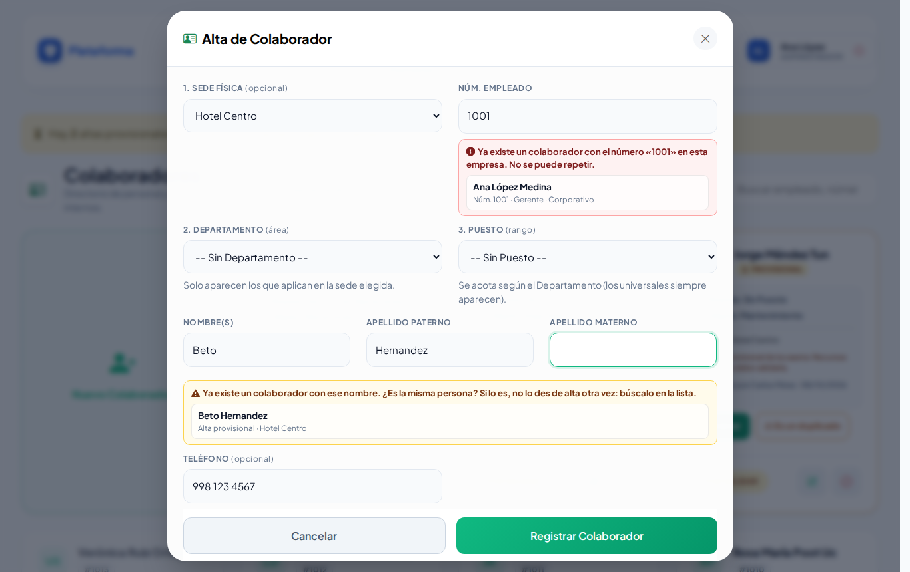
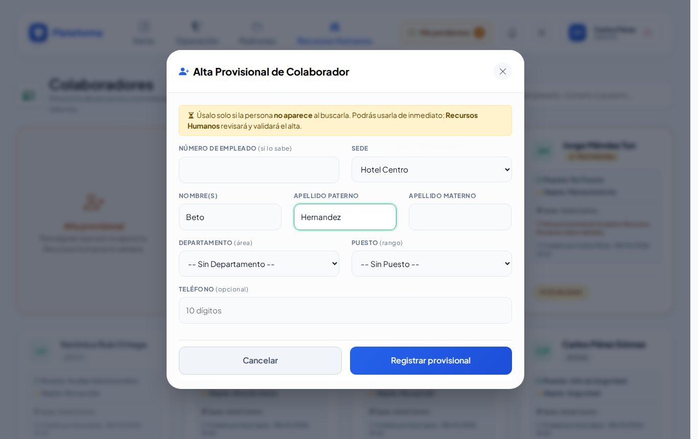
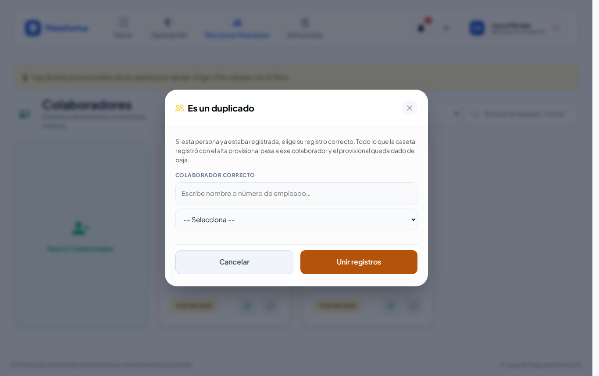
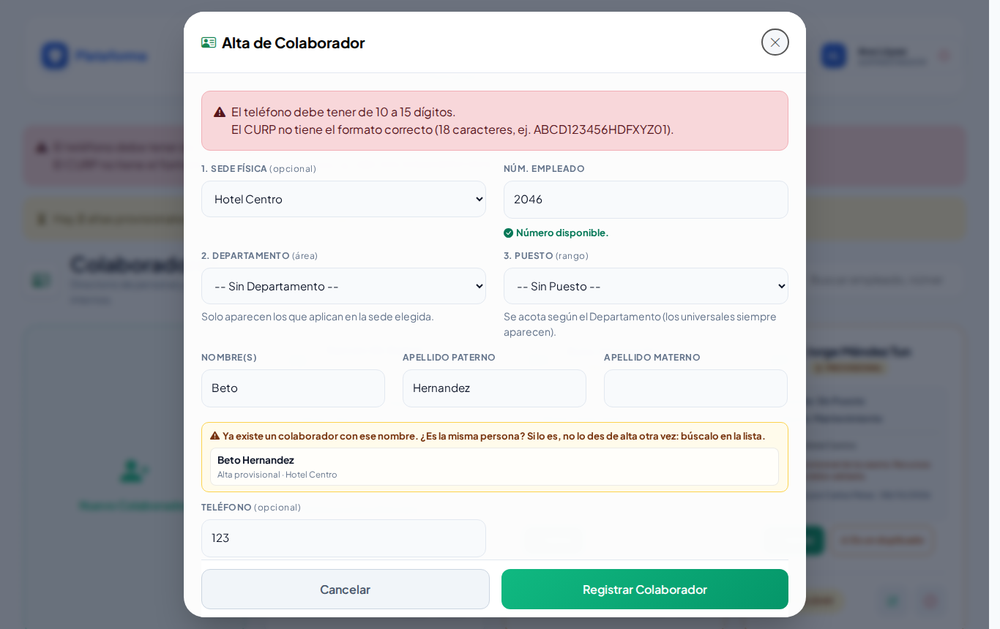

# Colaboradores

**¿Para qué sirve?** Es el directorio del personal de la empresa. Cada colaborador tiene un número de empleado, una sede física (o es corporativo), un departamento (área) y un puesto (rango). La caseta los busca aquí para registrar accesos, préstamos de llaves, pases de salida y responsivas.

## Antes de empezar

- Para ver la pantalla tu rol debe poder consultar *Colaboradores*. Si no aparece en el menú, pide el permiso a tu administrador.
- Para dar de alta, editar o dar de baja necesitas esos permisos. Si no ves **Nuevo Colaborador**, tu rol solo consulta.
- Los **datos legales** (CURP, RFC, NSS, nacimiento, nacionalidad, correo personal y dirección) solo los ve y captura quien tiene el permiso **Datos personales**.
- Si tu rol es de una sede, solo puedes registrar colaboradores en tus sedes.
- Antes de dar de alta conviene tener listos los [Departamentos y Puestos](departamentos-y-puestos.md).

## Cómo encontrar a un colaborador

1. Entra a **Recursos Humanos → Colaboradores**.
2. Escribe en **Buscar empleado, número o puesto...** el nombre, el número de empleado, el puesto o el departamento.
3. Si quieres, elige en **Todas las sedes** (incluye a quienes la tienen como sede adicional) y en **Todos los departamentos**.
4. Con **Todos los registros / Por validar** ves solo las altas provisionales de la caseta.

**Qué debes ver:** las fichas que coinciden, con su número, puesto, departamento, sede y si está **ACTIVO**, **BAJA** o **POR VALIDAR**. El filtro se mantiene mientras trabajas.

## Cómo dar de alta a un colaborador

1. Toca la tarjeta **Nuevo Colaborador**. Se abre **Alta de Colaborador**.
2. **1. Sede Física:** donde trabaja. Si la dejas en **-- Corporativo (todas las sedes) --**, trabaja en todas. Si tu rol es de una sede, es obligatoria.
3. **Núm. Empleado:** mientras escribes te avisa si ya existe.
4. **2. Departamento (área):** solo aparecen los que aplican en la sede elegida.
5. **3. Puesto (rango):** se acota según el departamento. Los puestos sin departamento (por ejemplo *Gerente*) siempre aparecen.
6. Escribe **Nombre(s)**, **Apellido Paterno**, **Apellido Materno** y, si quieres, el **Teléfono** (10 dígitos; puedes escribir espacios o guiones).
7. Si tienes el permiso, llena **Datos Legales (Opcionales)**: CURP, RFC, NSS, Fecha de Nacimiento, Estado de Nacimiento y Nacionalidad. El CURP y el RFC se pasan a mayúsculas solos.
8. Toca **Registrar Colaborador**.

**Qué debes ver:** «Colaborador «Juan Pérez López» creado correctamente.»

### Avisos mientras escribes

- **Núm. Empleado:** verde «Número disponible.»; rojo «Ya existe un colaborador con el número «1001» en esta empresa. No se puede repetir.» (si es de una sede que no tienes a cargo, solo te dice que existe).
- **Nombre y apellidos:** amarillo «Ya existe un colaborador con ese nombre. ¿Es la misma persona? Si lo es, no lo des de alta otra vez: búscalo en la lista.» Si es otra persona con el mismo nombre, continúa normalmente.

## Cómo editar a un colaborador

1. Toca el **lápiz** (Editar) de la ficha. Se abre **Editar Colaborador**.
2. Además de lo del alta, aquí se capturan el **Correo Personal** y la **Dirección Completa** (en **Datos Legales y de Contacto (Opcionales)**).
3. Toca **Guardar Cambios**.

**Qué debes ver:** «Colaborador «…» actualizado correctamente.»

## Cómo asignar sedes adicionales

Si alguien trabaja en más de una sede (por ejemplo un agente que cubre turnos en otra sede):

1. Toca **Gestionar sedes adicionales** en su ficha.
2. Marca las sedes donde **también** trabaja, además de la principal.
3. Toca **Guardar Sedes**.

**Qué debes ver:** «Sedes adicionales de «…» actualizadas.» La ficha dice «+1 sede adicional» y aparece al filtrar por esa sede. Si tu rol es de una sede, solo ves tus sedes; las demás se conservan.

## Cómo dar de baja o reingresar a un colaborador

1. Toca el **círculo rojo** (Dar de baja) y confirma con **Aceptar** («¿Dar de baja a este colaborador? Podrás reactivarlo con el mismo botón.»).
2. Para regresarlo, toca la **flecha circular** (Reingresar) y confirma.

**Qué debes ver:** la ficha en **BAJA**. Ya no aparece al buscarlo desde otros módulos. No se borra a nadie: su historial en bitácoras, pases y responsivas se conserva.

## Cómo registrar un alta provisional (caseta)

Si en la caseta necesitas registrar a alguien que **no aparece** al buscarlo:

1. Toca la tarjeta **Alta provisional** (también aparece dentro de los formularios de accesos, préstamos y pases). Se abre **Alta Provisional de Colaborador**.
2. Escribe **Nombre(s)**, **Apellido Paterno** y elige la **Sede**. El **Número de Empleado** solo si lo sabes.
3. Si ya hay alguien con ese nombre, la plataforma te lo muestra («Ya hay alguien registrado con ese nombre. Si es la misma persona, úsala; si no, confirma que es otra.»): tócalo para usarlo, o toca **Es otra persona: registrarla**.
4. Toca **Registrar provisional**.

**Qué debes ver:** la persona queda marcada **PROVISIONAL / POR VALIDAR** y ya la puedes usar. Recursos Humanos la revisará después.

## Cómo validar las altas provisionales (Recursos Humanos)

1. En **Inicio** (y en **Mis pendientes**) aparece «N altas provisionales por validar». Tócala y llegas a la lista filtrada. Dentro de Colaboradores también verás el aviso.
2. Elige **Por validar** en el filtro.
3. En cada ficha elige:
   - **Validar:** revisa y corrige los datos, asigna su **Núm. Empleado** y toca **Validar Colaborador**. Desde ese momento es un colaborador normal.
   - **Es un duplicado:** si la persona ya estaba registrada (por ejemplo «Beto Hernandez» es Roberto Hernández), busca y elige el **Colaborador correcto** y toca **Unir registros**. Todo lo que la caseta registró con el provisional pasa a ese colaborador y el provisional queda dado de baja.

**Qué debes ver:** ««Beto Hernandez» validado con el número 2047.» o ««Beto Hernandez» se unió con «Roberto Hernández Cruz» (#1005).»

## En el celular y en modo Noche

 

## Si algo sale mal

Los mensajes salen en rojo dentro de la ventana; lo que escribiste se conserva.

| Mensaje o síntoma | Qué significa | Qué hacer |
|---|---|---|
| Ya existe otro colaborador registrado con ese número de empleado. | El número ya se usa. | Revisa el número con Recursos Humanos. |
| Ya existe otro colaborador registrado con ese CURP. / RFC. / NSS. | Esa persona ya está registrada. | Búscala en la lista (puede estar de baja). |
| El CURP no tiene el formato correcto (18 caracteres, ej. ABCD123456HDFXYZ01). | El CURP está incompleto. | Cópialo de su documento. |
| El RFC no tiene el formato correcto (12 o 13 caracteres, ej. ABCD123456XYZ). | El RFC está incompleto. | Corrígelo o déjalo vacío. |
| El NSS debe tener exactamente 11 dígitos. | Faltan o sobran números. | Corrige el NSS. |
| El teléfono debe tener de 10 a 15 dígitos. | Faltan números. | Escribe el teléfono con lada. |
| La fecha de nacimiento debe ser anterior a hoy. | La fecha está mal. | Corrige la fecha. |
| Elige una de tus sedes: solo puedes registrar colaboradores en ellas. | Elegiste una sede que no es tuya. | Elige una de tus sedes. |
| El departamento «…» no aplica en la sede elegida. | Ese departamento no se usa en esa sede. | Elige otro o agrégale la sede en Departamentos. |
| El puesto «…» no aplica en el departamento elegido. | El puesto es de otro departamento. | Elige otro puesto. |
| Este colaborador ya no está pendiente de validar. | Otra persona ya lo validó o lo unió. | Recarga la página. |
| Elige un colaborador activo y ya validado. | Al unir elegiste uno inválido. | Elige el colaborador correcto. |
| No veo los datos legales. | Tu rol no tiene el permiso **Datos personales**. | Pídelo a tu administrador si lo necesitas. |

## Preguntas frecuentes

**¿Se puede borrar a un colaborador?** No. Se da de baja y se puede reingresar; así se conserva su historial.

**¿Qué significa «Corporativo»?** Que el colaborador no pertenece a una sede en particular y trabaja en todas.

**¿Por qué no aparece un departamento al dar de alta?** Porque no aplica en la sede elegida. Revísalo en [Departamentos y puestos](departamentos-y-puestos.md).

**¿Quién ve el CURP, RFC y NSS?** Solo quien tiene el permiso **Datos personales**. En la bitácora de auditoría se ven ocultos (solo los últimos 4 caracteres).

**¿Cómo le doy una cuenta para entrar a la plataforma?** En [Usuarios](usuarios.md), vinculando la cuenta con su ficha de colaborador.

## Relacionado

- [Departamentos y puestos](departamentos-y-puestos.md)
- [Turnos](turnos.md)
- [Usuarios](usuarios.md)
- [Altas por verificar](altas-por-verificar.md)
