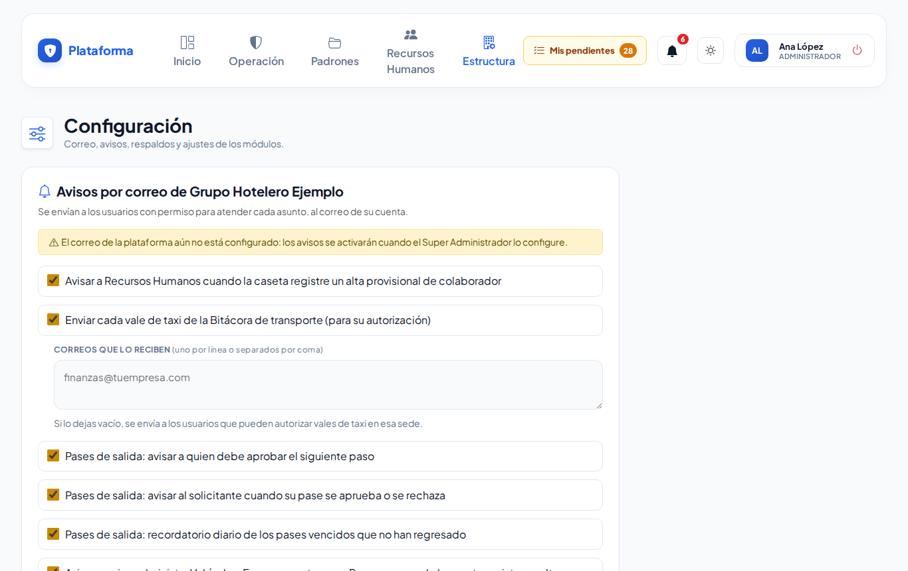
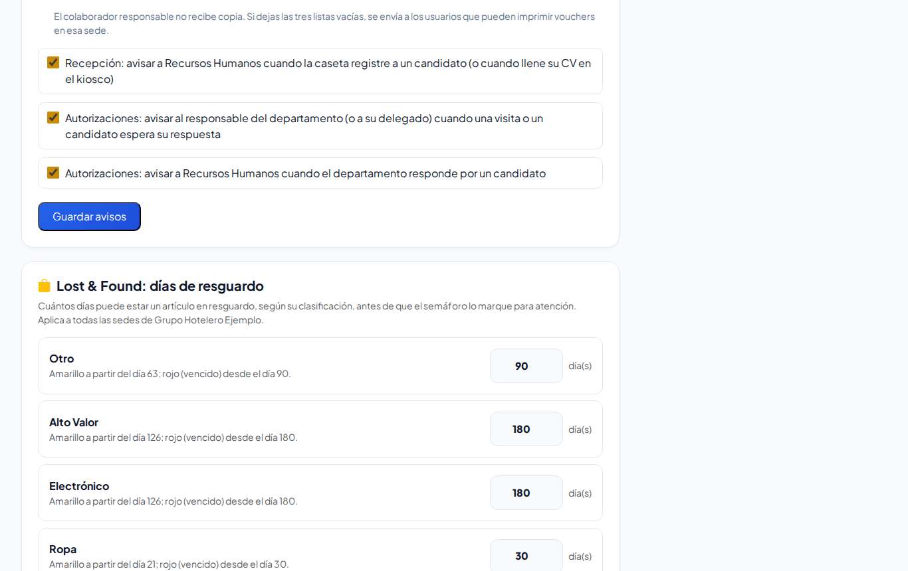
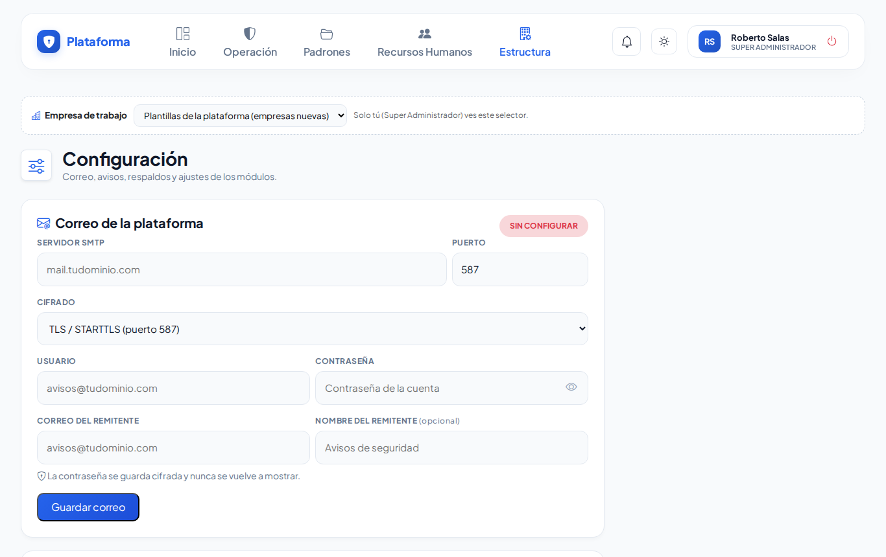
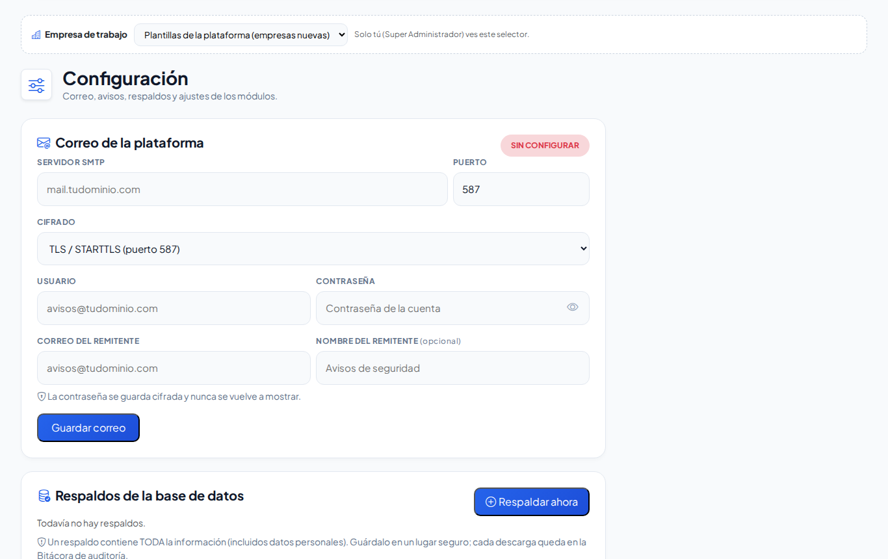

# Configuración

**¿Para qué sirve?** Aquí se ajusta cómo trabaja la plataforma para tu empresa: qué **avisos por correo** se envían y a quién, cuántos días se guarda cada objeto de **Lost & Found**, y los ajustes de **Pases de salida**, **Recepción** y la **bolsa de trabajo**. El Super Administrador configura además el **correo de la plataforma** y los **respaldos**.

## Antes de empezar

- Para ver la pantalla tu rol debe poder consultar *Configuración*.
- Los avisos de la empresa los cambia quien tiene el permiso **editar** de Configuración con alcance de empresa (normalmente el administrador).
- Los días de Lost & Found los cambia quien tiene el permiso **Configurar** de Lost & Found en toda la empresa.
- **Correo de la plataforma** y **Respaldos** solo los ve el Super Administrador.
- Si el correo de la plataforma aún no está configurado, verás el aviso «El correo de la plataforma aún no está configurado: los avisos se activarán cuando el Super Administrador lo configure.»

## Cómo elegir los avisos por correo

1. Entra a **Estructura → Configuración**.
2. En **Avisos por correo de …** marca los avisos que quieres que lleguen. Por ejemplo:
   - Avisar a Recursos Humanos cuando la caseta registre un alta provisional de colaborador.
   - Enviar cada vale de taxi de la Bitácora de transporte (escribe en **Correos que lo reciben** uno por línea o separados por coma).
   - Pases de salida: aprobación, resultado y recordatorio de pases vencidos.
   - Altas por verificar en Vehículos, Empresas externas o Personas.
   - Procedimientos publicados y recordatorios.
   - Vouchers de reposición con cobro (CXC): escribe los correos de **Copia Seguridad**, **Copia Recepción** y **Copia Administración**. Si dejas las tres listas vacías, se envía a los usuarios que pueden imprimir vouchers en esa sede. El colaborador responsable no recibe copia.
   - Recepción y Autorizaciones de los departamentos.
3. Toca **Guardar avisos**.

**Qué debes ver:** «Avisos por correo actualizados.» Los avisos se envían a los usuarios con permiso para atender cada asunto, al correo de su cuenta.

## Cómo cambiar los días de resguardo de Lost & Found

Cada tipo de objeto (Otro, Alto Valor, Electrónico, Ropa, Perecedero) tiene cuántos días puede estar guardado antes de que el semáforo lo marque: **amarillo** al pasar el 70 % de sus días y **rojo (vencido)** al llegar a sus días.

1. Baja a **Lost & Found: días de resguardo** (desde Lost & Found también llegas con el enlace de configuración).
2. Escribe los días de cada tipo (mínimo 1). Debajo de cada uno dice desde qué día se pone amarillo y rojo.
3. Toca **Guardar días de resguardo**.

**Qué debes ver:** «Los días de resguardo de Lost & Found se guardaron correctamente.» Aplica a todas las sedes de la empresa.

## Otros ajustes de módulos

En la misma pantalla están los ajustes de:

- **Pases de salida** (resumen del circuito de firmas). Ver [Pases de salida](pases-salida.md).
- **Recepción de candidatos:** aviso de privacidad y duración del enlace del kiosco. Ver [Recepción y autorizaciones](recepcion-y-autorizaciones.md).
- **Bolsa de trabajo en internet.** Ver [Vacantes](vacantes.md).

## Cómo configurar el correo de la plataforma (Super Administrador)

1. Pide a tu proveedor de correo los datos de la cuenta desde la que saldrán los avisos (por ejemplo `avisos@tuempresa.com`): servidor, puerto y cifrado.
2. En **Correo de la plataforma** captura **Servidor SMTP**, **Puerto** (normalmente 587 con TLS, o 465 con SSL), **Cifrado**, **Usuario** (la cuenta completa), **Contraseña**, **Correo del remitente** y, si quieres, el **Nombre del remitente**.
3. Toca **Guardar correo**.
4. En **Enviar correo de prueba a** escribe tu correo y toca **Enviar prueba**. Revisa tu bandeja de entrada y también la de correo no deseado.

**Qué debes ver:** «Configuración de correo guardada. Envía un correo de prueba para confirmar que funciona.» y la etiqueta **CONFIGURADO**. Si algo falla, la pantalla muestra el último error (por ejemplo, contraseña incorrecta o puerto bloqueado).

> Escribe la contraseña **solo en esta pantalla**, nunca en un chat o correo. Se guarda cifrada y no se vuelve a mostrar. Para cambiarla escribe la nueva; si dejas el campo vacío, se conserva la anterior.

## Cómo hacer o descargar un respaldo (Super Administrador)

- **Automáticos:** la plataforma se respalda sola cada día después de las 3:00 y antes de instalar cada versión nueva. Se guardan 14 días.
- **Respaldar ahora:** crea uno en el momento (por ejemplo antes de un cambio grande). Confirma con **Aceptar**.
- **Descargar:** con la flecha de cada respaldo. Guárdalo en un lugar seguro: contiene **toda** la información, incluidos datos personales. Cada descarga queda en la [Bitácora de auditoría](auditoria.md).
- **Restaurar** un respaldo reemplaza toda la información actual: pide ayuda a tu proveedor de hospedaje y hazlo solo si de verdad lo necesitas.

## Si algo sale mal

| Mensaje o síntoma | Qué significa | Qué hacer |
|---|---|---|
| Escribe solo el nombre del servidor (ej. mail.tudominio.com), sin https:// ni espacios. | El servidor está mal escrito. | Escribe solo el nombre del servidor. |
| Usa un puerto de correo: … | El puerto no es de correo. | Usa 587 (TLS) o 465 (SSL). |
| Primero guarda la configuración del correo. | Tocaste **Enviar prueba** sin guardar. | Toca **Guardar correo** y luego prueba. |
| No se pudo crear el respaldo: … | Hubo un problema al respaldar. | Intenta de nuevo; si sigue, avisa a soporte. |
| Los avisos son de toda la empresa: hace falta el permiso «editar» de Configuración con alcance de empresa. | Tu rol no puede cambiar los avisos. | Pídelo a tu administrador. |
| Los días de resguardo son de toda la empresa: hace falta el permiso «configurar» de Lost & Found con alcance de empresa. | Tu rol no puede cambiar los días. | Pídelo a tu administrador. |
| No llegan los correos. | El correo de la plataforma no está configurado o el aviso está apagado. | Revisa el aviso amarillo y las casillas; revisa el correo no deseado. |

## Preguntas frecuentes

**¿A quién le llegan los avisos?** A los usuarios activos con permiso para atender ese asunto en la sede correspondiente, al correo de su cuenta (salvo donde escribes correos fijos).

**¿Los días de Lost & Found se pueden poner por sede?** No; aplican a todas las sedes de la empresa.

**¿Cada cuánto se respalda la plataforma?** Diario y antes de cada actualización; se guardan 14 días.

## Relacionado

- [Lost & Found y robo](lost-found-y-robo.md)
- [Recepción y autorizaciones](recepcion-y-autorizaciones.md)
- [Vacantes](vacantes.md)
- [Altas por verificar](altas-por-verificar.md)
