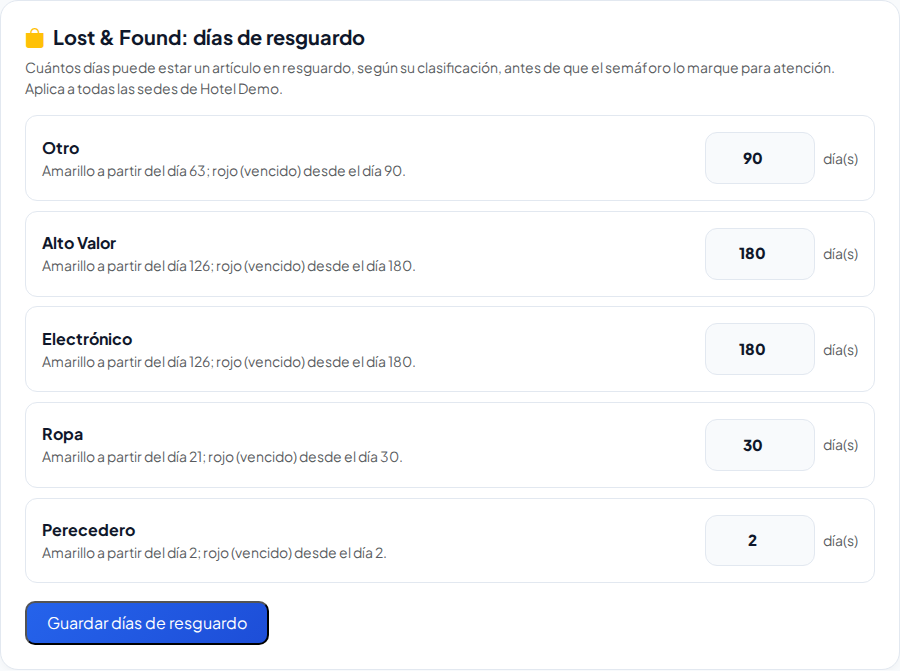
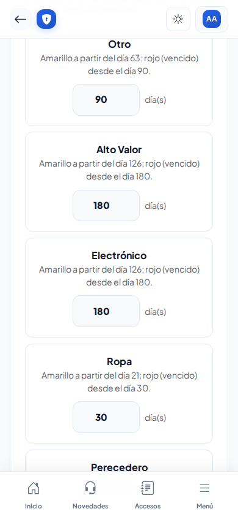
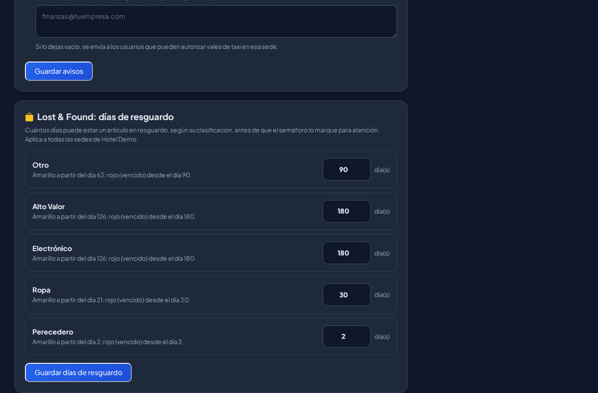
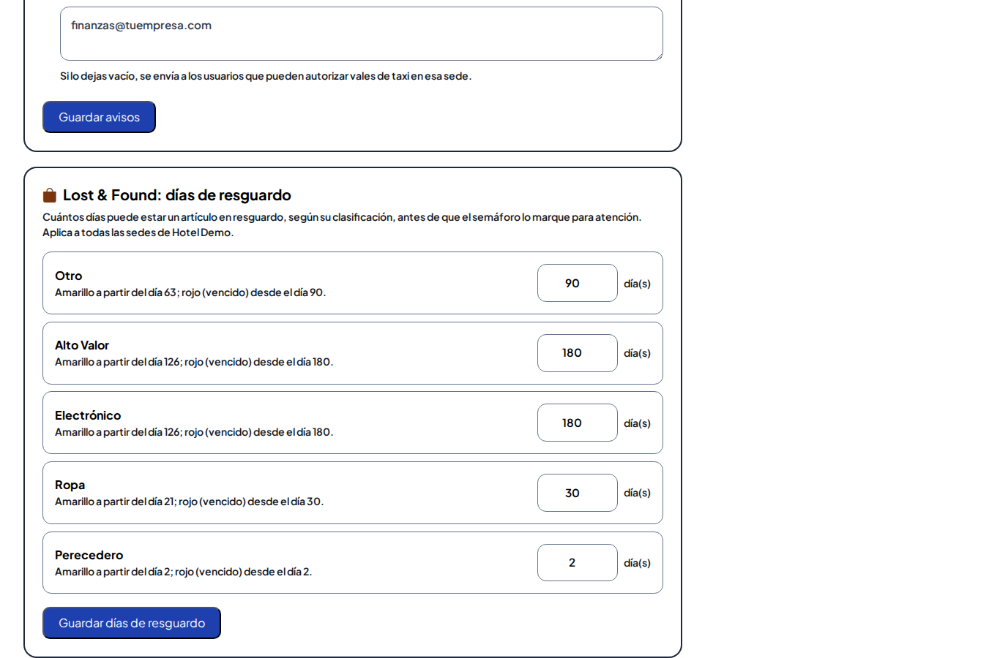

# Configuración (Estructura → Configuración)

## Correo de la plataforma (solo Super Administrador)

1. En cPanel crea (o usa) la cuenta de correo para los avisos, por ejemplo `avisos@tudominio.com`. En **Cuentas de correo → Conectar dispositivos** encuentras el servidor y los puertos.
2. En Configuración captura:
   - **Servidor** y **Puerto:** normalmente 587 con TLS, o 465 con SSL.
   - **Usuario:** la cuenta completa.
   - **Contraseña.**
   - **Correo del remitente.**
3. Guarda y toca **Enviar prueba**. Revisa tu bandeja de entrada y también la de spam.

> La contraseña escríbela **solo en esta pantalla**, nunca en un chat o correo. Se guarda cifrada y no se vuelve a mostrar. Para cambiarla, escribe la nueva; si dejas el campo vacío, se conserva la anterior.

Si algo falla, la pantalla muestra el último error, por ejemplo una contraseña incorrecta o un puerto bloqueado.

## Avisos por correo (Administrador de la empresa)

Marca los avisos que quieres que lleguen. Hoy está disponible:

- **Altas provisionales:** cuando la caseta registra a alguien que no estaba en el directorio, Recursos Humanos recibe un correo con un botón para revisarlo.

## Lost & Found: días de resguardo (Administrador de la empresa)

Aquí decides **cuántos días** puede estar guardado un artículo de Lost & Found, según su tipo (Otro, Alto Valor, Electrónico, Ropa, Perecedero), antes de que el semáforo lo marque:

- **Amarillo:** cuando ya pasó el 70 % de sus días.
- **Rojo (vencido):** cuando llega a sus días. Hay que decidir si se entrega, se dona o se destruye.

Pasos:

1. Entra a **Estructura → Configuración** y baja a **Lost & Found: días de resguardo** (desde Lost & Found también llegas con el enlace **Configurar en Estructura → Configuración**).
2. Escribe los días de cada tipo (mínimo 1).
3. Toca **Guardar días de resguardo**. Aplica a **todas las sedes** de la empresa.

Solo los cambia quien tiene el permiso **Configurar** de Lost & Found en **toda la empresa** (por omisión, el Administrador). Un Jefe de seguridad de una sede no los puede cambiar.

| En el celular | Noche | Sol |
|---|---|---|
|  |  |  |

## Respaldos (solo Super Administrador)

- **Automáticos:** la plataforma se respalda **sola** cada día después de las 3:00 y antes de instalar cada versión nueva. Se guardan 14 días.
- **Manual:** **Respaldar ahora** crea uno en el momento, por ejemplo antes de un cambio grande.
- **Descargar:** con la flecha de cada respaldo. Guárdalo en un lugar seguro: contiene toda la información.
- **Restaurar:** en cPanel → phpMyAdmin → elige la base → **Importar** → selecciona el archivo `.sql.gz`. Hazlo solo si de verdad necesitas regresar la información, porque reemplaza todo lo actual.
