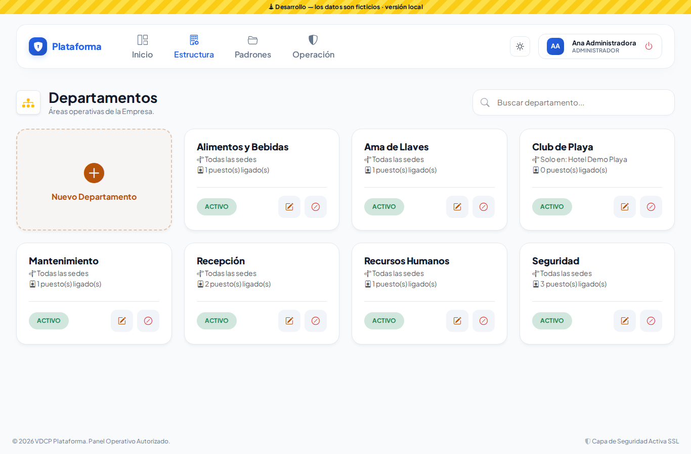
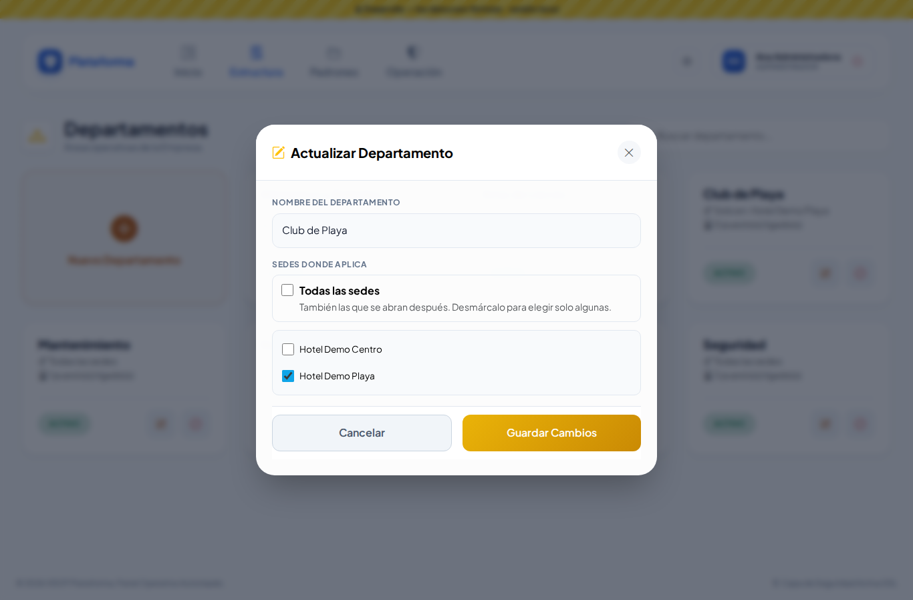
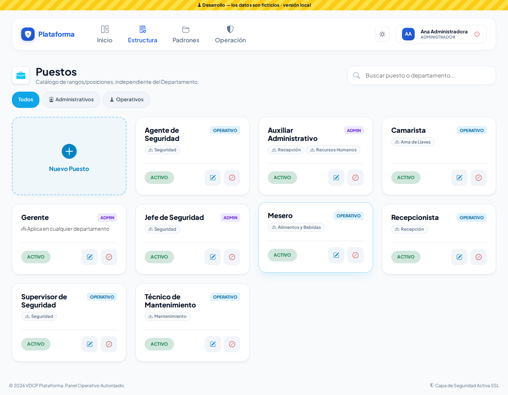
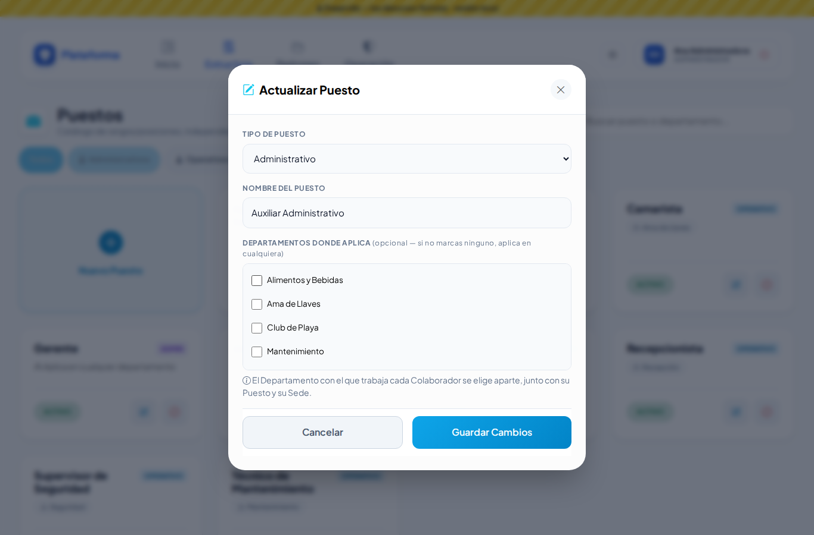
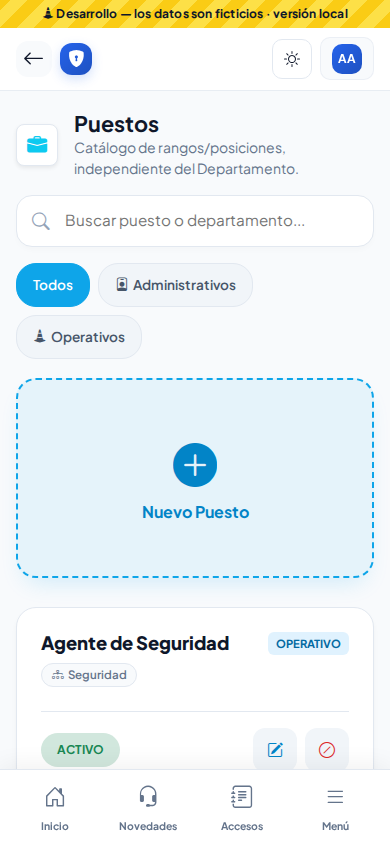

# Departamentos y Puestos

Los departamentos son las **áreas** de la empresa (Seguridad, Recepción, Ama de Llaves…). Los puestos son los **rangos** (Agente, Supervisor, Gerente…). Al dar de alta a un colaborador elegirás su departamento, su puesto y su sede.

## Departamentos (Estructura → Departamentos)

1. Toca **Nuevo Departamento** y escribe el nombre. Si ya existe uno igual, te avisa mientras escribes.
2. **Sedes donde aplica:** por defecto, **Todas las sedes**, incluidas las que abras después. Si el departamento solo existe en algunas (por ejemplo, *Club de Playa*), desmárcalo y elige las sedes.

La ficha te dice en qué sedes aplica y cuántos puestos tiene ligados.

## Puestos (Estructura → Puestos)

1. Toca **Nuevo Puesto**.
2. Elige el **tipo**: Operativo o Administrativo.
3. Escribe el **nombre**.
4. Si quieres, marca los **departamentos donde aplica**. Si no marcas ninguno, el puesto sirve para cualquier departamento.
5. Usa las píldoras **Todos / Administrativos / Operativos** y el buscador para encontrar un puesto rápido. El buscador también encuentra puestos por el nombre de su departamento.

## Desactivar

El botón **⊘** desactiva un departamento o un puesto sin borrar su historial, y **↺** lo reactiva. Un puesto ligado a un departamento desactivado conserva esa liga: se ve tachada en la ficha.

## Quién puede modificarlos

Departamentos y puestos son de **toda la empresa**: solo los modifica quien tiene alcance de empresa (por ejemplo, el Administrador). Quien solo tiene una sede los ve en modo consulta.

En el celular la pantalla se adapta:

