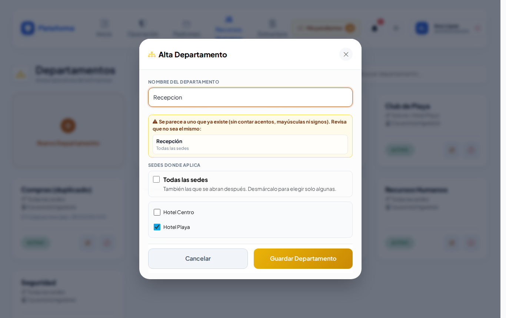
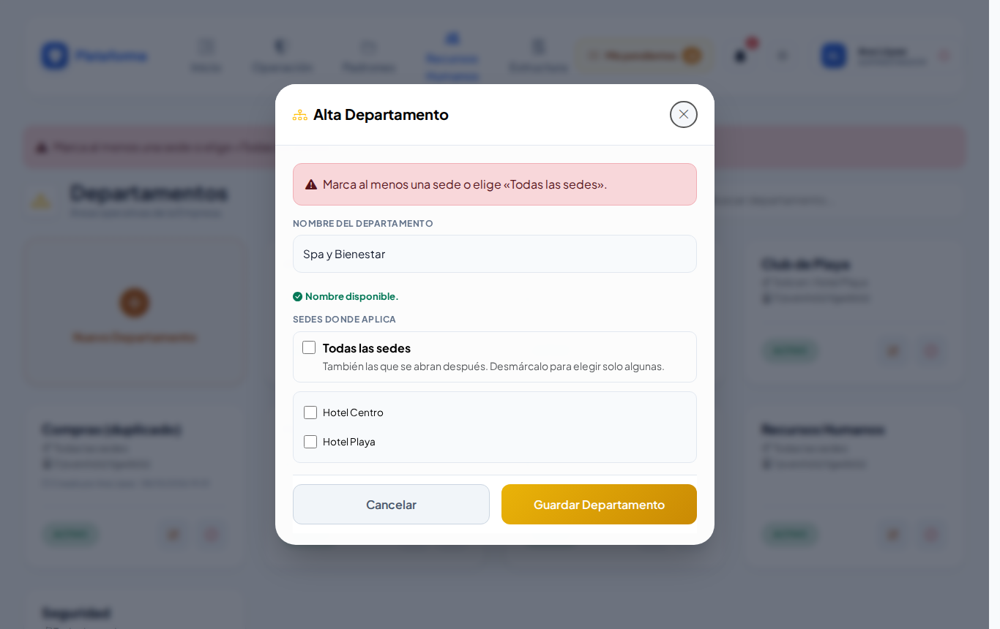

# Departamentos y puestos

**¿Para qué sirve?** Los **departamentos** son las áreas de la empresa (Seguridad, Recepción, Ama de Llaves…). Los **puestos** son los rangos (Agente, Supervisor, Gerente…). Al dar de alta a un [colaborador](colaboradores.md) eliges su departamento, su puesto y su sede; los préstamos de llaves y las autorizaciones también usan estos catálogos.

## Antes de empezar

- Para ver estas pantallas tu rol debe poder consultar *Departamentos* y *Puestos*. Si no aparecen en el menú, pide el permiso a tu administrador.
- Son catálogos de **toda la empresa**: solo los modifica quien tiene alcance de empresa (por ejemplo el administrador). Si tu rol es de una sede, los verás en modo consulta.

## Cómo crear un departamento

1. Entra a **Recursos Humanos → Departamentos**.
2. Toca la tarjeta **Nuevo Departamento**. Se abre **Alta Departamento**.
3. Escribe el **Nombre del Departamento**. Mientras escribes te avisa si ya existe o se parece a otro.
4. En **Sedes donde aplica** deja **Todas las sedes** (incluye las que abras después) o desmárcala y elige solo algunas (por ejemplo, un *Club de Playa* que solo existe en una sede).
5. Toca **Guardar Departamento**.

**Qué debes ver:** «Departamento «Spa y Bienestar» creado correctamente.» La ficha dice en qué sedes aplica y cuántos puestos tiene ligados.

### Avisos mientras escribes el nombre

- **Verde:** «Nombre disponible.»
- **Rojo:** «Ya existe un departamento «…» en esta empresa. No se puede repetir.» Si está desactivado, aparece **Reactivar**: úsalo en lugar de crearlo otra vez.
- **Amarillo:** «Se parece a uno que ya existe (sin contar acentos, mayúsculas ni signos). Revisa que no sea el mismo:». Por ejemplo «Recepcion» y «Recepción».

## Cómo crear un puesto

1. Entra a **Recursos Humanos → Puestos**.
2. Toca la tarjeta **Nuevo Puesto**. Se abre **Alta de Puesto**.
3. Elige el **Tipo de Puesto**: Operativo o Administrativo.
4. Escribe el **Nombre del Puesto** (también te avisa si ya existe o se parece).
5. Si quieres, marca los **Departamentos donde aplica**. Si no marcas ninguno, el puesto sirve para cualquier departamento.
6. Toca **Guardar Puesto**.

**Qué debes ver:** «Puesto «…» creado correctamente.» Para encontrar un puesto usa **Todos / Administrativos / Operativos** y **Buscar puesto o departamento...**.

## Cómo editar un departamento o un puesto

1. Toca el **lápiz** (Editar) de la ficha.
2. Corrige el nombre, las sedes (departamento) o el tipo y los departamentos (puesto).
3. Toca **Guardar Cambios**.

**Qué debes ver:** «Departamento «…» actualizado correctamente.» o «Puesto «…» actualizado correctamente.»

## Cómo desactivar o reactivar

1. Toca el **círculo rojo** (Desactivar) y confirma con **Aceptar**.
2. Para regresarlo, toca la **flecha circular** (Reactivar).

**Qué debes ver:** la ficha en gris. No se borra el historial. Un puesto ligado a un departamento desactivado conserva esa liga: se ve tachada en su ficha.

## En el celular

## Si algo sale mal

Los mensajes salen en rojo dentro de la ventana; lo que escribiste se conserva.

| Mensaje o síntoma | Qué significa | Qué hacer |
|---|---|---|
| Ya existe un departamento con ese nombre en esta empresa. | El nombre ya se usa (sin importar mayúsculas). | Usa el existente o reactívalo. |
| Ya existe un puesto con ese nombre en esta empresa. | El puesto ya existe. | Usa el existente o reactívalo. |
| Marca al menos una sede o elige «Todas las sedes». | Quitaste todas las sedes. | Marca al menos una sede. |
| Aparece el globo «Completa este campo». | El nombre está vacío. | Escribe el nombre. |
| No veo **Nuevo Departamento** ni el lápiz. | Tu rol no tiene alcance de empresa. | Pide el cambio a tu administrador. |
| Un departamento no aparece al dar de alta a un colaborador. | No aplica en la sede elegida o está desactivado. | Agrégale la sede o reactívalo. |

## Preguntas frecuentes

**¿Qué diferencia hay entre departamento y puesto?** El departamento es el área donde trabaja (Recepción); el puesto es su rango o posición (Recepcionista, Gerente).

**¿Para qué sirve «Departamentos donde aplica» en un puesto?** Para que al dar de alta a un colaborador solo aparezcan los puestos de su departamento. Los puestos sin departamento salen siempre.

**¿Puedo borrar un departamento?** No; se desactiva para conservar el historial.

**¿Dos departamentos pueden llamarse igual?** No dentro de la misma empresa.

## Relacionado

- [Colaboradores](colaboradores.md)
- [Turnos](turnos.md)
- [Recepción y autorizaciones](recepcion-y-autorizaciones.md)
