# Eliminar definitivamente

A veces se captura algo **por error**: un departamento repetido, un tipo de gafete mal escrito, una persona registrada dos veces. **Dar de baja** lo esconde pero lo deja en la lista de inactivos para siempre. **Eliminar definitivamente** lo borra de la base de datos.

Solo se puede si **nadie lo usa todavía**. Si ya tiene historial (préstamos, accesos, colaboradores…), la plataforma no lo borra: te dice qué lo usa y te ofrece darlo de baja.

> Por omisión solo el **Administrador** de la empresa puede eliminar definitivamente. Agentes, Supervisores, Jefes de seguridad y Recursos Humanos no ven el botón.

## Dónde está

Abre el registro con **Editar** (el lápiz). Al pie de la ventana, debajo de los botones, aparece en rojo **Eliminar definitivamente**.

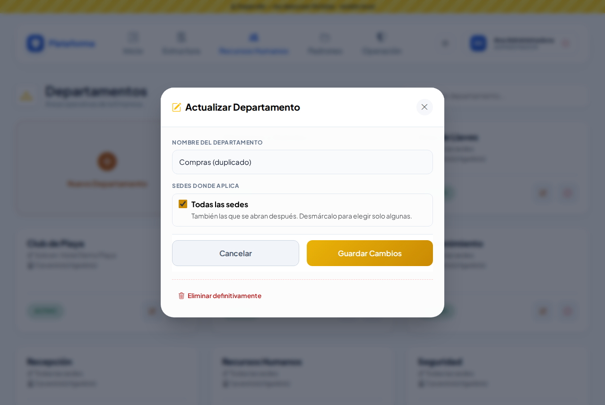

Está en: Sedes, Zonas y áreas, Departamentos, Puestos, Turnos, Colaboradores, Roles, Proveedores, Padrón de personas, Padrón vehicular, Catálogo de llaves, Gafetes, Equipos de seguridad, Equipos de Protección Civil, Estacionamientos, Rutas y Paraderos.

**Nunca** se pueden eliminar las bitácoras ni lo que sirve de evidencia: Accesos, Novedades (Lost & Found, Robo, Accidentes…), Préstamo de llaves, Responsivas, Pases de salida, Transporte, Vouchers y la Bitácora de auditoría. Tampoco Empresas ni Usuarios: esos se dan de baja.

## Eliminar algo que nadie usa

1. Toca **Eliminar definitivamente**.
2. La ventana te recuerda que **no se puede deshacer** y te pide escribir el nombre o identificador (el código de la sede, las placas del vehículo, la nomenclatura de la llave, el número de empleado…).

   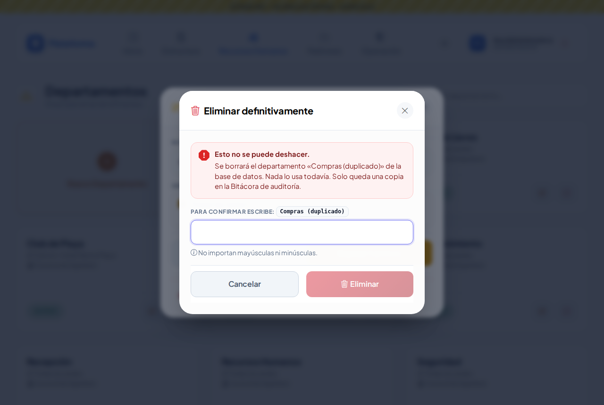

3. Escríbelo. No importan mayúsculas ni minúsculas. El botón **Eliminar** se activa cuando coincide.

   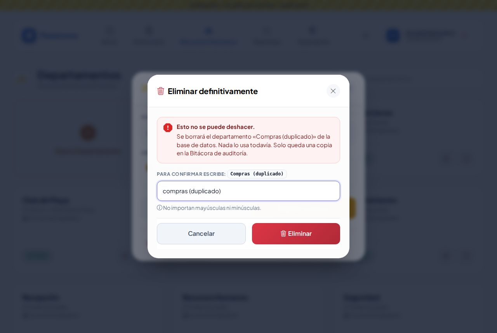

4. Toca **Eliminar**. Regresas a la lista con el aviso «… se eliminó definitivamente».

   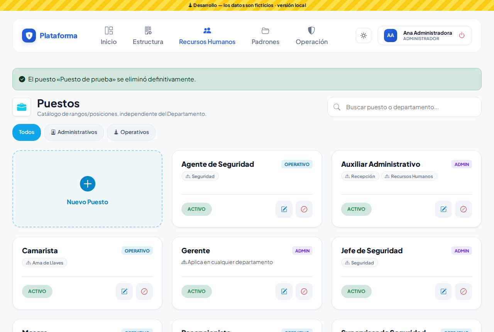

Lo que era parte del registro se va con él: los horarios de una llave y los lugares que abre, los horarios y paradas de una ruta, los permisos de un rol, las sedes donde operaba un proveedor.

## Cuando ya se usa

Si algo depende del registro, verás por qué y no se borra nada:

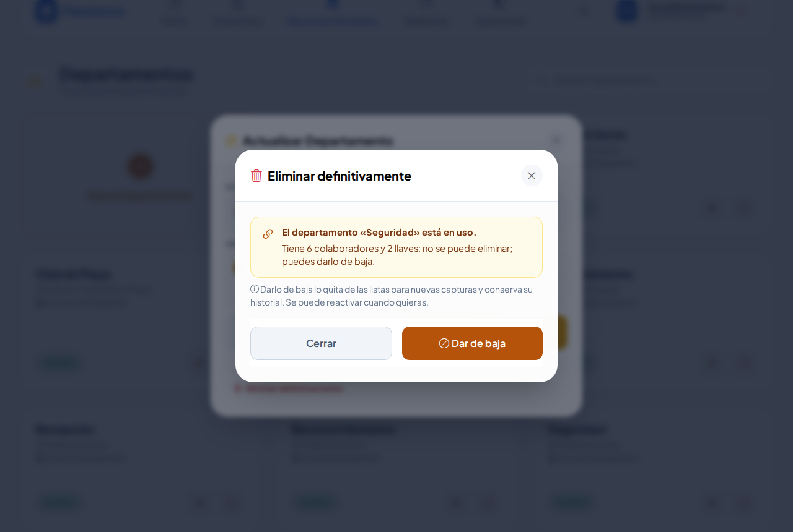

- **Dar de baja** lo desactiva en ese momento (igual que el botón de desactivar de la ficha). Podrás reactivarlo cuando quieras.
- En llaves, gafetes y equipos la baja pide motivo y quizá voucher, así que la ventana te indica usar **Dar de baja** de su ficha.

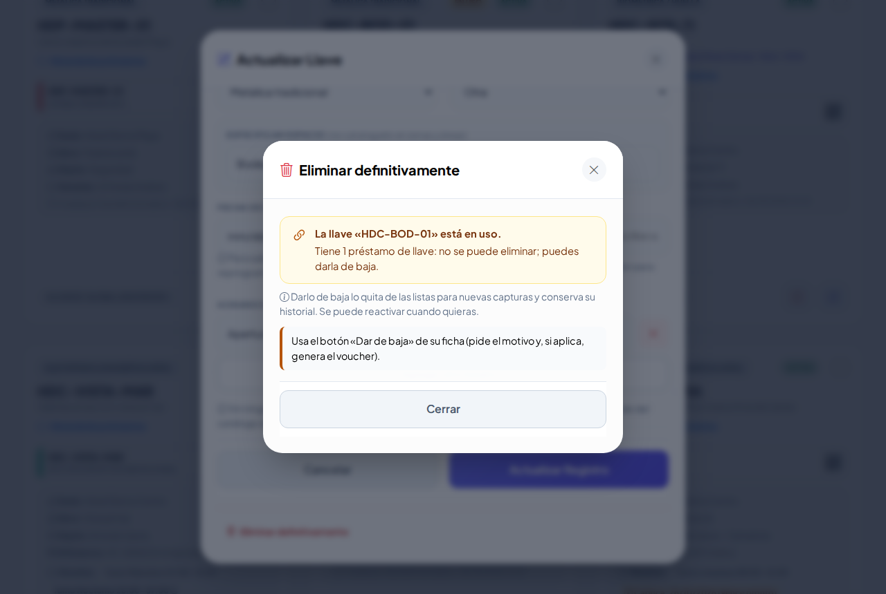

Otros casos que no se pueden eliminar:

- La **única sede** de la empresa.
- Un **rol** que tiene usuarios, tu propio rol o uno de tu nivel o superior, y las plantillas de la plataforma.
- Algo de **otra sede** si tu permiso es solo de tu sede.

## Tipos de gafete y de equipo mal escritos

En **Gafetes** y en **Equipos de seguridad**, debajo de los filtros, abre **Eliminar tipos de … sin usar**: aparecen los tipos que ningún gafete o equipo usa. Toca el bote de basura del tipo y confirma igual que arriba.

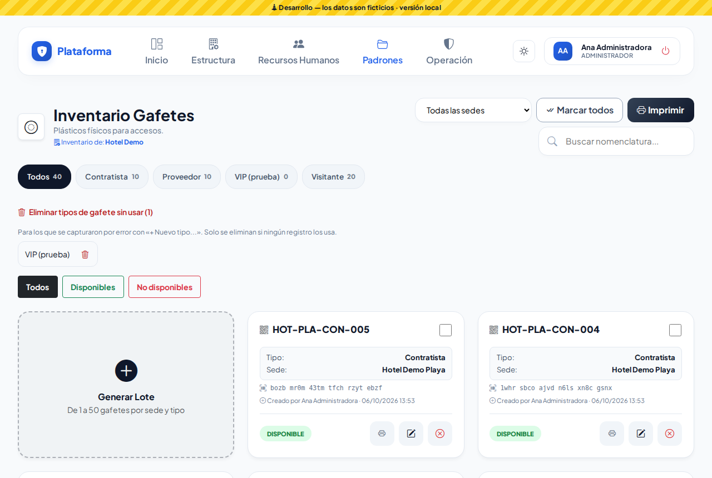

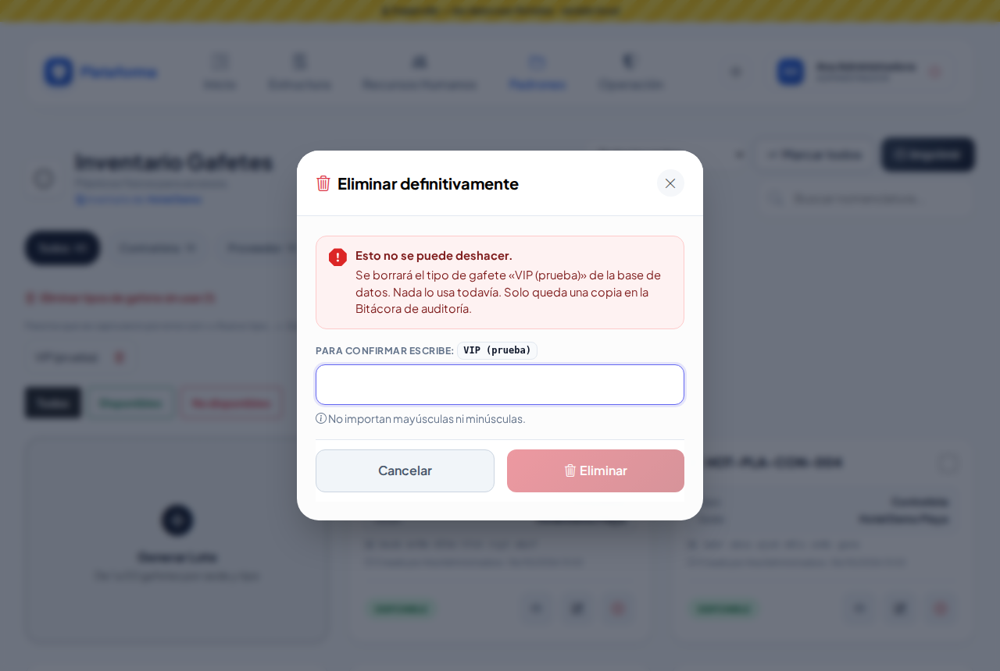

## ¿Y si me equivoqué?

No se puede deshacer desde la pantalla. Pero queda una **copia completa** en la **Bitácora de auditoría** (módulo del registro, acción «Eliminado definitivo»): ahí están todos sus datos para volver a capturarlo.

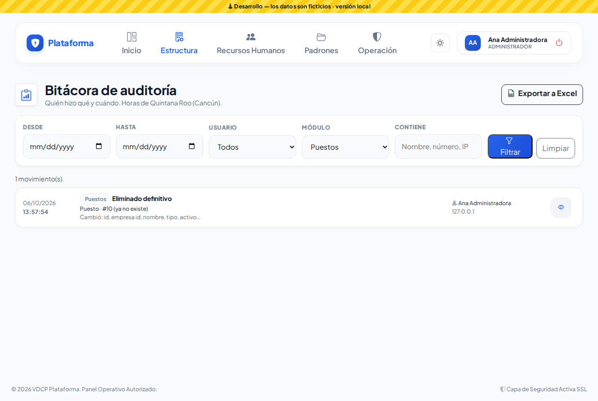

## En el celular y en los modos Noche y Sol

En el celular la confirmación sale abajo, con botones grandes.

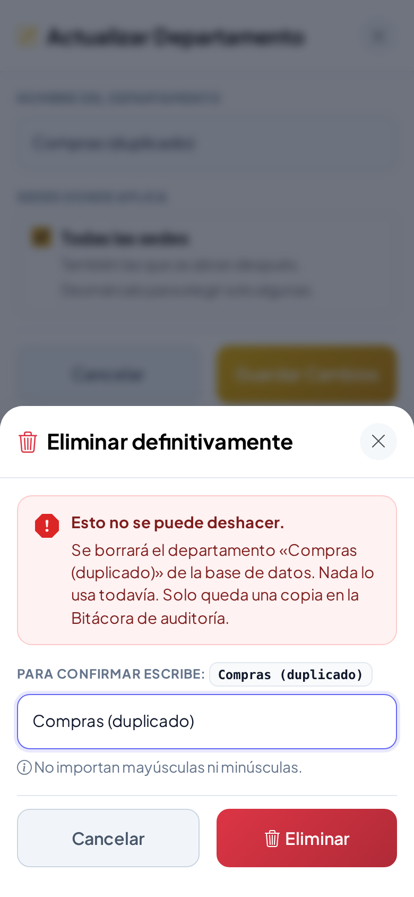
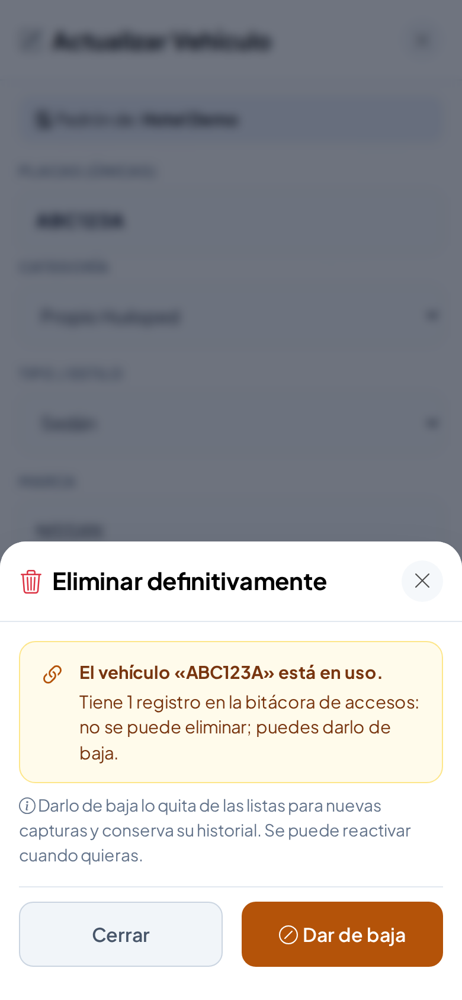

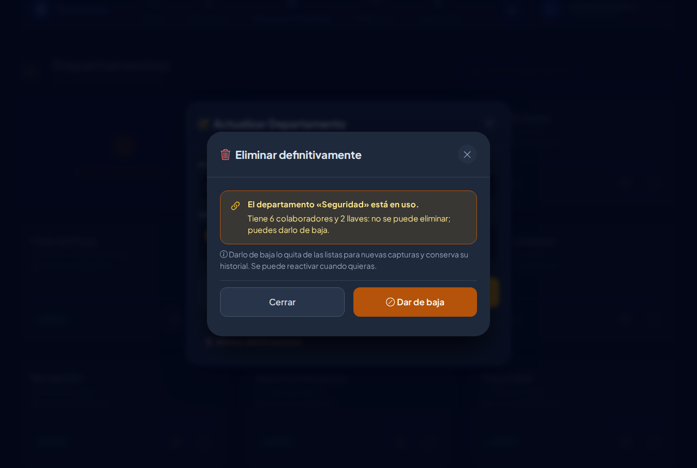
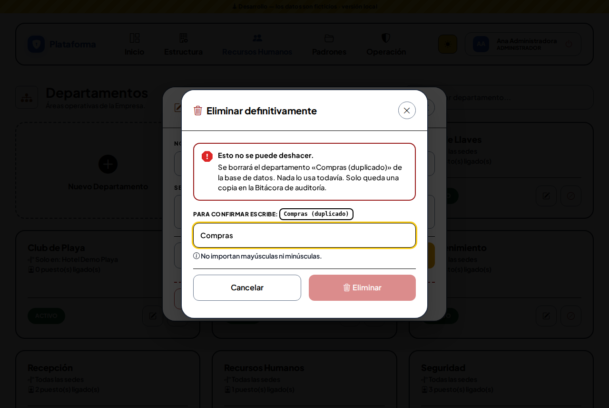

## Lo que ve el Agente

El Agente consulta los padrones pero no ve ningún botón para eliminar.

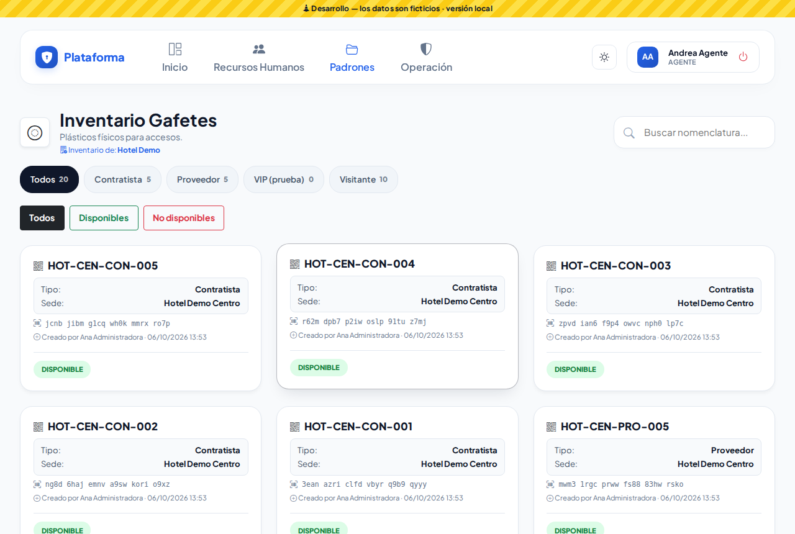

## Permisos

En **Matriz de permisos**, cada módulo de la lista de arriba tiene en «Otras acciones» **Eliminar definitivamente**. Es distinto de **Eliminar** (que en la plataforma es dar de baja). Para catálogos de toda la empresa (departamentos, puestos, turnos, roles, proveedores, personas, vehículos, tipos y sedes) hace falta con alcance **Toda la empresa**.
