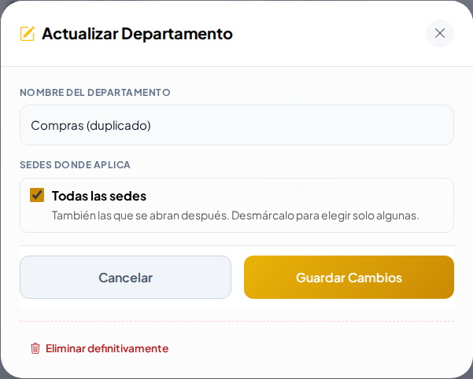
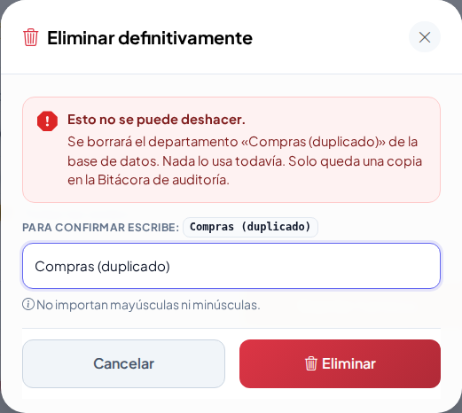
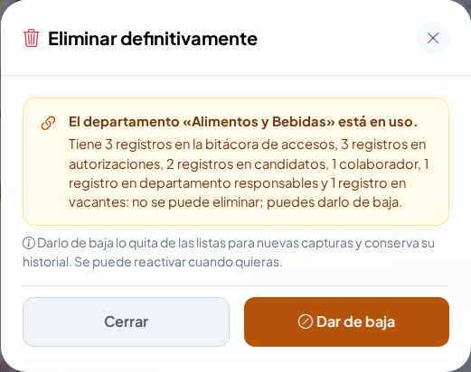

# Eliminar definitivamente

**¿Para qué sirve?** A veces se captura algo por error: un departamento repetido, un tipo de gafete mal escrito, una persona registrada dos veces. **Dar de baja** lo esconde, pero lo deja en la lista de inactivos. **Eliminar definitivamente** lo borra para siempre, solo si **nadie lo ha usado**.

**Antes de empezar:** necesitas el permiso **Eliminar definitivamente** del módulo. Normalmente solo lo tiene el **Administrador** de la empresa. Si no ves el botón rojo, no lo tienes: pide a tu administrador que lo haga.

Se puede en: Sedes, Zonas y áreas, Departamentos, Puestos, Turnos, Colaboradores, Roles, Empresas externas, Padrón de personas, Padrón vehicular, Catálogo de llaves, Gafetes, Equipos de seguridad, Equipos de Protección Civil, Estacionamientos y Rutas (con sus paraderos).

**Nunca** se borran las bitácoras ni lo que sirve de evidencia: Accesos, Novedades, Préstamo de llaves, Responsivas, Pases de salida, Transporte, Vouchers y la Bitácora de auditoría. Empresas y Usuarios tampoco: esos se dan de baja.

## Cómo eliminar algo que nadie usa

1. Entra a la pantalla del registro, por ejemplo **Recursos Humanos → Catálogos → Departamentos**.
2. Toca el **lápiz** (Editar) del registro equivocado.
3. Al pie de la ventana, debajo de los botones, toca **Eliminar definitivamente** (en rojo).

   

4. La ventana te recuerda que **Esto no se puede deshacer** y en **Para confirmar escribe:** te pide escribir el nombre o identificador (el nombre del departamento, las placas del vehículo, el número de empleado…). Escríbelo; no importan mayúsculas ni minúsculas.
5. Cuando coincide, se activa el botón **Eliminar**. Tócalo.

   

**Qué debes ver:** regresas a la lista con el aviso «… se eliminó definitivamente» y el registro ya no aparece.

Lo que era parte del registro se va con él: los horarios de una llave, las paradas de una ruta, los permisos de un rol, las sedes donde operaba una empresa externa.

## Cómo saber por qué no se puede eliminar

Si el registro ya se usó (tiene préstamos, accesos, colaboradores…), la ventana te dice **qué lo usa** y no borra nada.

1. Lee la lista de lo que lo usa.
2. Si de todos modos ya no debe usarse, toca **Dar de baja**: se desactiva y podrás reactivarlo cuando quieras.
3. En llaves, gafetes y equipos la baja pide motivo (y a veces voucher): usa **Dar de baja** desde su ficha.

**Qué debes ver:** el registro aparece como inactivo en su lista.

## Cómo borrar tipos de gafete o de equipo mal escritos

1. Entra a **Padrones → Inventarios → Gafetes** (o **Equipos de seguridad**).
2. Debajo de los filtros abre **Eliminar tipos de … sin usar**.
3. Toca el **bote de basura** del tipo y confirma escribiendo su nombre, igual que arriba.

**Qué debes ver:** el tipo desaparece de la lista de tipos.

## Si algo sale mal

| Mensaje o síntoma | Qué significa | Qué hacer |
|---|---|---|
| No veo **Eliminar definitivamente** | Tu rol no tiene ese permiso, o es una bitácora. | Pide a tu administrador que lo haga. |
| «… está en uso» o «Tiene 3 préstamos de llave…: no se puede eliminar; puedes darla de baja» | El registro ya tiene historial. | Usa **Dar de baja**. |
| El botón **Eliminar** sigue gris | Lo que escribiste no coincide. | Escribe el nombre exacto que muestra la ventana. |
| No deja eliminar la sede | Es la única sede de la empresa. | Una empresa siempre necesita al menos una sede. |
| No deja eliminar un rol | Tiene usuarios, es tu rol o es de tu nivel o superior. | Quita a los usuarios del rol o pide ayuda a un administrador. |

## Preguntas frecuentes

- **¿Me equivoqué y lo borré, se puede recuperar?** No desde la pantalla. Pero queda una copia de todos sus datos en la **Bitácora de auditoría** (acción «Eliminado definitivo»); con ella se puede volver a capturar.
- **¿Qué diferencia hay con «Eliminar» de la Matriz de permisos?** «Eliminar» es dar de baja (se puede reactivar). «Eliminar definitivamente» borra para siempre.
- **¿El Agente puede eliminar?** No; consulta los padrones pero no ve ese botón.
- **¿Puedo borrar algo de otra sede?** Solo si tu permiso es de toda la empresa.

## Relacionado

- [Primeros pasos](primeros-pasos.md)
- [Vouchers de reposición](vouchers.md)
