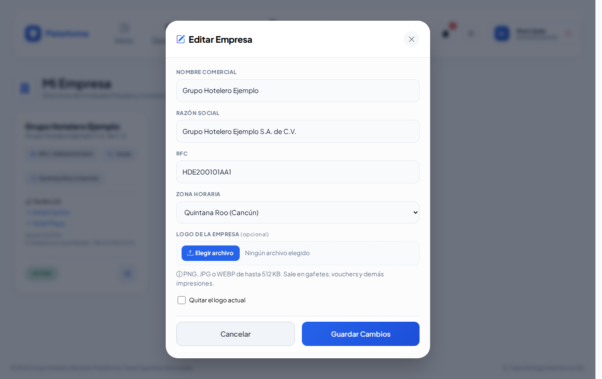
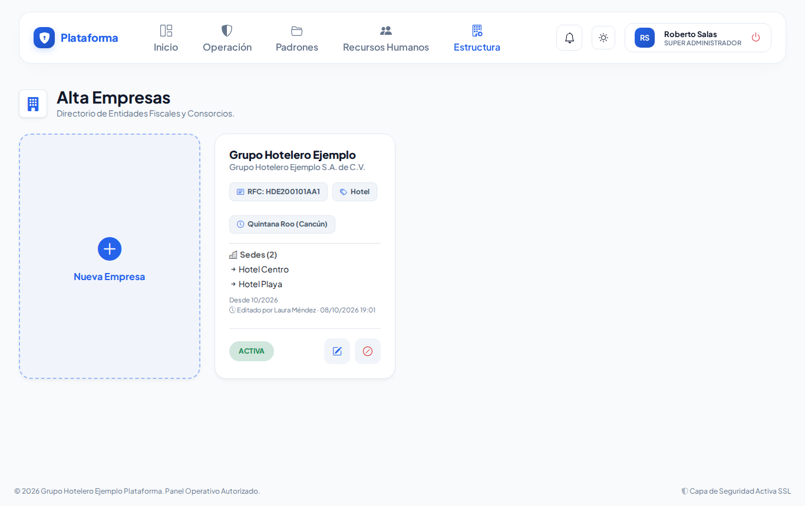
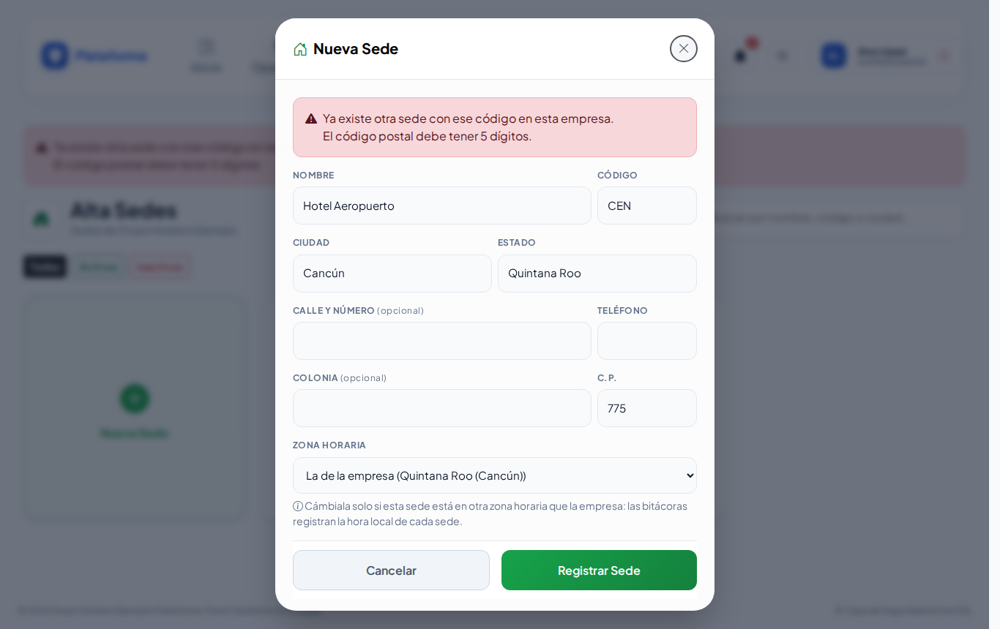

# Empresas y sedes

**¿Para qué sirve?** Aquí están los datos de tu **empresa** (nombre, razón social, RFC, rubro, zona horaria y logo) y sus **sedes**: los centros de trabajo donde opera (por ejemplo «Hotel Centro» y «Hotel Playa»). Casi todas las pantallas se organizan por sede, y la hora que ves en cada sede depende de su zona horaria.

## Antes de empezar

- Para ver estas pantallas tu rol debe poder consultar *Empresas* y *Sedes*. Si no aparecen en el menú, pide el permiso a tu administrador.
- Los datos de la empresa solo los cambia quien tiene el permiso **editar** de Empresas con alcance de empresa (normalmente el administrador).
- Dar de alta **empresas nuevas** solo lo hace el **Super Administrador** de la plataforma.

## Cómo corregir los datos de tu empresa

1. Entra a **Estructura → Empresas**. Se abre **Mi Empresa**.
2. Toca el **lápiz** (Editar). Se abre **Editar Empresa**.
3. Corrige **Nombre Comercial**, **Razón Social**, **RFC** o **Zona Horaria**.
4. **Logo de la Empresa (opcional):** toca **Elegir archivo** y elige un PNG, JPG o WEBP de hasta 512 KB. Sale en gafetes, vouchers y demás impresiones. Para quitarlo, marca **Quitar el logo actual**.
5. Toca **Guardar Cambios**.

**Qué debes ver:** «Empresa actualizada correctamente.»

## Cómo dar de alta una empresa nueva (Super Administrador)

1. Entra a **Estructura → Empresas**. Se abre **Alta Empresas**.
2. Toca la tarjeta **Nueva Empresa**.
3. Captura **Nombre Comercial**, **Razón Social**, **RFC**, **Rubro** (Hotel, Corporativo / industria, Condominio o Fraccionamiento) y **Zona Horaria**.
4. Toca **Registrar Empresa**.

**Qué debes ver:** «Empresa «…» creada con sus módulos y roles base. Ahora registra sus sedes.» El rubro decide cómo se llaman las cosas (por ejemplo «Habitación» en un hotel, «Oficina» en un corporativo o «Casa» en un fraccionamiento).

## Cómo registrar una sede

1. Entra a **Estructura → Sedes**. Se abre **Alta Sedes**.
2. Toca la tarjeta **Nueva Sede**.
3. Captura:
   - **Nombre** y **Código** corto (por ejemplo `CEN`), sin espacios ni acentos.
   - **Ciudad** y **Estado**.
   - Si quieres, **Calle y Número**, **Colonia**, **C.P.** y **Teléfono**.
4. Deja la **Zona Horaria** en **La de la empresa**, salvo que esa sede esté en otro horario.
5. Toca **Registrar Sede**.

**Qué debes ver:** ««Hotel Aeropuerto» registrada correctamente.» Usa **Buscar por nombre, código o ciudad...** y **Todos / Activos / Inactivos** para encontrar una sede.

## Cómo editar o desactivar una sede

1. **Editar** (lápiz): corrige los datos y toca **Guardar Cambios**. Verás ««…» actualizada correctamente.»
2. **Desactivar** (círculo rojo): confirma con **Aceptar**. La sede deja de aparecer para nuevas capturas, pero su historial se conserva: ««…» desactivada: ya no aparecerá para nuevas capturas. Su historial se conserva.»
3. **Reactivar** (flecha circular): la vuelve a activar.

## Si algo sale mal

Los mensajes salen en rojo dentro de la ventana; lo que escribiste se conserva.

| Mensaje o síntoma | Qué significa | Qué hacer |
|---|---|---|
| Ya existe otra sede con ese código en esta empresa. | El código ya se usa. | Usa otro código. |
| El código solo puede tener letras, números y guiones (sin espacios ni acentos). | El código tiene espacios o acentos. | Corrígelo (por ejemplo `PLA`). |
| El código postal debe tener 5 dígitos. | El C.P. está incompleto. | Corrígelo o déjalo vacío. |
| El teléfono solo puede tener números, espacios, +, guiones y paréntesis. | El teléfono tiene letras. | Corrígelo. |
| El RFC no tiene un formato válido (12 caracteres para persona moral, 13 para persona física). | El RFC está mal escrito. | Cópialo de la constancia fiscal. |
| Ya existe una empresa registrada con ese RFC. | Esa empresa ya existe. | Revisa la lista de empresas. |
| El logo no debe pesar más de 512 KB. / El logo debe ser PNG, JPG o WEBP (SVG no está permitido por seguridad). | La imagen no se acepta. | Reduce la imagen o cámbiala a PNG. |
| Los datos de la empresa solo los cambia quien tiene el permiso «editar» de Empresas con alcance de empresa. | Tu rol no puede editar la empresa. | Pídelo a tu administrador. |

## Preguntas frecuentes

**¿Cuándo cambio la zona horaria de una sede?** Solo si esa sede está en otro horario que la empresa (por ejemplo, otra región del país). Las bitácoras registran la hora local de cada sede.

**¿Puedo borrar una sede?** No; se desactiva para conservar su historial.

**¿Qué pasa si desactivo la empresa?** Sus usuarios ya no pueden entrar. Solo lo hace el Super Administrador.

## Relacionado

- [Zonas y áreas](zonas-y-areas.md)
- [Usuarios](usuarios.md)
- [Configuración](configuracion.md)
