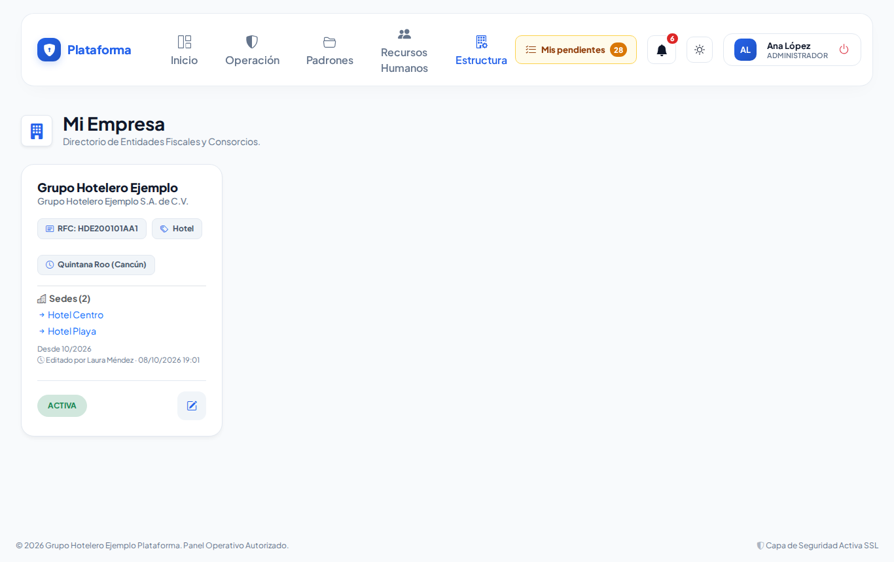
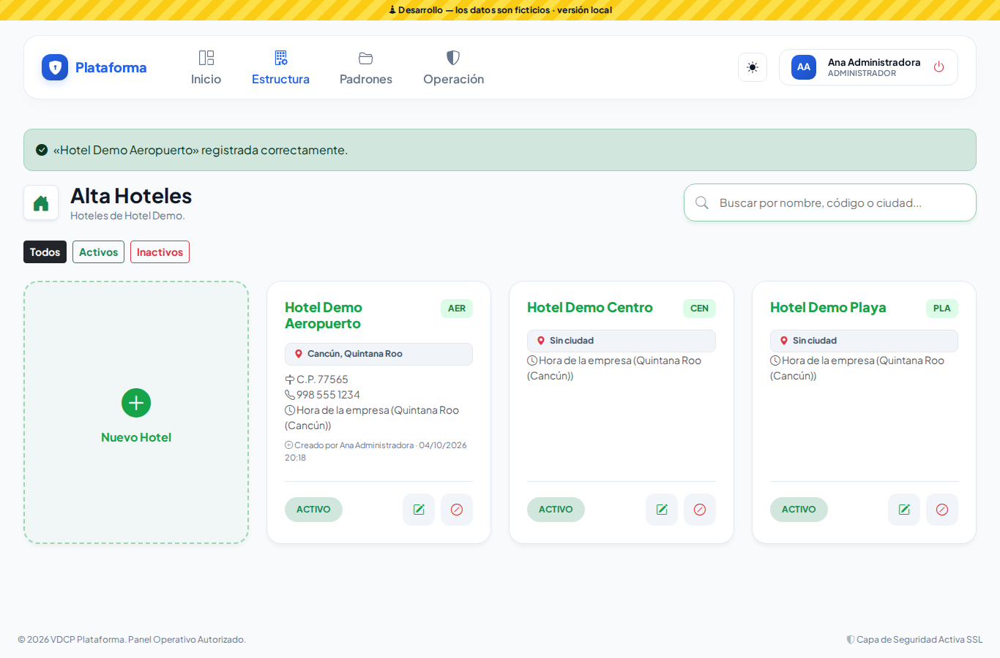
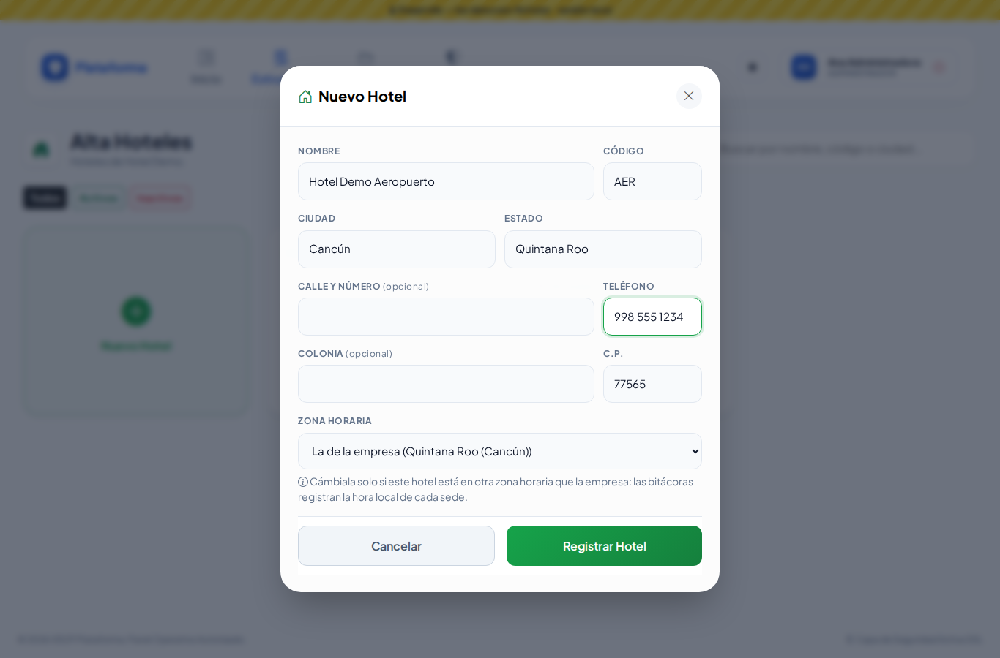

# Empresas y Sedes

## Empresas (Estructura → Entidades Legales → Empresas)

- **Super Administrador:** da de alta cada cliente con **Nueva Empresa**. Captura nombre comercial, razón social, RFC, **rubro** (hotel, corporativo, condominio o fraccionamiento) y **zona horaria**. Al guardar, la empresa queda lista con sus módulos y roles base; después registra sus sedes.
- **Administrador del cliente:** ve **Mi Empresa** y puede corregir sus datos fiscales y su zona horaria.

## Sedes (Estructura → Entidades Legales → Sedes)

1. Toca **Nueva Sede** (o Nueva Planta, Torre… según tu giro).
2. Captura:
   - **Nombre** y **código corto** (por ejemplo `CEN`), sin espacios.
   - **Ciudad** y **estado**.
   - Si quieres, dirección, colonia, C.P. y teléfono.
3. Deja la **zona horaria** como "La de la empresa", salvo que esa sede esté en otro horario.
4. Guarda.

Usa el buscador y los botones **Todos / Activos / Inactivos** para encontrar una sede. Para cerrarla, desactívala con **⊘**: deja de aparecer para nuevas capturas, pero su historial se conserva.
