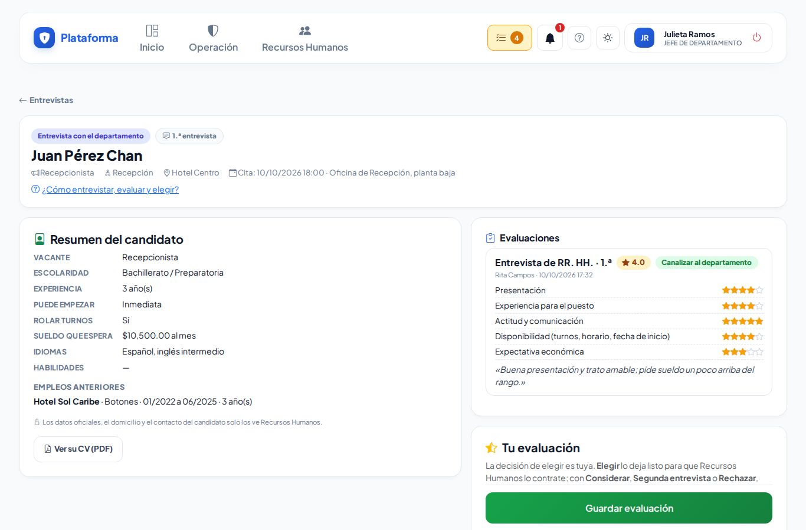
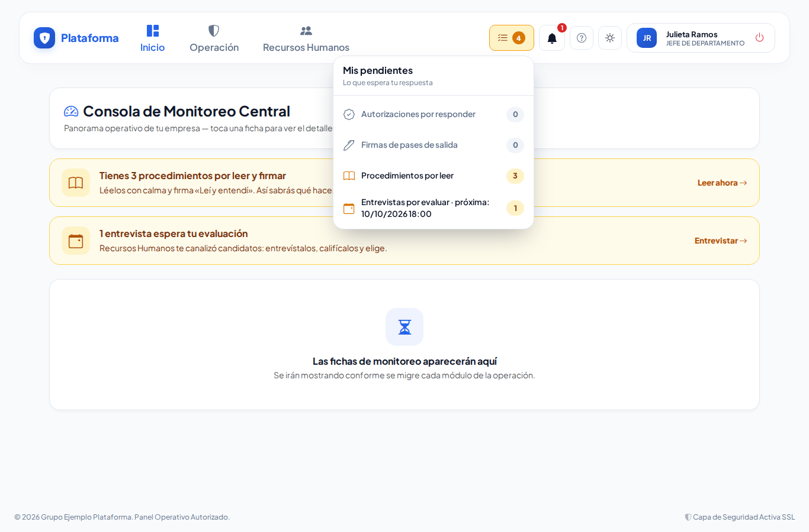
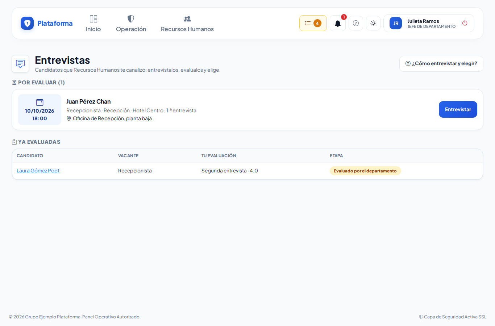
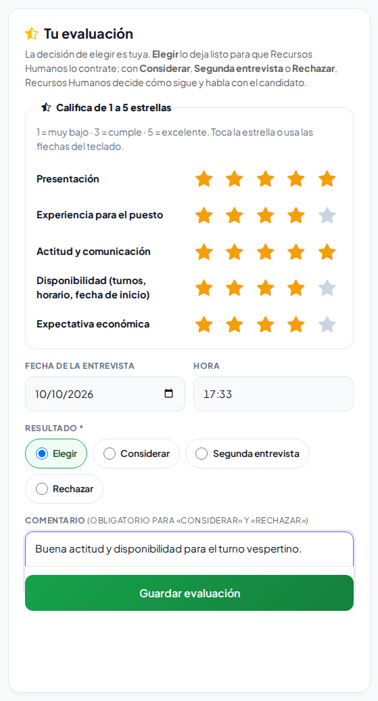
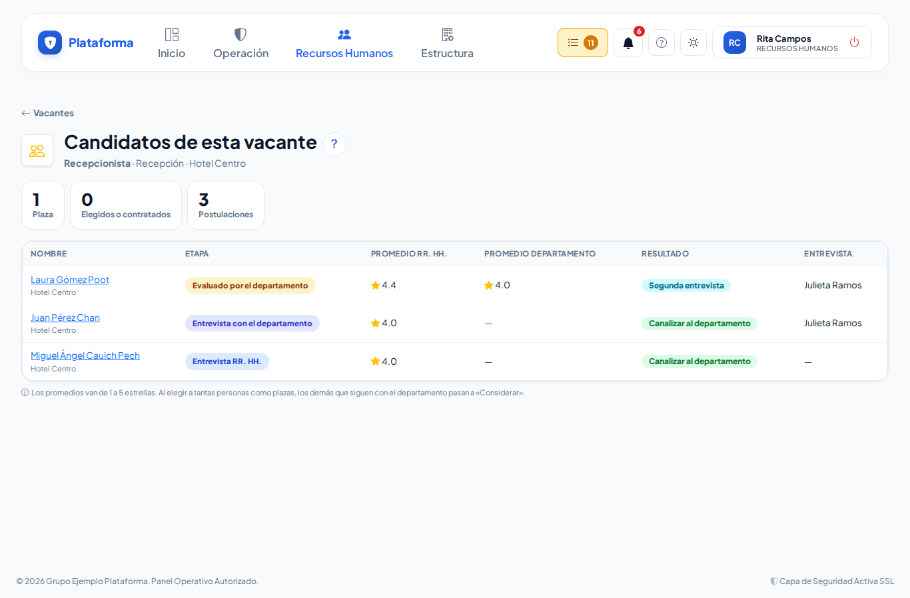

# Entrevistar y elegir

**¿Para qué sirve?** Cuando Recursos Humanos entrevista a un candidato y le sirve, te lo **canaliza** con una cita para que tú lo entrevistes. En la pantalla **Entrevistar** ves su resumen y la opinión de Recursos Humanos, lo calificas y decides: **Elegir**, **Considerar**, **Segunda entrevista** o **Rechazar**. La decisión de elegir es tuya; Recursos Humanos se encarga de los documentos, el contrato y de hablar con el candidato.

## Antes de empezar

- Tu rol necesita el permiso **Evaluar** de *Candidatos*. Lo traen los roles **Jefe de departamento**, **Director**, **Jefe de seguridad** y **Supervisor**. Si no te llegan las entrevistas, pide el permiso a tu administrador.
- Para que Recursos Humanos te proponga de una vez, debes estar como **responsable** de tu departamento (Recursos Humanos o el administrador lo definen en **Autorizaciones → Responsables por departamento**).
- Solo puedes evaluar las entrevistas que te asignaron (o las de la persona que te delegó sus avisos). No ves los datos oficiales del candidato (CURP, RFC, NSS), su domicilio ni su teléfono.

## Cómo te enteras de una entrevista

Cuando Recursos Humanos te canaliza a alguien, te llega el aviso «Entrevista: Juan Pérez · 15/10/2026 11:00» por cualquiera de estos caminos:

- la **campana** (arriba a la derecha);
- **Mis pendientes**, en el renglón **Entrevistas por evaluar** (dice cuál es la próxima cita);
- un **correo** con el botón **Abrir la entrevista** (pide iniciar sesión; vale 3 días);
- el aviso de **Inicio** «1 entrevista espera tu evaluación»;
- el botón **Entrevistas** de la pantalla **Autorizaciones**.

Cuando el candidato llega a la caseta para su entrevista, te llega otro aviso: «Juan Pérez ya está en recepción para su entrevista de las 11:00».

## Cómo ver tus entrevistas

1. Toca **Mis pendientes → Entrevistas por evaluar** (o el aviso de la campana).
2. En **Por evaluar** ves cada candidato con su **cita** (o «Ahora (está en sala)»), la vacante, el departamento y el lugar. Si es de alguien que te delegó sus avisos, dice «Por delegación de …».
3. Abajo, en **Ya evaluadas**, quedan las que ya calificaste.
4. Toca la tarjeta del candidato para abrir **Entrevistar**.

## Cómo entrevistar y evaluar

1. En **Entrevistar** revisa el **Resumen del candidato**: vacante, escolaridad, experiencia, cuándo puede empezar, si puede rolar turnos y el sueldo que espera. Si la vacante lo permite, toca **Ver su CV (PDF)**.
2. Revisa en **Evaluaciones** lo que calificó Recursos Humanos (estrellas, promedio y comentario).
3. Entrevista a la persona.
4. En **Tu evaluación**, califica cada criterio de **1 a 5 estrellas** (con el dedo, el ratón o el teclado: tabulador para llegar y flechas para cambiar).
5. Revisa la **Fecha y hora de la entrevista** (ya viene la de ahora).
6. Elige el **Resultado**:
   - **Elegir:** te quedas con esta persona.
   - **Considerar:** te gustó, pero no para ahora.
   - **Segunda entrevista:** quieres verla otra vez (o que la vea alguien más).
   - **Rechazar:** no te sirve.
7. Escribe un **Comentario**. Es obligatorio para **Considerar** y **Rechazar**; ayuda a Recursos Humanos a explicarle al candidato.
8. Toca **Guardar evaluación**. Si elegiste **Elegir**, confirma con **Aceptar**.

**Qué debes ver:** «Listo: elegiste a esta persona. Recursos Humanos ya lo sabe y se encarga de los documentos y el contrato.» o «Evaluación guardada (…). Recursos Humanos ya la tiene y se comunica con el candidato.» La entrevista pasa a **Ya evaluadas**.

## Qué pasa después de tu evaluación

| Elegiste | Qué pasa |
|---|---|
| **Elegir** | El candidato queda **Elegido**. Recursos Humanos le pide sus documentos y lo contrata. Si la vacante ya no tiene plazas, los demás candidatos de esa vacante que seguían contigo pasan a «Considerar» y ya no tienes que evaluarlos. |
| **Considerar** o **Segunda entrevista** | Recursos Humanos decide: puede mandártelo otra vez (te llega una **2.ª entrevista**) o a otra persona. |
| **Rechazar** | Recursos Humanos cierra el contacto con el candidato. A él no le llega ningún aviso de rechazo. |

## Cómo comparar a los candidatos de una vacante

1. Entra a **Recursos Humanos → Vacantes**.
2. En la tarjeta de la vacante toca **Candidatos de esta vacante**.
3. Ves a los candidatos que te canalizaron con su etapa, el promedio de Recursos Humanos, tu promedio y el resultado.

## Cuando no estás («No molestar»)

Si sales de vacaciones, delega tus avisos en **Autorizaciones → No molestar / delegar** (ver [Recepción y autorizaciones](recepcion-y-autorizaciones.md)). Mientras dure la delegación, las entrevistas nuevas le llegan a quien te cubre, y esa persona puede evaluar las tuyas.

## Si algo sale mal

| Mensaje o síntoma | Qué significa | Qué hacer |
|---|---|---|
| Califica «…» de 1 a 5 estrellas. | Faltó calificar un criterio. | Toca las estrellas de ese criterio. |
| Escribe un comentario: es obligatorio para «Considerar» y «Rechazar». | Elegiste Considerar o Rechazar sin comentario. | Escribe el comentario. |
| Elige el resultado de la entrevista. | No elegiste el resultado. | Elige Elegir, Considerar, Segunda entrevista o Rechazar. |
| Esta entrevista ya se evaluó o Recursos Humanos la cambió. | Alguien más ya la evaluó, o Recursos Humanos la canceló o la reprogramó con otra persona. | Revisa **Mis pendientes**. |
| «Página no encontrada» al abrir una entrevista. | La entrevista no es tuya (o ya se asignó a otra persona). | Abre tus entrevistas desde **Mis pendientes**. |
| El enlace del correo ya venció o fue alterado. | El botón del correo pasó de 3 días. | Abre la entrevista desde **Mis pendientes**. |
| No aparece **Ver su CV (PDF)**. | La vacante no tiene marcado **El jefe puede ver el CV**, o el candidato no subió su CV en PDF. | Pide a Recursos Humanos que lo marque en la vacante. |
| No me llegan las entrevistas. | Te falta el permiso **Evaluar** o no eres responsable del departamento. | Pide a tu administrador el permiso y que te agregue en **Responsables por departamento**. |

## Preguntas frecuentes

**¿Recursos Humanos puede elegir por mí?** No. Solo la persona asignada (o quien la cubre por delegación) puede elegir.

**¿Por qué no veo el teléfono ni el domicilio del candidato?** Son datos personales que solo ve Recursos Humanos. Tú ves lo necesario para decidir.

**¿Puedo cambiar mi evaluación?** No. Si te equivocaste, avisa a Recursos Humanos: puede mandarte una segunda entrevista.

**¿Qué pasa si el candidato no llega?** Recursos Humanos lo marca **No se presentó** y te llega el aviso; si vuelve a agendar, te llega la nueva cita.

**¿Quién califica con qué criterios?** Recursos Humanos los define para toda la empresa (por ejemplo Presentación, Experiencia para el puesto, Actitud y comunicación). Son los mismos para ti y para Recursos Humanos.

## Relacionado

- [Pedir y aprobar solicitudes](solicitudes.md)
- [Recepción y autorizaciones](recepcion-y-autorizaciones.md)
- [Vacantes](vacantes.md)
