# Equipos de Protección Civil

**Padrones → Inventarios de Seguridad → Equipos de Protección Civil.** Aquí está la lista de extintores, hidrantes, detectores, botiquines, lámparas de emergencia y demás equipo fijo de Protección Civil de cada sede. Son los equipos que la guardia revisa en los [Recorridos de Protección Civil](recorridos-pc.md).

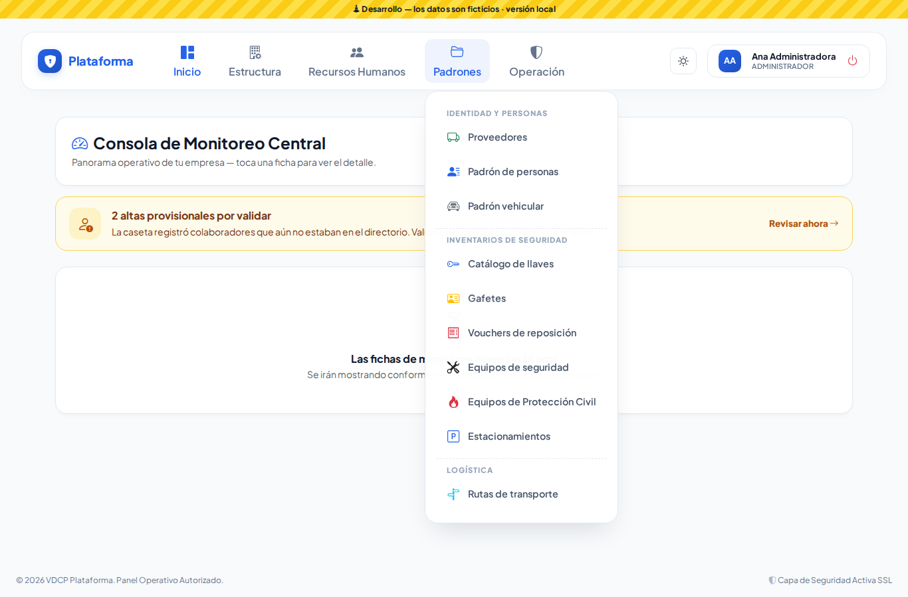

> Antes este catálogo se abría con el botón **Catálogo de Equipos** dentro de Recorridos. Ahora está en Padrones, junto a Equipos de seguridad. Si tenías guardada la dirección anterior, te lleva sola a la nueva. Las etiquetas QR que ya imprimiste siguen funcionando.

## 1. La lista

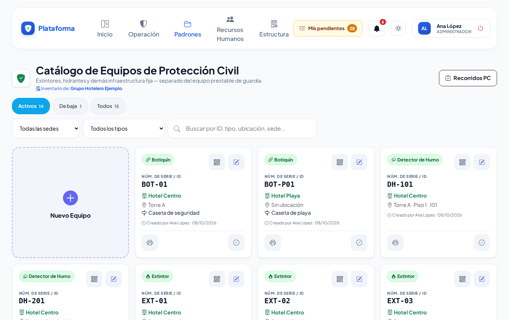

- Cada tarjeta es un equipo: su **tipo** (Extintor, Hidrante…), su **Núm. de Serie / ID** (lo que va en la etiqueta, por ejemplo `EXT-01`), la sede, la ubicación y una referencia para encontrarlo.
- Arriba filtras por **Activos**, **De baja** o **Todos**, por sede, por tipo, o buscas por ID, tipo, ubicación o sede.
- Si puedes ver los recorridos, el botón **Recorridos PC** te lleva a ellos.

## 2. Registrar un equipo

Lo hacen el Supervisor, el Jefe de seguridad, el Asistente o el Administrador (el Agente solo consulta).

1. Toca **Nuevo Equipo**.
2. Elige la **Sede** (si solo tienes una, ya viene elegida) y el **Tipo de Equipo**.
3. Escribe el **Núm. de Serie / ID** que irá en la etiqueta (ej. `EXT-01`). No se puede repetir en la misma sede; en otra sede sí.
4. Si quieres, elige **Zona / Piso** y **Área Específica**, y escribe una **Referencia** («Junto al elevador de servicio»).
5. Si la etiqueta trae chip NFC, acércala en **Etiqueta NFC / RFID** (opcional).
6. Toca **Guardar**, o **Guardar y capturar siguiente** para registrar otro con la misma sede, tipo y ubicación.

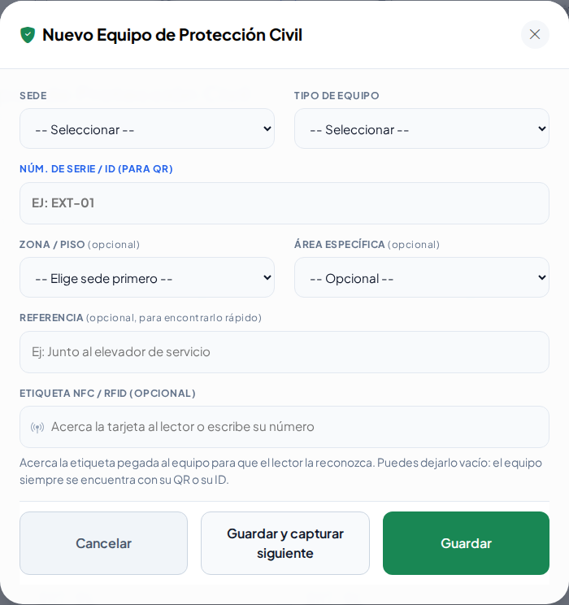

Si algo está mal (por ejemplo, el ID ya existe en esa sede), el mensaje aparece dentro de la misma ventana:

En el celular:

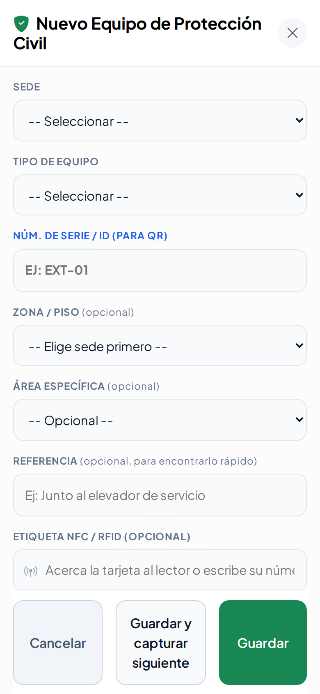

## 3. Editar, ver QR, imprimir la etiqueta y dar de baja

En cada tarjeta:

- **Lápiz:** editar.
- **QR:** ver su código y la dirección para grabar una etiqueta NFC.
- **Impresora:** imprimir la etiqueta para pegarla en el equipo.
- **Círculo tachado:** darlo de baja (ya no aparece en los recorridos). Con la **flecha** se reactiva.

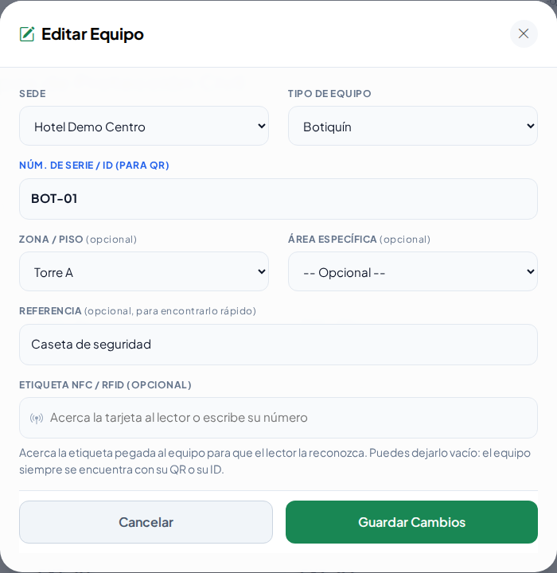
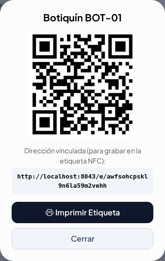
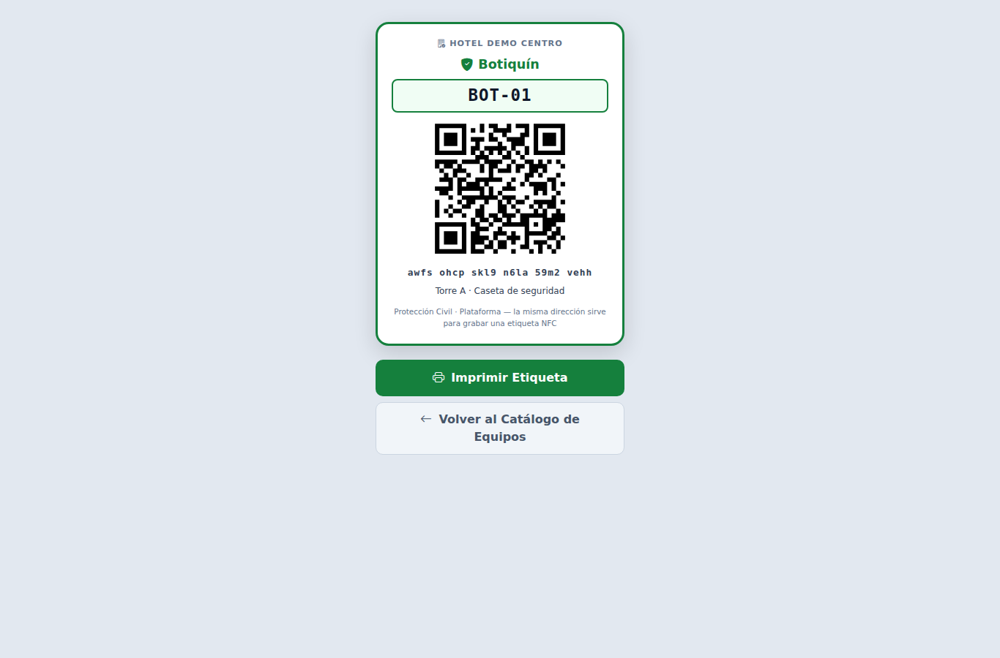

## 4. Lo que ve el Agente

El Agente consulta los equipos de su sede y sus QR, pero no ve **Nuevo Equipo**, el lápiz ni la baja:

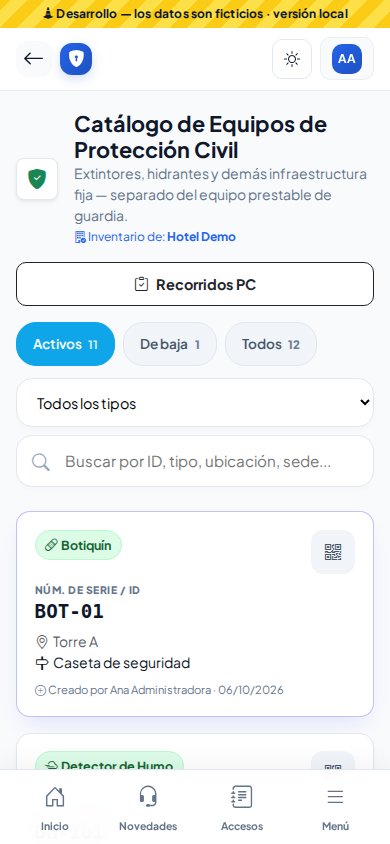

En Recorridos, el Agente ve un enlace pequeño al catálogo debajo del título:

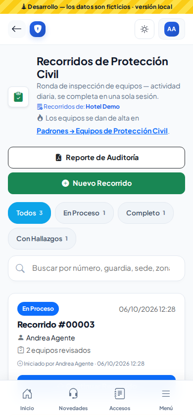

## 5. Modo Noche y modo Sol

| Noche | Sol |
|---|---|
| 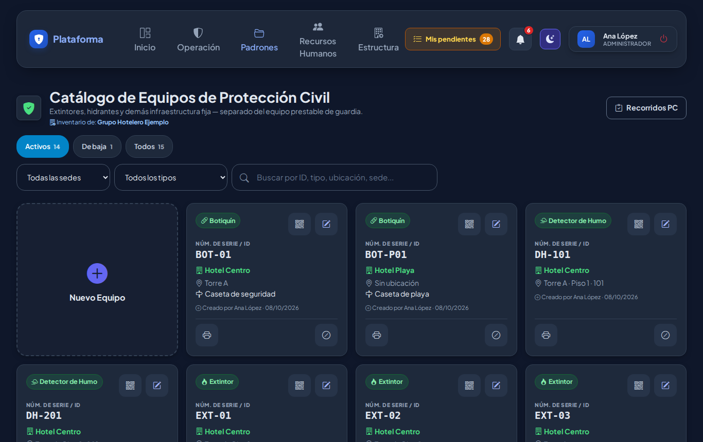 | 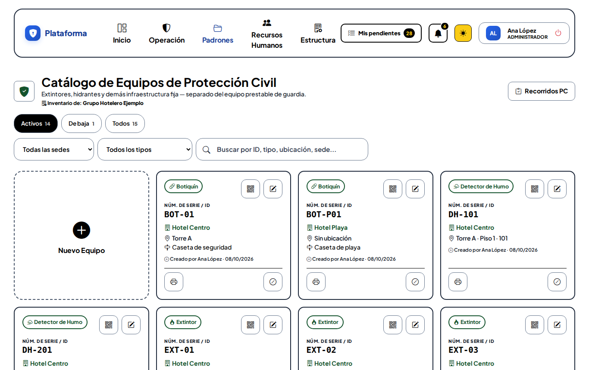 |

## ¿Quién puede qué?

Se decide en **Estructura → Matriz de permisos**, módulo **Equipos de Protección Civil**:

| Permiso | Para qué |
|---|---|
| Ver | Abrir la lista y ver los QR |
| Crear | Registrar equipos |
| Editar | Cambiar sus datos |
| Eliminar | Dar de baja y reactivar |
| Imprimir | Imprimir la etiqueta |

Al instalar esta versión, cada rol recibió lo mismo que ya podía hacer: quien veía Recorridos ahora ve el catálogo, y quien podía crear, editar, dar de baja o imprimir en **Equipos de seguridad** puede hacer lo mismo aquí.

## Ronda 6

Al escribir el **Núm. de Serie / ID** te avisa si ya existe en esa sede o si se parece a otro. Al acercar o escribir la **etiqueta NFC** te avisa si ya la tiene otro registro.
