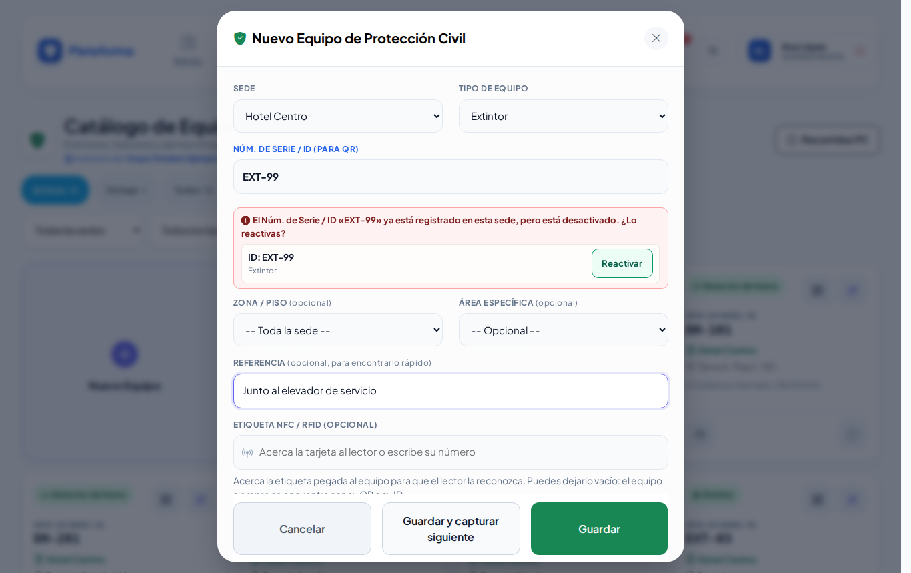

# Equipos de Protección Civil

**¿Para qué sirve?** Es la lista de extintores, hidrantes, detectores, botiquines, lámparas de emergencia y demás equipo **fijo** de Protección Civil de cada sede. Son los equipos que la guardia revisa en los [Recorridos de Protección Civil](recorridos-pc.md). Cada uno tiene su etiqueta con código QR.

## Antes de empezar

- Para ver la pantalla tu rol debe poder consultar *Equipos de Protección Civil*. Si no aparece en el menú, pide el permiso a tu administrador.
- Para registrar, editar, imprimir o dar de baja necesitas esos permisos. Si no ves **Nuevo Equipo**, tu rol solo consulta.
- Para elegir la ubicación (zona, piso, área), esos lugares deben existir en [Zonas y áreas](zonas-y-areas.md).

## Cómo encontrar un equipo

1. Entra a **Padrones → Equipos de Protección Civil**.
2. Toca **Activos**, **De baja** o **Todos**.
3. Si hay varias, elige en **Todas las sedes** o **Todos los tipos**.
4. Escribe en **Buscar por ID, tipo, ubicación, sede...**.

**Qué debes ver:** tarjetas con el tipo (Extintor, Hidrante…), el **Núm. de Serie / ID** (lo que va en la etiqueta, por ejemplo `EXT-01`), la sede, la ubicación y la referencia. El botón **Recorridos PC** te lleva a los recorridos.

## Cómo registrar un equipo

1. Toca la tarjeta **Nuevo Equipo**. Se abre **Nuevo Equipo de Protección Civil**.
2. Elige la **Sede** (si solo tienes una, ya viene elegida) y el **Tipo de Equipo**.
3. Escribe el **Núm. de Serie / ID (para QR)** que irá en la etiqueta (por ejemplo `EXT-01`). No se puede repetir en la misma sede; en otra sede sí.
4. Si quieres, elige **Zona / Piso** y **Área Específica**, y escribe una **Referencia** (por ejemplo «Junto al elevador de servicio»).
5. Si la etiqueta trae chip, acércala en **Etiqueta NFC / RFID (opcional)**.
6. Toca **Guardar**, o **Guardar y capturar siguiente** para registrar otro con la misma sede, tipo y ubicación (ideal cuando capturas un piso completo).

**Qué debes ver:** «Equipo EXT-50 (Extintor) registrado. Ya puedes imprimir su etiqueta QR.» Con **Guardar y capturar siguiente** la ventana se queda abierta, lista para el siguiente.

### Avisos mientras escribes el ID

- **Verde:** «ID disponible en esta sede.»
- **Rojo:** el ID ya existe en esa sede. Si está desactivado y puedes reactivarlo, aparece **Reactivar**.
- **Amarillo:** «Se parece a un ID ya registrado en esta sede (los guiones y espacios no cuentan):».

En el celular la ventana ocupa toda la pantalla:

## Cómo editar un equipo

1. Toca el **lápiz** (Editar) de la tarjeta.
2. Corrige los datos.
3. Toca **Guardar Cambios**.

**Qué debes ver:** «Equipo … actualizado correctamente.»

## Cómo ver el QR e imprimir la etiqueta

1. Toca el botón del **código QR** de la tarjeta. Se abre **Código e identificación** con el QR y la dirección (botón **Copiar**). Si puedes editar, también puedes **Asignar etiqueta NFC / RFID**.
2. Para imprimir toca **Imprimir etiqueta** (o el botón de la **impresora** de la tarjeta). En la pestaña nueva toca **Imprimir Etiqueta**.

## Cómo dar de baja o reactivar un equipo

1. Toca el **círculo con raya** (Dar de baja) y confirma con **Aceptar**.
2. Para regresarlo, filtra **De baja** y toca la **flecha circular** (Reactivar).

**Qué debes ver:** «Equipo … dado de baja: ya no aparece en los recorridos. Puedes reactivarlo con un clic.» Al reactivar: «Equipo … reactivado: vuelve a aparecer en los recorridos.»

## Lo que ve el agente de caseta

El agente consulta los equipos de su sede y sus QR, pero no ve **Nuevo Equipo**, el lápiz ni la baja. En Recorridos tiene un enlace al catálogo debajo del título.

## En los modos Noche y Sol

| Noche | Sol |
|---|---|
|  |  |

## Si algo sale mal

Los mensajes salen en rojo dentro de la ventana; lo que escribiste se conserva.

| Mensaje o síntoma | Qué significa | Qué hacer |
|---|---|---|
| Elige la sede donde está el equipo. | No elegiste sede. | Elige la sede. |
| Elige el tipo de equipo. | No elegiste tipo. | Elige el tipo. |
| El Núm. de Serie / ID es obligatorio (es lo que va en la etiqueta, por ejemplo EXT-01). | Falta el ID. | Escribe el ID. |
| El Núm. de Serie / ID «…» ya está registrado en esta sede (…). | Ese ID ya existe en la sede. | Usa otro o reactiva el existente. |
| La ubicación elegida (zona, piso o área) no pertenece a la sede o está desactivada. | Cambiaste de sede o el lugar se desactivó. | Vuelve a elegir la ubicación. |
| Ya hay otro equipo con el ID «…» en esta sede. | Al reactivar, otro equipo activo ya usa ese ID. | Cambia el ID de uno de los dos. |
| Elige una sede activa de la lista: esa sede no existe, está desactivada o no está a tu cargo. | La sede no es tuya. | Elige una de tus sedes. |

## Preguntas frecuentes

**¿Cuál es la diferencia con Equipos de seguridad?** Aquí está el equipo **fijo** que se revisa en los recorridos (extintores, hidrantes…). En [Equipos de seguridad](equipos.md) está el equipo que la guardia **presta** (radios, lámparas…).

**¿Un equipo de baja aparece en los recorridos?** No. Reactívalo para que vuelva a aparecer.

**¿Puedo usar el mismo ID en dos sedes?** Sí. Solo no se repite dentro de la misma sede.

**¿Las etiquetas que ya imprimí siguen sirviendo?** Sí. El QR no cambia aunque edites el equipo.

## Relacionado

- [Recorridos de Protección Civil](recorridos-pc.md)
- [Equipos de seguridad](equipos.md)
- [Zonas y áreas](zonas-y-areas.md)
- [Etiquetas QR](etiquetas-qr.md)
