# Equipos de seguridad

Padrones → Inventarios de Seguridad → **Equipos de seguridad**. Aquí está el equipo que la guardia usa y se presta: radios, lámparas, detectores de metales, chalecos, botiquines… Cada equipo pertenece a una **sede** y tiene su **etiqueta con código QR**.

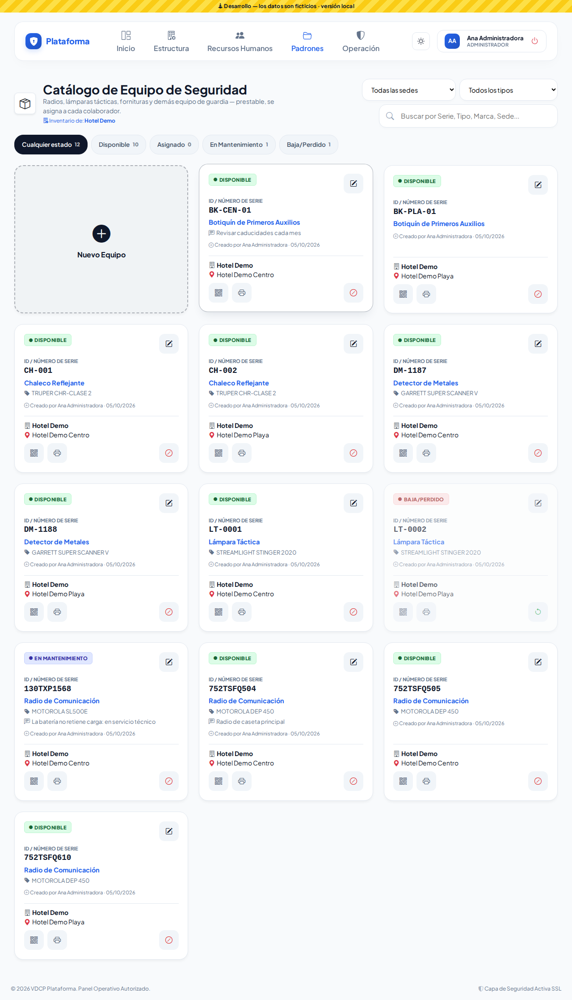

## Qué significa cada estado

| Estado | Qué quiere decir |
|---|---|
| **DISPONIBLE** (verde) | Está en la caseta, listo para prestarse. |
| **ASIGNADO** (amarillo) | Lo tiene un colaborador. Lo pone el módulo de [Responsivas](responsivas.md); la ficha dice **A cargo de** quién está. |
| **EN MANTENIMIENTO** (morado) | En reparación o revisión: no se presta. |
| **BAJA/PERDIDO** (rojo) | Se perdió, se dañó o lo robaron. Se dio de baja con un voucher. |

## Buscar y filtrar

- Escribe en **Buscar** el número de serie, el tipo, la marca, el modelo o la sede.
- Elige una **sede** o un **tipo** en las listas (solo aparecen si hay más de uno).
- Toca una píldora de estado (**Disponible**, **En Mantenimiento**…). El número junto a cada una dice cuántos hay.
- Los filtros se recuerdan mientras la pestaña siga abierta.

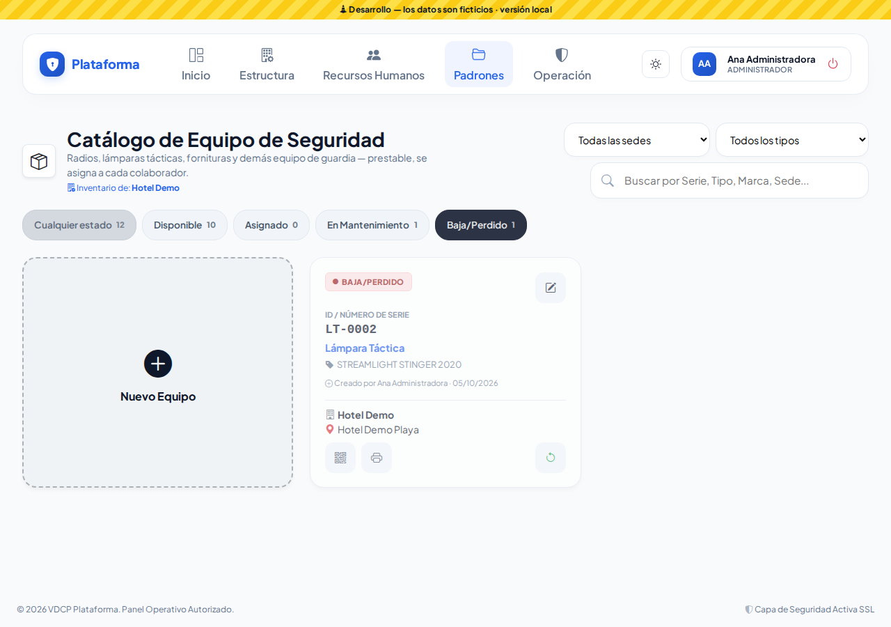

## Registrar un equipo

1. Toca **Nuevo Equipo**.
2. Elige la **Sede de instalación** (si solo tienes una, ya viene elegida).
3. Elige el **Tipo de equipo**. Si no está, elige **+ Nuevo tipo...** y escribe su nombre: quedará en la lista para la próxima vez.
4. Escribe **Marca** y **Modelo** (opcionales). Mientras escribes, el sistema te sugiere los que ya existen.
5. Escribe el **Núm. de Serie / ID** (obligatorio). Si ya existe en tu empresa, lo verás de inmediato debajo del campo.
6. **Costo**: lo que vale el equipo. Sirve para el voucher si algún día se pierde. Si ya registraste otro de la misma marca y modelo, el costo aparece solo.
7. **Observaciones**: la condición del equipo (opcional).
8. **Etiqueta NFC / RFID** (opcional): acerca al lector la etiqueta pegada al equipo. Si esa etiqueta ya la tiene otro registro, el sistema te dice cuál.
9. Toca **Registrar Equipo**. Nace como **DISPONIBLE**.

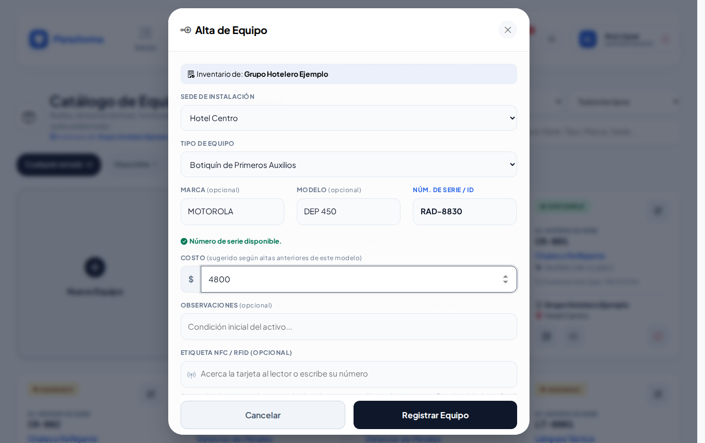
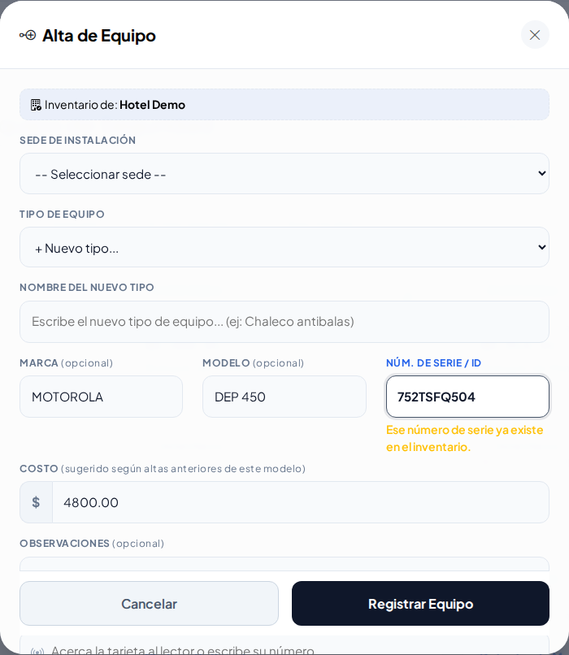

## Editar

Toca el lápiz de la ficha. Puedes cambiar todo y el **Estado actual** entre DISPONIBLE y EN MANTENIMIENTO. Si el equipo está ASIGNADO o de BAJA, el estado se muestra pero no se cambia aquí.

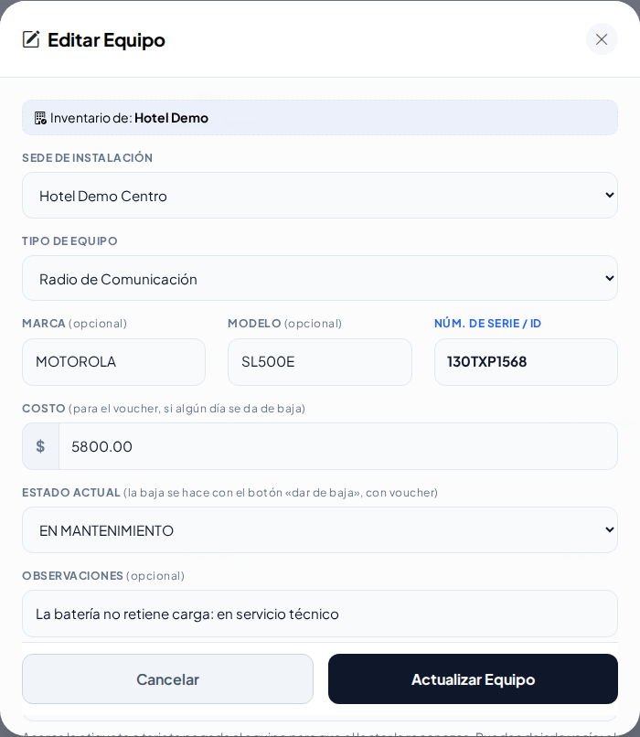

## Ver e imprimir el QR

- Botón **QR**: muestra el código en pantalla y la dirección que puedes grabar en una etiqueta NFC.
- Botón **impresora**: abre la etiqueta lista para imprimir y pegar en el equipo.
- Al escanear el QR con el celular se abre la ficha del equipo (solo con una cuenta de tu empresa).

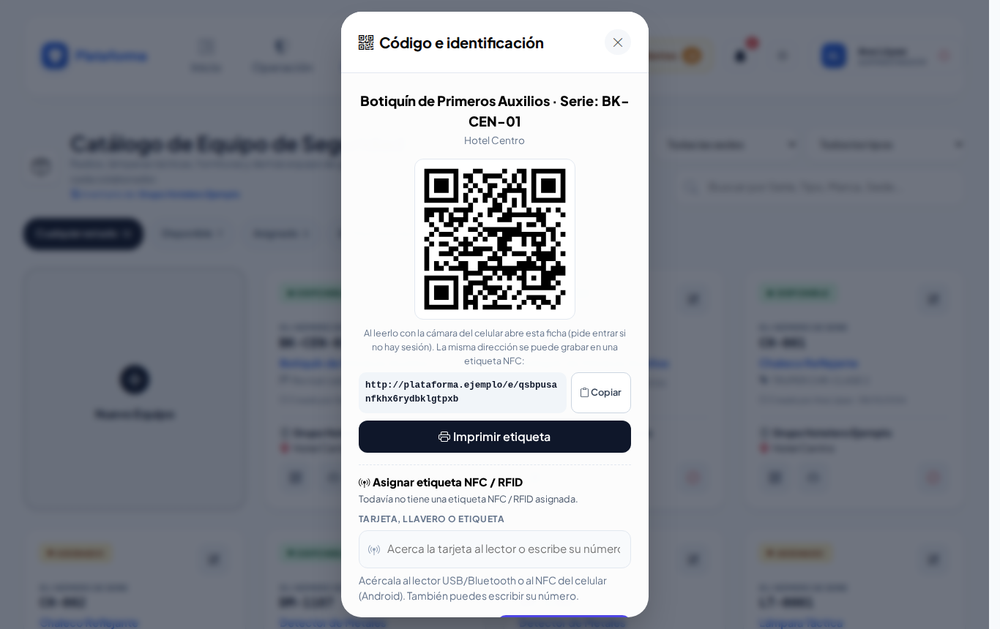
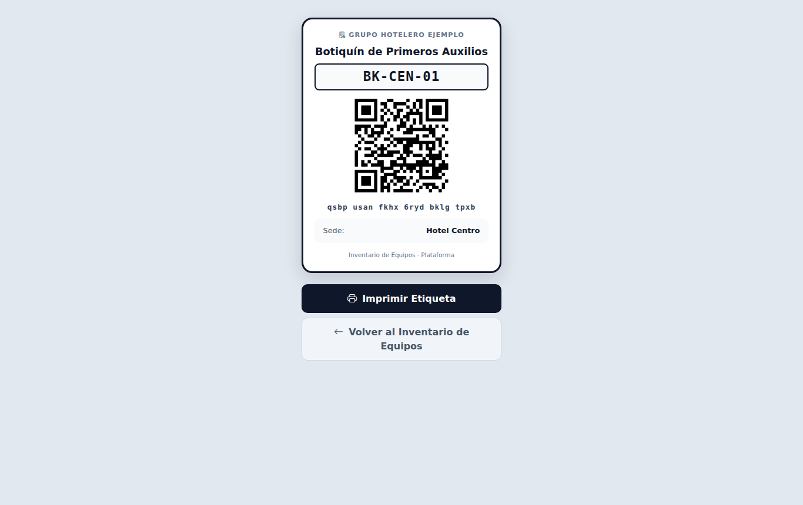

## Dar de baja (con voucher)

Cuando un equipo se pierde, se daña o lo roban:

1. Toca el botón rojo **Dar de baja** de la ficha.
2. Elige el **Motivo**: Extraviado, Dañado o Robado.
3. Escribe **¿Cómo pasó?**: ayuda a decidir si se cobra.
4. Si se le cobra a alguien, marca **Aplica CXC**. Aparecen:
   - **Monto**: ya viene con el costo del equipo (o lo último que se cobró por ese modelo); puedes ajustarlo.
   - **Colaborador responsable**: escanea su gafete, acerca su tarjeta o escribe su número de empleado o su nombre (aparece solo, sin Enter).
5. Toca **Generar Voucher y Dar de Baja**. El equipo queda como **BAJA/PERDIDO** y se crea el voucher con su folio.

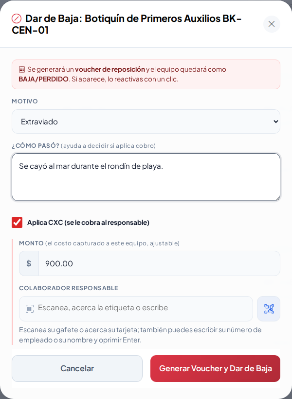

**¿Apareció?** Toca el botón verde **Reactivar** en su ficha: vuelve a DISPONIBLE. El voucher no se borra; queda como historial.

## En el celular y de noche

La pantalla funciona en el celular (los botones son grandes) y con los modos **Sol** (alto contraste) y **Noche**.

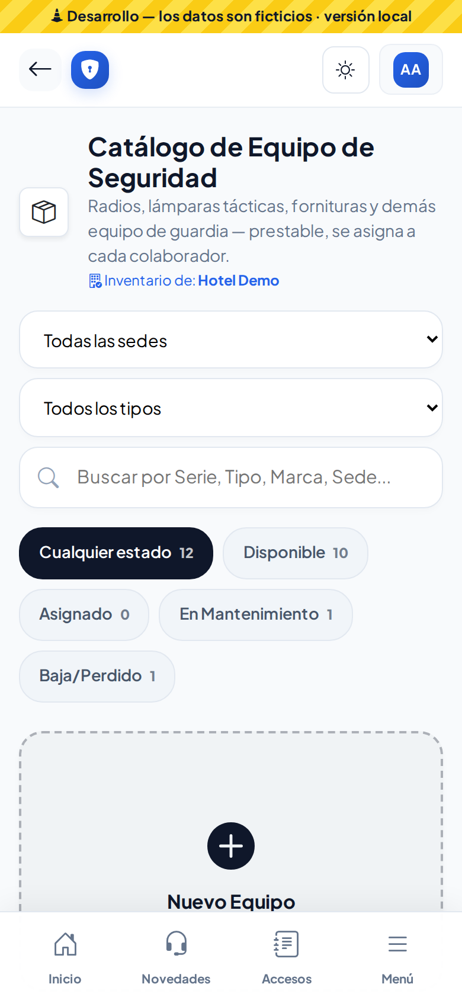
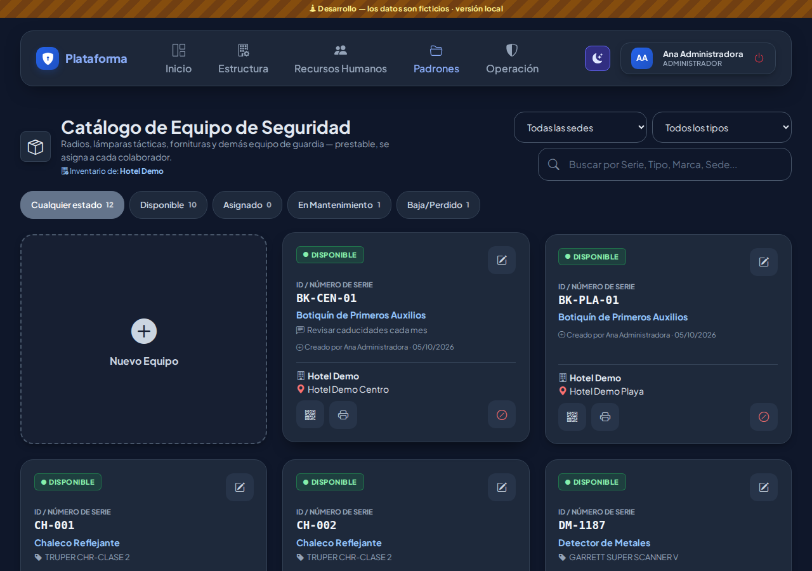

## Quién puede hacer qué

| Perfil | Puede |
|---|---|
| Administrador | Todo, en todas las sedes |
| Jefe de seguridad | Todo, solo en su sede |
| Asistente | Registrar, editar e imprimir en su sede (no dar de baja) |
| Agente | Consultar y ver el QR |

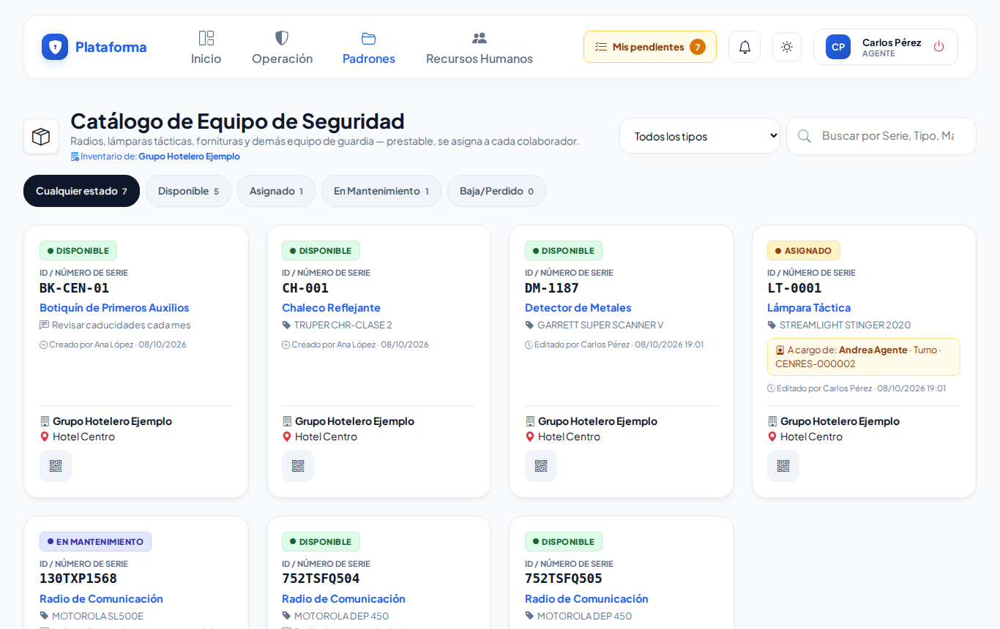

## Ronda 6: avisos y estado más claros

- Al escribir el **Núm. de Serie / ID** te avisa si ya existe o si se parece a otro (los guiones y espacios no cuentan). Al acercar o escribir una **etiqueta NFC** te avisa si ya la tiene otro registro.
- El número de serie siempre aparece con su rótulo: **Serie: 130TXP1568**.
- Al **editar**, debajo de **Estado actual** se explica por qué solo puedes elegir ciertas opciones. Por ejemplo, el radio MOTOROLA SL500E (Serie: 130TXP1568) está **En mantenimiento**: solo puedes cambiarlo a **Disponible** cuando regrese del servicio. Si el equipo está de **baja**, dice el folio de su voucher y cómo reactivarlo.

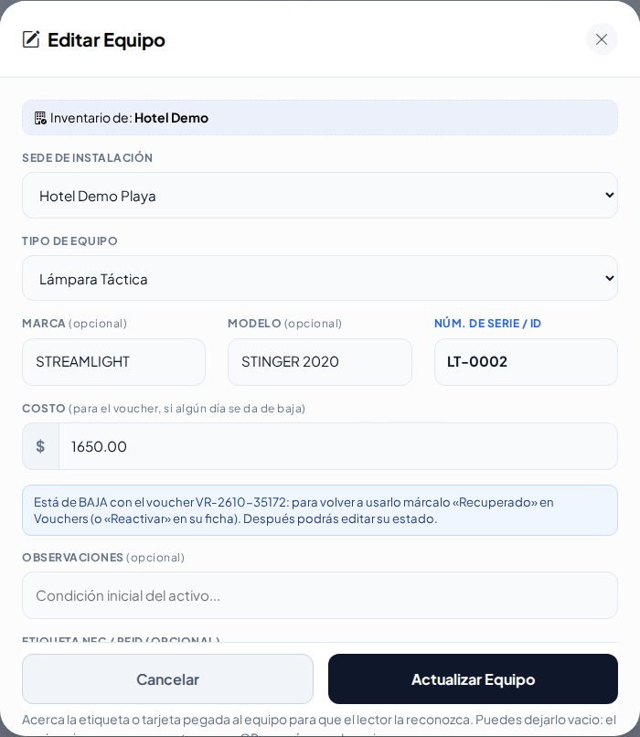
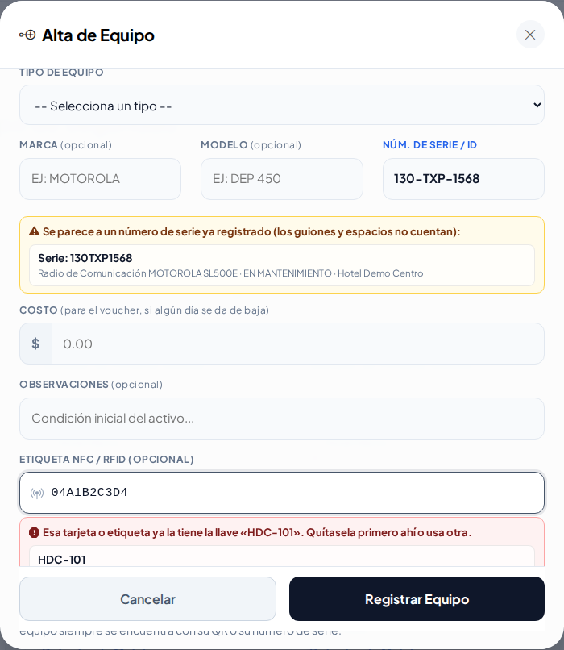
