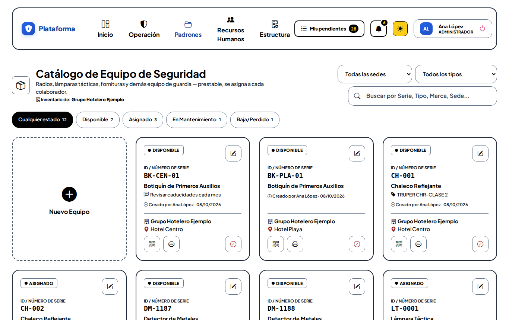
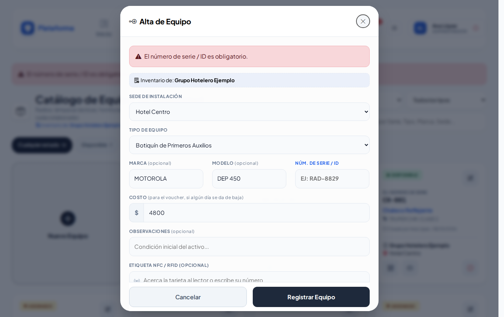

# Equipos de seguridad

**¿Para qué sirve?** Aquí está el equipo que usa y presta la guardia: radios, lámparas, detectores de metales, chalecos, botiquines… Cada equipo pertenece a una **sede**, tiene un **estado** y su **etiqueta con código QR**.

## Antes de empezar

- Para ver la pantalla tu rol debe poder consultar *Equipos de seguridad*. Si no aparece en el menú, pide el permiso a tu administrador.
- Para registrar, editar, imprimir o dar de baja necesitas esos permisos. Si no ves **Nuevo Equipo**, tu rol solo consulta.
- Solo ves los equipos de **tus sedes**.

## Qué significa cada estado

| Estado | Qué quiere decir |
|---|---|
| **DISPONIBLE** (verde) | Está en la caseta, listo para prestarse. |
| **ASIGNADO** (amarillo) | Lo tiene un colaborador. Lo pone [Responsivas](responsivas.md); la ficha dice **A cargo de** quién. |
| **EN MANTENIMIENTO** (morado) | En reparación o revisión: no se presta. |
| **BAJA/PERDIDO** (rojo) | Se perdió, se dañó o lo robaron; se dio de baja con un voucher. |

## Cómo encontrar un equipo

1. Entra a **Padrones → Equipos de seguridad**.
2. Escribe en **Buscar por Serie, Tipo, Marca, Sede...**.
3. Si hay varias, elige en **Todas las sedes** o **Todos los tipos**.
4. Toca un estado (**DISPONIBLE**, **EN MANTENIMIENTO**…). **Cualquier estado** los vuelve a mostrar. El número dice cuántos hay.

**Qué debes ver:** solo los equipos que coinciden. El número de serie siempre aparece con su rótulo (por ejemplo **Serie: RAD-8829**). Los filtros se recuerdan mientras la pestaña siga abierta.

## Cómo registrar un equipo

1. Toca la tarjeta **Nuevo Equipo**. Se abre **Alta de Equipo**.
2. Elige la **Sede de instalación** (si solo tienes una, ya viene elegida).
3. Elige el **Tipo de equipo**. Si no está, elige **+ Nuevo tipo...** y escribe el **Nombre del nuevo tipo** (por ejemplo «Chaleco antibalas»).
4. Escribe **Marca** y **Modelo** (opcionales). Mientras escribes te sugiere los que ya existen.
5. Escribe el **Núm. de Serie / ID** (obligatorio). Debajo verás si está disponible.
6. **Costo:** lo que vale el equipo; sirve para el voucher si algún día se pierde. Si ya registraste otro de la misma marca y modelo, aparece sugerido.
7. **Observaciones** (opcional): la condición del equipo.
8. **Etiqueta NFC / RFID (opcional):** acerca al lector la etiqueta pegada al equipo, o escribe su número.
9. Toca **Registrar Equipo**.

**Qué debes ver:** «Equipo RAD-8830 registrado correctamente. Ya puedes imprimir su etiqueta QR.» El equipo nace **DISPONIBLE**.

### Avisos mientras escribes

- **Núm. de Serie / ID:** verde «Número de serie disponible.»; rojo si ya está registrado (con **Reactivar** si está de baja); amarillo «Se parece a un número de serie ya registrado (los guiones y espacios no cuentan):».
- **Etiqueta NFC / RFID:** si ya la tiene otro registro, te dice cuál y no se puede usar.

## Cómo editar un equipo o ponerlo en mantenimiento

1. Toca el **lápiz** (Editar) de la ficha. Se abre **Editar Equipo**.
2. Corrige lo que necesites.
3. En **Estado actual** puedes cambiar entre **DISPONIBLE** y **EN MANTENIMIENTO**. Debajo se explica qué puedes hacer según el estado: si está ASIGNADO o de BAJA, el estado se muestra pero no se cambia aquí.
4. Toca **Actualizar Equipo**.

**Qué debes ver:** «Equipo … actualizado correctamente.»

## Cómo ver el QR, imprimir la etiqueta y asignar NFC

1. Toca el botón del **código QR** de la ficha. Se abre **Código e identificación** con el QR y la dirección (botón **Copiar**).
2. **Imprimir etiqueta** abre la etiqueta en otra pestaña; ahí toca **Imprimir Etiqueta**. **Volver al Inventario de Equipos** te regresa. También puedes usar el botón de la **impresora** de la ficha.
3. En **Asignar etiqueta NFC / RFID** acerca la etiqueta al lector y toca **Guardar etiqueta**.

**Qué debes ver:** al leer el QR con el celular se abre la ficha del equipo (solo con una cuenta de tu empresa).

## Cómo dar de baja un equipo (con voucher)

Cuando un equipo se pierde, se daña o lo roban:

1. Toca el botón rojo **Dar de baja** de la ficha. Se abre **Dar de Baja: …**.
2. Elige el **Motivo**: Extraviado, Dañado o Robado.
3. Escribe **¿Cómo pasó?** (ayuda a decidir si se cobra).
4. Si se le cobra a alguien, marca la casilla de cobro (**Aplica CXC**):
   - **Monto:** viene con el costo del equipo; puedes ajustarlo.
   - **Colaborador responsable:** escanea su gafete, acerca su tarjeta o escribe su número de empleado (aparece solo, sin Enter).
5. Toca **Generar Voucher y Dar de Baja**.

**Qué debes ver:** «Equipo … dado de baja con el voucher VR-…». El equipo queda **BAJA/PERDIDO**.

## Cómo reactivar un equipo que apareció

1. Filtra por **BAJA/PERDIDO**.
2. Toca el botón verde **Reactivar (se encontró / se recuperó)** y confirma con **Aceptar**.

**Qué debes ver:** «Equipo … reactivado: ya vuelve a estar DISPONIBLE.» El voucher no se borra; queda como historial.

## Lo que ve el agente de caseta

El agente consulta los equipos y su QR, pero no registra, edita ni da de baja.

## En el celular y en los modos Noche y Sol

## Si algo sale mal

Los mensajes salen en rojo dentro de la ventana; lo que escribiste se conserva.

| Mensaje o síntoma | Qué significa | Qué hacer |
|---|---|---|
| Elige la sede donde está el equipo. | No elegiste sede. | Elige la sede. |
| Elige el tipo de equipo (o «+ Nuevo tipo...»). | No elegiste tipo. | Elige uno o crea uno nuevo. |
| Escribe el nombre del nuevo tipo de equipo. | Elegiste «+ Nuevo tipo...» sin nombre. | Escribe el nombre. |
| El número de serie / ID es obligatorio. | Falta el número de serie. | Escríbelo (si no tiene, inventa un ID como `RAD-01`). |
| El número de serie «…» ya está registrado en esta empresa (…). | Ese equipo ya existe. | Búscalo; si está de baja, reactívalo. |
| El costo debe ser un número (por ejemplo 4800.00). | Escribiste letras o signos. | Escribe solo la cantidad. |
| Elige DISPONIBLE o EN MANTENIMIENTO. La baja se hace con el botón «Dar de baja» (genera voucher). | Intentaste dar de baja desde Editar. | Usa el botón **Dar de baja**. |
| Elige una sede activa de la lista: esa sede no existe, está desactivada o no está a tu cargo. | La sede no es tuya. | Elige una de tus sedes. |
| Indica el monto a cobrar. / Elige al responsable al que se le cobrará. | Marcaste cobro sin monto o sin responsable. | Complétalos o desmarca la casilla. |

## Preguntas frecuentes

**¿Cómo paso un equipo a ASIGNADO?** Con una [responsiva](responsivas.md): al firmarla, el equipo queda a cargo del colaborador.

**¿Por qué no puedo cambiar el estado al editar?** Porque está ASIGNADO o de BAJA. El cuadro bajo **Estado actual** te dice qué hacer.

**¿Qué pasa con el voucher si el equipo aparece?** Se conserva como historial; en [Vouchers de reposición](vouchers.md) se puede marcar como recuperado.

**¿Puedo imprimir muchas etiquetas a la vez?** Sí, en [Etiquetas QR](etiquetas-qr.md).

## Relacionado

- [Responsivas](responsivas.md)
- [Vouchers de reposición](vouchers.md)
- [Equipos de Protección Civil](equipos-pc.md)
- [Etiquetas QR](etiquetas-qr.md)
