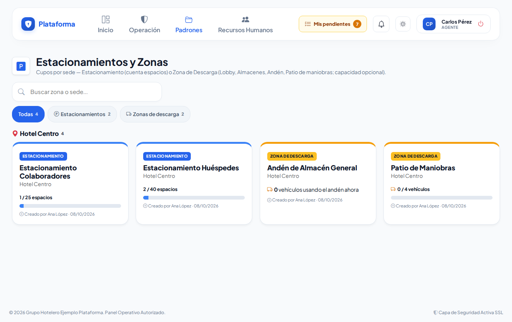
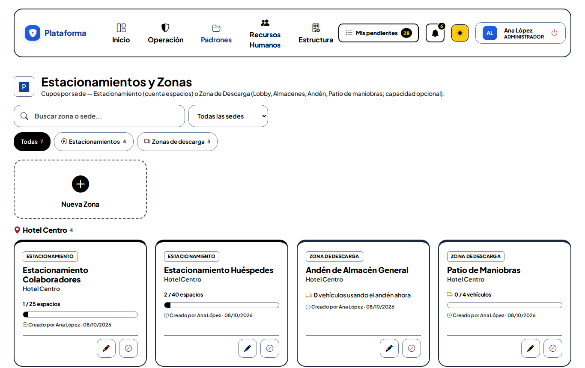
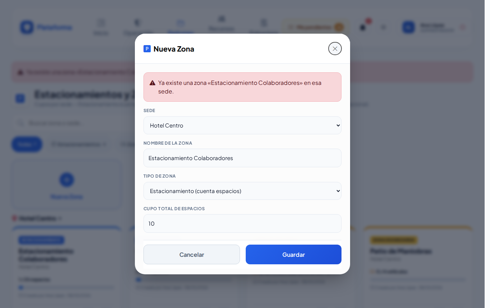

# Estacionamientos

**¿Para qué sirve?** Aquí configuras, por sede, dónde se dejan los vehículos y ves cuánto están ocupados:

- **Estacionamiento:** tiene un número de espacios (cupo).
- **Zona de descarga:** lobby, almacén, andén o patio de maniobras donde los vehículos se detienen un rato. Puede tener una capacidad máxima (opcional).

La caseta elige estas zonas al registrar la entrada de un vehículo en la [Bitácora de accesos](accesos.md).

## Antes de empezar

- Para ver la pantalla tu rol debe poder consultar *Estacionamientos*. Si no aparece en el menú, pide el permiso a tu administrador.
- Para crear, editar o desactivar zonas necesitas esos permisos. Si no ves **Nueva Zona**, tu rol solo consulta los cupos.
- Solo ves las zonas de **tus sedes**.

## Cómo leer la pantalla

1. Entra a **Padrones → Estacionamientos**.
2. Las zonas aparecen **agrupadas por sede**.
3. En cada estacionamiento ves **ocupados / cupo** (por ejemplo `2 / 40 espacios`) y una barra. Si se llena, la barra se pone **roja** y aparece **LLENO**.
4. En las zonas de descarga ves cuántos vehículos la están usando (o `0 / 4 vehículos` si tiene capacidad).
5. Una zona **Inactiva** se ve más clara: ya no se puede asignar en Accesos.

Para encontrar una zona escribe en **Buscar zona o sede...**, elige una sede en **Todas las sedes** o toca **Todas**, **Estacionamientos** o **Zonas de descarga**.

**Qué debes ver:** la ocupación se actualiza sola cuando la caseta registra entradas y salidas de vehículos.

## Cómo crear un estacionamiento

1. Toca la tarjeta **Nueva Zona**.
2. Elige la **Sede**.
3. Escribe el **Nombre de la Zona** (por ejemplo «Estacionamiento Colaboradores»). No se puede repetir en la misma sede.
4. En **Tipo de Zona** deja **Estacionamiento (cuenta espacios)**.
5. Escribe el **Cupo Total de Espacios** (1 o más).
6. Toca **Guardar**.

**Qué debes ver:** «Zona «Estacionamiento Colaboradores Norte» creada correctamente.»

## Cómo crear una zona de descarga

1. Toca **Nueva Zona** y elige la **Sede**.
2. Escribe el nombre (por ejemplo «Andén de Almacén»).
3. En **Tipo de Zona** elige **Zona de Descarga (Lobby, Almacén, Andén, Patio de maniobras)**.
4. **Capacidad máxima de vehículos (opcional):** si la escribes (por ejemplo 4), verás `0 / 4 vehículos` y te avisará cuando se llene, también en Accesos. Déjala vacía si no tiene límite.
5. Toca **Guardar**.

## Cómo editar una zona

1. Toca el **lápiz** (Editar) de la zona.
2. Cambia el nombre, el tipo, el cupo o la sede.
3. Toca **Guardar**.

**Qué debes ver:** «Zona «…» actualizada correctamente.»

## Cómo desactivar o reactivar una zona

1. Toca el **círculo rojo** (Desactivar) y confirma con **Aceptar** («¿Desactivar esta zona? Ya no se podrá asignar en Accesos.»). Úsalo, por ejemplo, para un estacionamiento en obra.
2. Para regresarla, toca la **flecha circular** (Reactivar) y confirma.

**Qué debes ver:** «Zona «…» desactivada: ya no se podrá asignar en Accesos, pero puedes reactivarla cuando quieras.»

## Lo que ve el agente de caseta

El agente consulta los cupos de su sede, sin botones para crear, editar o desactivar.

## En el celular y en los modos Noche y Sol

## Si algo sale mal

Los mensajes salen en rojo dentro de la ventana; lo que escribiste se conserva.

| Mensaje o síntoma | Qué significa | Qué hacer |
|---|---|---|
| Elige la sede de la zona. | No elegiste sede. | Elige la sede. |
| Escribe el nombre de la zona. | El nombre está vacío. | Escribe el nombre. |
| Ya existe una zona «…» en esa sede. | Ese nombre ya se usa en la sede. | Usa otro nombre. |
| Ya existe una zona «…» en esa sede (desactivada): reactívala en lugar de crearla otra vez. | La zona existe pero está inactiva. | Reactívala con la flecha circular. |
| Un estacionamiento necesita su cupo total de espacios (1 o más). | Falta el cupo. | Escribe cuántos espacios tiene. |
| Revisa el cupo total: máximo 9999 espacios. | El número es demasiado grande. | Corrige el cupo. |
| Elige una sede activa de la lista: esa sede no existe, está desactivada o no está a tu cargo. | La sede no es tuya. | Elige una de tus sedes. |
| La ocupación siempre dice 0. | Aún no se registran vehículos en esa zona. | Se llena sola al registrar entradas en Accesos. |

## Preguntas frecuentes

**¿Cómo se cuenta la ocupación?** Cada vehículo que entra por la caseta con esa zona asignada ocupa un lugar hasta que sale.

**¿Qué pasa si la zona está llena?** La barra se pone roja con **LLENO** y la caseta lo ve al registrar la entrada.

**¿Puedo borrar una zona?** No; se desactiva para que ya no se use, y se conserva su historial.

**¿Es obligatoria la capacidad de una zona de descarga?** No. Solo escríbela si quieres que te avise cuando se llene.

## Relacionado

- [Bitácora de accesos](accesos.md)
- [Padrón vehicular](vehiculos.md)
- [Empresas y sedes](empresas-y-sedes.md)
