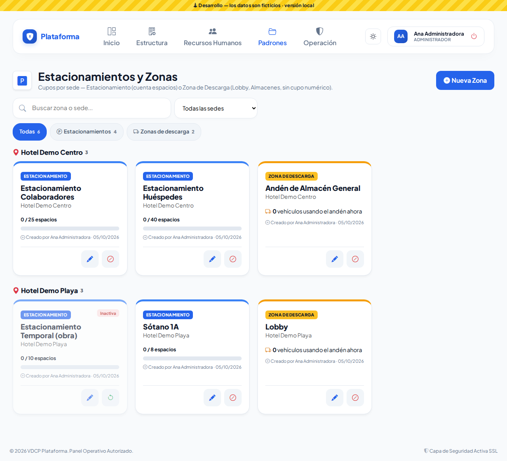
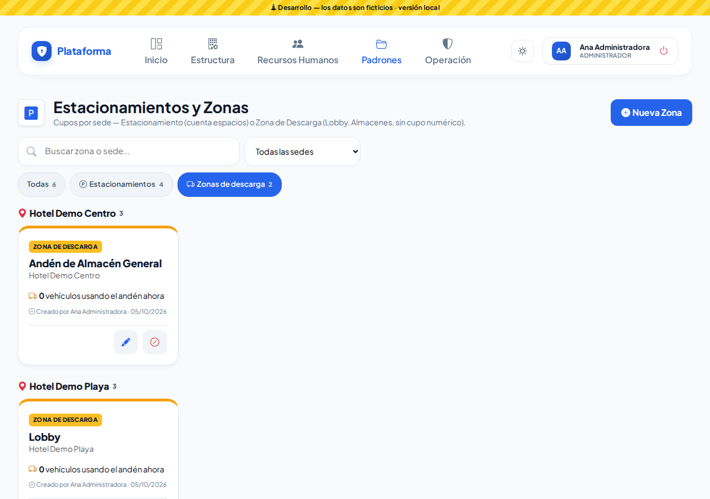
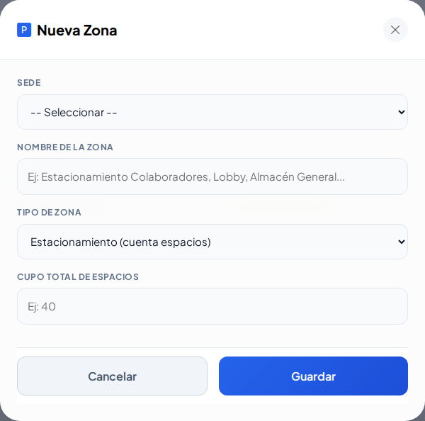
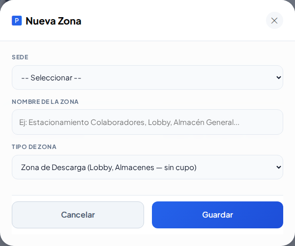
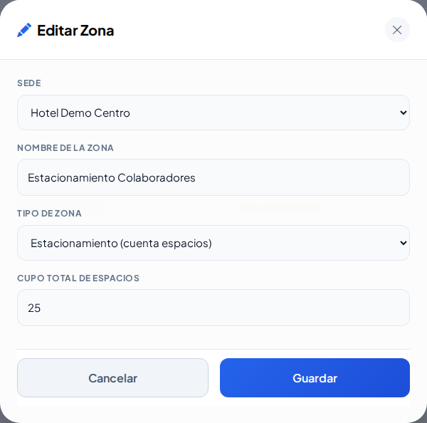
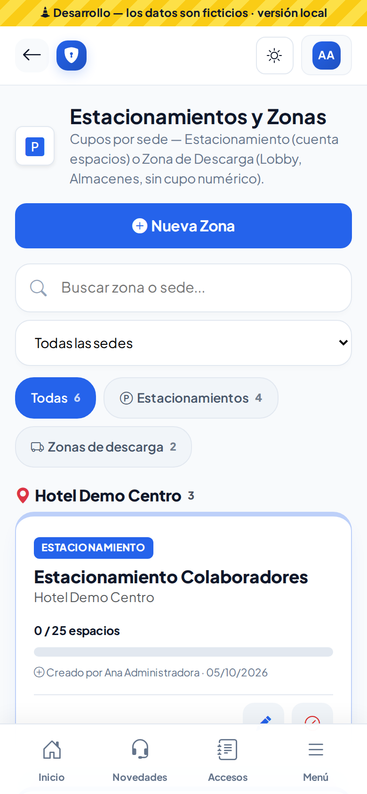
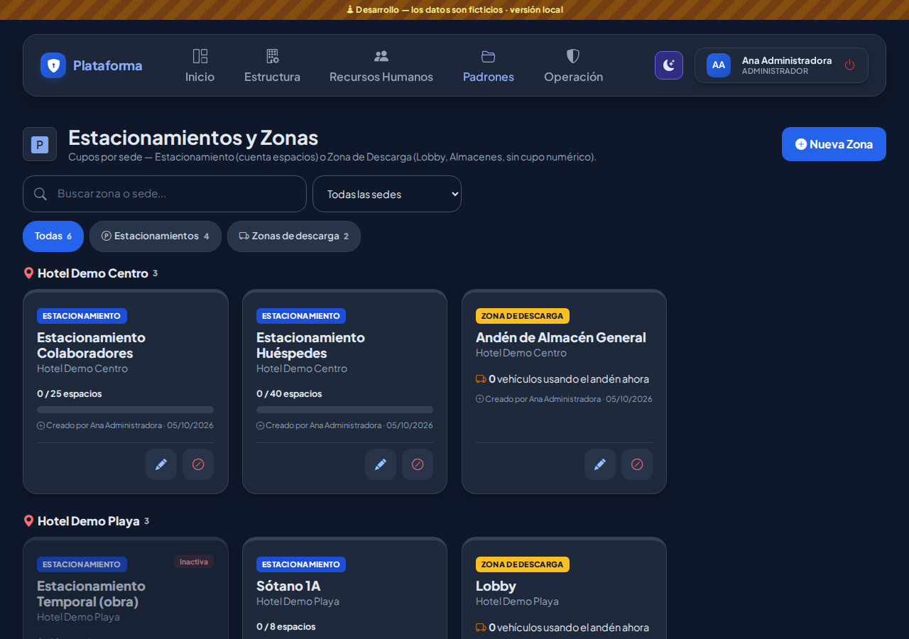

# Estacionamientos y zonas

Padrones → Inventarios de Seguridad → **Estacionamientos**. Aquí configuras, por sede, dónde se dejan los vehículos:

- **Estacionamiento**: tiene un número de espacios (cupo).
- **Zona de descarga**: lobby, almacén o andén donde los vehículos se detienen un rato. No cuenta espacios.

## Leer la pantalla

- Las zonas aparecen **agrupadas por sede**.
- En cada estacionamiento ves **ocupados / cupo** (por ejemplo `0 / 40 espacios`) y una barra. Si se llena, la barra se pone **roja** y aparece **LLENO**.
- En las zonas de descarga ves cuántos vehículos la están usando.
- La ocupación se llenará sola con la **Bitácora de accesos** (cuando entra un vehículo y se le asigna zona). Mientras ese módulo llega, verás 0.
- Una zona **Inactiva** se ve más clara: ya no se podrá asignar en Accesos.

Usa **Buscar**, la lista de **sedes** y las píldoras **Estacionamientos / Zonas de descarga** para encontrar una zona.

## Crear una zona

1. Toca **Nueva Zona**.
2. Elige la **Sede**.
3. Escribe el **Nombre de la Zona** (por ejemplo: Estacionamiento Colaboradores, Lobby, Almacén General). No se puede repetir en la misma sede.
4. Elige el **Tipo de Zona**.
5. Si es estacionamiento, escribe el **Cupo Total de Espacios** (1 o más). En zona de descarga ese campo desaparece.
6. Toca **Guardar**.

## Editar, desactivar y reactivar

- **Lápiz**: cambia nombre, tipo, cupo o sede.
- **Botón rojo**: desactiva la zona (por ejemplo, un estacionamiento en obra).
- **Botón verde**: la vuelve a activar.

## En el celular y de noche

## Quién puede hacer qué

| Perfil | Puede |
|---|---|
| Administrador | Todo, en todas las sedes |
| Jefe de seguridad | Todo, solo en su sede |
| Asistente | Crear y editar en su sede (no desactivar) |
| Agente | Consultar los cupos |
