# Etiquetas QR

**¿Para qué sirve?** Aquí imprimes **de una sola vez** las etiquetas con código QR de tus llaves, gafetes, equipos, vehículos, colaboradores, artículos de Lost & Found y procedimientos. Pegas la etiqueta y, desde ese momento, la caseta encuentra el registro **escaneándolo** con la cámara del celular o con el lector. Tiene tres pestañas: **Imprimir**, **Historial** y **Plantillas**.

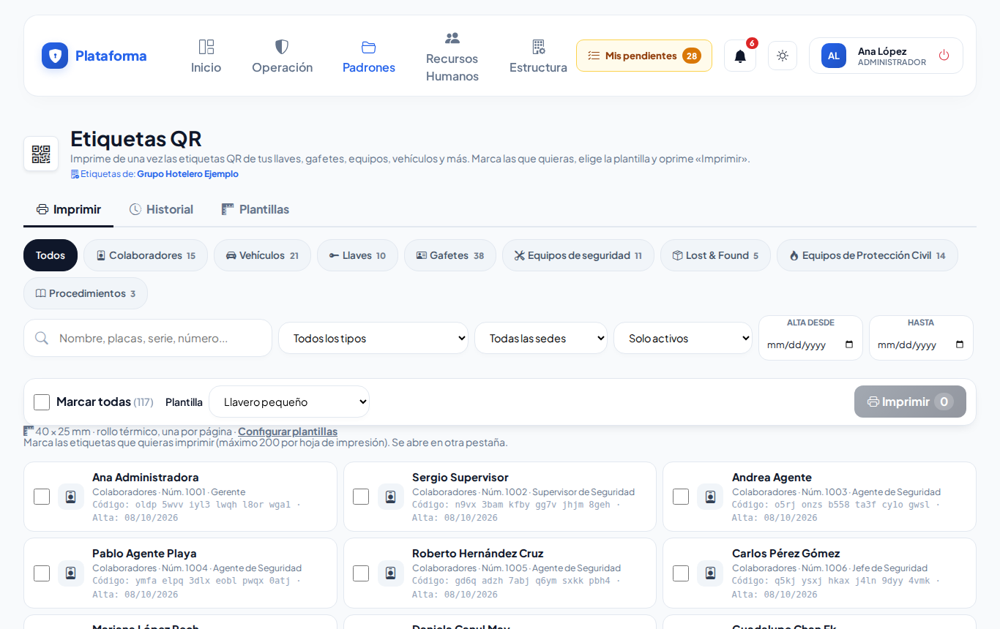

> Si solo necesitas **una** etiqueta, ábrela desde la ficha del registro con el botón del QR (**Código e identificación** → **Imprimir etiqueta**).

## Antes de empezar

- Cada tipo de registro aparece solo si puedes **ver** ese módulo y además **imprimir** en él (en Colaboradores y Procedimientos se pide poder **editar**). Si no ves un tipo, pide ese permiso a tu administrador.
- Si no tienes permiso de imprimir en ningún módulo, verás «No tienes permiso de imprimir etiquetas de ningún módulo.».
- Solo ves lo de **tus sedes**. Los vehículos y los procedimientos son de toda la empresa: si eliges una sede, no aparecen.
- La pestaña **Plantillas** solo la ve quien puede configurar las etiquetas (por ejemplo el administrador o el jefe de seguridad).

## Cómo imprimir varias etiquetas

1. Entra a **Padrones → Etiquetas QR**. Se abre la pestaña **Imprimir**.
2. Arriba toca el **tipo** (por ejemplo **Llaves**). El número junto a cada tipo dice cuántos hay.
3. Si quieres, escribe en **Nombre, placas, serie, número...**, elige la sede, el estatus (**Solo activos**, **Solo de baja** o **Activos y de baja**) y las fechas **Alta desde** / **hasta**. Toca **Buscar**. **Quitar filtros** los limpia.
4. Marca las casillas de las etiquetas que quieras, o **Marcar todas**.
5. Elige la **Plantilla** (el tamaño). Debajo se ve su medida, por ejemplo «40 × 25 mm · rollo térmico, una por página». La plataforma recuerda la última que usaste.
6. Toca **Imprimir** (muestra cuántas llevas). Se abre otra pestaña: **Etiquetas QR listas**.
7. Ahí toca **Imprimir Etiquetas**. En la impresora elige **Tamaño real / 100 %** para que salgan a la medida. **Volver a Etiquetas QR** te regresa.

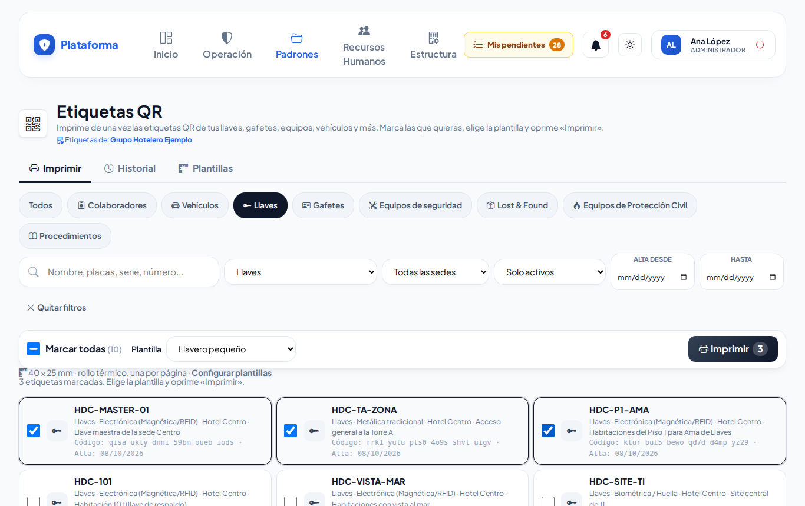

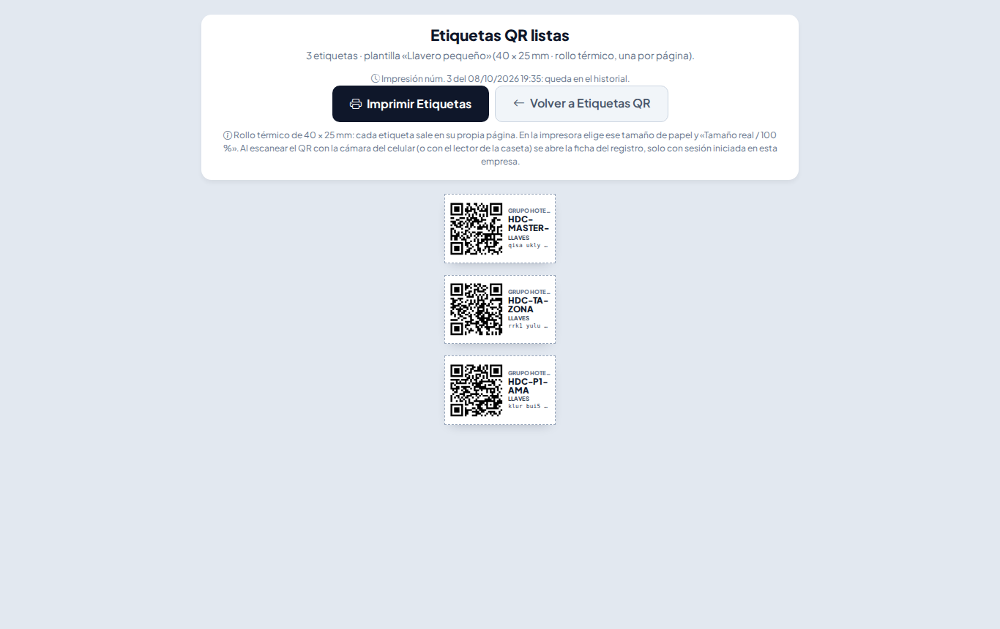

**Qué debes ver:** cada etiqueta con su **QR**, el **nombre** de lo que identifica (por ejemplo `HDC-101`, `ABC123A` o `Serie: RAD-8829`) y un **código** en letras para escribirlo a mano si el QR se daña. La impresión queda guardada en el **Historial**.

Puedes imprimir hasta **200** etiquetas a la vez.

### Qué plantilla usar

- **Llavero pequeño** (40 × 25 mm): llaveros.
- **Etiqueta 50 × 25 mm**: la de las impresoras de etiquetas más comunes.
- **Gafete**: tamaño credencial.
- **Calcomanía vehicular**: para el parabrisas.

Con **rollo térmico** (Zebra, Brother…) cada etiqueta sale en su propia página; con **hoja carta o A4** se acomodan en la planilla (por ejemplo 3 columnas × 10 filas).

## Cómo ver el historial y reimprimir

1. Toca la pestaña **Historial**. Ves cada impresión: número, fecha, quién la hizo, plantilla y qué etiquetas llevaba.
2. Para encontrar una, escribe en **Buscar una etiqueta (nombre, placas...)** o usa **Todos los usuarios**, **Todas las plantillas**, **Desde** y **Hasta**. Toca **Buscar**.
3. **Ver hoja** vuelve a abrir esa misma hoja.
4. **Reimprimir** abre **Reimprimir impresión núm. …** con sus etiquetas marcadas:
   - Quita la marca de las que no necesitas (por ejemplo, deja solo la que se dañó).
   - En **Plantilla** deja **La misma de la impresión original** o elige otra.
   - Toca **Reimprimir**.

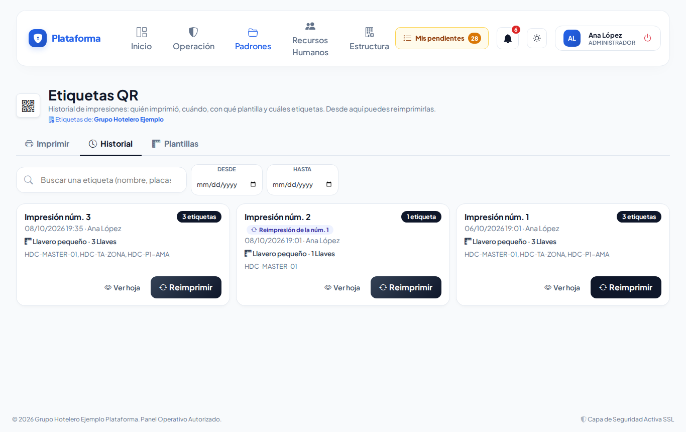

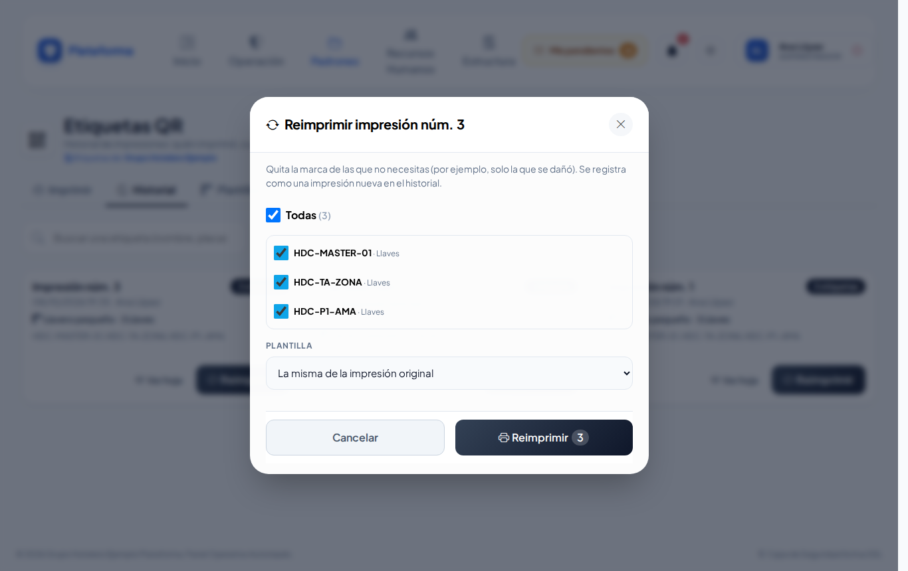

**Qué debes ver:** se abre la hoja y se guarda como una impresión nueva, marcada «Reimpresión de la núm. …». Solo ves las impresiones de tus sedes (o las que tú hiciste) y de los tipos que puedes imprimir.

## Cómo crear o ajustar una plantilla

1. Toca la pestaña **Plantillas**. Ya vienen las de siempre; puedes **Editar** cualquiera o tocar **Nueva plantilla**.
2. **1. Nombre y lugar:** escribe el **Nombre de la plantilla** (por ejemplo «Zebra 2 × 1 pulgadas») y en **¿Quién la usa?** elige **Toda la empresa** o una sede.
3. **2. Papel:** elige el **Formato**:
   - **Rollo térmico (una etiqueta por página):** escribe **Ancho** y **Alto de la etiqueta (mm)**.
   - **Hoja carta o A4 con planilla de etiquetas:** elige la **Hoja** y escribe columnas, filas, márgenes y separación. 1 pulgada = 25.4 mm.
4. **3. Contenido:** elige la **Orientación** (QR a la izquierda o arriba), el **Tamaño del QR (mm)** (mínimo 8 mm) y los **Datos visibles** (nombre, código legible, tipo, departamento / sede, fecha de impresión, logo).
5. Revisa la **Vista previa**: se acomoda mientras escribes y te avisa si algo **no cabe**.
6. Toca **Crear plantilla** (o **Guardar cambios**).

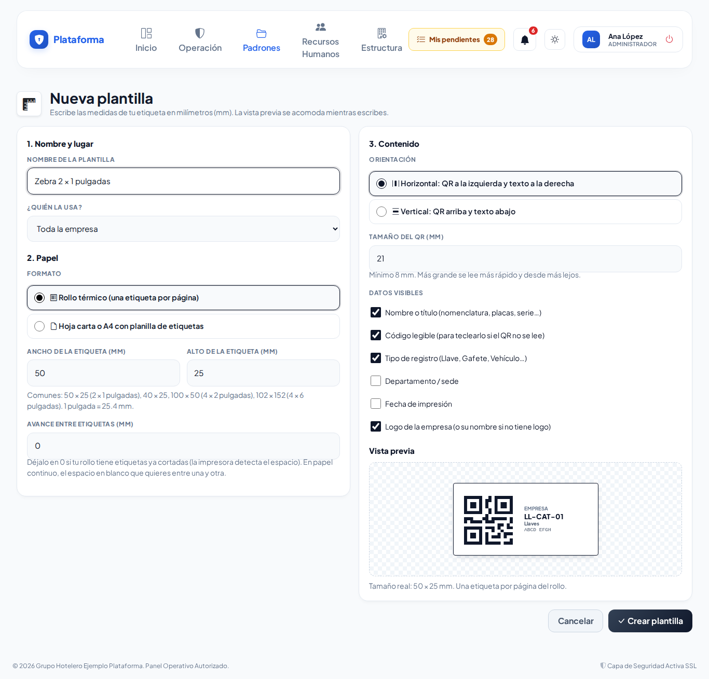

**Qué debes ver:** «Plantilla «…» creada. Imprime una hoja de prueba para revisar que las medidas coincidan con tu papel.»

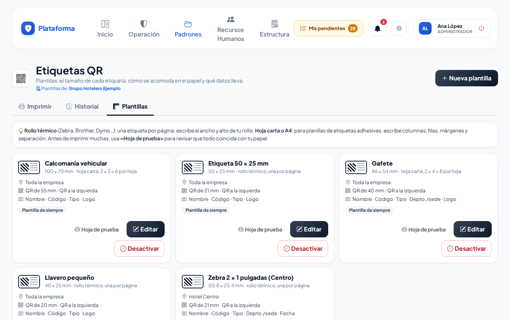

- **Hoja de prueba** imprime una página con etiquetas de ejemplo (no se guarda en el historial). Úsala antes de imprimir muchas.
- **Desactivar** quita la plantilla de la lista al imprimir (se puede volver a **Activar**).

## Lo que ve el agente de caseta

El agente imprime solo lo que puede imprimir (por ejemplo las etiquetas de Lost & Found) y no ve la pestaña Plantillas.

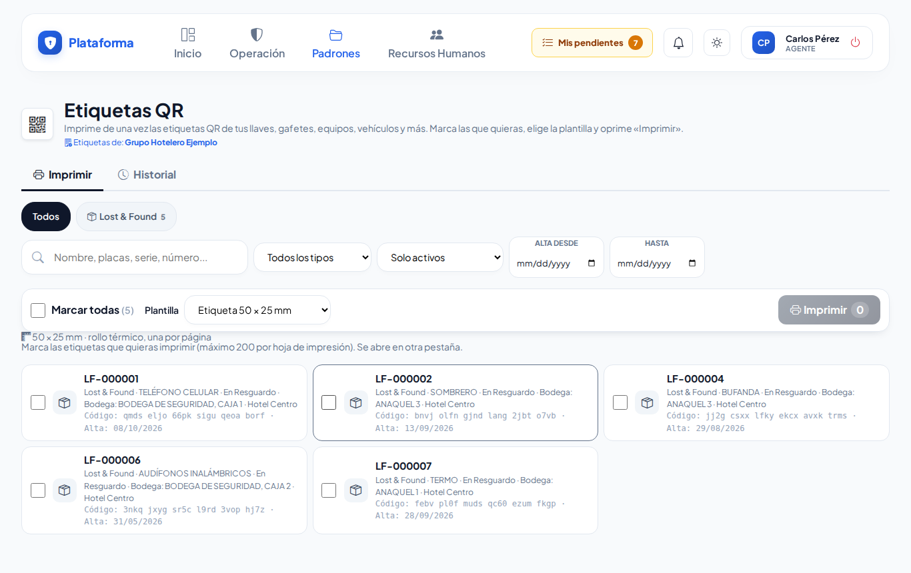

## En el celular y en los modos Noche y Sol

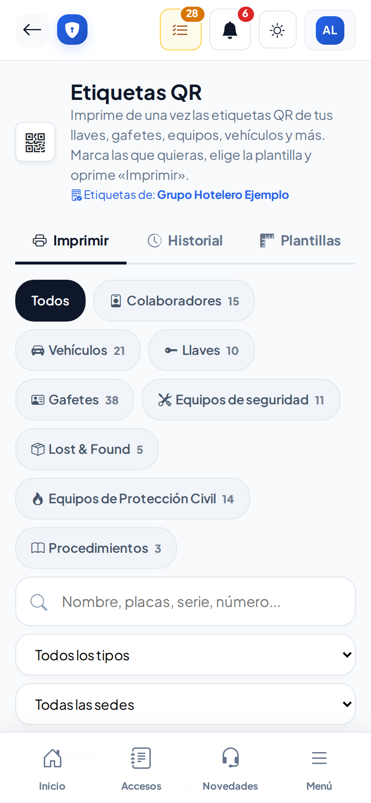

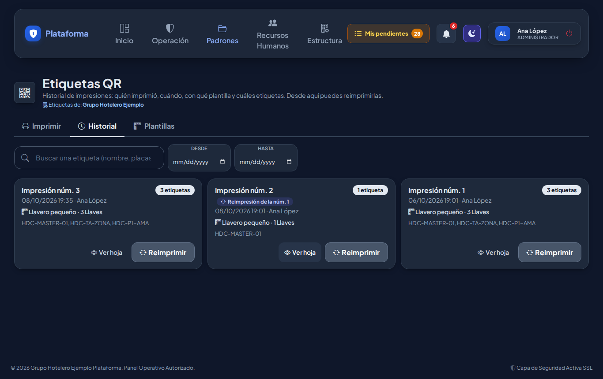

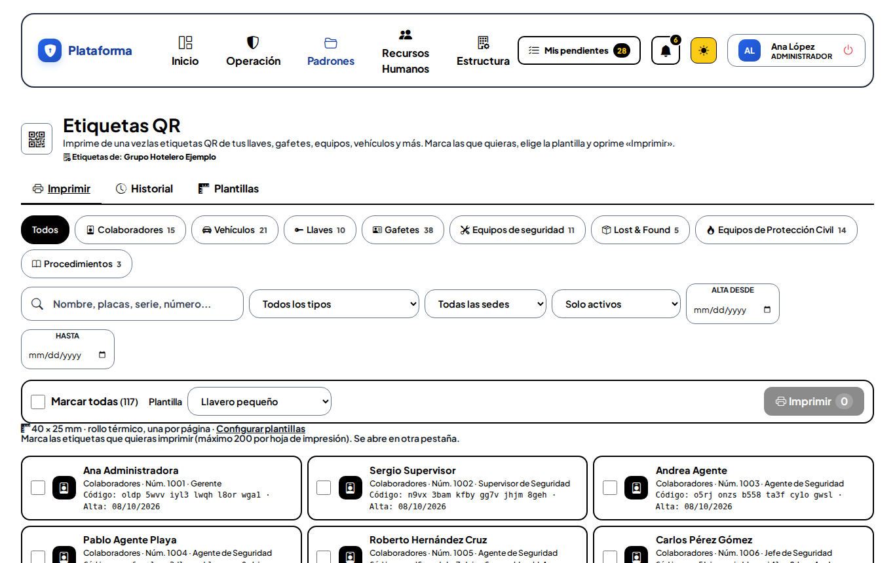

## Si algo sale mal

| Mensaje o síntoma | Qué significa | Qué hacer |
|---|---|---|
| Marca al menos un registro para imprimir sus etiquetas. | Tocaste **Imprimir** sin marcar nada. | Marca las casillas. |
| Marca al menos una etiqueta para reimprimir. | Quitaste todas las marcas al reimprimir. | Deja marcada al menos una. |
| El botón **Imprimir** está apagado. | No hay nada marcado, o marcaste más de 200. | Marca de 1 a 200 etiquetas. |
| No tienes permiso de imprimir etiquetas de ningún módulo. | Tu rol no imprime en ningún módulo. | Pide el permiso «Imprimir» del módulo a tu administrador. |
| No aparecen los vehículos. | Elegiste una sede y los vehículos son de toda la empresa. | Deja **Todas las sedes**. |
| Escribe un nombre para la plantilla (por ejemplo «Zebra 2 × 1 pulgadas»). | La plantilla no tiene nombre. | Escribe un nombre. |
| La etiqueta debe medir al menos 15 mm de ancho. / al menos 10 mm de alto. | La medida es muy pequeña. | Corrige la medida. |
| La vista previa dice que algo no cabe. | Las etiquetas no caben en la hoja con esas medidas. | Reduce columnas, filas, márgenes o separación. |
| Es la única plantilla activa de toda la empresa: activa otra antes de desactivar esta (sin plantillas no se podría imprimir). | Intentaste desactivar la última plantilla. | Activa otra primero. |
| Las etiquetas salen más chicas o más grandes. | La impresora está ajustando el tamaño. | Elige **Tamaño real / 100 %** en la impresora. |

## Preguntas frecuentes

**¿El QR cambia si reimprimo?** No. El QR de cada registro siempre es el mismo; puedes reimprimirlo cuantas veces quieras.

**¿El QR lleva datos personales?** No. Solo abre la ficha, y solo con una sesión de tu empresa.

**¿Por qué no veo algún tipo de registro?** Porque te falta ver o imprimir en ese módulo. Pide el permiso a tu administrador.

**¿Qué hago si el QR se daña?** Escribe a mano el código en letras que trae la etiqueta, o reimprímela desde el Historial.

## Relacionado

- [Catálogo de llaves](llaves.md)
- [Gafetes](gafetes.md)
- [Padrón vehicular](vehiculos.md)
- [Equipos de seguridad](equipos.md)
