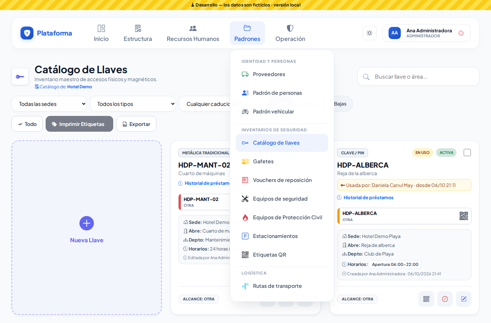
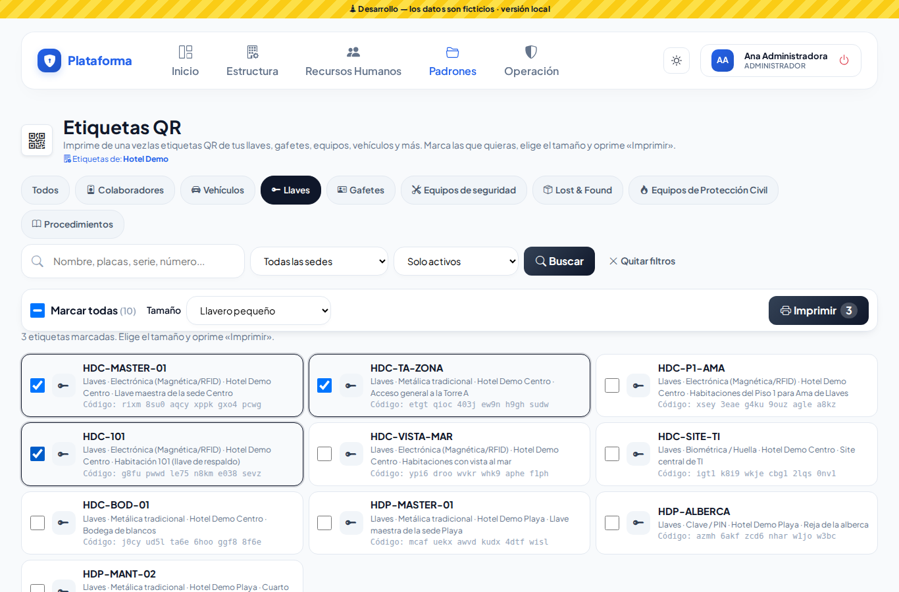
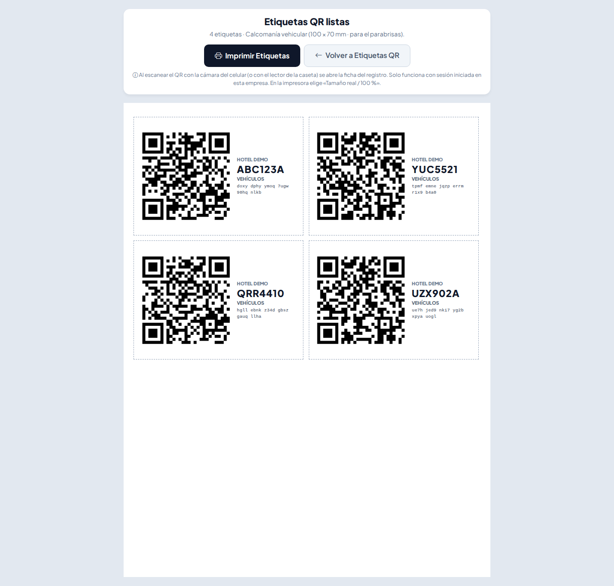
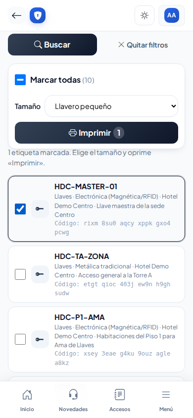
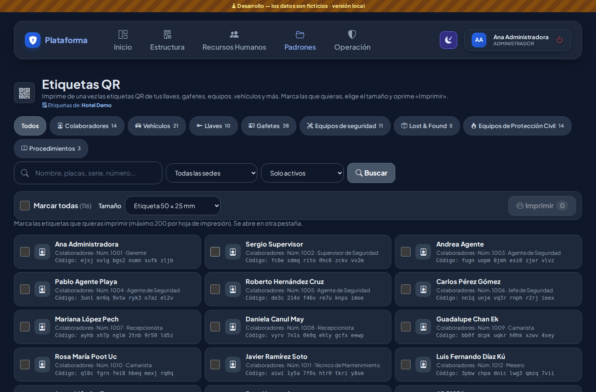
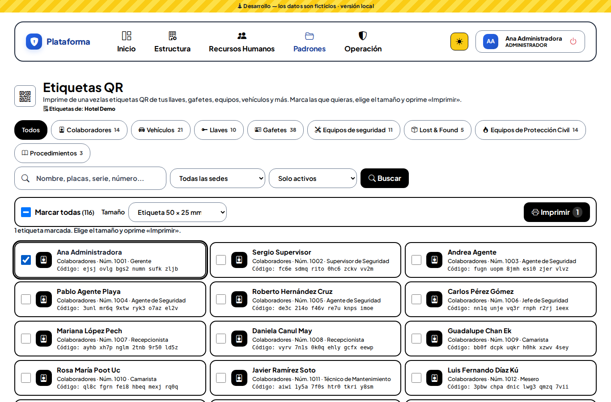

# Etiquetas QR

Padrones → Inventarios de Seguridad → **Etiquetas QR**. Aquí imprimes **de una sola vez** las etiquetas con código QR de tus llaves, gafetes, equipos, vehículos, colaboradores, artículos de Lost & Found y más. Pegas la etiqueta y, desde ese momento, la caseta encuentra el registro **escaneándolo** con la cámara del celular o con el lector.

Si solo necesitas **una** etiqueta, ábrela desde la ficha del registro con el botón **QR** («Código e identificación» → **Imprimir etiqueta**).

## Paso a paso

1. Arriba elige el **tipo** (por ejemplo **Llaves**). El número junto a cada tipo dice cuántos hay.
2. Si quieres, escribe en el buscador (nombre, placas, serie, número…), elige la **sede** y si quieres **Solo activos** o **Activos y de baja**.
3. Marca las casillas de las etiquetas que quieras, o **Marcar todas**.
4. Elige el **Tamaño**:
   - **Llavero pequeño** (40 × 25 mm) para llaveros.
   - **Etiqueta 50 × 25 mm**, la de las impresoras de etiquetas más comunes.
   - **Gafete** (86 × 54 mm), tamaño credencial.
   - **Calcomanía vehicular** (100 × 70 mm) para el parabrisas.
5. Oprime **Imprimir**: se abre otra pestaña con la hoja lista. Ahí oprime **Imprimir Etiquetas**. En la impresora elige **Tamaño real / 100 %** para que salgan a la medida.

Cada etiqueta lleva el **QR**, el **nombre** de lo que identifica (por ejemplo `HDC-101`, `ABC123A` o `Serie: 130TXP1568`) y un **código** en letras para escribirlo a mano si el QR se daña.

Puedes imprimir hasta **200** etiquetas a la vez. Si marcas más, el botón se apaga y te avisa.

## ¿Por qué no veo algún tipo?

Cada tipo aparece solo si puedes **ver** ese módulo y además **imprimir** en él (en Colaboradores y Procedimientos, que no tienen «Imprimir», se pide **Editar**). Solo ves lo de **tus sedes**.

Por ejemplo, el **Agente** ve **Lost & Found** (imprime las etiquetas de las bolsas), pero no Llaves ni Vehículos, porque en esos padrones solo consulta.

## En el celular y de noche

En el celular la lista es de una columna, con casillas grandes; la barra de **Marcar todas · Tamaño · Imprimir** se queda arriba. Funciona igual en los modos **Sol** y **Noche**.

