# Etiquetas QR

Padrones → Inventarios de Seguridad → **Etiquetas QR**. Aquí imprimes **de una sola vez** las etiquetas con código QR de tus llaves, gafetes, equipos, vehículos, colaboradores, artículos de Lost & Found y más. Pegas la etiqueta y, desde ese momento, la caseta encuentra el registro **escaneándolo** con la cámara del celular o con el lector.

Si solo necesitas **una** etiqueta, ábrela desde la ficha del registro con el botón **QR** («Código e identificación» → **Imprimir etiqueta**).

## Paso a paso

1. Arriba elige el **tipo** (por ejemplo **Llaves**). El número junto a cada tipo dice cuántos hay.
2. Si quieres, escribe en el buscador (nombre, placas, serie, número…), elige la **sede** y si quieres **Solo activos** o **Activos y de baja**.
3. Marca las casillas de las etiquetas que quieras, o **Marcar todas**.
4. Elige el **Tamaño**:
   - **Llavero pequeño** (40 × 25 mm) para llaveros.
   - **Etiqueta 50 × 25 mm**, la de las impresoras de etiquetas más comunes.
   - **Gafete** (86 × 54 mm), tamaño credencial.
   - **Calcomanía vehicular** (100 × 70 mm) para el parabrisas.
5. Oprime **Imprimir**: se abre otra pestaña con la hoja lista. Ahí oprime **Imprimir Etiquetas**. En la impresora elige **Tamaño real / 100 %** para que salgan a la medida.

Cada etiqueta lleva el **QR**, el **nombre** de lo que identifica (por ejemplo `HDC-101`, `ABC123A` o `Serie: 130TXP1568`) y un **código** en letras para escribirlo a mano si el QR se daña.

Puedes imprimir hasta **200** etiquetas a la vez. Si marcas más, el botón se apaga y te avisa.

## ¿Por qué no veo algún tipo?

Cada tipo aparece solo si puedes **ver** ese módulo y además **imprimir** en él (en Colaboradores y Procedimientos, que no tienen «Imprimir», se pide **Editar**). Solo ves lo de **tus sedes**.

Por ejemplo, el **Agente** ve **Lost & Found** (imprime las etiquetas de las bolsas), pero no Llaves ni Vehículos, porque en esos padrones solo consulta.

## En el celular y de noche

En el celular la lista es de una columna, con casillas grandes; la barra de **Marcar todas · Tamaño · Imprimir** se queda arriba. Funciona igual en los modos **Sol** y **Noche**.

## Novedades de la Ronda 7: plantillas, historial y reimpresión

Etiquetas QR ahora tiene tres pestañas: **Imprimir**, **Historial** y **Plantillas** (esta última solo la ven el Administrador, el Director y el Jefe de seguridad).

### Imprimir

Es igual que antes, pero en lugar de «Tamaño» eliges una **Plantilla**. Debajo de la barra se ve su medida (por ejemplo «40 × 25 mm · rollo térmico, una por página»). La plataforma **recuerda la última plantilla que usaste**.

Hay filtros nuevos: **tipo de registro**, **estatus** (solo activos, solo de baja, o ambos) y **fecha de alta** (desde / hasta). Cada registro muestra su fecha de alta.

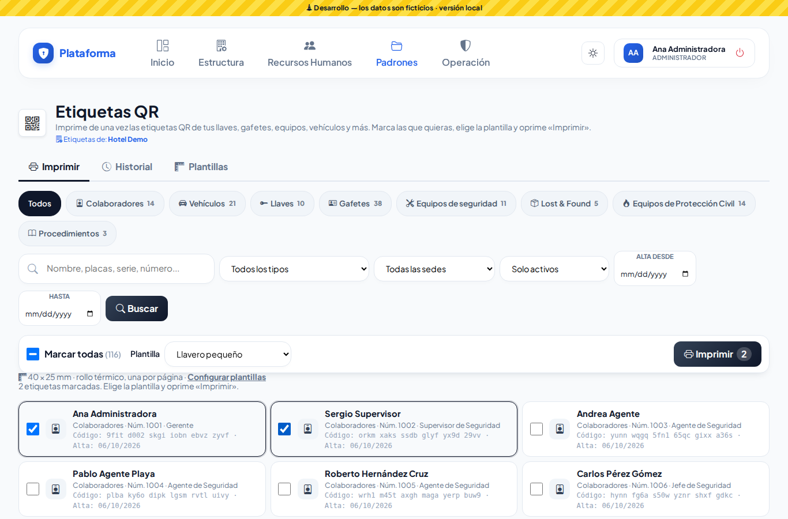
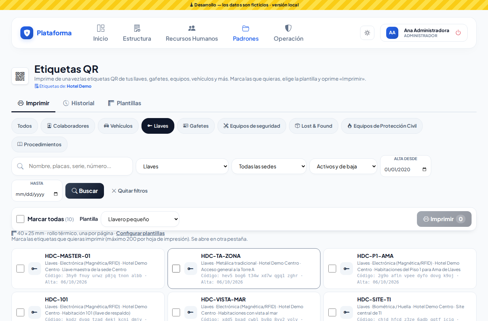

Al oprimir **Imprimir** se abre la hoja lista y la impresión **queda guardada en el historial** (quién, cuándo, con qué plantilla y cuáles etiquetas).

- **Rollo térmico** (Zebra, Brother…): cada etiqueta sale en su propia página del tamaño de la etiqueta. En la impresora elige ese tamaño de papel y «Tamaño real / 100 %».
- **Hoja carta o A4**: las etiquetas se acomodan en la planilla (por ejemplo 3 columnas × 10 filas).

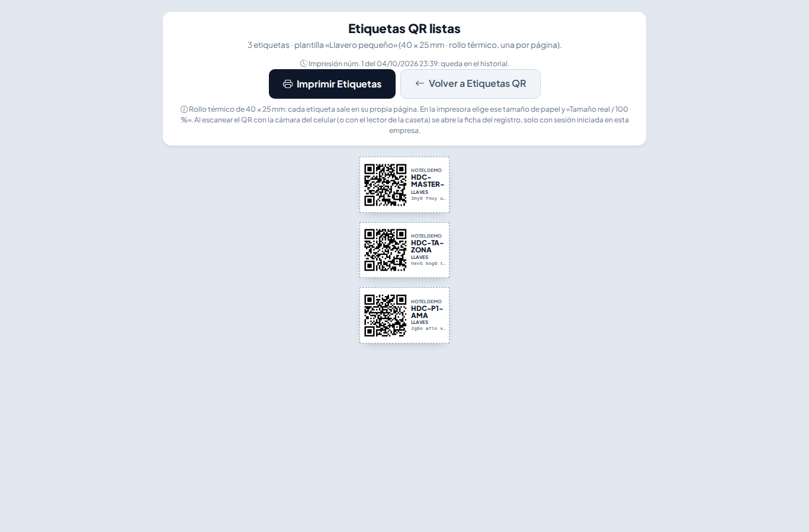
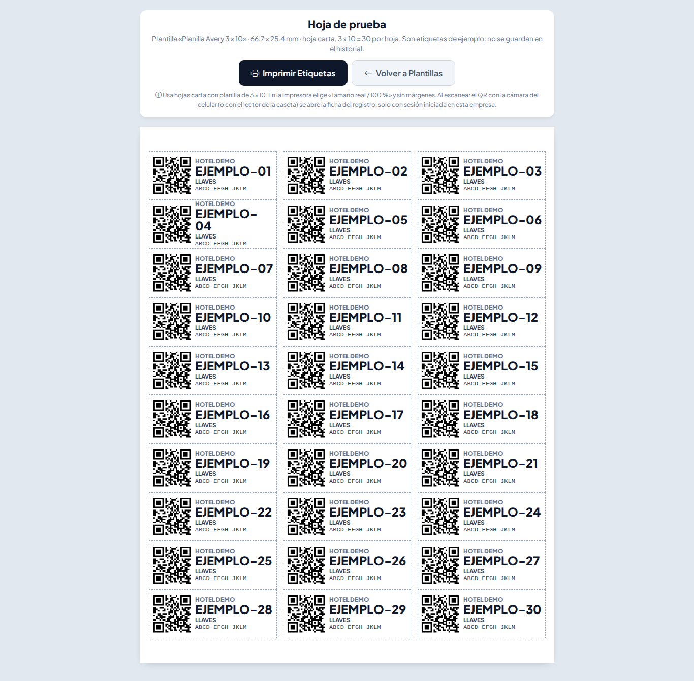

### Historial y Reimprimir

En **Historial** ves cada impresión: número, fecha, quién la hizo, plantilla y qué etiquetas llevaba. Puedes buscar una etiqueta, filtrar por fechas, por usuario o por plantilla.

- **Ver hoja** vuelve a abrir esa misma hoja.
- **Reimprimir** abre una ventana con sus etiquetas marcadas: **quita la marca** de las que no necesitas (por ejemplo, deja solo la que se dañó), elige otra plantilla si quieres y oprime **Reimprimir**. Se guarda como una impresión nueva, marcada «Reimpresión de la núm. …».

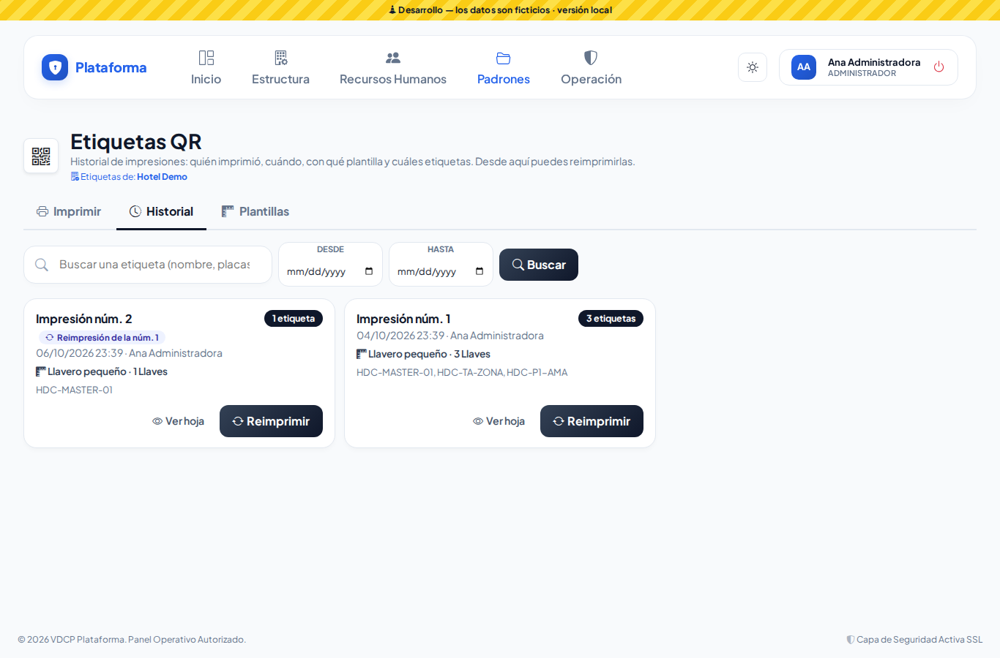
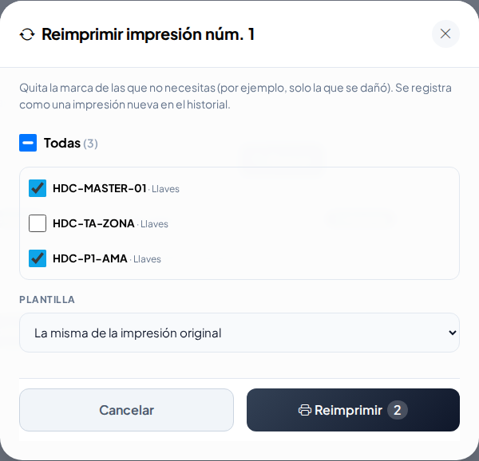

Solo ves las impresiones de tus sedes (o las que tú hiciste) y solo de los tipos que puedes imprimir.

### Plantillas

Aquí defines el tamaño de cada etiqueta. Ya vienen las **4 de siempre** (Llavero pequeño, Etiqueta 50 × 25 mm, Gafete y Calcomanía vehicular); puedes ajustarlas o agregar las tuyas con **Nueva plantilla**:

1. **Nombre y lugar**: un nombre que reconozcas («Zebra 2 × 1 pulgadas») y si es para **toda la empresa** o **solo una sede** (el Jefe de seguridad crea plantillas de su sede).
2. **Papel**: **Rollo térmico** (escribe ancho y alto de tu etiqueta en mm) u **Hoja carta o A4** (además columnas, filas, márgenes y separación entre etiquetas). 1 pulgada = 25.4 mm.
3. **Contenido**: orientación (QR a la izquierda o arriba), **tamaño del QR** (mínimo 8 mm) y qué datos lleva: nombre, código legible, tipo, departamento / sede, fecha de impresión y logo de la empresa.

La **vista previa** se acomoda mientras escribes y te avisa si algo **no cabe** («A lo largo ocupan 292.1 mm y la hoja mide 279.4 mm…»). El servidor revisa lo mismo al guardar.

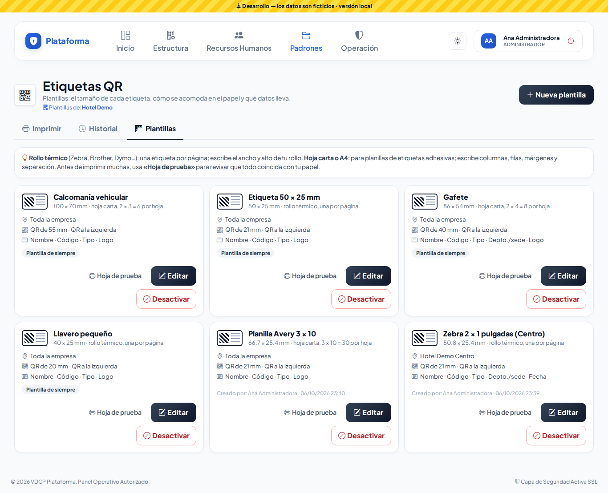
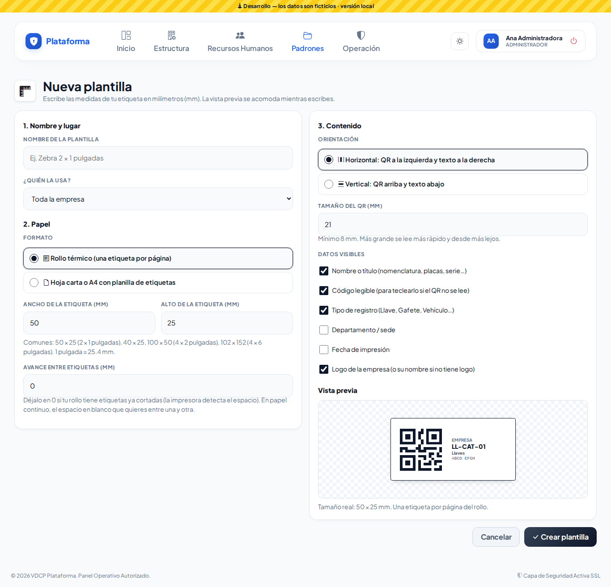
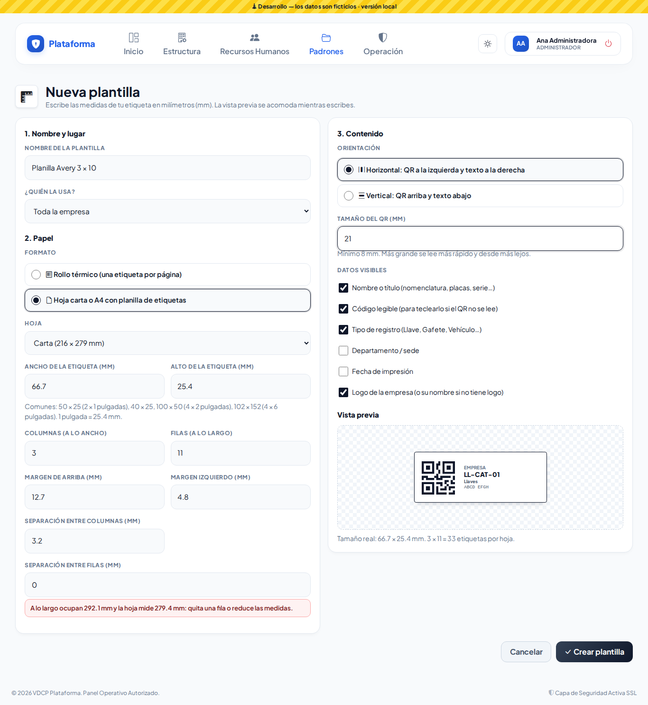

Antes de imprimir muchas, usa **Hoja de prueba**: imprime una página con etiquetas de ejemplo (no se guarda en el historial) para revisar que coincida con tu papel.

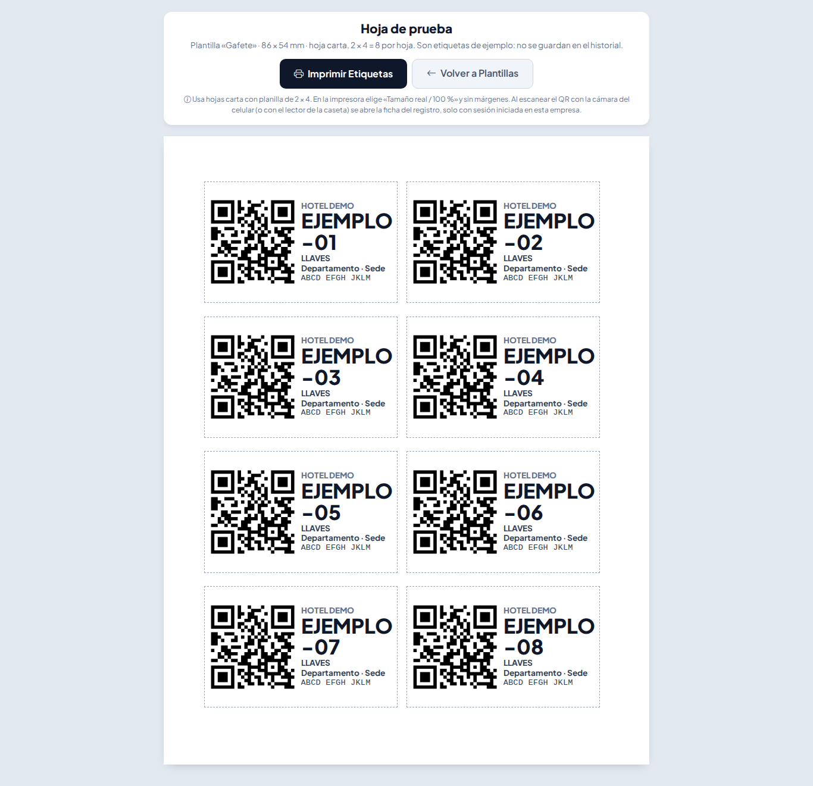

**Desactivar** quita la plantilla de la lista al imprimir (se puede volver a **Activar**). La única plantilla activa de toda la empresa no se puede desactivar.

### En el celular, Sol y Noche, y el Agente

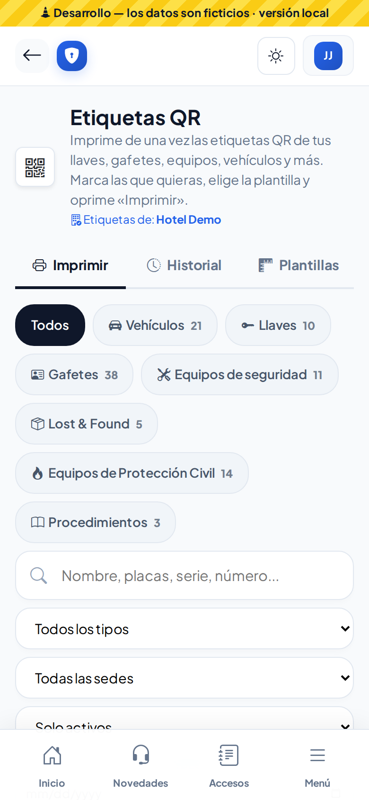
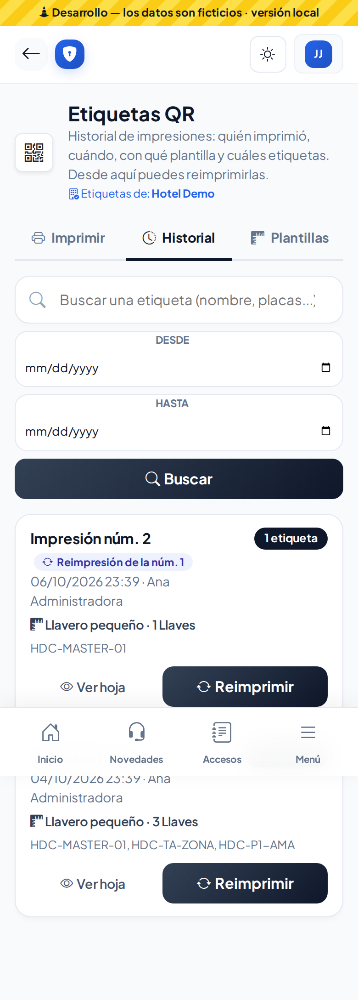
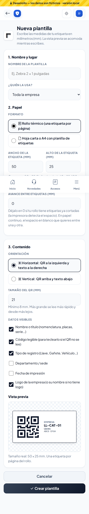
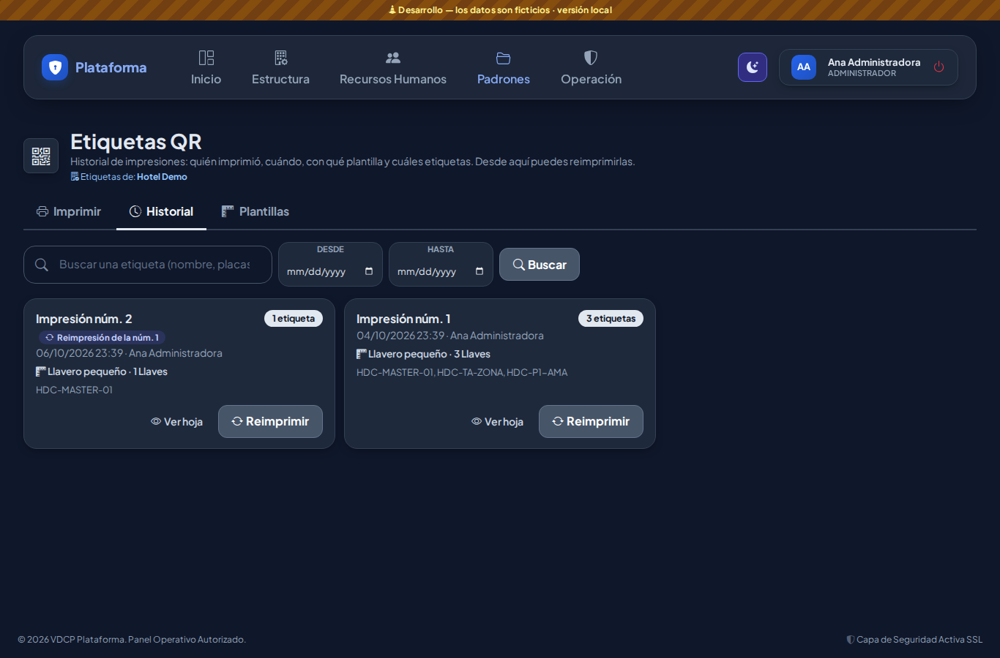
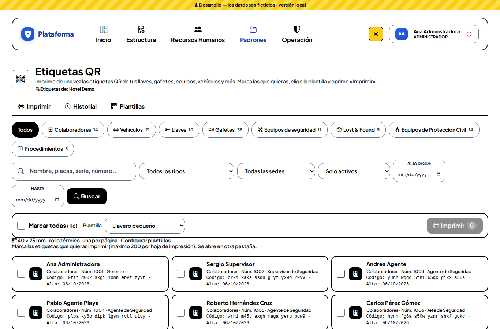

El **Agente** imprime y ve el historial solo de lo que puede imprimir (Lost & Found) y no ve la pestaña Plantillas.

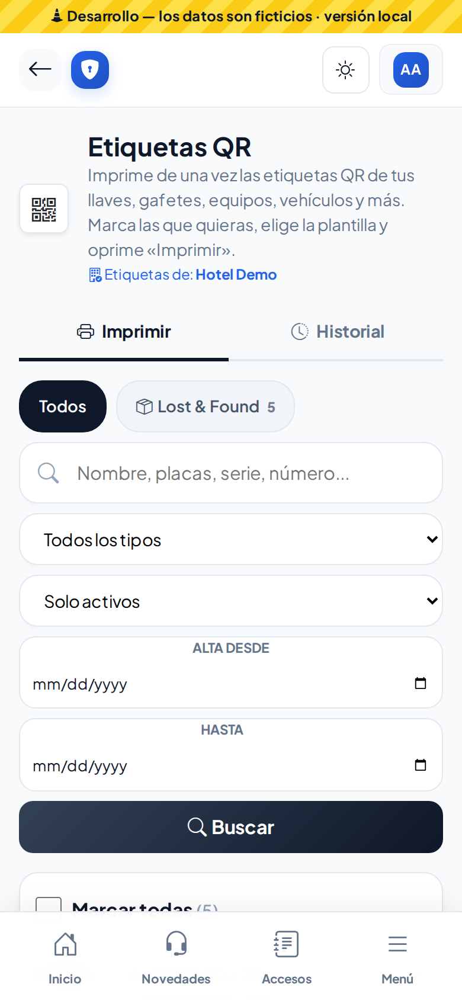
