# Inventario de gafetes

Padrones → Inventarios de Seguridad → **Gafetes**. Aquí están los gafetes de plástico que se prestan en caseta a visitantes, proveedores y contratistas. Cada gafete tiene un nombre corto (su **nomenclatura**, por ejemplo `HOT-CEN-VIS-001`) y un **código QR** para encontrarlo rápido.

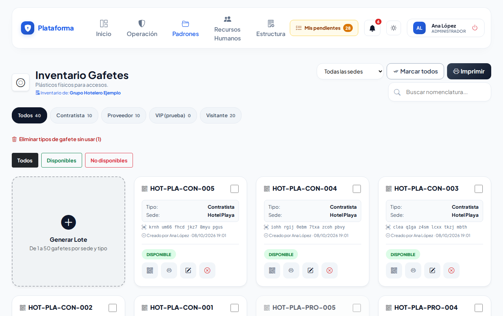

## Qué ves en cada ficha

- La **nomenclatura** en grande.
- **Tipo** (Visitante, Proveedor, Contratista o los que tu empresa agregue) y **Sede**.
- El **código interno** (lo que lleva el QR). Si el gafete tiene chip, también su **NFC / RFID**.
- Quién lo creó o lo editó y cuándo.
- Abajo, el estado: **DISPONIBLE** (verde) o **NO DISPONIBLE** (rojo: se perdió, se dañó o lo robaron).

## Buscar y filtrar

- Escribe en **Buscar nomenclatura...** una parte del nombre (`vis-01`), el tipo o la sede.
- Toca una píldora para ver solo un tipo; el número dice cuántos hay.
- Usa **Todas las sedes** para ver una sola sede (si tienes varias).
- **Todos / Disponibles / No disponibles** filtra por estado.
- Los filtros se recuerdan mientras la pestaña siga abierta.

## Generar gafetes (lote)

1. Toca **Generar Lote**.
2. Elige la **Sede** donde se van a usar.
3. Elige el **Tipo de Gafete**. Si no está en la lista, elige **+ Nuevo tipo...** y escribe su nombre (por ejemplo, *Capital Humano*).
4. Escribe la **Cantidad a Crear** (de 1 a 50).
5. Toca **Generar Lote**.

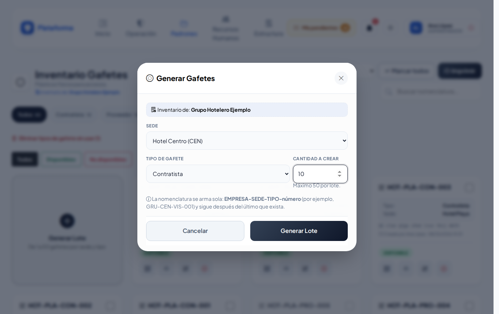

La nomenclatura se arma sola: **EMPRESA-SEDE-TIPO-número**. Por ejemplo, en Hotel Demo, sede Centro (`CEN`), tipo Visitante: `HOT-CEN-VIS-001`, `HOT-CEN-VIS-002`… Si ya existían hasta el `010`, el siguiente lote empieza en `011`.

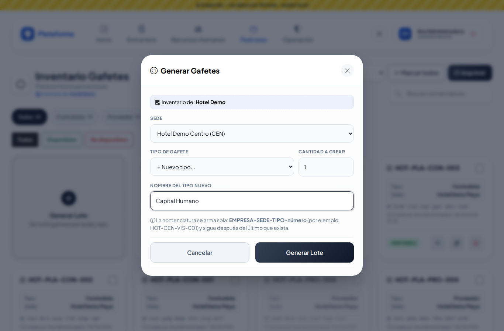

## Imprimir gafetes

1. Marca la casilla de cada gafete que quieras imprimir, o toca **Marcar todos** (marca solo los que se ven con el filtro actual; tócalo otra vez para desmarcar).
2. El botón **Imprimir** muestra cuántos llevas. Tócalo: se abre otra pestaña.
3. Toca **Imprimir Selección**.
4. Recorta cada gafete por el borde exterior y **dóblalo por la línea punteada**: de un lado queda el tipo con el color (naranja Visitante, azul Proveedor, gris los demás) y del otro el QR con la nomenclatura. Mételo en la mica.

Para imprimir uno solo, toca el botón de la **impresora** en su ficha.

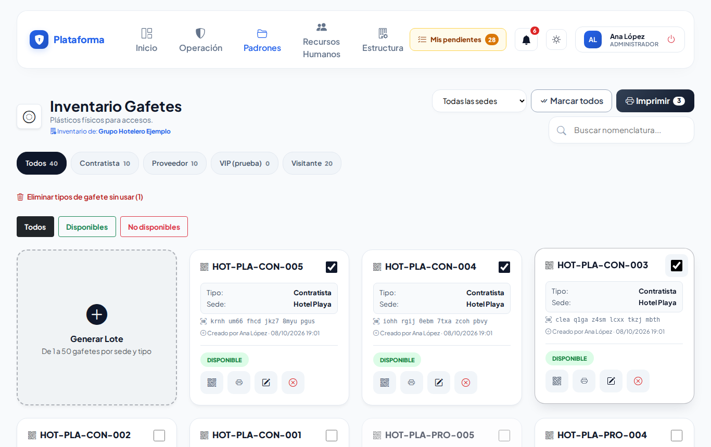
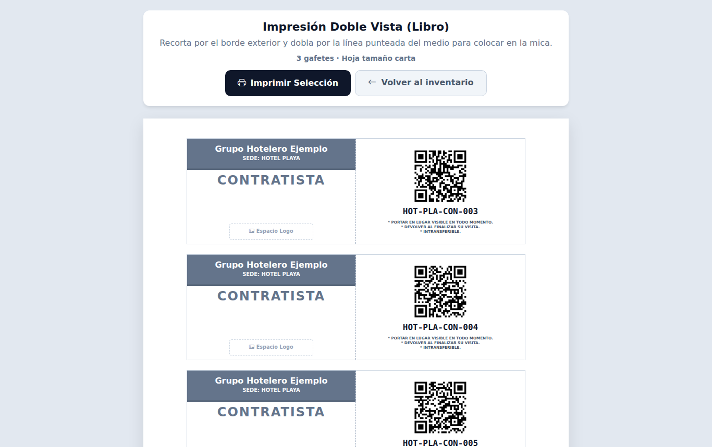

Al escanear el QR con un celular que tenga la sesión iniciada, se abre la ficha del gafete. El QR no lleva datos personales y solo funciona en tu empresa.

## Editar un gafete

Toca el **lápiz**. Puedes cambiar:

- la **Nomenclatura** (no puede repetirse en tu empresa);
- el **Tipo de Gafete** (o crear uno nuevo);
- la **Etiqueta NFC / RFID (opcional)**: si el plástico trae chip o tarjeta, acércalo al lector (o escribe su número). Así el gafete también se encuentra acercando la tarjeta. Si ese número ya lo tiene otro gafete, el sistema te dice cuál.

El **Código Interno** no cambia nunca: es el que va en el QR.

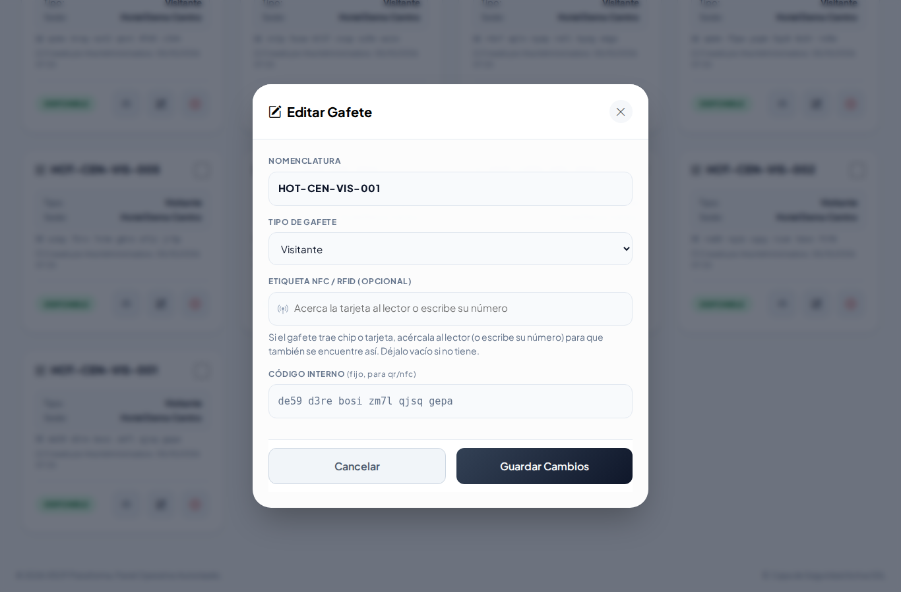

## Dar de baja con voucher (se perdió, se dañó o lo robaron)

1. Toca la **X roja** de la ficha.
2. Elige el **Motivo**: Extraviado, Dañado o Robado.
3. Escribe **¿Cómo pasó?** (ayuda a decidir si se cobra).
4. Si se le va a cobrar a alguien, marca **Aplica CXC**:
   - **Monto**: el sistema sugiere el último que se cobró por ese tipo de gafete; puedes cambiarlo.
   - **Colaborador Responsable**: escribe su número de empleado (aparece solo, sin Enter), o lee su credencial con el lector o la cámara.
5. Toca **Generar Voucher y Dar de Baja**.

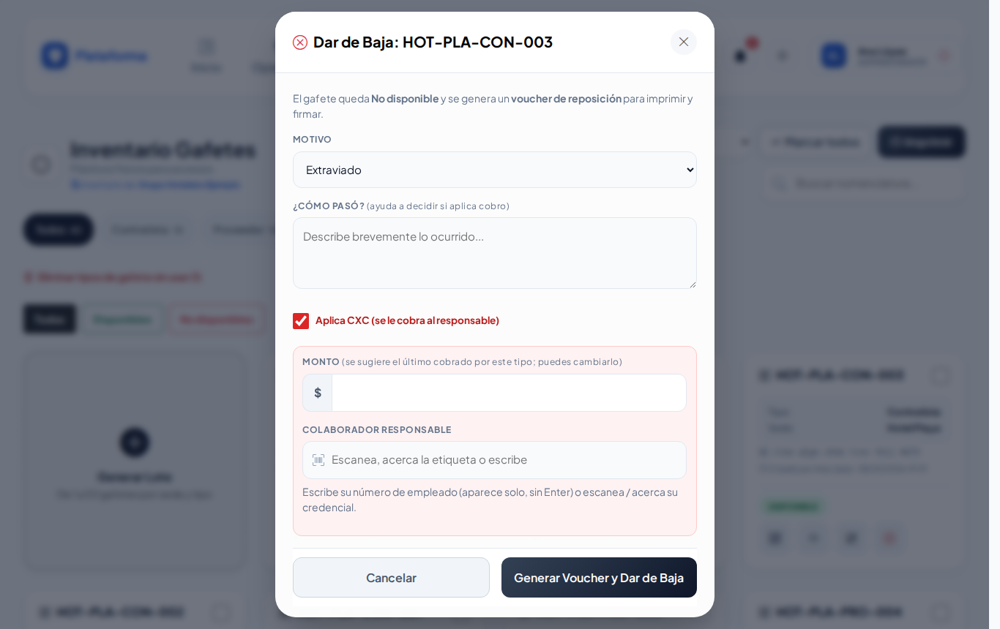

El gafete queda **NO DISPONIBLE** y arriba aparece el folio del voucher con el botón **Imprimir voucher** (3 copias en una hoja para firmar). Todos los vouchers quedan en [Vouchers de reposición](vouchers.md).

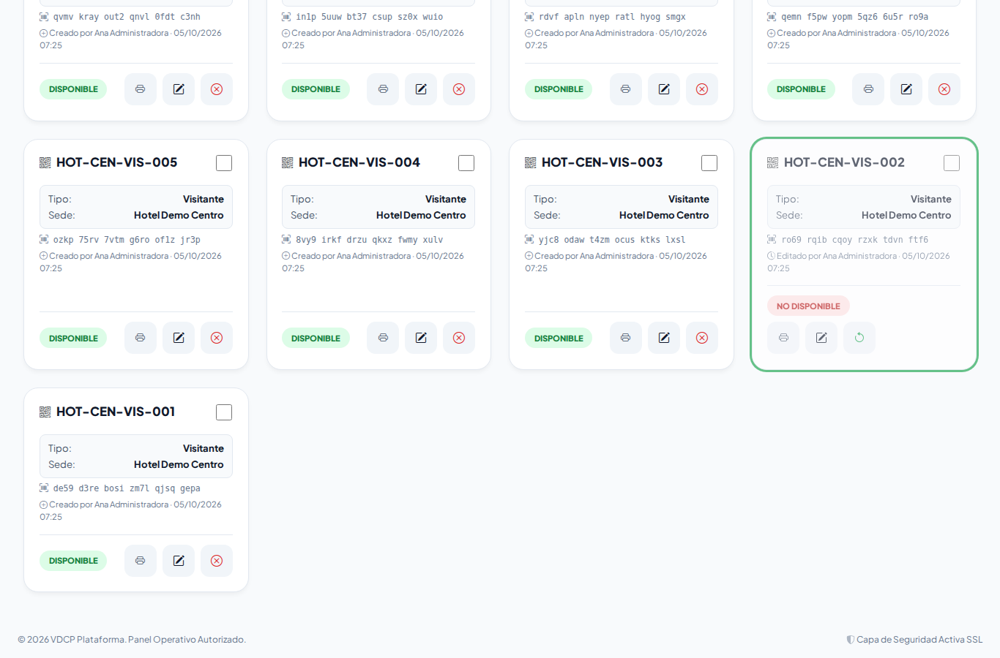

## Reactivar

Si el gafete aparece, toca la **flecha verde** de su ficha y confirma. Vuelve a **DISPONIBLE**; el voucher no se borra.

## Quién puede qué

- **Agente**: consulta los gafetes de su sede y los encuentra con el lector; no genera, no edita, no da de baja ni imprime.
- **Asistente y Supervisor**: generan, editan e imprimen en su sede.
- **Jefe de seguridad**: además da de baja con voucher y reactiva, en su sede.
- **Administrador**: todo, en todas las sedes.

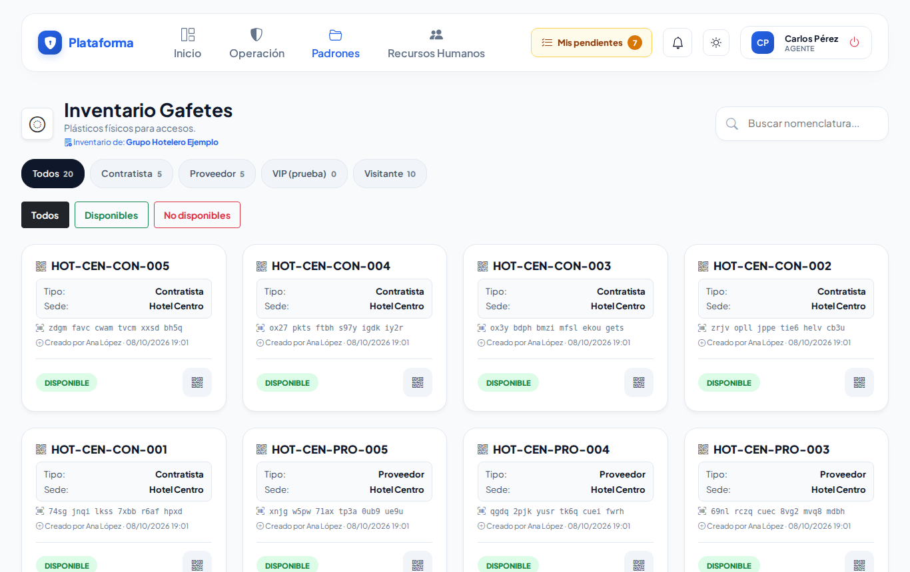

## En el celular, al sol y de noche

En el celular la lista queda en una columna y las ventanas ocupan toda la pantalla; casillas y botones son grandes para el dedo. El botón del sol/luna cambia a **Sol** (alto contraste, para exteriores) o **Noche** (oscuro).

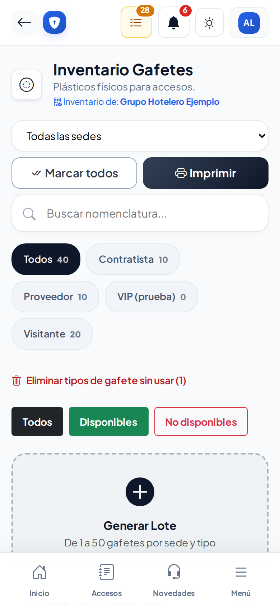
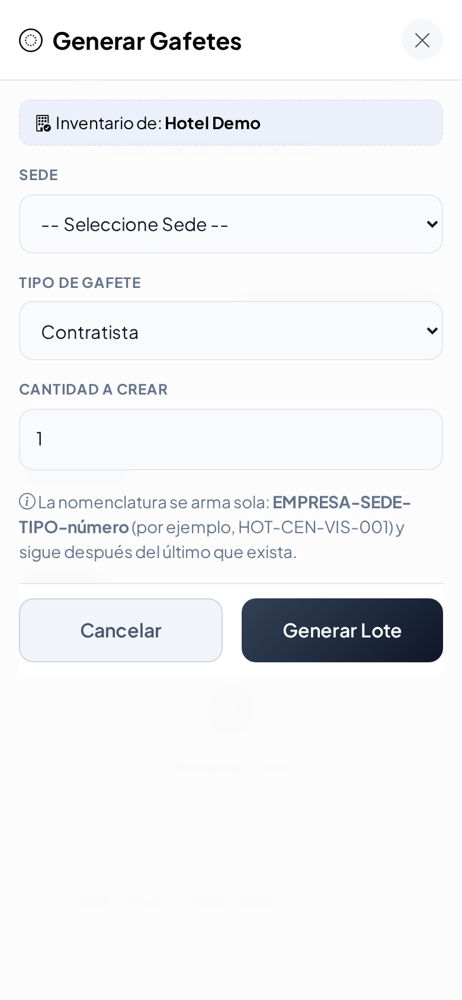
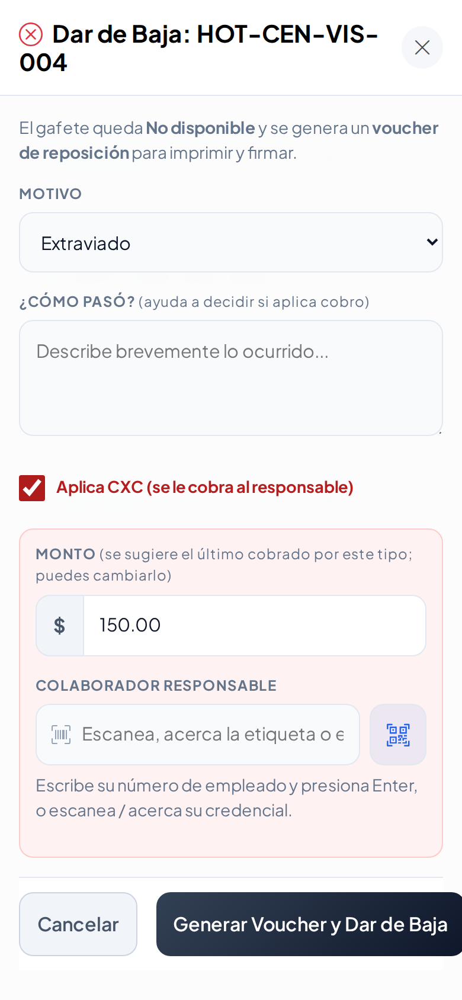
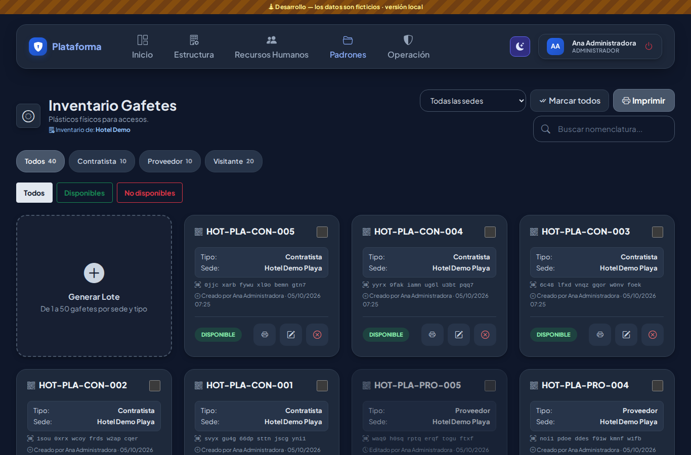
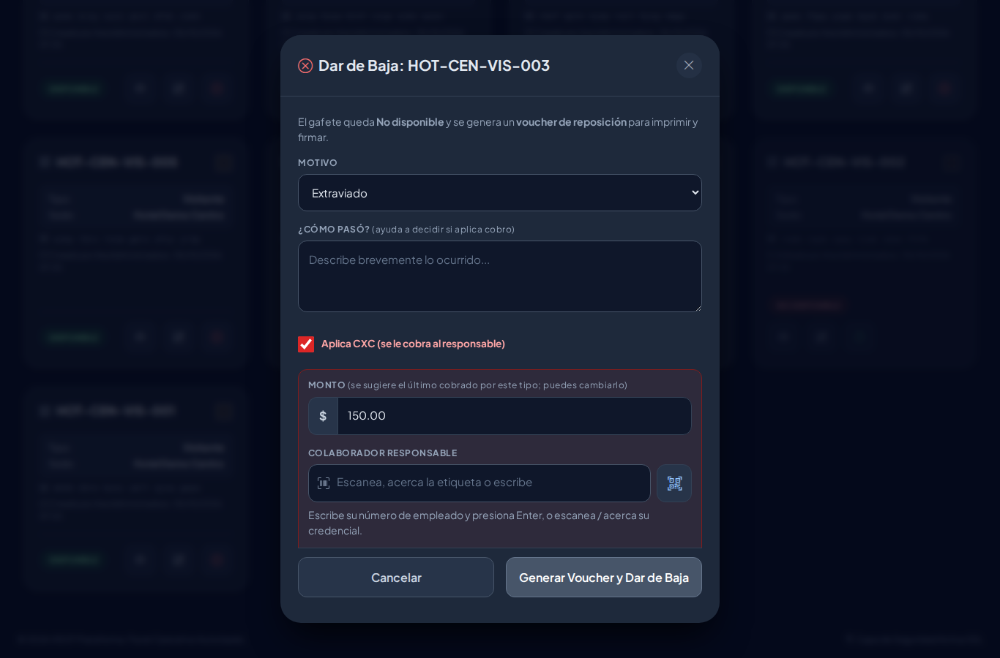
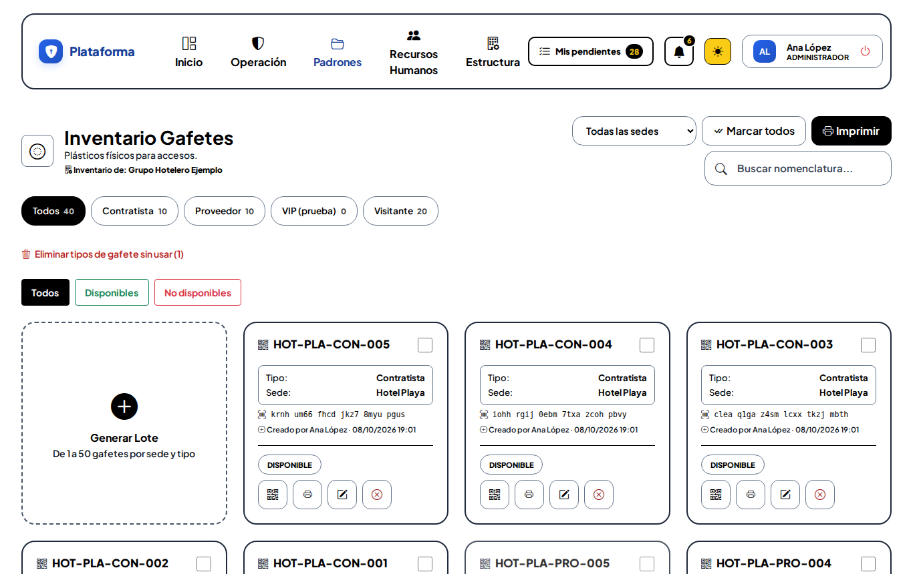

## Ronda 6

- **Generar lote**: bajo **Cantidad a Crear** se ve el límite: **Máximo 50 por lote**. Si necesitas más, genera otro lote.
- Al editar un gafete, el **folio** avisa si ya existe. Al acercar o escribir la **etiqueta NFC** (en la edición o en el botón QR → «Código e identificación»), aparece en el acto si ya la tiene otro registro, por ejemplo «ya la tiene la llave «HDC-101»».

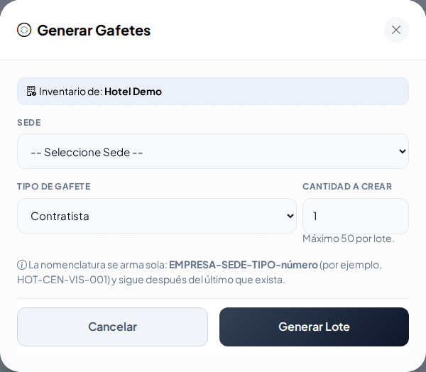

