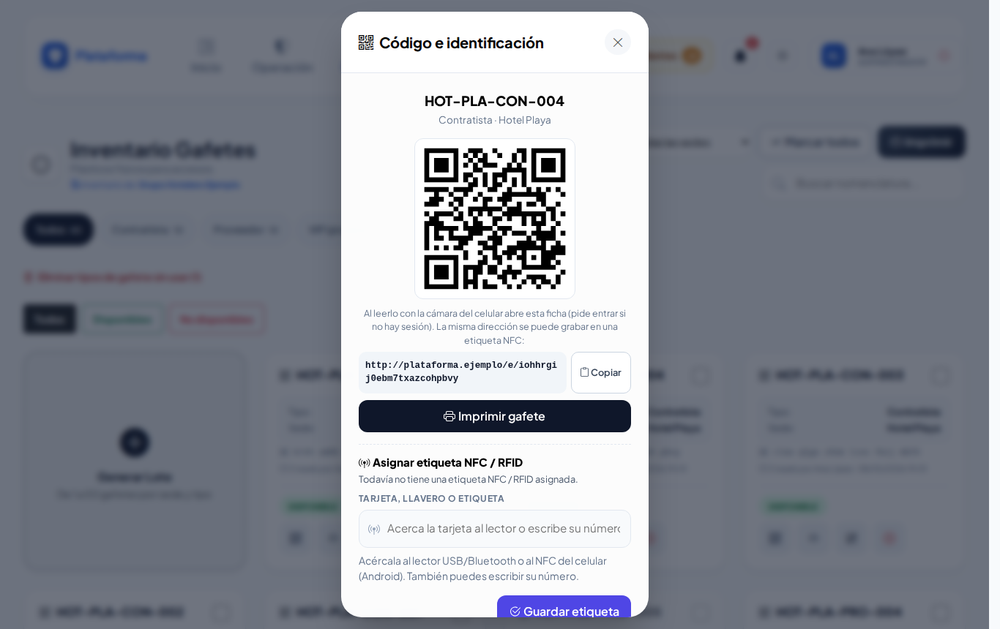
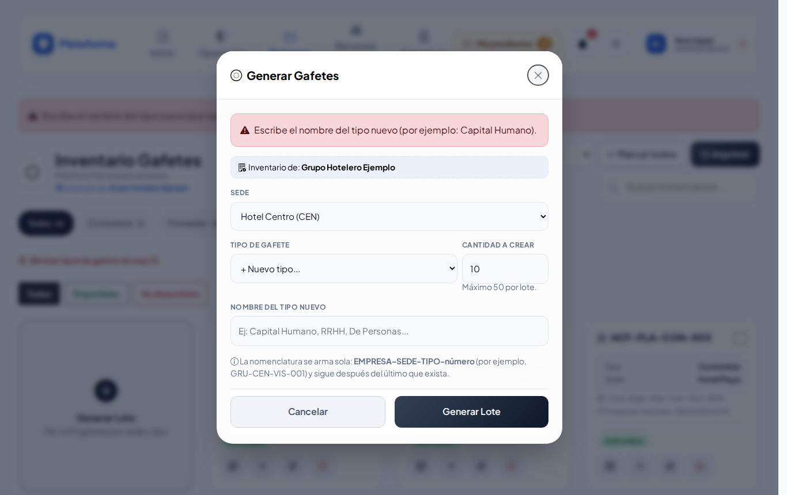

# Gafetes

**¿Para qué sirve?** Aquí están los gafetes de plástico que la caseta presta a visitantes, proveedores y contratistas. Cada gafete tiene un nombre corto (su **nomenclatura**, por ejemplo `HOT-CEN-VIS-001`) y un **código QR** para encontrarlo rápido con el lector.

## Antes de empezar

- Para ver la pantalla tu rol debe poder consultar *Gafetes*. Si no aparece en el menú, pide el permiso a tu administrador.
- Para generar, editar, imprimir o dar de baja necesitas esos permisos. Si no ves **Generar Lote**, tu rol solo consulta (como el agente de caseta).
- Solo ves los gafetes de **tus sedes**.

## Cómo leer una ficha

- La **nomenclatura** en grande y la casilla para marcarlo a imprimir.
- El **Tipo** (Visitante, Proveedor, Contratista o los que agregue tu empresa) y la **Sede**.
- El **código interno** (lo que lleva el QR) y, si tiene chip, su **NFC / RFID**.
- Quién lo creó o lo editó y cuándo.
- Abajo, el estado: **DISPONIBLE** (verde) o **NO DISPONIBLE** (rojo: se perdió, se dañó o lo robaron).

## Cómo encontrar un gafete

1. Entra a **Padrones → Gafetes**.
2. Escribe en **Buscar nomenclatura...** una parte del nombre (por ejemplo `vis-01`), el tipo o la sede.
3. Toca un tipo (por ejemplo **Visitante**) para ver solo ese; el número dice cuántos hay. **Todos** los vuelve a mostrar.
4. Si tienes varias sedes, usa **Todas las sedes**.
5. Toca **Todos**, **Disponibles** o **No disponibles**.

**Qué debes ver:** solo los gafetes que coinciden. Los filtros se recuerdan mientras la pestaña siga abierta.

## Cómo generar gafetes nuevos (lote)

1. Toca la tarjeta **Generar Lote**. Se abre **Generar Gafetes**.
2. Elige la **Sede** donde se van a usar.
3. Elige el **Tipo de Gafete**. Si no está, elige **+ Nuevo tipo...** y escribe el **Nombre del tipo nuevo** (por ejemplo «Capital Humano»).
4. Escribe la **Cantidad a Crear** (máximo 50 por lote).
5. Toca **Generar Lote**.

**Qué debes ver:** «Lote de 10 gafetes generado correctamente (…). Márcalos y presiona «Imprimir».»

La nomenclatura se arma sola: **EMPRESA-SEDE-TIPO-número**. Por ejemplo, sede Centro (`CEN`), tipo Visitante: `HOT-CEN-VIS-001`, `HOT-CEN-VIS-002`… Si ya existían hasta el `010`, el siguiente lote empieza en `011`.

## Cómo imprimir gafetes

1. Marca la casilla de cada gafete, o toca **Marcar todos** (marca solo los que se ven con el filtro actual; tócalo otra vez para desmarcar).
2. Toca **Imprimir** (muestra cuántos llevas). Se abre otra pestaña: **Impresión Doble Vista (Libro)**.
3. Toca **Imprimir Selección**. **Volver al inventario** te regresa.
4. Recorta cada gafete por el borde exterior y **dóblalo por la línea punteada**: de un lado queda el tipo con su color y del otro el QR con la nomenclatura. Mételo en la mica.

Para imprimir uno solo, toca el botón de la **impresora** en su ficha.

## Cómo editar un gafete

1. Toca el **lápiz** (Editar nomenclatura, tipo y etiqueta). Se abre **Editar Gafete**.
2. Puedes cambiar la **Nomenclatura** (no puede repetirse en tu empresa) y el **Tipo de Gafete** (o crear uno nuevo).
3. El **Código Interno** no cambia nunca: es el que va en el QR.
4. Toca **Guardar Cambios**.

**Qué debes ver:** «Gafete … actualizado correctamente.»

### Avisos mientras escribes la nomenclatura

- **Verde:** «Folio disponible.»
- **Rojo:** ya existe un gafete con ese folio. Si está dado de baja y puedes reactivarlo, aparece **Reactivar**.
- **Amarillo:** «Se parece a un folio ya registrado (los guiones y espacios no cuentan):».

## Cómo asignar una tarjeta NFC / RFID al gafete

1. Toca el botón del **código QR** de la ficha. Se abre **Código e identificación**.
2. En **Asignar etiqueta NFC / RFID** acerca el chip o la tarjeta del gafete al lector (o escribe su número).
3. Toca **Guardar etiqueta**.

**Qué debes ver:** «Etiqueta … asignada. Ya se puede leer con el lector.» Si ese número ya lo tiene otra cosa, el aviso te dice cuál (por ejemplo «ya la tiene la llave «HDC-101»») y no se asigna.

## Cómo dar de baja un gafete (se perdió, se dañó o lo robaron)

1. Toca la **X roja** (Dar de baja) de la ficha. Se abre **Dar de Baja: …**.
2. Elige el **Motivo**: Extraviado, Dañado o Robado.
3. Escribe **¿Cómo pasó?** (ayuda a decidir si se cobra).
4. Si se le va a cobrar a alguien, marca **Aplica CXC (se le cobra al responsable)**:
   - **Monto:** se sugiere el último cobrado por ese tipo de gafete; puedes cambiarlo.
   - **Colaborador Responsable:** escribe su número de empleado (aparece solo, sin Enter) o escanea su credencial.
5. Toca **Generar Voucher y Dar de Baja**.

**Qué debes ver:** el gafete en **NO DISPONIBLE** y arriba el folio del voucher con el botón **Imprimir voucher**. Todos los vouchers quedan en [Vouchers de reposición](vouchers.md).

## Cómo reactivar un gafete

Si el gafete aparece, toca la **flecha circular** (Reactivar) de su ficha y confirma con **Aceptar**. Vuelve a **DISPONIBLE**; el voucher no se borra.

## Lo que ve el agente de caseta

El agente consulta los gafetes de su sede y los encuentra con el lector, pero no genera, edita, imprime ni da de baja.

## En el celular y en los modos Noche y Sol

## Si algo sale mal

Los mensajes salen en rojo dentro de la ventana; lo que escribiste se conserva.

| Mensaje o síntoma | Qué significa | Qué hacer |
|---|---|---|
| Elige la sede donde se usarán los gafetes. | No elegiste sede. | Elige la sede. |
| Escribe el nombre del tipo nuevo (por ejemplo: Capital Humano). | Elegiste «+ Nuevo tipo...» sin escribir el nombre. | Escribe el nombre del tipo. |
| La cantidad debe ser de 1 a 50. | Pediste más de 50 o cero. | Genera varios lotes de máximo 50. |
| Elige una sede activa de la lista (solo puedes generar gafetes para tus sedes). | Esa sede no es tuya o está desactivada. | Elige una de tus sedes. |
| La nomenclatura es obligatoria. | La dejaste vacía al editar. | Escribe la nomenclatura. |
| La nomenclatura solo lleva letras, números, guiones, puntos o diagonales. | Escribiste signos o espacios. | Quita los signos. |
| Ya existe un gafete con la nomenclatura «…» en esta empresa. | Ese nombre ya se usa. | Usa otro o reactiva el existente. |
| Indica el monto a cobrar. / Elige al responsable al que se le cobrará. | Marcaste *Aplica CXC* sin monto o sin responsable. | Complétalos o desmarca la casilla. |
| No marcaste ningún gafete para imprimir. Marca las casillas de los gafetes (o «Marcar todos») y presiona «Imprimir». | Tocaste **Imprimir** sin marcar. | Marca las casillas. |

## Preguntas frecuentes

**¿Puedo generar más de 50 gafetes?** Sí, en varios lotes. Cada lote sigue la numeración del anterior.

**¿Cambia el QR si cambio la nomenclatura?** No. El QR usa el código interno, que nunca cambia.

**¿Se borra un gafete dado de baja?** No. Queda **NO DISPONIBLE** con su voucher, y lo puedes reactivar si aparece.

**¿Para qué sirve el tipo «+ Nuevo tipo...»?** Para crear tipos de gafete propios de tu empresa (por ejemplo «Capital Humano»). El tipo nuevo queda disponible para los siguientes lotes.

## Relacionado

- [Vouchers de reposición](vouchers.md)
- [Bitácora de accesos](accesos.md)
- [Etiquetas QR](etiquetas-qr.md)
