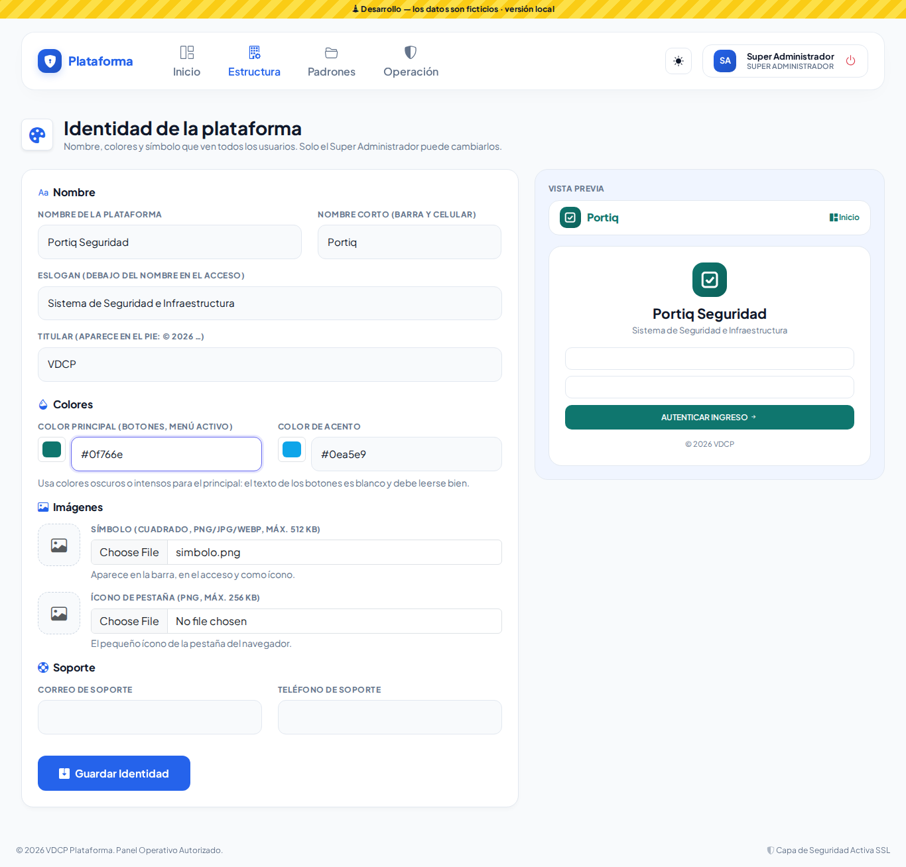

# Identidad de la plataforma (Super Administrador)

**Estructura → Plataforma → Identidad de la plataforma**

1. Escribe el **nombre** completo y el **nombre corto**, que es el que se ve en la barra y en el celular.
2. Ajusta el **eslogan** y el **titular** del pie de página.
3. Elige los **colores** con el cuadro de color o escribiendo el código (por ejemplo `#2563eb`). Usa un color principal oscuro o intenso, porque el texto de los botones es blanco.
4. Sube el **símbolo**: una imagen cuadrada en PNG, JPG o WEBP, de preferencia blanca con fondo transparente. Si lo deseas, sube también el **ícono de pestaña**.
5. Revisa la **vista previa** de la derecha: se actualiza mientras escribes.
6. Pulsa **Guardar Identidad**. El cambio se ve de inmediato en todas las pantallas, incluida la de acceso.

Para volver a lo predeterminado, marca **Quitar y usar el predeterminado** debajo de la imagen.
