# Entrar y moverse en la plataforma

## Entrar

1. Abre la dirección de la plataforma en tu navegador o celular.
2. Escribe tu **usuario o tu correo** y tu **contraseña**. El ojo a la derecha muestra u oculta lo que escribes.
3. Toca **Autenticar Ingreso**.

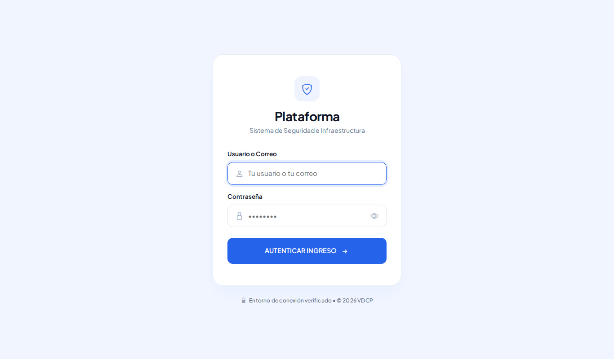

Si algo sale mal verás un aviso:

| Aviso | Qué significa | Qué hacer |
|---|---|---|
| Datos de acceso incorrectos | Usuario o contraseña equivocados | Revisa mayúsculas y vuelve a intentar |
| Cuenta bloqueada temporalmente | 5 intentos fallidos seguidos | Espera los minutos que indica (15) o pide a tu administrador o jefe de seguridad que **desbloquee** tu cuenta |
| Sesión finalizada por seguridad | Pasaron 20 minutos sin actividad | Vuelve a entrar |
| Tu cuenta no está activa | Tu usuario fue desactivado | Consulta a tu administrador |

## La pantalla principal

**En computadora**, la barra de arriba tiene *Inicio* y los menús **Estructura**, **Padrones** y **Operación**. Solo ves lo que tu rol tiene permitido. A la derecha: el botón de **modo de pantalla**, tu nombre, tu rol y el botón rojo para **cerrar sesión**.

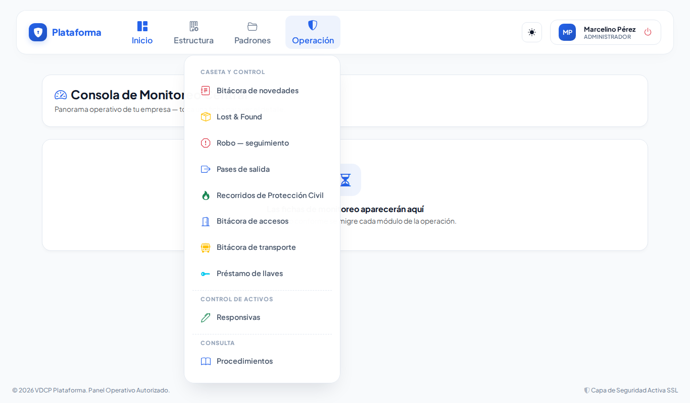

**En celular**, abajo tienes *Inicio*, *Novedades*, *Accesos* y **Menú**, que abre el menú completo por grupos (Operación primero). Todos los grupos aparecen **cerrados**: toca el que necesites para abrirlo. El grupo de la pantalla en la que estás se ve resaltado en color.

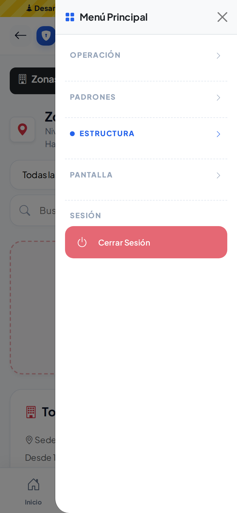

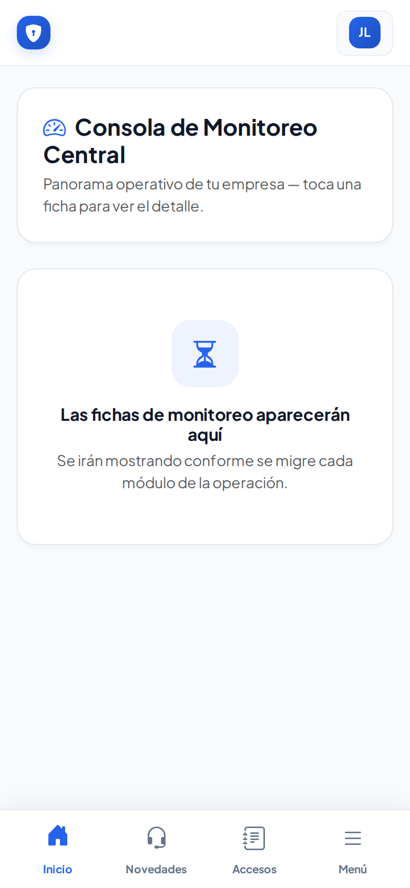 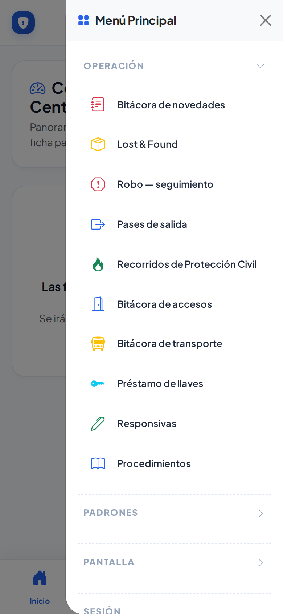

## Modo de pantalla: Normal, Sol y Noche

El botón junto a tu nombre (en celular, junto a tus iniciales arriba a la derecha, o en *Menú → Pantalla*) cambia cómo se ve la plataforma. Cada toque pasa al siguiente modo:

| Modo | Botón | Para qué |
|---|---|---|
| **Normal** | sol de contorno | Uso en oficina |
| **Sol** | sol relleno, botón amarillo | Exteriores a pleno sol: blanco y negro, bordes gruesos, letra más marcada |
| **Noche** | luna, botón morado | Turnos nocturnos: fondo oscuro que no deslumbra |

El modo se recuerda en ese equipo o celular, también en la pantalla de acceso. Si antes usabas el *alto contraste*, ahora entras directo en modo **Sol**.

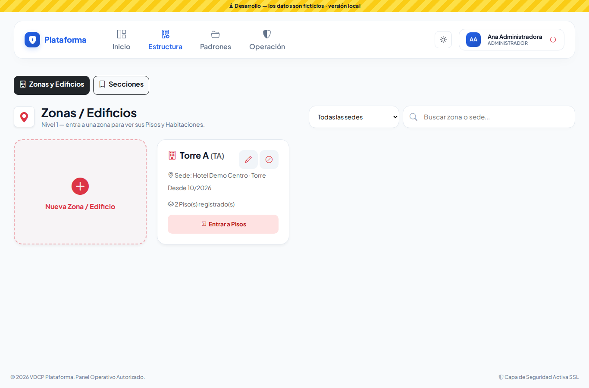
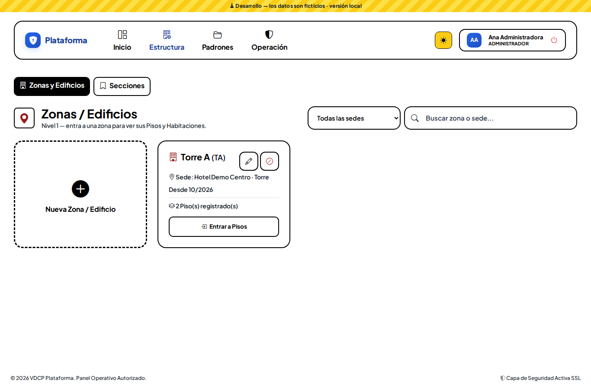
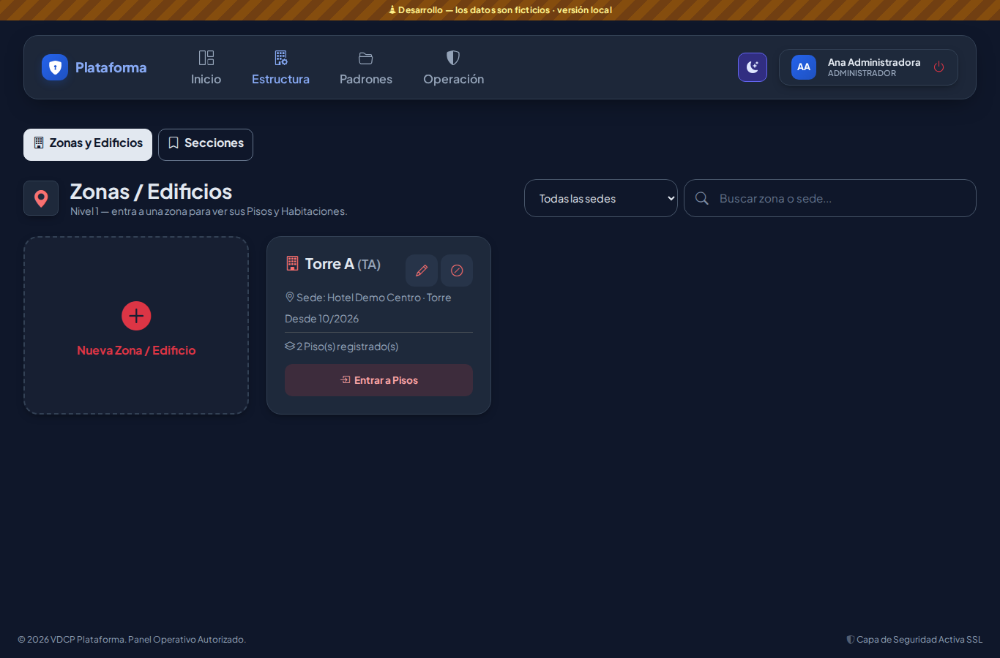

Las ventanas de captura y la pantalla de acceso también se adaptan:

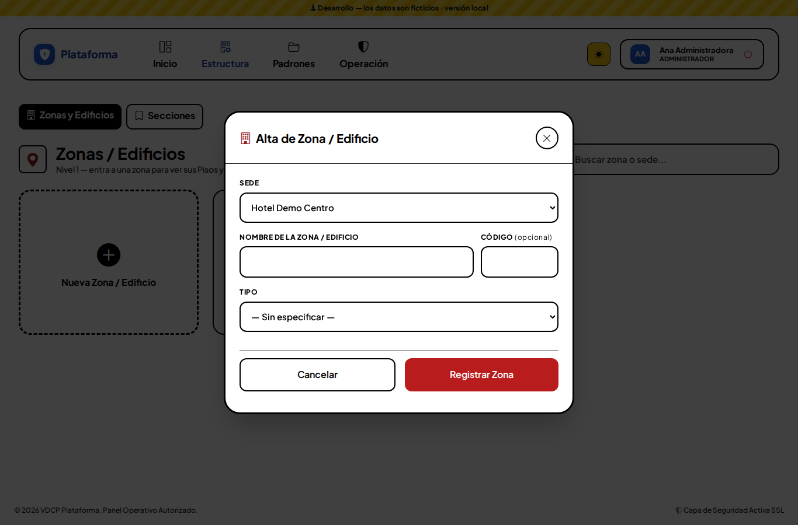
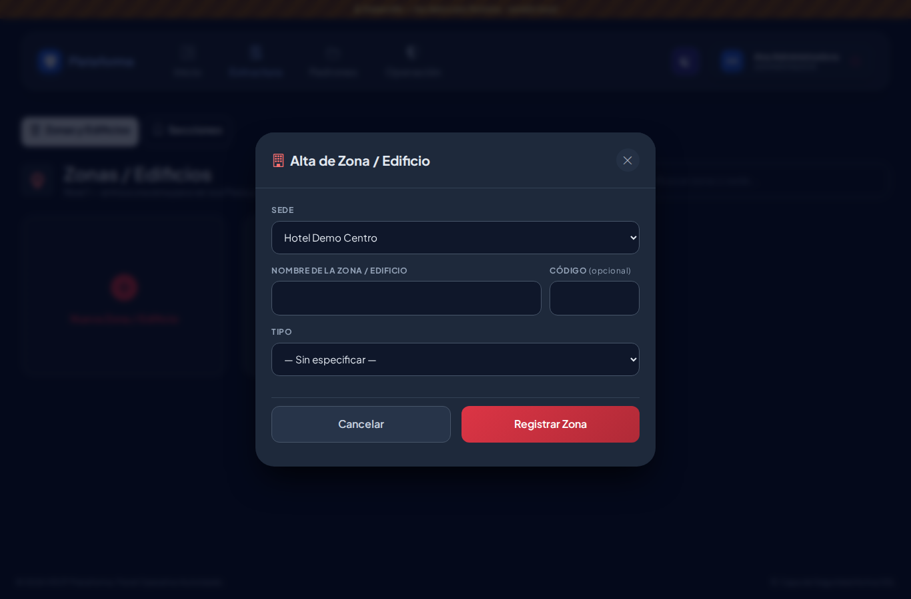
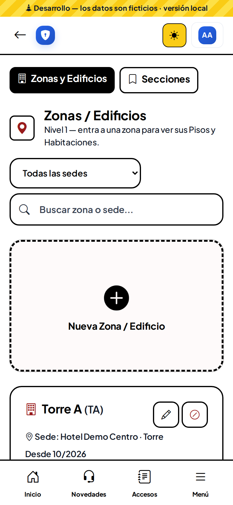 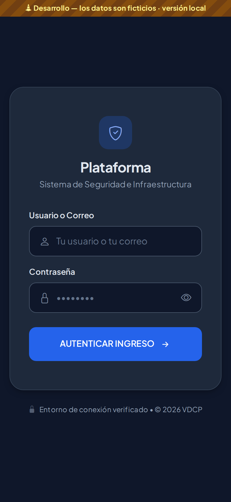

## Cierre automático

Si dejas la pantalla sin usar, 2 minutos antes de que se cierre aparece **"Tu sesión está por cerrarse"**. Toca **Sí, seguir aquí** para continuar. Mientras estés escribiendo o usando la pantalla, la sesión no se cierra.

## Módulos en migración

Mientras un módulo se migra, al abrirlo verás el aviso **"Este módulo se está migrando"**. Sigue disponible en el sistema actual.
