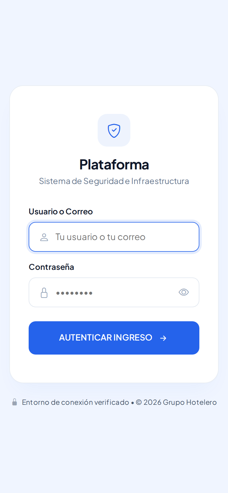
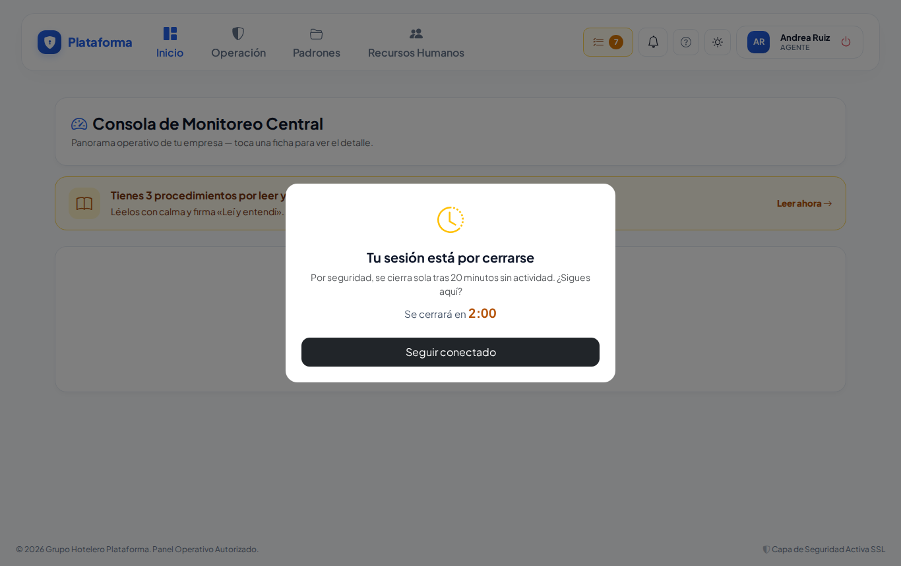
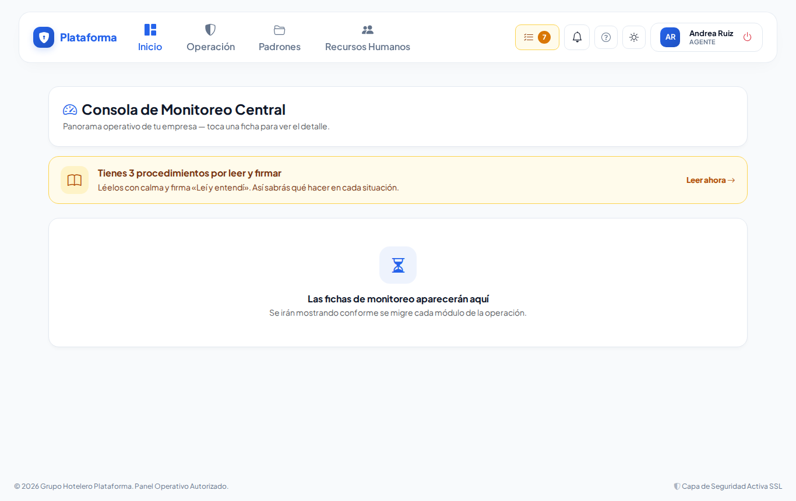
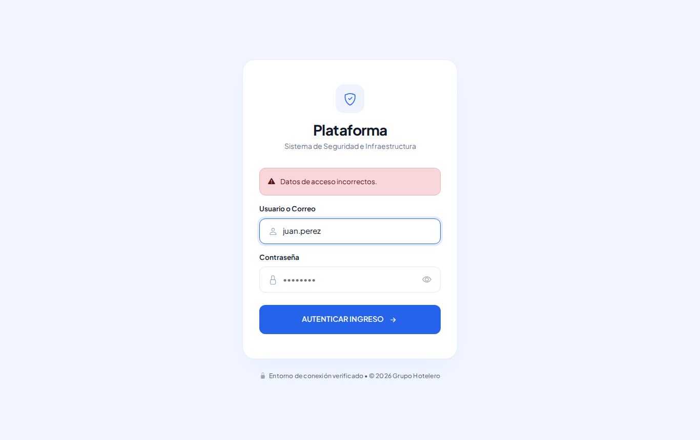

# Entrar y salir de la plataforma

**¿Para qué sirve?** Para que solo tú uses tu cuenta. Todo lo que registras queda a tu nombre, por eso nunca compartas tu usuario ni tu contraseña.

**Antes de empezar:** necesitas tu **usuario** (o tu correo) y tu **contraseña**. Te los da tu administrador de la plataforma.

## Cómo entrar

1. Abre **la dirección de tu plataforma** en el navegador de tu computadora o celular.
2. En **Usuario o Correo** escribe tu usuario (por ejemplo `juan.perez`) o tu correo.
3. En **Contraseña** escribe tu contraseña. El **ojo** de la derecha muestra u oculta lo que escribes, para revisar que esté bien.
4. Toca **Autenticar Ingreso**.

**Qué debes ver:** la pantalla de **Inicio** con tus menús y tu nombre arriba a la derecha.

En el celular es igual; los botones son grandes para tocarlos con el dedo:

## Cómo salir

1. En la computadora, toca el botón rojo de **apagar** junto a tu nombre (arriba a la derecha).
2. En el celular, toca **Menú** (abajo a la derecha) y al final toca **Cerrar Sesión**.

**Qué debes ver:** la pantalla para entrar. Hazlo siempre al terminar tu turno, sobre todo en computadoras compartidas.

## Cómo seguir conectado (cierre automático)

Por seguridad, la sesión se cierra sola después de **20 minutos sin usarla**.

1. Dos minutos antes aparece la ventana **«Tu sesión está por cerrarse»** con una cuenta regresiva.
2. Si sigues trabajando, toca **Seguir conectado**.

**Qué debes ver:** la ventana se cierra y sigues en la misma pantalla.

- Mientras escribes o usas la pantalla, la sesión no se cierra.
- Si tienes varias pestañas abiertas, basta con usar una.
- Si se cerró, la plataforma te lleva a entrar con el aviso **«Sesión finalizada por seguridad»**. Solo vuelve a entrar.

## Si algo sale mal

| Mensaje o síntoma | Qué significa | Qué hacer |
|---|---|---|
| **Datos de acceso incorrectos.** | El usuario o la contraseña no coinciden. | Revisa mayúsculas y minúsculas con el ojo y vuelve a intentar. |
| **Demasiados intentos fallidos. Esta cuenta está bloqueada temporalmente…** | Se escribió mal la contraseña 5 veces seguidas. | Espera los minutos que indica o pide a tu administrador o jefe de seguridad que **desbloquee** tu cuenta. |
| **Sesión finalizada por seguridad.** | Pasaron 20 minutos sin usar la plataforma. | Vuelve a entrar. |
| **Tu cuenta no está activa. Consulta a tu administrador.** | Tu usuario fue dado de baja. | Habla con tu administrador. |
| Olvidé mi contraseña | — | Pide a tu administrador que te asigne una nueva. |

## Preguntas frecuentes

- **¿Puedo entrar con mi correo?** Sí, en el mismo campo de usuario.
- **¿Puedo entrar desde dos equipos a la vez?** Sí, pero cierra la sesión en el que ya no uses.
- **¿Por qué me sacó si estaba leyendo?** Solo leer no cuenta como actividad después de 20 minutos; toca **Seguir conectado** cuando salga el aviso.
- **¿La plataforma recuerda el modo Sol o Noche?** Sí, en ese mismo equipo, incluso en la pantalla para entrar.

## Relacionado

- [Primeros pasos](primeros-pasos.md)
- [Menús, Mis pendientes y modos de pantalla](menus.md)
