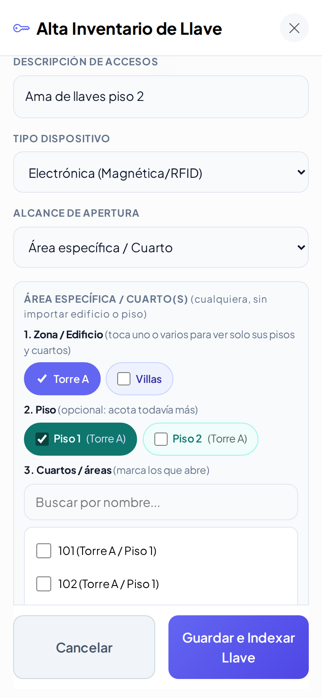
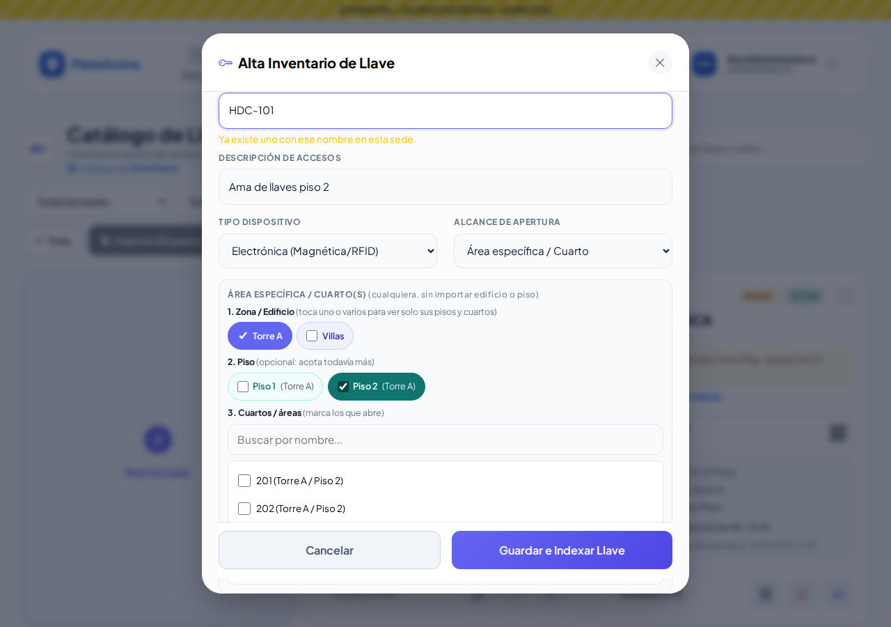
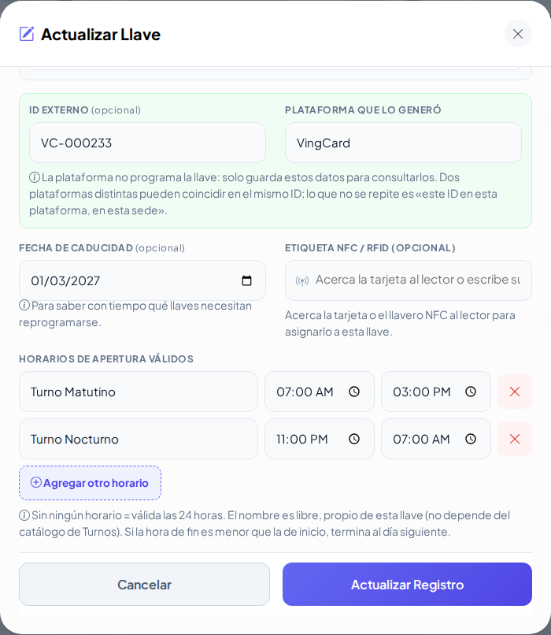
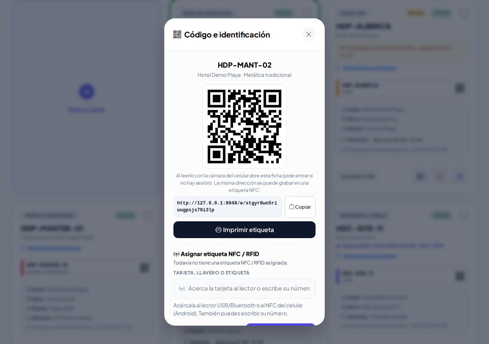
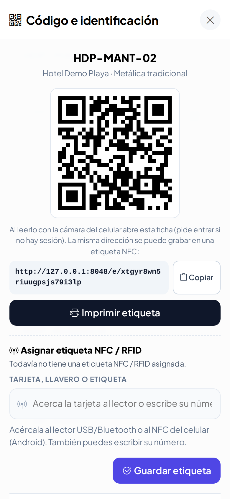
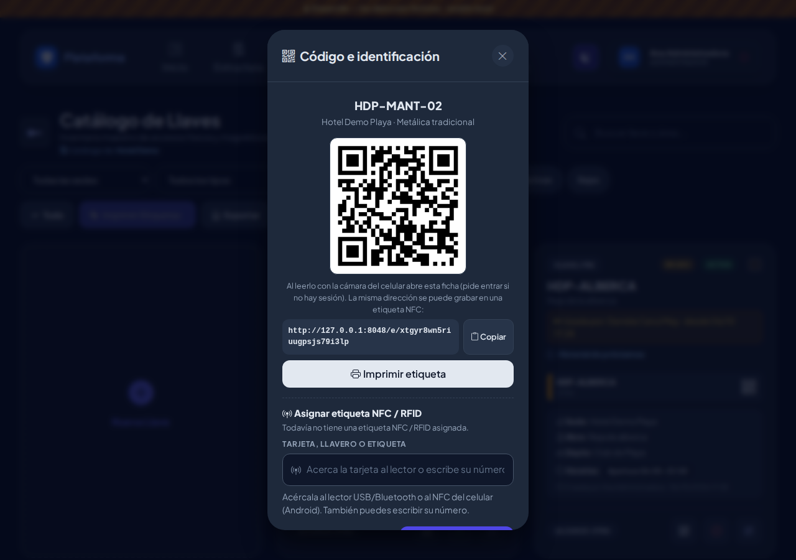
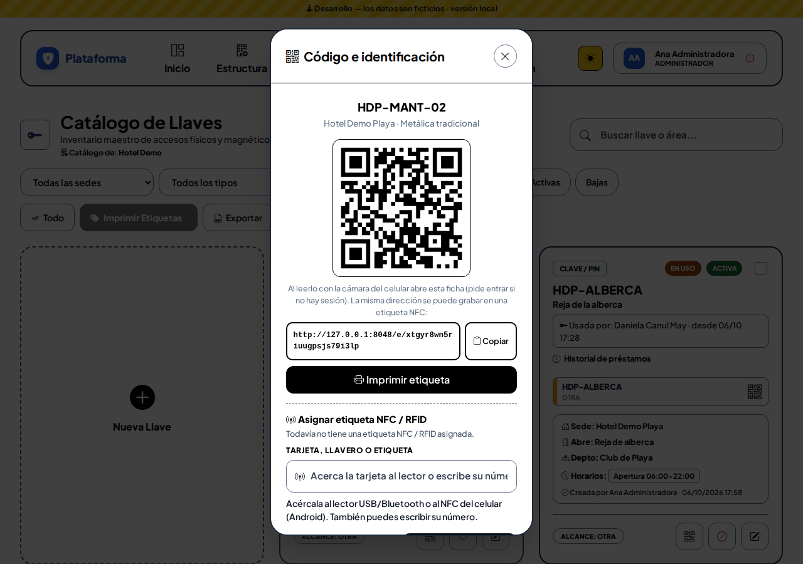
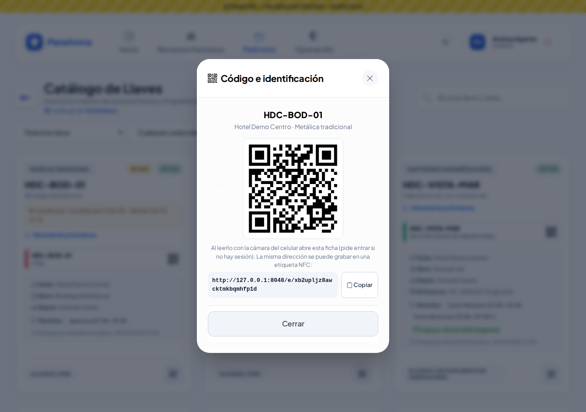
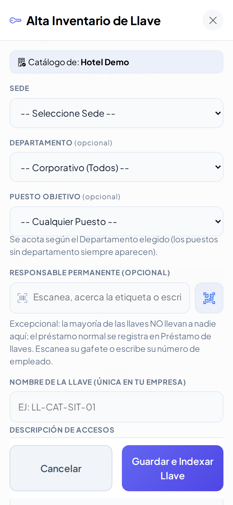

# Catálogo de Llaves

Seguridad → Padrones → **Catálogo de llaves**. Aquí está el inventario de todas las llaves de tus sedes: llaves metálicas, tarjetas electrónicas, accesos con huella y claves. Para cada llave se anota **qué abre**, **en qué horario** sirve y **hasta cuándo** es válida. Cada llave tiene una **etiqueta con código QR** para su llavero.

> El préstamo diario de llaves (quién se la llevó y cuándo la regresó) se registra en **[Préstamo de llaves](prestamo-llaves.md)**, no aquí. Mientras una llave está prestada, su ficha muestra **EN USO** y **Usada por**; el enlace **Historial de préstamos** abre sus movimientos.

## Cómo leer una ficha

- Arriba a la izquierda, el **tipo de dispositivo**; a la derecha, **ACTIVA** o **BAJA** y la casilla para marcarla a imprimir.
- El **nombre** de la llave (por ejemplo `HDC-P1-AMA`) y la descripción de lo que abre.
- Una vista previa de la etiqueta. El color de la barra indica el tipo: **verde** electrónica, **rojo** metálica, **morado** biométrica, **ámbar** clave.
- **Sede**, **Abre** (los lugares), departamento, ID externo y **Horarios** (si no tiene, dice "24 horas (todos)").
- **Caduca**: en verde si está vigente, en ámbar si **vence pronto** (30 días o menos) y en rojo si ya está **VENCIDA**.
- Abajo, el **Alcance** y los botones: dar de baja (círculo rojo), reactivar (flecha verde) y editar (lápiz).

## Buscar y filtrar

- Escribe en **Buscar llave o área...** el nombre, la descripción, un lugar (por ejemplo `101` o `Torre A`), el departamento o el responsable.
- Usa las listas **Sede**, **Tipo** y **Caducidad**, y los botones **Todas / Activas / Bajas**.
- Los filtros se recuerdan mientras la pestaña siga abierta.

## Registrar una llave

1. Toca **Nueva Llave**.
2. Elige la **Sede**. Departamento y Puesto objetivo son opcionales (el puesto se acota según el departamento).
3. **Responsable Permanente** solo en casos excepcionales: escanea el gafete del colaborador o escribe su número de empleado.
4. Escribe el **Nombre de la Llave**. Debajo verás si ya existe otra con ese nombre **en la misma sede** («Ya existe uno con ese nombre en esta sede.»). Dos sedes distintas sí pueden tener una llave con el mismo nombre (por ejemplo `HDC-101` en Centro y en Playa).
5. Escribe la **Descripción de Accesos** (qué abre).
6. Elige el **Tipo Dispositivo** y el **Alcance de Apertura**. Según el alcance aparece la lista de lugares de esa sede, tomada de **Zonas y áreas**:
   - **Global (Master Key)**: abre todo; no pide nada más.
   - **Edificio / Zona completa**: marca uno o varios edificios.
   - **Piso**: primero toca el **edificio** (1) y solo verás sus pisos (2); marca los que abre.
   - **Área específica / Cuarto**: toca el **edificio** (1), luego el **piso** (2) y solo verás los cuartos de ese piso (3). Marca los que abre.
   - **Sección (grupo de habitaciones)**: marca las secciones.
   - **Otra**: escribe el lugar (por ejemplo "Cuarto de máquinas").

   Si no tocas ningún edificio ni piso, se ven todos los lugares de la sede. Puedes tocar varios: se suman. Lo que ya marcaste nunca se esconde.
7. En llaves electrónicas, biométricas o de clave puedes anotar el **ID Externo** y la **Plataforma** que lo generó (VingCard, Salto…).
8. Opcional: **Fecha de Caducidad**, **Costo de Reposición** y **Etiqueta NFC / RFID** (acerca la tarjeta o llavero al lector).
   - Con un costo y **sin** marcar «Costo variable», al darla de baja se cobra ese monto fijo.
   - Con **Costo variable** marcado, el monto se pregunta en cada baja (el costo escrito solo se sugiere).
9. **Horarios de Apertura Válidos**: nombre, hora de inicio y fin. Usa **Agregar otro horario** o la **X** para quitar. Sin horarios, la llave vale las 24 horas.
10. Toca **Guardar e Indexar Llave**.

Alcance **Piso**: toca el edificio y solo aparecen sus pisos.

Alcance **Área específica**: edificio → piso → cuartos de ese piso.

Si el nombre ya existe en la sede elegida, lo verás al escribirlo:

Si algo falta, la ventana se queda abierta y el aviso rojo dice qué corregir.

## Editar

Toca el lápiz. Si cambias la **sede**, vuelve a marcar los lugares: los de la otra sede ya no aplican.

## Dar de baja (con voucher) y reactivar

1. Toca el **círculo rojo** de la ficha.
2. Elige el **Motivo** (Extraviado, Dañado o Robado) y cuenta **¿Cómo pasó?**.
3. Si se le cobrará a alguien, marca **Aplica CXC**: aparece el **Monto** y el **Colaborador responsable**.
   - Si la llave tiene **costo fijo**, el monto ya viene puesto y no se cambia.
   - Si tiene **costo variable**, viene sugerido y puedes ajustarlo. Si no tiene costo, se sugiere el último cobro de ese tipo de llave.
   - Para el responsable **no hace falta Enter**: escribe su número de empleado (por ejemplo `1009`) y en un momento aparece solo. También puedes escanear su gafete.
4. Elige cómo se firmará el voucher (**Firmas del voucher**):
   - **Firma física** (normal): después imprimes el voucher y Seguridad y el responsable firman a mano. En **Vouchers de reposición** marcas «Registrar firma en papel» (y si quieres, le tomas foto a la hoja).
   - **Firma digital**: firman en la pantalla Seguridad (quien registra) y, si hay responsable, también él.
5. Toca **Generar Voucher y Dar de Baja**. El aviso verde muestra el **folio** del voucher (`VR-…`).

Las copias del voucher son para **Seguridad, Recepción y Administración**; el colaborador no recibe copia. Si hay cobro, las copias se envían por correo a las listas de Configuración.

Para reactivar una llave dada de baja toca la **flecha verde**. El voucher no se borra. Al volver, se abre su **Código e identificación** para que reimprimas la etiqueta o le asignes otra tarjeta NFC/RFID.

## Código e identificación (QR, NFC y RFID)

Toca el ícono de **QR** de cualquier ficha. Se abre una ventana (no otra página) con:

- el **código QR** de la llave (al leerlo con la cámara del celular abre su ficha);
- la **dirección** del código, con el botón **Copiar** (sirve para grabarla en una etiqueta NFC);
- **Imprimir etiqueta**, que abre la hoja para imprimir;
- **Asignar etiqueta NFC / RFID** (solo si puedes editar): acerca la tarjeta o el llavero al lector USB/Bluetooth, o usa el NFC del celular Android. Se guarda sola. Si esa tarjeta ya es de otra llave (o de un vehículo, un gafete…), te dice de cuál.

El agente solo consulta: ve el QR y la dirección, pero no imprime ni asigna etiquetas:

## Imprimir etiquetas

1. Marca la casilla de cada llave (o toca **Todo** para marcar las que se ven con el filtro actual).
2. Toca **Imprimir Etiquetas**: se abre una pestaña con las etiquetas de 6.5 × 3.5 cm listas para mica.
3. Toca **Imprimir Etiquetas** en esa pestaña.

Al escanear el QR con la cámara del celular se abre la ficha de la llave (con tu sesión iniciada).

## Exportar

**Exportar** descarga un archivo para Excel con las llaves que coinciden con los filtros que tengas puestos.

## En el celular y de noche

## Quién puede hacer qué

| Rol | Puede |
|---|---|
| Administrador | Todo, en todas las sedes |
| Jefe de seguridad | Todo, en sus sedes |
| Asistente | Registrar, editar, imprimir y exportar en su sede |
| Supervisor | Igual que el Jefe, sin dar de baja |
| Agente | Solo consultar las llaves de su sede |

