# Catálogo de llaves

**¿Para qué sirve?** Es el inventario de todas las llaves de tus sedes: llaves metálicas, tarjetas electrónicas, accesos con huella y claves. De cada una se anota **qué abre**, **en qué horario** sirve y **hasta cuándo** es válida. Cada llave tiene una **etiqueta con código QR** para su llavero.

> El préstamo diario (quién se llevó la llave y cuándo la regresó) se registra en [Préstamo de llaves](prestamo-llaves.md), no aquí. Mientras una llave está prestada, su ficha muestra **EN USO** y quién la usa; el enlace **Historial de préstamos** abre sus movimientos.

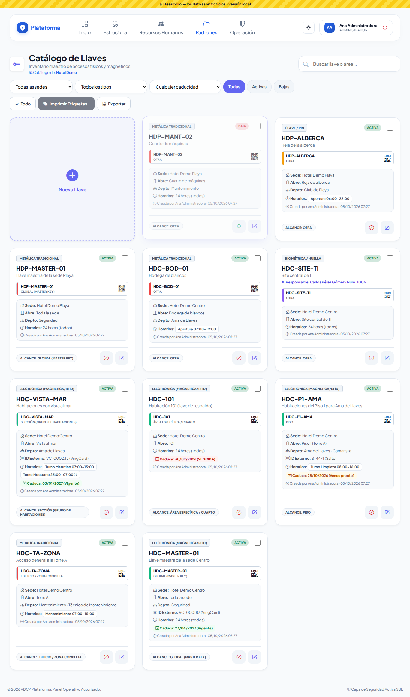

## Antes de empezar

- Para ver la pantalla tu rol debe poder consultar el *Catálogo de llaves*. Si no aparece en el menú, pide el permiso a tu administrador.
- Para registrar, editar, dar de baja, imprimir o exportar necesitas esos permisos. Si no ves **Nueva Llave**, tu rol solo consulta.
- Solo ves las llaves de **tus sedes**.
- Para elegir los lugares que abre una llave, esos lugares deben existir en **Estructura → Zonas y áreas**.

## Cómo leer una ficha

- Arriba, el **tipo de dispositivo** y si está **ACTIVA** o en **BAJA**; la casilla sirve para marcarla a imprimir.
- El **nombre** de la llave (por ejemplo `HDC-P1-AMA`) y lo que abre.
- El color de la barra indica el tipo: **verde** electrónica, **rojo** metálica, **morado** biométrica, **ámbar** clave.
- **Sede**, **Abre** (los lugares), departamento, ID externo y **Horarios** (sin horarios dice «24 horas (todos)»).
- **Caduca:** verde si está vigente, ámbar si **vence pronto** (30 días o menos) y rojo si ya está **VENCIDA**.

## Cómo encontrar una llave

1. Entra a **Padrones → Catálogo de llaves**.
2. Escribe en **Buscar llave o área...** el nombre, lo que abre, un lugar (por ejemplo `101` o `Torre A`), el departamento o el responsable.
3. Usa las listas **Todas las sedes**, **Todos los tipos** y **Cualquier caducidad**.
4. Toca **Todas**, **Activas** o **Bajas**.

**Qué debes ver:** solo las llaves que coinciden. Los filtros se recuerdan mientras la pestaña siga abierta.

## Cómo registrar una llave

1. Toca la tarjeta **Nueva Llave**. Se abre **Alta Inventario de Llave**.
2. Elige la **Sede**. **Departamento** y **Puesto Objetivo** son opcionales (el puesto se acota según el departamento).
3. **Responsable Permanente (opcional):** solo en casos excepcionales. Escanea el gafete del colaborador o escribe su número de empleado.
4. Escribe el **Nombre de la Llave (Único en su sede)**. Debajo verás si está disponible (ver «Avisos mientras escribes»).
5. Escribe la **Descripción de Accesos** (qué abre).
6. Elige el **Tipo Dispositivo** y el **Alcance de Apertura**:
   - **Global (Master Key):** abre todo; no pide nada más.
   - **Edificio / Zona completa:** marca uno o varios edificios.
   - **Piso:** toca primero el **edificio** y verás solo sus pisos; marca los que abre.
   - **Área específica / Cuarto:** toca el **edificio**, luego el **piso**, y marca los cuartos.
   - **Sección (grupo de habitaciones):** marca las secciones.
   - **Otra:** escribe el lugar en **Especificar Espacio** (por ejemplo «Cuarto de máquinas»).
7. En llaves electrónicas, biométricas o de clave puedes anotar el **ID Externo** y la **Plataforma que lo generó** (VingCard, Salto…).
8. Opcional: **Fecha de Caducidad**, **Costo de Reposición** (con la casilla de costo variable si el monto cambia en cada baja) y **Etiqueta NFC / RFID** (acerca la tarjeta o el llavero al lector).
9. En **Horarios de Apertura Válidos** escribe nombre, hora de inicio y hora de fin (24 horas, por ejemplo `07:00` y `15:00`). Usa **Agregar otro horario** o la **X** para quitar. Sin horarios, la llave vale las 24 horas.
10. Toca **Guardar e Indexar Llave**.

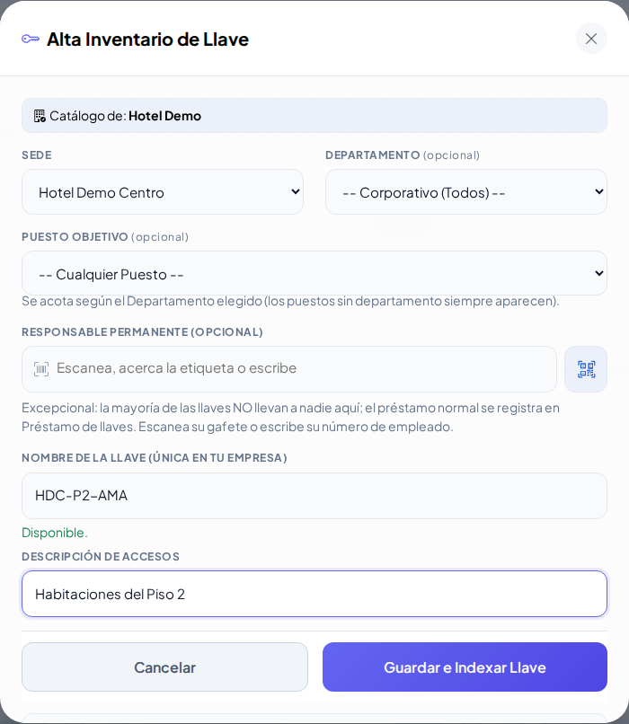

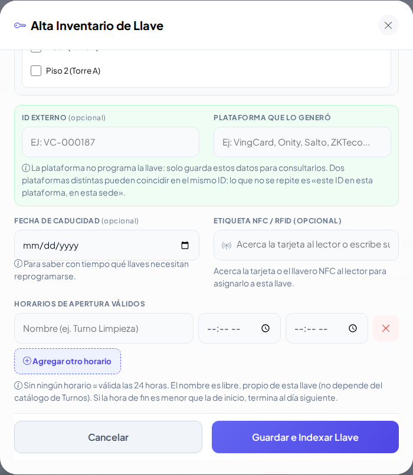

**Qué debes ver:** «Llave HDC-102 registrada correctamente. Ya puedes imprimir su etiqueta.»

Alcance **Área específica**: edificio → piso → cuartos de ese piso. Lo que ya marcaste nunca se esconde.

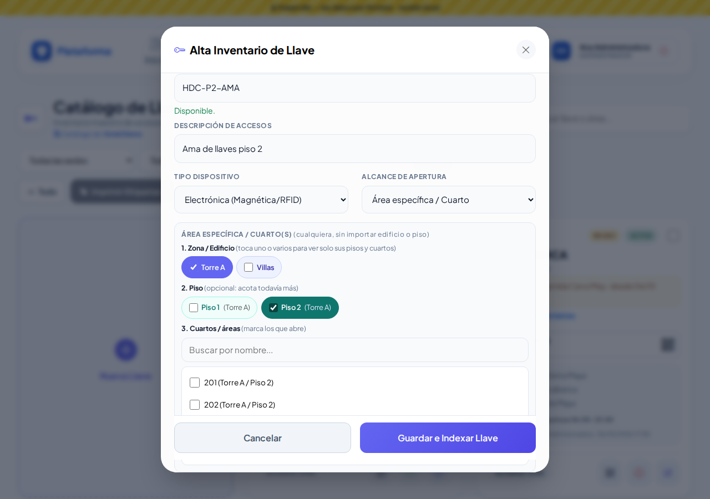

### Avisos mientras escribes el nombre

El nombre es único **dentro de su sede**: dos sedes sí pueden tener una llave `HDC-101`. El aviso revisa la sede que elegiste; si cambias la sede, vuelve a revisar.

- **Verde:** «Nombre disponible en Hotel Centro.»
- **Rojo:** «Ya existe una llave «HDC-101» en Hotel Centro. No se puede repetir en la misma sede.»
- **Rojo con botón Reactivar:** la llave existe pero está dada de baja. Toca **Reactivar** en lugar de registrarla otra vez.
- **Amarillo:** «Se parece a una llave que ya está en Hotel Centro (los guiones y espacios no cuentan). Revisa que no sea la misma:». Por ejemplo `HDC 101` se parece a `HDC-101`.

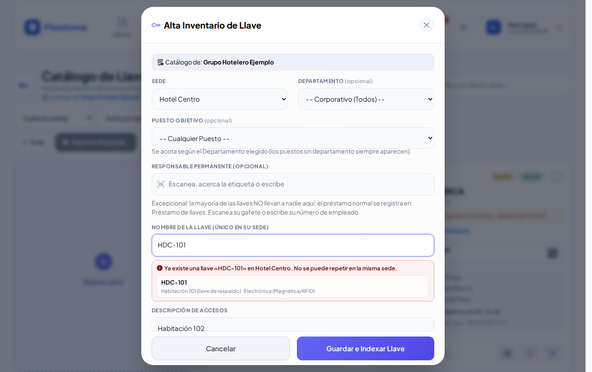

## Cómo editar una llave

1. Toca el **lápiz** (Editar) en la ficha.
2. Corrige los datos en **Actualizar Llave**. Si cambias la **sede**, vuelve a marcar los lugares: los de la otra sede ya no aplican.
3. Toca **Actualizar Registro**.

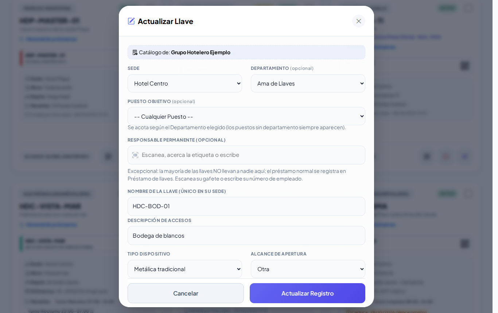

**Qué debes ver:** «Llave … actualizada correctamente.»

## Cómo dar de baja una llave (con voucher)

Al dar de baja se genera un **voucher de reposición** con folio. La llave no se borra.

1. Toca el **círculo rojo** (Dar de baja) en la ficha. Se abre **Dar de Baja: …**.
2. Elige el **Motivo**: Extraviado, Dañado o Robado.
3. Cuenta **¿Cómo pasó?** (ayuda a decidir si aplica cobro).
4. Si se le cobrará a alguien, marca **Aplica CXC (se le cobra al responsable)**:
   - **Monto:** si la llave tiene costo fijo, ya viene puesto; si es variable, viene sugerido y puedes ajustarlo.
   - **Colaborador responsable:** escanea su gafete o escribe su número de empleado. No hace falta Enter: aparece solo.
5. En **Firmas del voucher** elige:
   - **Firma física (imprimir y firmar a mano):** después imprimes el voucher y firman a mano.
   - **Firma digital (en la pantalla):** firman en la pantalla Seguridad (quien registra) y, si hay responsable, también él.
6. Toca **Generar Voucher y Dar de Baja**.

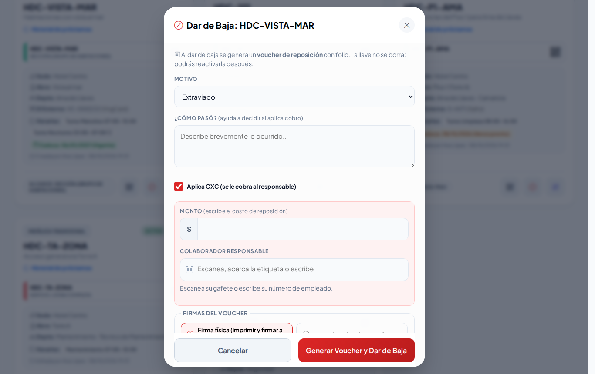

**Qué debes ver:** el aviso con el **folio** del voucher (`VR-…`) y la ficha en **BAJA**. Las copias del voucher son para Seguridad, Recepción y Administración; si hay cobro, se envían por correo a las listas de [Configuración](configuracion.md). El seguimiento del voucher está en [Vouchers de reposición](vouchers.md).

## Cómo reactivar una llave

1. Filtra por **Bajas** y toca la **flecha circular** (Reactivar) en la ficha.
2. Confirma con **Aceptar**.

**Qué debes ver:** «Llave … reactivada correctamente. Revisa su código QR: puedes reimprimir la etiqueta o asignarle otra tarjeta NFC/RFID.» Se abre su **Código e identificación**. El voucher no se borra.

## Cómo ver el código QR y asignar una tarjeta NFC / RFID

1. Toca el ícono de **QR** de la ficha. Se abre **Código e identificación** con el QR y la dirección de la llave (botón **Copiar**).
2. **Imprimir etiqueta** abre la hoja para imprimir esa llave.
3. En **Asignar etiqueta NFC / RFID** (si puedes editar) acerca la tarjeta o el llavero al lector USB/Bluetooth o al NFC del celular Android, o escribe su número, y toca **Guardar etiqueta**.

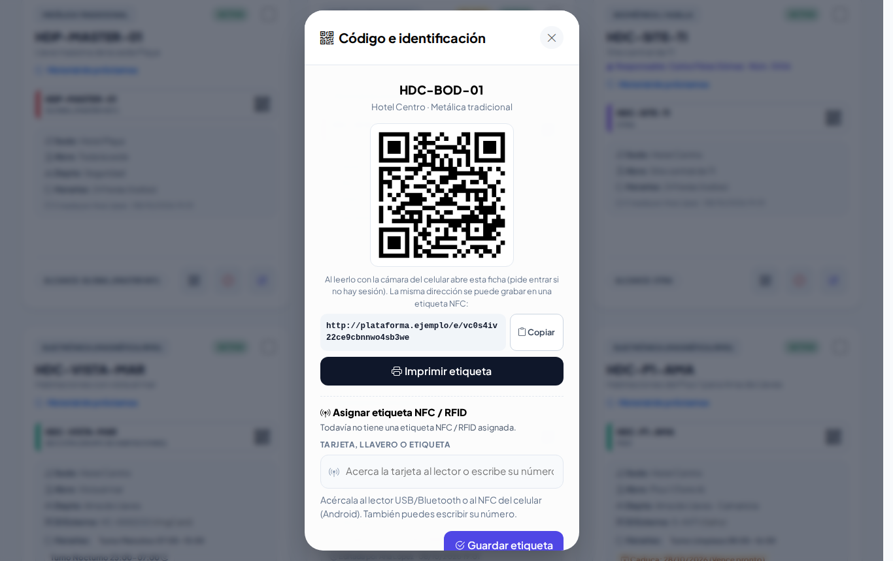

**Qué debes ver:** «Etiqueta … asignada. Ya se puede leer con el lector.» Si esa tarjeta ya es de otra cosa (otra llave, un vehículo, un gafete…), el aviso te dice de cuál y no se asigna.

## Cómo imprimir varias etiquetas

1. Marca la casilla de cada llave (o toca **Todo** para marcar todas las que se ven con el filtro actual).
2. Toca **Imprimir Etiquetas**. Se abre una pestaña **Etiquetas de Llaveros Listas** (6.5 × 3.5 cm, para mica).
3. Toca **Imprimir Etiquetas** en esa pestaña.

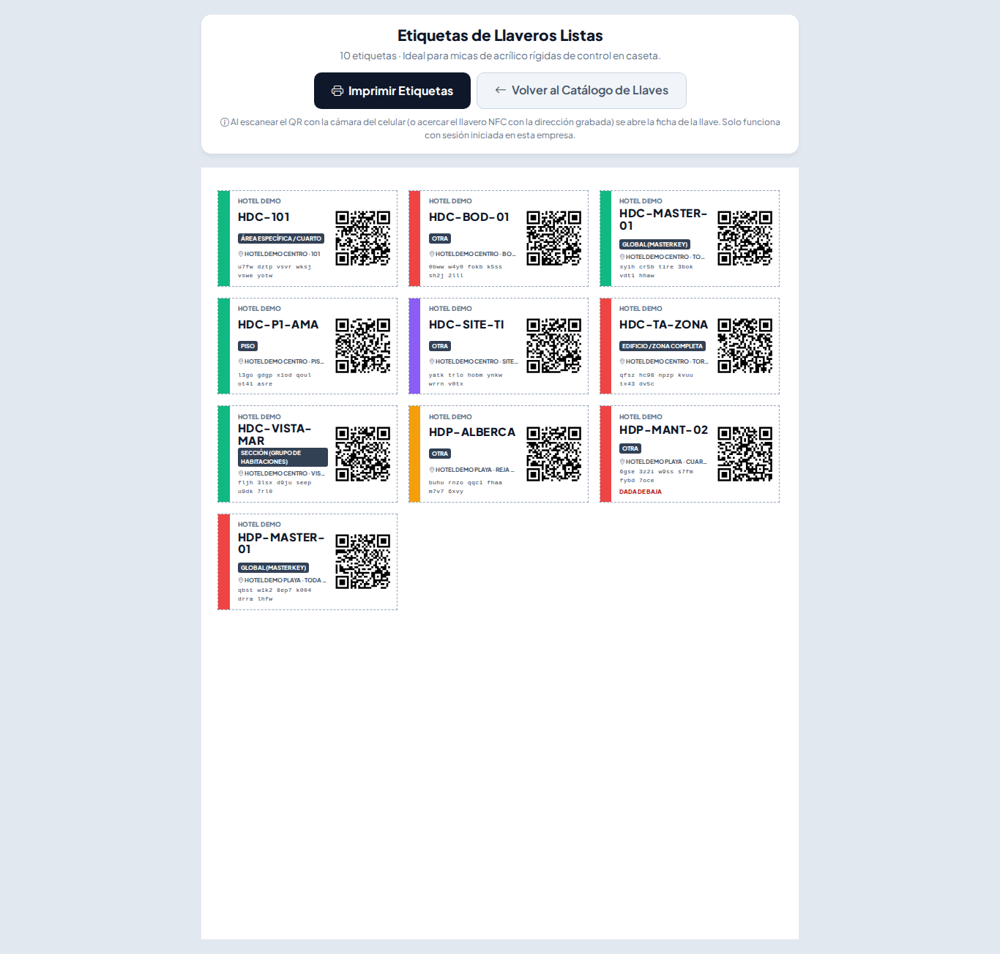

## Cómo exportar a Excel

Toca **Exportar**: se descarga un archivo de Excel (CSV) con las llaves que coinciden con los filtros que tengas puestos.

## Lo que ve el agente de caseta

El agente solo consulta las llaves de su sede: ve el QR y la dirección, pero no registra, imprime ni asigna etiquetas.

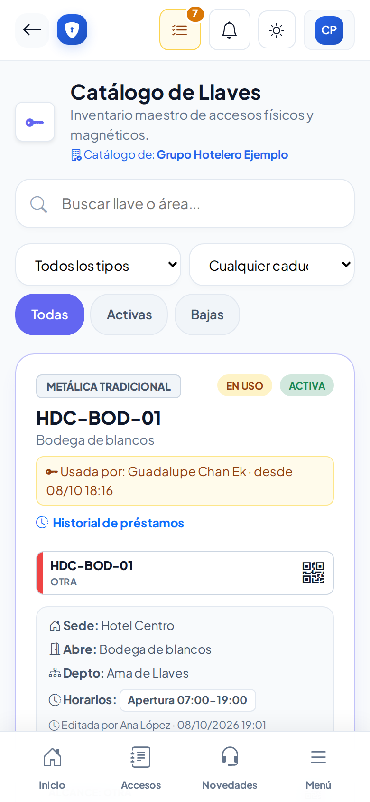

## En el celular y en los modos Noche y Sol

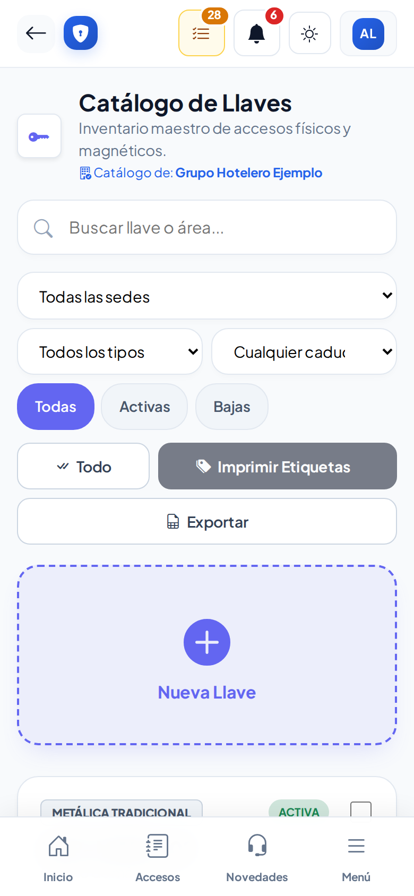

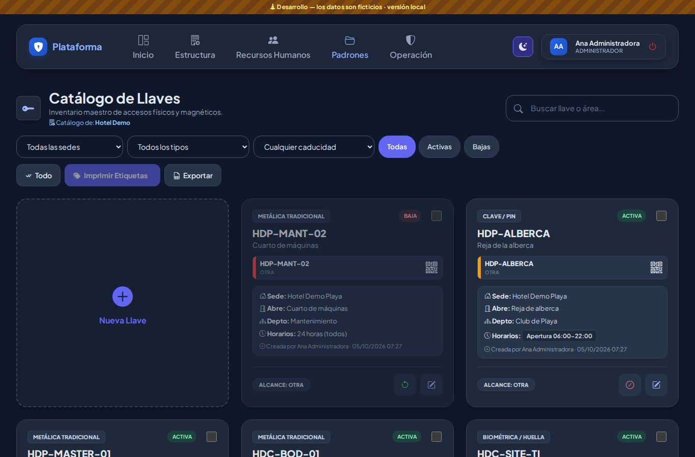

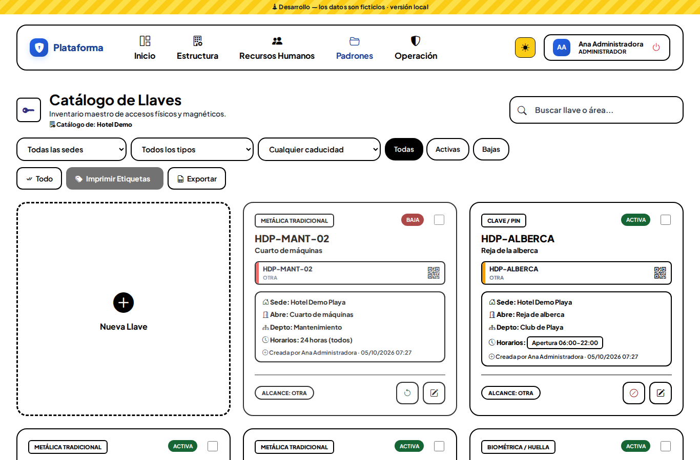

## Si algo sale mal

Los mensajes salen en rojo dentro de la ventana; lo que escribiste se conserva.

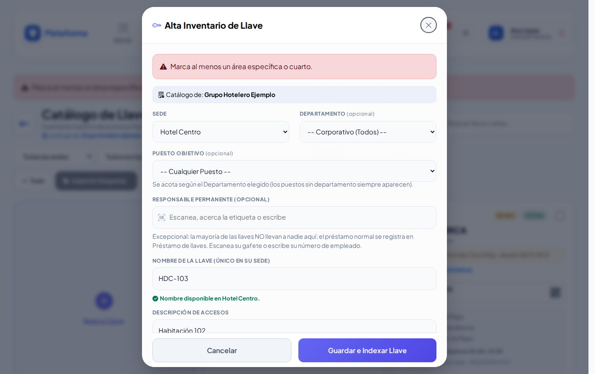

| Mensaje o síntoma | Qué significa | Qué hacer |
|---|---|---|
| Elige la sede de la llave. | No elegiste sede. | Elige la sede. |
| Escribe el nombre (nomenclatura) de la llave. | El nombre está vacío. | Escribe el nombre. |
| Ya existe una llave con el nombre «…» en la sede … | Ese nombre ya se usa en esa sede. | Usa otro nombre o reactiva la existente. |
| Describe qué abre la llave (por ejemplo: Site central de TI). | Falta la descripción. | Escribe qué abre. |
| Marca al menos una zona o edificio. / Marca al menos un piso. / Marca al menos un área específica o cuarto. | Elegiste un alcance pero no marcaste lugares. | Marca los lugares que abre. |
| Escribe qué espacio abre (por ejemplo: Cuarto de máquinas). | Elegiste «Otra» sin escribir el lugar. | Escribe el lugar. |
| Algunos lugares marcados no pertenecen a la sede elegida o están desactivados. Revisa la lista. | Cambiaste de sede o se desactivó un lugar. | Vuelve a marcar los lugares. |
| Completa el horario …: nombre, hora de inicio y hora de fin (o quítalo). | Un horario está incompleto. | Llénalo o quítalo con la X. |
| Revisa las horas del horario …: se escriben como HH:MM (24 horas). | La hora está mal escrita. | Escribe por ejemplo `07:00`. |
| El costo de reposición debe ser una cantidad (por ejemplo 350 o 350.50). | Escribiste letras en el costo. | Escribe solo la cantidad. |
| Indica el monto a cobrar. / Elige al responsable al que se le cobrará. | Marcaste *Aplica CXC* sin monto o sin responsable. | Complétalos o desmarca la casilla. |
| Falta la firma de Seguridad: firma en el recuadro o elige «Firma física». | Elegiste firma digital y no firmaste. | Firma o cambia a firma física. |
| Marca al menos una llave para imprimir sus etiquetas. | Tocaste **Imprimir Etiquetas** sin marcar llaves. | Marca las casillas. |
| No veo **Nueva Llave**. | Tu rol solo consulta. | Pide el permiso a tu administrador. |

## Preguntas frecuentes

**¿Dos sedes pueden tener una llave con el mismo nombre?** Sí. El nombre solo es único dentro de cada sede.

**¿Qué pasa si una llave no tiene horarios?** Vale las 24 horas.

**¿Se borra la llave al darla de baja?** No. Queda en **BAJA** con su voucher y la puedes reactivar.

**¿Por qué no aparecen los cuartos que quiero marcar?** Toca primero el edificio y el piso. Si aun así no están, deben darse de alta en [Zonas y áreas](zonas-y-areas.md).

**¿Para qué sirve el ID externo?** Para anotar el número que le dio el sistema de cerraduras (VingCard, Salto…), y encontrar la tarjeta rápido.

## Relacionado

- [Préstamo de llaves](prestamo-llaves.md)
- [Vouchers de reposición](vouchers.md)
- [Zonas y áreas](zonas-y-areas.md)
- [Etiquetas QR](etiquetas-qr.md)
