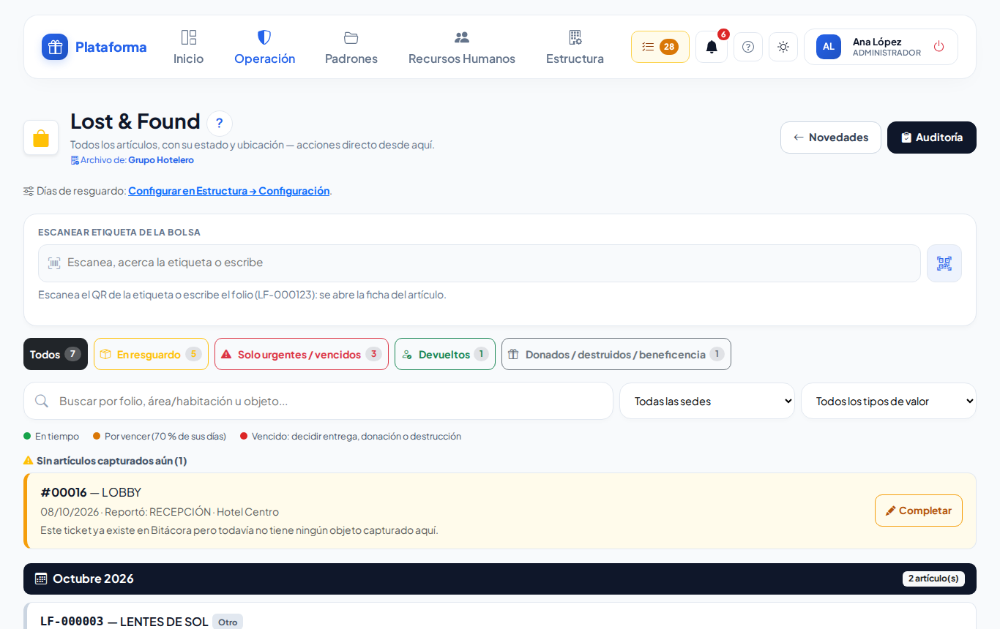
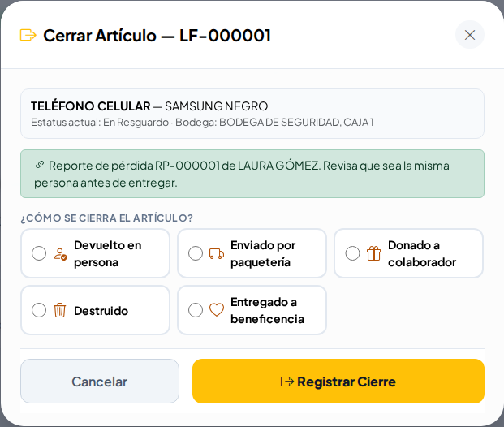
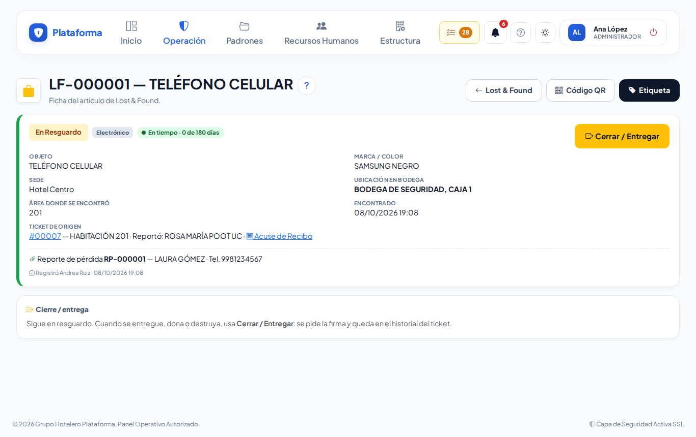
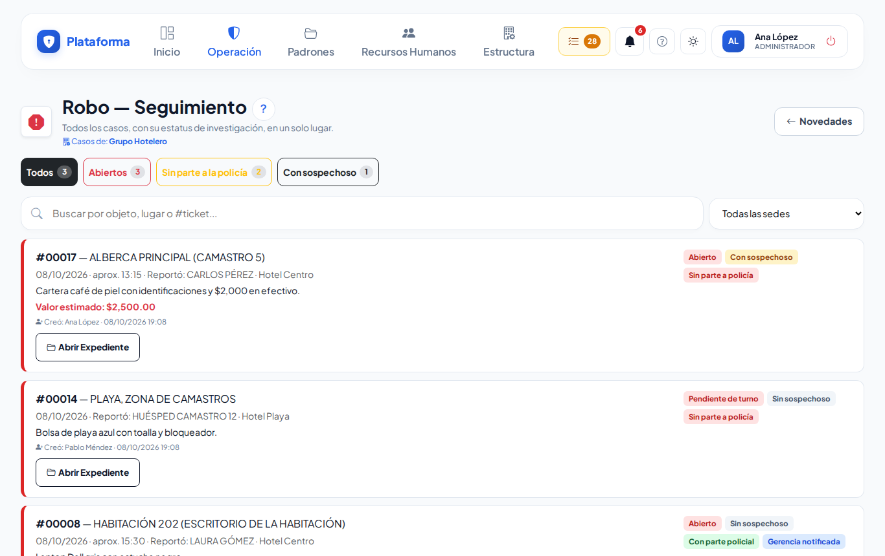
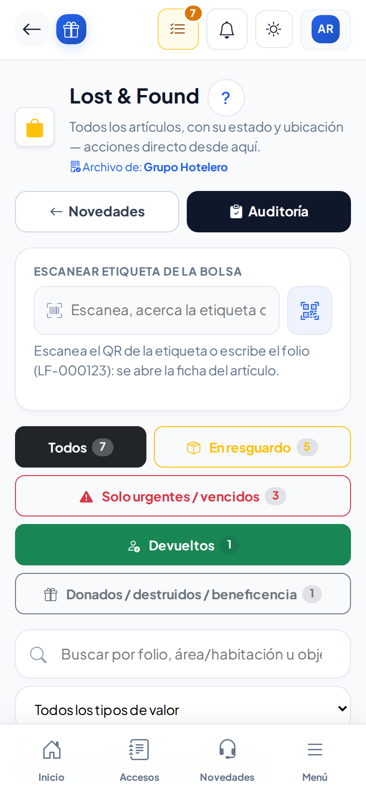

# Lost & Found y Robo

**¿Para qué sirve?**

- **Lost & Found** es el archivo de los objetos encontrados: dónde están guardados, cuántos días llevan y a quién se entregaron.
- **Robo** reúne los casos de robo para darles seguimiento sin buscarlos entre las demás novedades.

Los objetos y los casos **se registran en la [Bitácora de novedades](novedades.md)** (ticket de Lost & Found o de Robo). Aquí se consultan, se entregan y se imprimen.

**Antes de empezar:** necesitas que tu rol pueda **ver** Lost & Found o Robo. Para entregar un objeto se necesita además **firmar**; para imprimir etiquetas, **imprimir**. Si no ves un botón, pide a tu administrador que revise tu rol.

## Cómo leer el archivo de Lost & Found

1. Entra a **Operación → Incidentes → Lost & Found**.
2. Cada renglón dice el folio y el objeto (por ejemplo **LF-000123 — CARTERA**), cuándo se encontró, **cuántos días lleva en resguardo**, marca, color, dónde se encontró y en qué **Bodega** está.
3. El **color** es el semáforo: **verde** en tiempo, **ámbar** por vencer, **rojo** vencido.
4. Usa los filtros (**Todos**, **En resguardo**, **Solo urgentes / vencidos**, **Devueltos**…) o escribe en el buscador: se aplican solos.

**Qué debes ver:** si un huésped ya reportó el objeto como perdido, el renglón dice **Reporte de pérdida RP-…** con su nombre.

Para abrir un objeto rápido, en **Escanear etiqueta de la bolsa** escanea el QR de su etiqueta o escribe su folio.

## Cómo entregar o cerrar un objeto

1. Toca **Cerrar / Entregar** en el renglón (o en la ficha del objeto).
2. Elige **¿Cómo se cierra el artículo?**:
   - **Devuelto en persona**: a un huésped o persona externa (nombre e identificación) o a un colaborador (escanea su gafete). Si alguien reportó la pérdida, su nombre ya viene: **revisa que sea la misma persona**.
   - **Enviado por paquetería**: nombre, paquetería y número de guía.
   - **Donado a colaborador**: escanea el gafete del colaborador.
   - **Destruido**.
   - **Entregado a beneficencia**: escribe la institución.
3. Pide la **firma** en el recuadro (quien recibe, o quien autoriza).
4. Toca **Registrar Cierre**.

**Qué debes ver:** el renglón cambia a **Devuelto al Huésped**, **Donado a Colaborador**, etc., y el cierre queda en el Minuto a Minuto del ticket. Sin firma no se registra.

## Cómo ver la ficha de un objeto

1. Toca el **ojo** del renglón.
2. Revisa dónde está, de qué ticket viene (con su **Acuse de Recibo**), reportes de pérdida o robos ligados y, si se entregó, a quién, cuándo y la firma.

## Cómo imprimir la etiqueta de la bolsa

1. Toca el botón de **etiqueta** (en el renglón o en la ficha).
2. Toca **Imprimir Etiqueta** y pégala en la bolsa.

**Qué debes ver:** al escanear la etiqueta se abre la ficha del objeto.

## Cómo hacer la auditoría de bodega

1. Toca **Auditoría**.
2. Elige la sede y las fechas y toca **Aplicar**.
3. Imprime la lista, marca cada objeto que encuentres y anota las diferencias. Al final firman quien contó y quien cotejó.

**Qué debes ver:** la lista de lo que debería estar en bodega hoy.

Los días que puede estar guardado cada tipo de objeto se cambian en **Estructura → Configuración** (enlace **Configurar en Estructura → Configuración**, solo para quien tiene ese permiso).

## Cómo dar seguimiento a un robo

1. Entra a **Operación → Incidentes → Robo**.
2. Filtra (**Todos**, **Abiertos**, **Sin parte a la policía**, **Con sospechoso**) o busca por objeto, lugar o número de ticket.
3. Toca **Abrir Expediente** en el caso.
4. Escribe una **nueva nota** y completa circunstancias, sospechoso, testigos y canalización.
5. Toca **Buscar Coincidencias en Lost & Found**: si ya se encontró algo parecido, tócalo y **Vincular**.
6. Toca **Guardar Cambios**. Para cerrarlo, elige **Resuelto y Cerrado** y escribe cómo se resolvió.

**Qué debes ver:** las etiquetas del caso (**Abierto**, **Con sospechoso**, **Sin parte a policía**…) y, si se ligó, **Vinculado con el hallazgo LF-…**.

## En el celular

## Si algo sale mal

| Mensaje o síntoma | Qué significa | Qué hacer |
|---|---|---|
| «Elige cómo se cierra el artículo.» | Falta el tipo de cierre. | Elige una opción. |
| El recuadro de firma se pone rojo | Falta la firma. | Pide la firma y vuelve a registrar. |
| «Escribe el nombre de quien recibe.» | Falta quién recibe. | Escríbelo. |
| «Escribe el número de guía del envío.» | Falta la guía de paquetería. | Escríbela. |
| «Escanea el gafete o busca al colaborador que recibe el artículo.» | Falta el colaborador. | Escanea su gafete. |
| «Este caso ya está Resuelto. Reábrelo antes de vincular un hallazgo.» | El robo está cerrado. | Reábrelo en la Bitácora de novedades. |
| No veo **Cerrar / Entregar** | Tu rol solo consulta. | Pide a tu supervisor que lo entregue. |

## Preguntas frecuentes

- **¿Dónde registro un objeto encontrado?** En la [Bitácora de novedades](novedades.md), ticket de **Lost & Found**.
- **¿Qué pasa cuando un objeto se vence?** Se pone en rojo; tu supervisor decide si se dona, se destruye o se entrega a beneficencia.
- **¿Puedo volver a cerrar un objeto ya entregado?** No; un objeto cerrado no se vuelve a cerrar.
- **¿Qué es «Sin artículos capturados aún»?** Tickets de Lost & Found sin objetos anotados; toca **Completar** para hacerlo.

## Relacionado

- [Bitácora de novedades](novedades.md)
- [Etiquetas QR](etiquetas-qr.md)
- [Bitácora de accesos](accesos.md)
