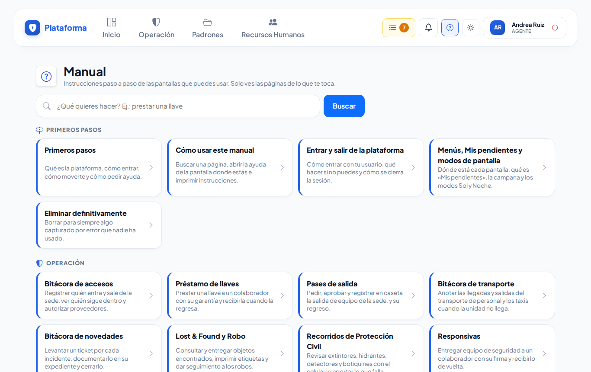
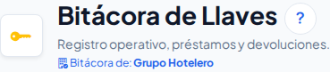
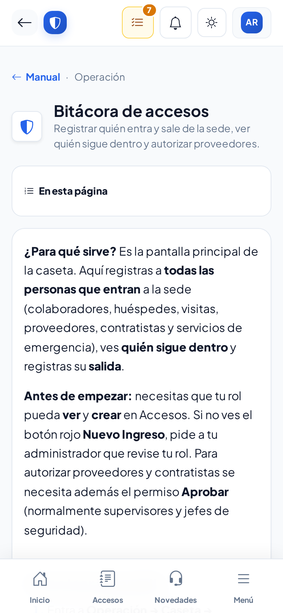
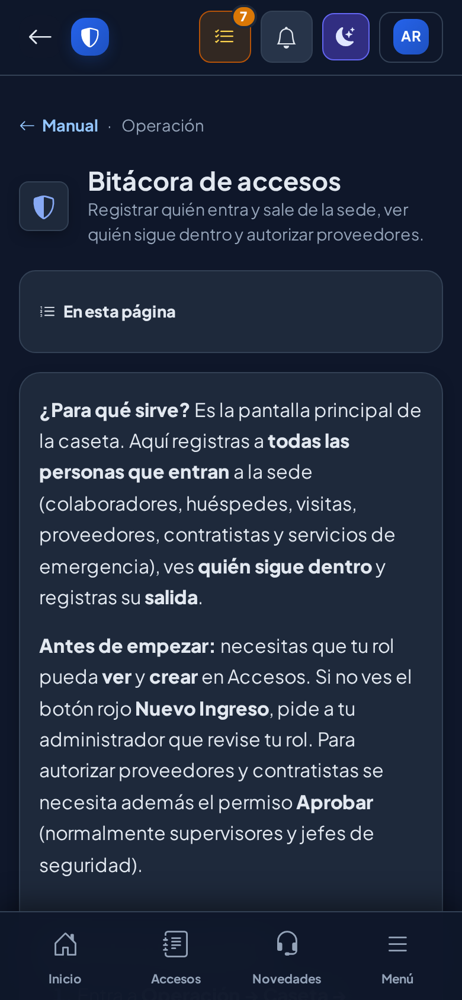
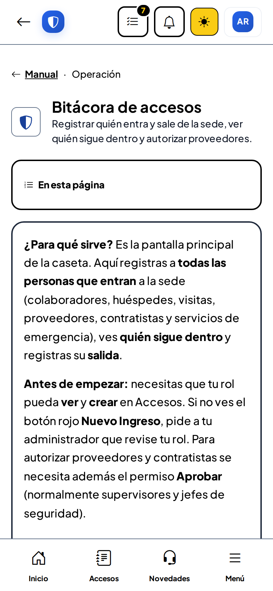

# Cómo usar este manual

**¿Para qué sirve?** El manual explica, paso a paso y con imágenes, cómo usar cada pantalla de la plataforma. Solo ves las páginas de lo que tu puesto puede usar, así que todo lo que encuentras aquí te sirve.

**Antes de empezar:** no necesitas ningún permiso especial: todos los usuarios pueden abrir el manual.

## Cómo abrir el manual

1. En la computadora, toca el botón **?** de arriba, junto a la campana.
2. En el celular, toca **Menú** (abajo a la derecha) y luego **Ayuda → Manual**.

**Qué debes ver:** las páginas agrupadas en **Primeros pasos**, **Operación**, **Padrones**, **Recursos Humanos** y **Estructura** (solo los grupos que te tocan).

## Cómo buscar lo que necesitas

1. Escribe en el buscador lo que quieres hacer, por ejemplo «llave», «pase» o «contraseña».
2. La lista se filtra mientras escribes; no importan los acentos ni las mayúsculas.
3. Toca la página.

**Qué debes ver:** solo las páginas cuyo título o resumen tienen esas palabras. Si no hay ninguna, sale «No encontramos páginas con esas palabras».

## Cómo abrir la ayuda de la pantalla donde estás

1. Junto al título de la pantalla (por ejemplo **Bitácora de Llaves**) toca el botón redondo **?**.
2. Se abre la página del manual de esa pantalla.

**Qué debes ver:** la página de esa pantalla. Para regresar, usa el botón **←** del navegador o el menú.

## Cómo leer una página

1. Arriba ves el título y para qué sirve.
2. En **En esta página** toca la tarea que quieres hacer (en el celular, toca **En esta página** para abrir la lista).
3. Sigue los pasos numerados. Los textos en **negritas** son los botones y menús tal como se ven en la pantalla.
4. Al final de cada tarea, **Qué debes ver** te dice si salió bien.
5. Si algo falla, busca el mensaje en la tabla **Si algo sale mal**.

## Cómo imprimir una página

1. En la computadora, abre la página y toca **Imprimir**.
2. Elige tu impresora (o «Guardar como PDF») y acepta.

**Qué debes ver:** solo el contenido de la página, sin menús ni botones.

## En los modos Sol y Noche

El manual se adapta al modo de pantalla que elegiste.

## Si algo sale mal

| Mensaje o síntoma | Qué significa | Qué hacer |
|---|---|---|
| «Todavía no hay páginas del manual para tu usuario» | Tu rol no tiene pantallas con página de ayuda. | Pide ayuda a tu administrador. |
| Un enlace se ve como texto normal (sin subrayar) | Esa página es de una pantalla que tu rol no usa. | No la necesitas; si crees que sí, pregunta a tu administrador. |
| No aparece el **?** junto al título | Esa pantalla todavía no tiene página propia. | Busca en el índice del manual. |
| «No encontramos lo que buscas» al abrir una página | La página no existe o no es para tu rol. | Regresa al índice del manual. |

## Preguntas frecuentes

- **¿El manual cambia?** Sí: cada vez que cambia una pantalla, se actualiza su página.
- **¿Puedo ver el manual de otro puesto?** No; cada quien ve lo que le toca.
- **¿Funciona sin internet?** No; el manual está dentro de la plataforma.
- **¿Puedo imprimirlo en el celular?** El botón Imprimir solo aparece en la computadora.

## Relacionado

- [Primeros pasos](primeros-pasos.md)
- [Menús, Mis pendientes y modos de pantalla](menus.md)
