# Cómo moverte por la plataforma: menús y «Mis pendientes»

Los menús están ordenados como se trabaja en el día: primero la **operación de caseta**, luego los **padrones** (catálogos), **Recursos Humanos**, **Informes** y al final la **Estructura** de la empresa. En la computadora y en el celular el orden es el mismo.

Solo ves lo que tu rol te permite. Si un menú no tiene nada para ti, no aparece.

## Los menús

### 1. Operación
Lo que hace la caseta todos los días.

- **Caseta:** Bitácora de accesos, Préstamo de llaves, Pases de salida, Bitácora de transporte.
- **Incidentes:** Novedades, Lost & Found, Robo.
- **Protección civil:** Recorridos de Protección Civil.
- **Activos:** Responsivas y Vouchers de reposición.
- **Consulta:** Procedimientos.

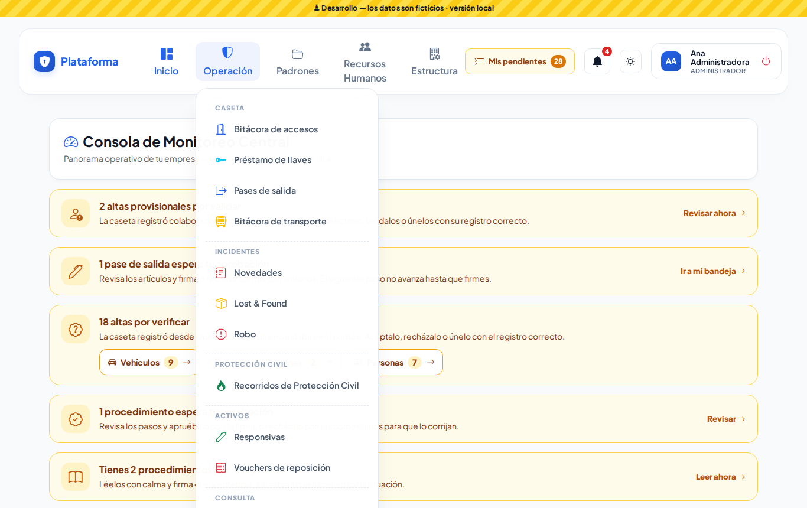

### 2. Padrones
Los catálogos que la caseta consulta.

- **Personas y vehículos:** Empresas externas, Padrón de personas, Padrón vehicular.
- **Inventarios:** Catálogo de llaves, Gafetes, Equipos de seguridad, Equipos de Protección Civil.
- **Instalaciones:** Estacionamientos, Rutas de transporte.
- **Herramientas:** Etiquetas QR.

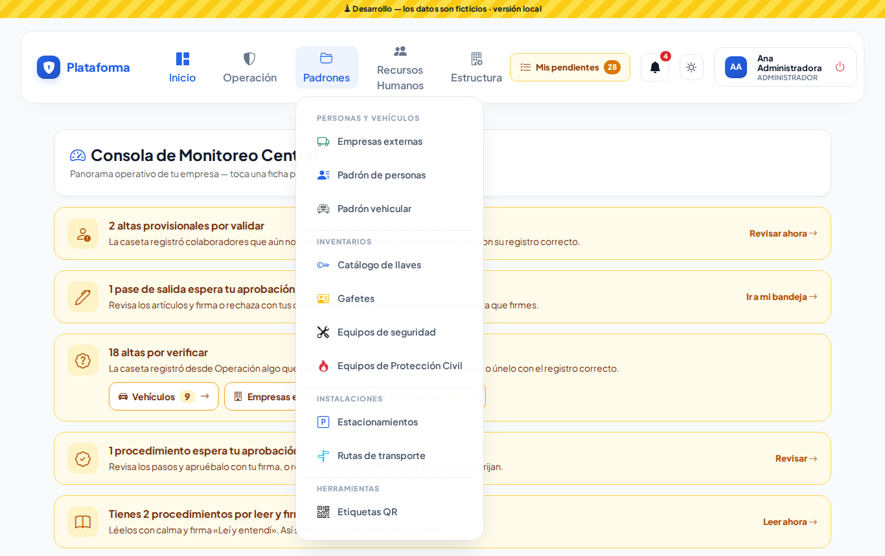

### 3. Recursos Humanos
- **Personal:** Colaboradores.
- **Recepción y candidatos:** Recepción de RR. HH., Candidatos.
- **Catálogos:** Departamentos, Puestos, Turnos.

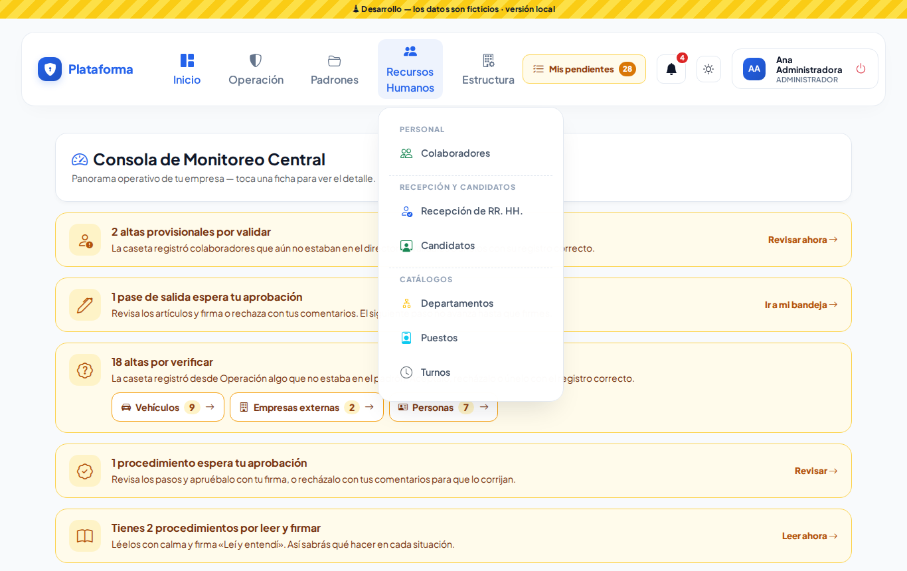

> **¿Dónde quedaron las Autorizaciones departamentales?** Ya no están en el menú. Te llegan por la **campana** y por **Mis pendientes** (abajo). La pantalla sigue en el mismo lugar.

### 4. Informes
Tablero, Bitácora del día, Tendencias e Informe ejecutivo. **Todavía no aparece**: se mostrará solo cuando esas pantallas estén listas.

### 5. Estructura
- **Empresa:** Empresas, Sedes, Zonas y áreas.
- **Accesos y permisos:** Usuarios, Roles, Matriz de permisos.
- **Sistema:** Configuración, Identidad de la plataforma, Bitácora de auditoría.

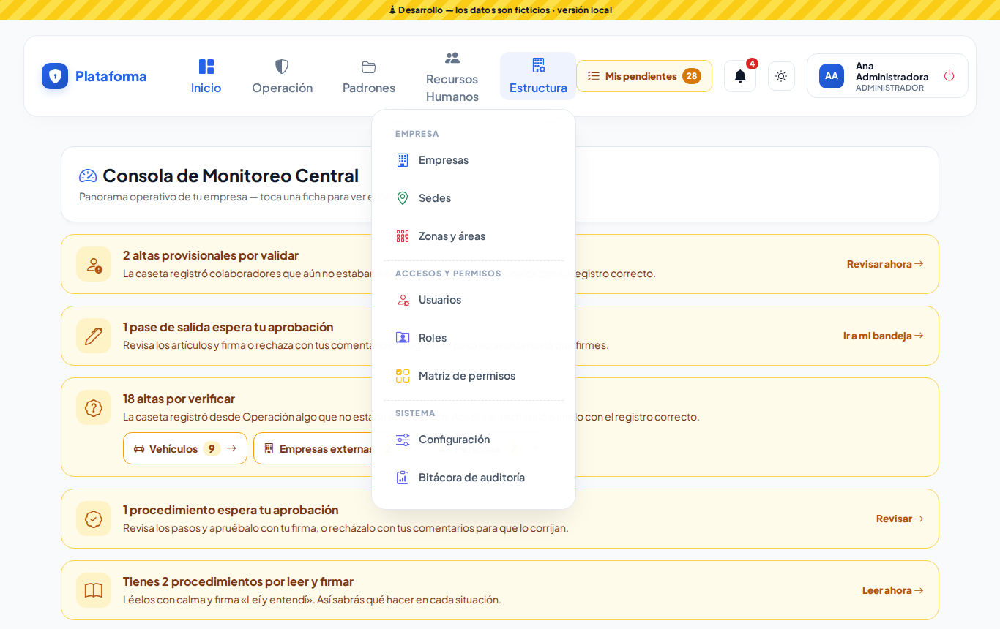

## «Mis pendientes»

Junto a la campana hay un botón amarillo **Mis pendientes** con un número: es lo que **espera tu respuesta**. Tócalo para ver la lista:

- **Autorizaciones por responder:** visitas o candidatos de tu departamento.
- **Firmas de pases de salida:** pases que esperan tu firma (aprobación o paso de caseta).
- **Procedimientos por leer:** los que te faltan leer y firmar «Leí y entendí».
- **Altas por verificar:** lo que la caseta registró y tú revisas.

Toca un renglón para ir directo a resolverlo. El número se actualiza solo cada 30 segundos.

Si no tienes nada pendiente, el botón **no se muestra**.

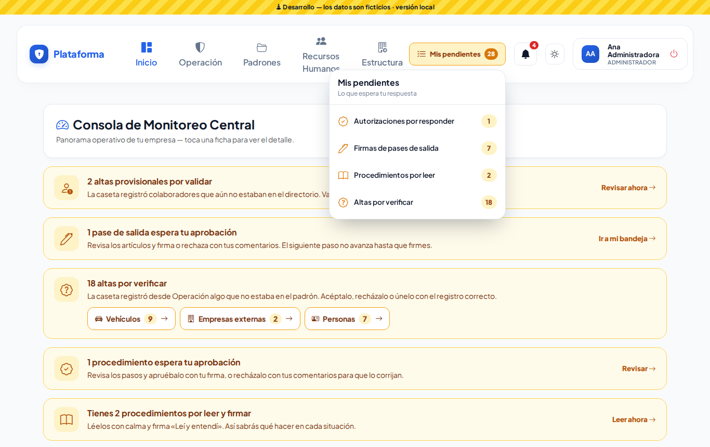

## En el celular

- Arriba: **Mis pendientes** (ícono de lista con su número), la campana y el modo de pantalla.
- Abajo: **Inicio, Accesos, Novedades y Menú**.
- En **Menú** están los mismos menús, en el mismo orden. Toca el nombre de un menú para abrirlo.

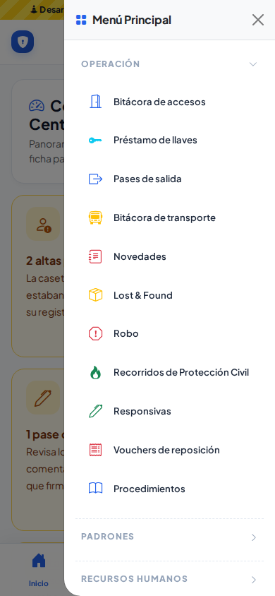 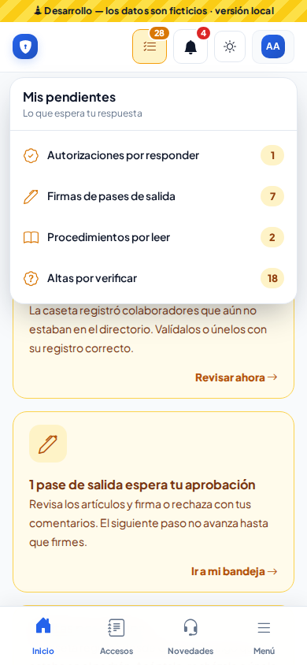

## Lo que ve cada quien (ejemplos del demo)

- **agente.demo (caseta):** Operación, Padrones (solo consulta) y Colaboradores. En Mis pendientes: firmas de pases y procedimientos por leer.

  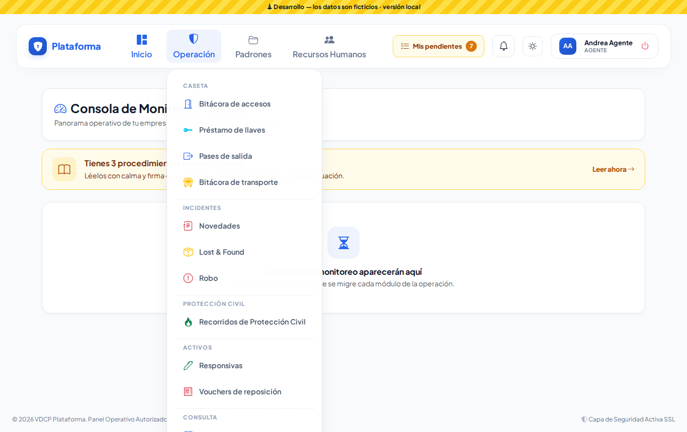 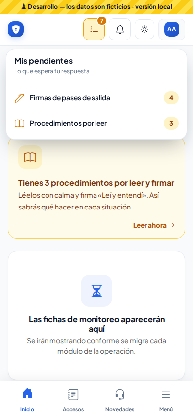

- **rh.demo (Recursos Humanos):** su menú completo, Procedimientos y Sedes (consulta).

  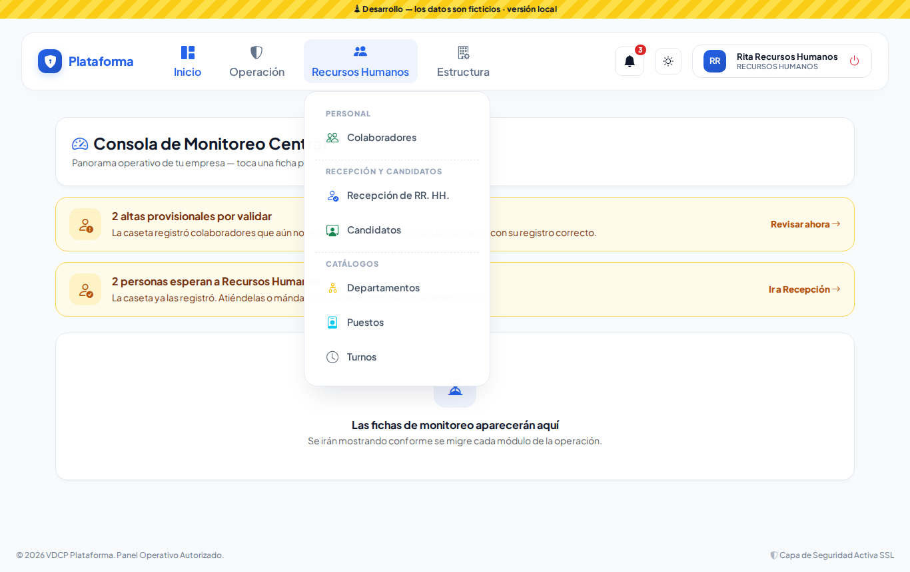

## Modos de pantalla

Todo funciona igual en **Sol** (alto contraste, para exteriores) y **Noche**.

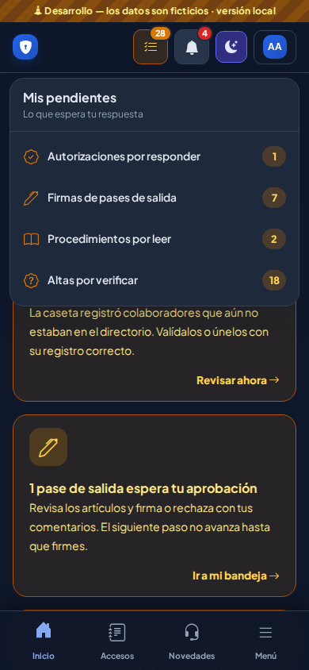 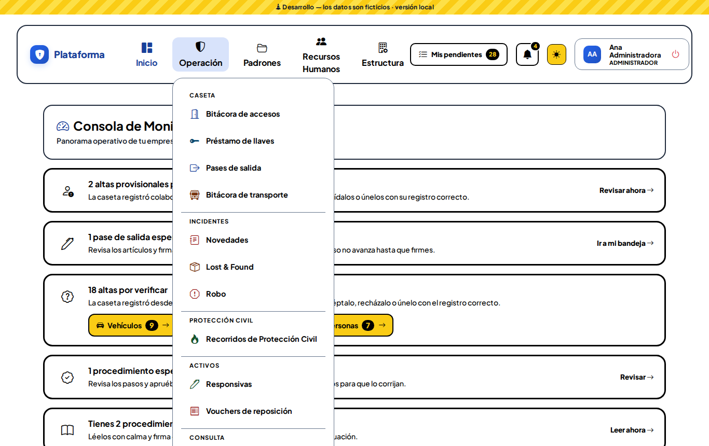 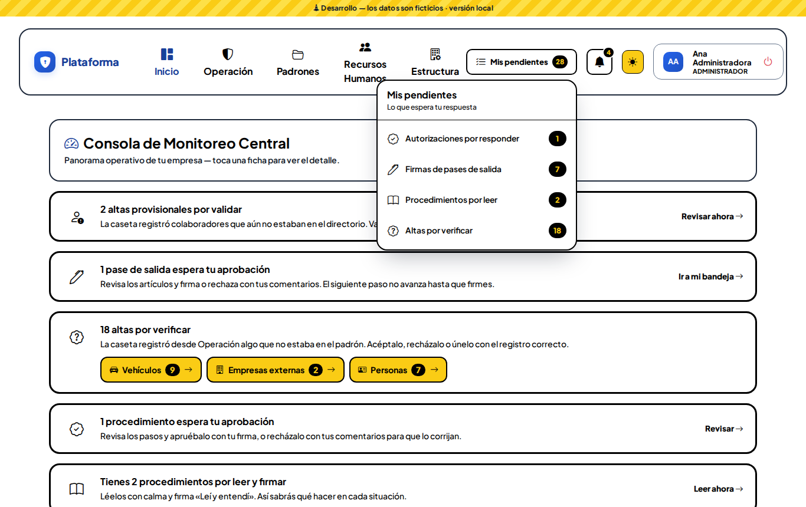
