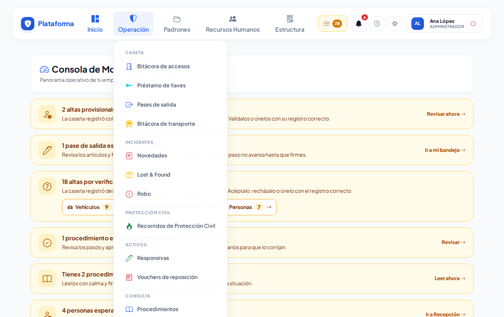
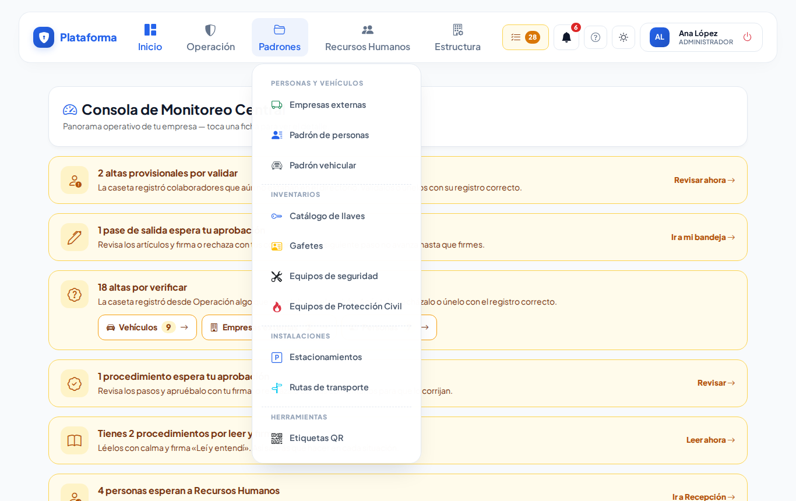
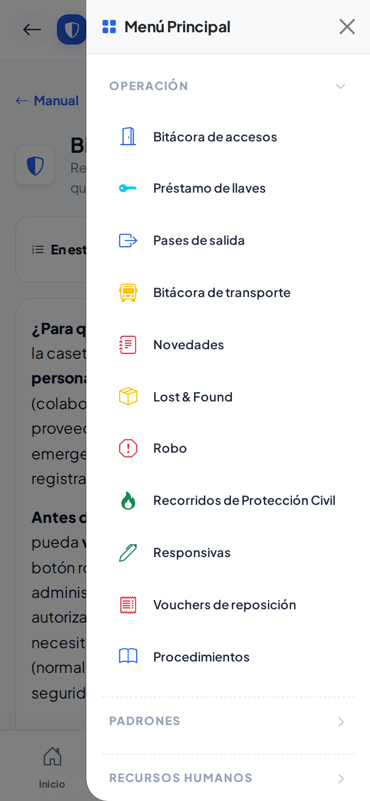
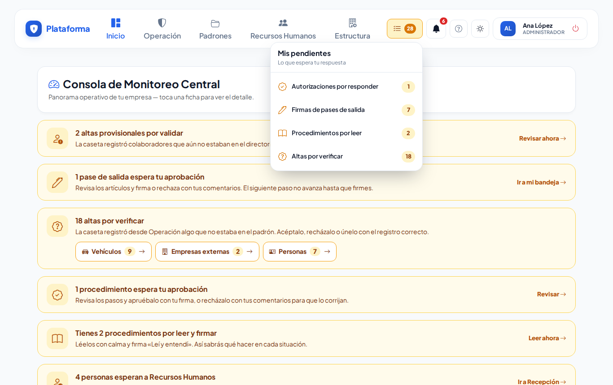
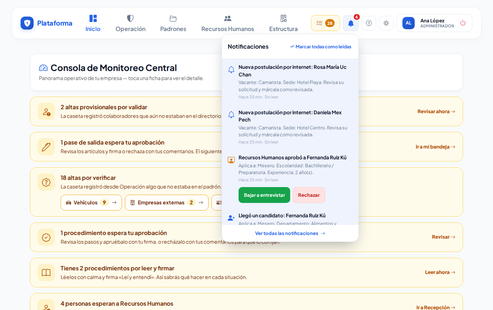
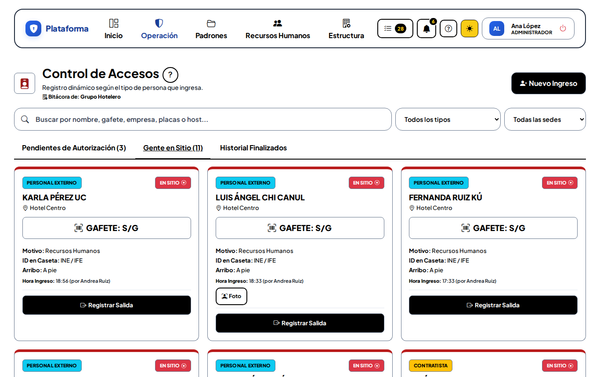
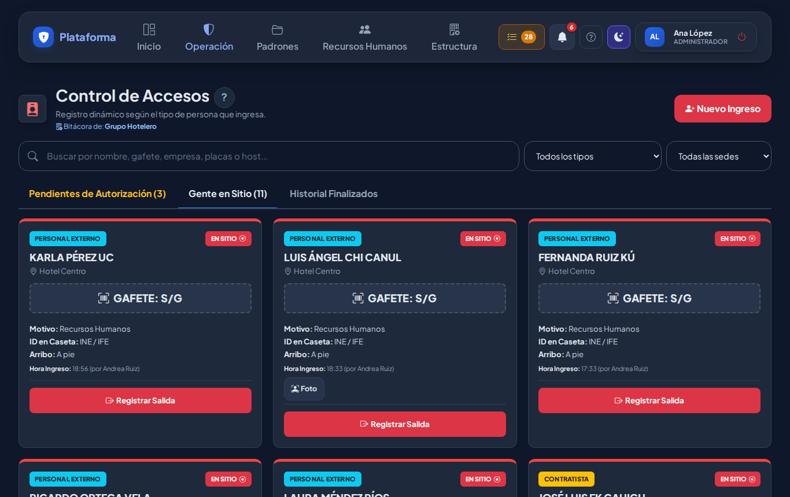

# Menús, Mis pendientes y modos de pantalla

**¿Para qué sirve?** Para encontrar rápido cada pantalla y saber qué está esperando tu respuesta. Los menús están ordenados como se trabaja en el día: primero la operación de caseta, después los padrones, Recursos Humanos y al final la estructura de la empresa.

**Antes de empezar:** solo ves los menús y pantallas que tu rol permite. Si un menú no tiene nada para ti, no aparece. Si te falta una pantalla que necesitas, pide a tu administrador que revise tu rol.

## Cómo abrir una pantalla desde el menú (computadora)

1. En la barra de arriba toca el nombre del menú, por ejemplo **Operación**.
2. Se abre la lista, dividida en grupos (por ejemplo **Caseta**, **Incidentes**, **Activos**).
3. Toca la pantalla que necesitas, por ejemplo **Préstamo de llaves**.

**Qué debes ver:** la pantalla elegida, y el menú **Operación** resaltado en azul.

Los menús y sus grupos:

| Menú | Grupos y pantallas |
|---|---|
| **Operación** | **Caseta:** Bitácora de accesos, Préstamo de llaves, Pases de salida, Bitácora de transporte. **Incidentes:** Novedades, Lost & Found, Robo. **Protección civil:** Recorridos de Protección Civil. **Activos:** Responsivas, Vouchers de reposición. **Consulta:** Procedimientos. |
| **Padrones** | **Personas y vehículos:** Empresas externas, Padrón de personas, Padrón vehicular. **Inventarios:** Catálogo de llaves, Gafetes, Equipos de seguridad, Equipos de Protección Civil. **Instalaciones:** Estacionamientos, Rutas de transporte. **Herramientas:** Etiquetas QR. |
| **Recursos Humanos** | **Personal:** Colaboradores. **Recepción y candidatos:** Recepción de RR. HH., Candidatos, Vacantes. **Catálogos:** Departamentos, Puestos, Turnos. |
| **Estructura** | **Empresa:** Empresas, Sedes, Zonas y áreas. **Accesos y permisos:** Usuarios, Roles, Matriz de permisos. **Sistema:** Configuración, Identidad de la plataforma, Bitácora de auditoría. |

## Cómo abrir una pantalla en el celular

1. Abajo tienes **Inicio**, **Accesos**, **Novedades** y **Menú**.
2. Toca **Menú**. Se abre el menú completo con los grupos **cerrados**.
3. Toca el nombre del grupo (por ejemplo **Operación**) para abrirlo.
4. Toca la pantalla que necesitas.

**Qué debes ver:** la pantalla elegida. El grupo donde estás se ve resaltado. Para regresar al inicio toca la flecha **←** de arriba o **Inicio** abajo.

## Cómo usar «Mis pendientes»

Junto a la campana hay un botón amarillo **Mis pendientes** con un número: es lo que **espera tu respuesta**.

1. Toca **Mis pendientes**. Se abre la lista **Lo que espera tu respuesta**.
2. Revisa los renglones:
   - **Autorizaciones por responder:** visitas a tu departamento.
   - **Entrevistas por evaluar:** candidatos que Recursos Humanos te canalizó, con la próxima cita. Ver [Entrevistar y elegir](entrevistar-y-elegir.md).
   - **Firmas de pases de salida:** pases que esperan tu firma.
   - **Procedimientos por leer:** los que te faltan leer y firmar «Leí y entendí».
   - **Altas por verificar:** lo que la caseta registró y tú revisas.
   - **Esperando en Recepción** (Recursos Humanos): quien espera en caseta a que digas «Que pase» y los candidatos de hoy que aún no atiendes. Ver [Recepción y autorizaciones](recepcion-y-autorizaciones.md).
   - **Solicitudes por revisar** (Recursos Humanos): lo que los candidatos llenaron en su celular o por internet y aún no revisas.
   - **Por entrevistar (RR. HH.)**, **Evaluaciones del departamento** y **Elegidos por contratar** (Recursos Humanos): candidatos que esperan tu entrevista, los que el jefe ya evaluó y los que eligió. Ver [Candidatos](candidatos.md).
3. Toca un renglón para ir directo a resolverlo. Si eres jefe de un departamento, en [Pedir y aprobar solicitudes](solicitudes.md) está paso a paso lo que te puede aparecer.

**Qué debes ver:** la pantalla con lo pendiente. El número se actualiza solo cada 30 segundos. Si no tienes nada pendiente, el botón no aparece.

## Cómo revisar la campana (avisos)

1. Toca la **campana**. El número rojo dice cuántos avisos no has leído.
2. Toca un aviso para abrir lo que pasó (por ejemplo, un candidato que llegó a recepción).
3. Si quieres, toca **Marcar todas como leídas** o **Ver todas las notificaciones**.

**Qué debes ver:** el aviso se marca como leído y el número baja.

## Cómo cambiar el modo de pantalla (Sol y Noche)

1. Toca el botón del **sol** (arriba a la derecha; en el celular también en **Menú → Pantalla**).
2. Cada toque cambia al siguiente modo:

| Modo | Botón | Para qué |
|---|---|---|
| **Normal** | sol de contorno | Oficina. |
| **Sol** | sol relleno, botón amarillo | Exteriores a pleno sol: blanco y negro, bordes gruesos. |
| **Noche** | luna, botón morado | Turno nocturno: fondo oscuro que no deslumbra. |

**Qué debes ver:** los colores cambian en todas las pantallas. El modo se recuerda en ese equipo.

## Cómo abrir el manual

- Toca el botón **?** de arriba (junto a la campana) para ver el índice del manual.
- En una pantalla, toca el **?** redondo junto al título para ver la ayuda de esa pantalla.
- En el celular: **Menú → Ayuda → Manual**.

## Si algo sale mal

| Mensaje o síntoma | Qué significa | Qué hacer |
|---|---|---|
| No aparece un menú | Tu rol no tiene ninguna pantalla de ese menú. | Pide a tu administrador que revise tu rol. |
| No aparece **Mis pendientes** | No tienes nada pendiente (o no te aplica). | Nada; aparece solo cuando hay algo. |
| La campana no muestra el aviso que esperabas | El aviso es para otra persona o ya lo leíste. | Toca **Ver todas las notificaciones**. |
| La pantalla se ve muy oscura o en blanco y negro | Está en modo Noche o Sol. | Toca el botón del sol hasta volver a **Normal**. |

## Preguntas frecuentes

- **¿Dónde quedaron las Autorizaciones departamentales?** No están en el menú: te llegan por la **campana** y por **Mis pendientes**.
- **¿Por qué mi compañero ve otros menús?** Cada rol ve solo lo que le toca.
- **¿El menú del celular es diferente?** Tiene lo mismo y en el mismo orden; solo se abre con **Menú**.
- **¿El modo Sol gasta más batería?** No; solo cambia colores.

## Relacionado

- [Primeros pasos](primeros-pasos.md)
- [Entrar y salir de la plataforma](inicio-de-sesion.md)
- [Procedimientos](procedimientos.md)
- [Pases de salida](pases-salida.md)
