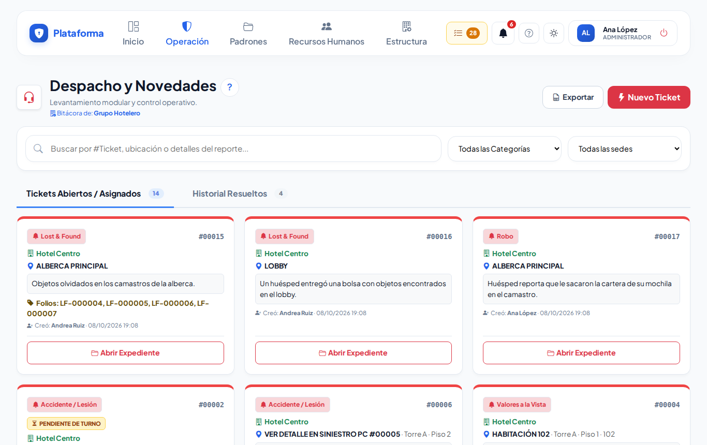
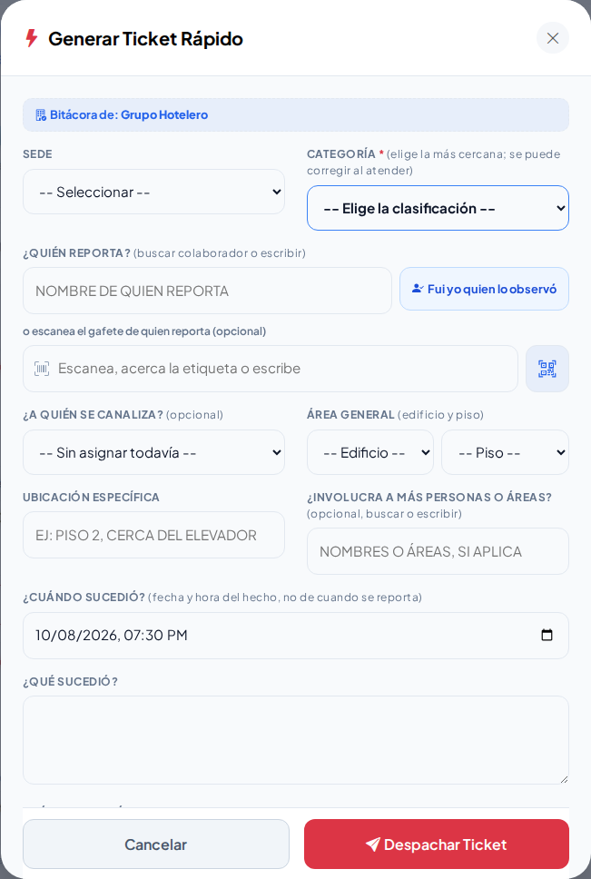
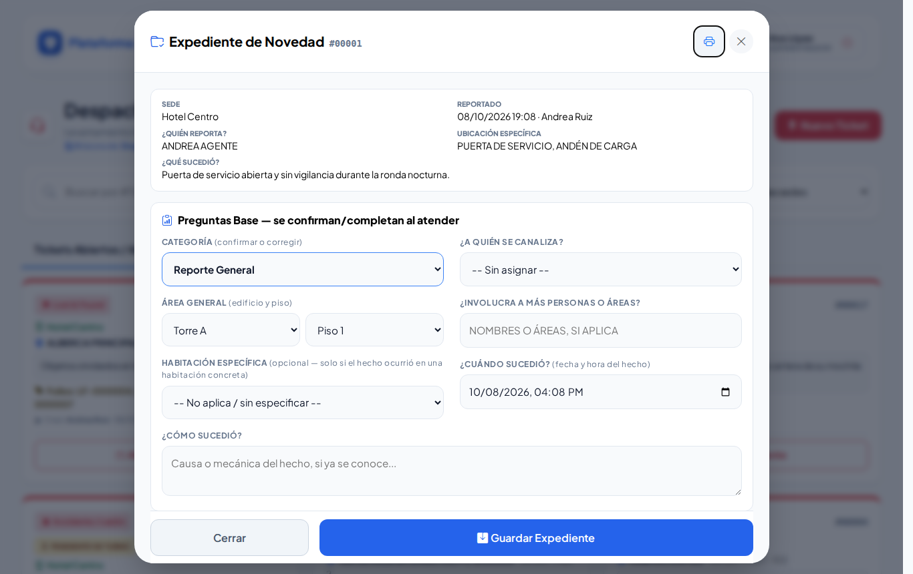
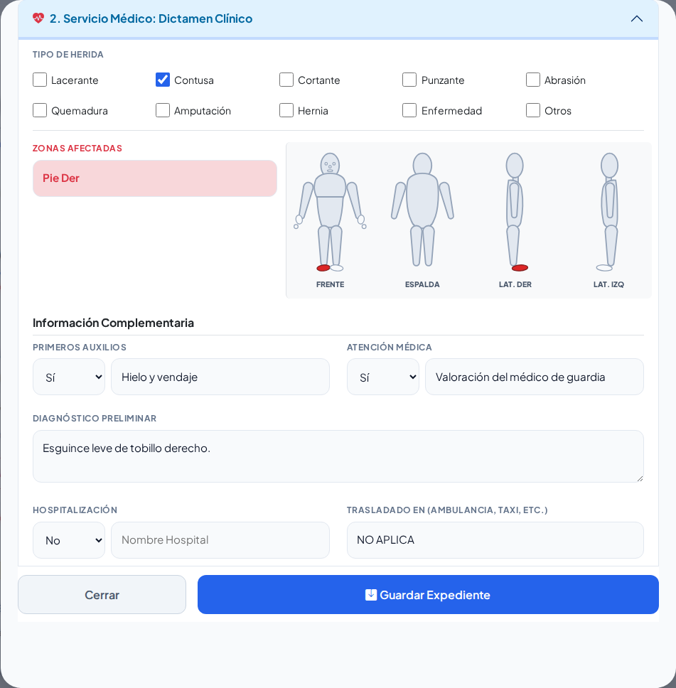
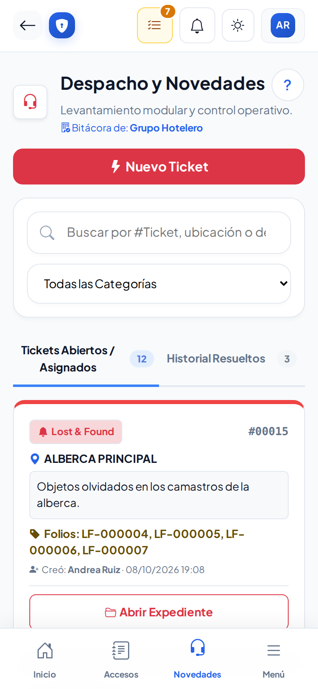

# Bitácora de novedades

**¿Para qué sirve?** Aquí se levanta un **ticket** por cada cosa que pasa en la sede (un accidente, un objeto olvidado, un robo, una habitación abierta con valores, un conato de incendio…) y se le da seguimiento hasta cerrarlo. El camino siempre es el mismo:

1. Alguien reporta algo → la caseta **despacha un ticket rápido**.
2. Quien atiende abre el **Expediente** y llena el formato de la categoría.
3. Cada avance se anota en el **Minuto a Minuto**.
4. Cuando todo está documentado, el caso se marca **Resuelto y Cerrado**.

**Antes de empezar:** necesitas que tu rol pueda **ver** y **crear** en Novedades (para atender, también **editar**). Reabrir casos y exportar son permisos aparte. Si no ves **Nuevo Ticket**, pide a tu administrador que revise tu rol.

## Cómo leer la lista

1. Entra a **Operación → Incidentes → Novedades** (en el celular, el botón **Novedades** de abajo).
2. Usa el buscador (número de ticket, ubicación o lo que se reportó) y los filtros de **categoría** y **sede**.
3. Tienes dos pestañas: **Tickets Abiertos / Asignados** (borde rojo) e **Historial Resueltos** (borde verde).

**Qué debes ver:** cada ficha con la categoría, el número (por ejemplo `#00012`), la sede, la ubicación, lo que pasó, quién lo creó y quién le dio seguimiento. Las que dicen **PENDIENTE DE TURNO** las atiende el siguiente turno.

## Cómo despachar un ticket rápido

1. Toca **Nuevo Ticket**. Se abre **Generar Ticket Rápido**.
2. Revisa la **Sede**.
3. Elige la **Categoría** (la más cercana; se puede corregir al atender).
4. En **¿Quién reporta?** escribe el nombre, **escanea su gafete**, o toca **Fui yo quien lo observó**.
5. Si ya sabes quién lo atiende, elige **¿A quién se canaliza?** (solo personal de Seguridad de la sede).
6. Elige el **Área General** (edificio y piso) y escribe la **ubicación específica** (por ejemplo «Piso 2, cerca del elevador»).
7. Revisa **¿Cuándo sucedió?** (ya trae la hora actual) y escribe **¿Qué sucedió?**.
8. Toca **Despachar Ticket**.

**Qué debes ver:** el ticket nuevo en **Tickets Abiertos / Asignados**. Si falta algo, el aviso sale en rojo **dentro** de la ventana y lo que escribiste se conserva.

## Cómo atender un ticket (Expediente)

1. En la ficha toca **Abrir Expediente** (o **Ver Expediente** si solo puedes consultar).
2. Arriba está el reporte inicial (no cambia). Revisa y completa las **Preguntas Base**: categoría, a quién se canaliza, área, habitación (si aplica), involucrados, cuándo y cómo sucedió.
3. Llena el **formato de la categoría** (ver tabla).
4. En la línea del **Minuto a Minuto** escribe lo que se hizo.
5. Toca **Guardar Expediente**.

**Qué debes ver:** tu nota aparece en el Minuto a Minuto con fecha, hora y tu nombre. Lo escrito ahí **no se puede borrar ni cambiar**.

| Categoría | Qué se captura |
|---|---|
| **Reporte General** | Quién fue observado, qué hacía, por qué y acciones inmediatas. |
| **Accidente / Lesión** | Formato de huésped o colaborador, dictamen médico con el mapa del cuerpo, anexo de guardavidas, Recursos Humanos y firmas. |
| **Valores a la Vista** | Habitación, personas, puertas y ventanas, caja fuerte y valores por zona. |
| **Siniestro Protección Civil** | Tipo de evento, alarma, evacuación, servicios externos, lesionados, daños y causa. Si hubo lesionados, se abre solo un ticket de Accidente ligado. |
| **Lost & Found (Objetos Perdidos)** | Artículos encontrados (folio LF-…) y reportes de pérdida (folio RP-…). |
| **Robo** | Circunstancias, qué se llevaron, sospechoso, testigos, policía y canalización. |

En los formatos largos cada apartado se abre o se cierra tocando su título; si tiene un error, se abre solo y dice **Revisar**.

## Cómo capturar un Accidente con sus firmas

1. En **Seguridad: Formato de Afectado** elige **Huésped / Cliente** o **Colaborador Interno** (para un colaborador, escanea su gafete: departamento y puesto se llenan solos).
2. En el **Dictamen Clínico** marca el tipo de herida y toca en el **mapa del cuerpo** las zonas afectadas.
3. En **Firmas Digitales de Cierre** elige quién firma, pídele que firme en el recuadro y toca **Guardar Esta Firma**. Repite con cada persona.
4. Toca **Guardar Expediente**.

**Qué debes ver:** las firmas guardadas aparecen en el expediente y en la hoja impresa (botón de la impresora, arriba a la derecha).

## Cómo cerrar o reabrir un caso

1. En **Estatus** elige **Resuelto y Cerrado (Documentación Completa)**.
2. Escribe en **Estatus Final / Resolución** cómo se concluyó (obligatorio).
3. Toca **Guardar Expediente**.
4. Para corregir un caso resuelto, toca **Reabrir Caso para Editar** y escribe el motivo.

**Qué debes ver:** el caso pasa a **Historial Resueltos** y se ve en solo lectura. La reapertura queda anotada en el Minuto a Minuto.

## Cómo exportar

1. Filtra lo que necesitas.
2. Toca **Exportar**.

**Qué debes ver:** un archivo de Excel (CSV) con exactamente lo que estás viendo. Solo aparece si tienes ese permiso.

## En el celular

## Si algo sale mal

| Mensaje o síntoma | Qué significa | Qué hacer |
|---|---|---|
| «Elige la clasificación del ticket (Categoría)…» | Falta la categoría. | Elige la más cercana. |
| «Escribe quién reporta (o toca «Fui yo quien lo observó»).» | Falta quién reporta. | Escribe el nombre o toca el botón. |
| «Escribe la ubicación específica (por ejemplo: Piso 2, cerca del elevador).» | Falta el lugar. | Escríbelo. |
| «Este caso ya está Resuelto. Para editarlo usa «Reabrir Caso para Editar» y escribe el motivo.» | El caso está cerrado. | Reábrelo con el motivo. |
| «Escribe el motivo antes de continuar: un caso resuelto no se puede reabrir sin justificación.» | Falta el motivo de reapertura. | Explica por qué se reabre. |
| No deja marcar Resuelto | Falta **Estatus Final / Resolución**. | Escribe cómo se concluyó. |
| Página «La acción no llegó completa» | Se perdió la conexión al guardar. | Regresa, abre el expediente y revisa si tus cambios ya están. |

## Preguntas frecuentes

- **¿Qué hago si no sé qué categoría es?** Elige la más cercana; quien atiende la puede corregir.
- **¿Puedo borrar algo del Minuto a Minuto?** No, así queda constancia de todo.
- **¿Quién ve los tickets de Lost & Found?** También quien solo tiene permiso de Lost & Found (por ejemplo, Ama de Llaves).
- **¿Cómo imprimo el expediente?** Con el botón de la impresora, arriba a la derecha del expediente.
- **¿Dónde se hacen los recorridos de Protección Civil?** En su propia pantalla: [Recorridos de Protección Civil](recorridos-pc.md).

## Relacionado

- [Lost & Found y Robo](lost-found-y-robo.md)
- [Recorridos de Protección Civil](recorridos-pc.md)
- [Bitácora de accesos](accesos.md)
