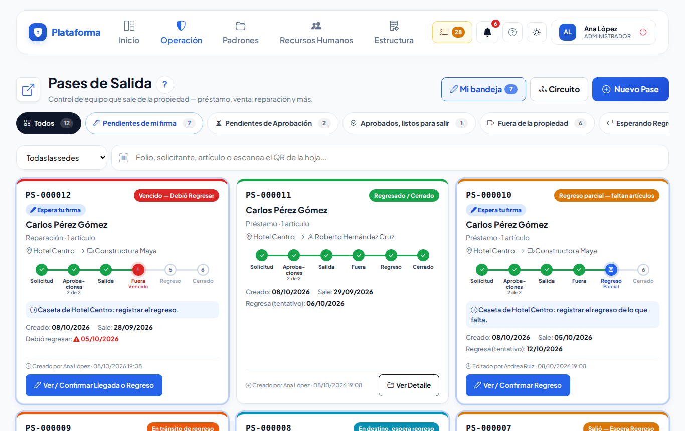
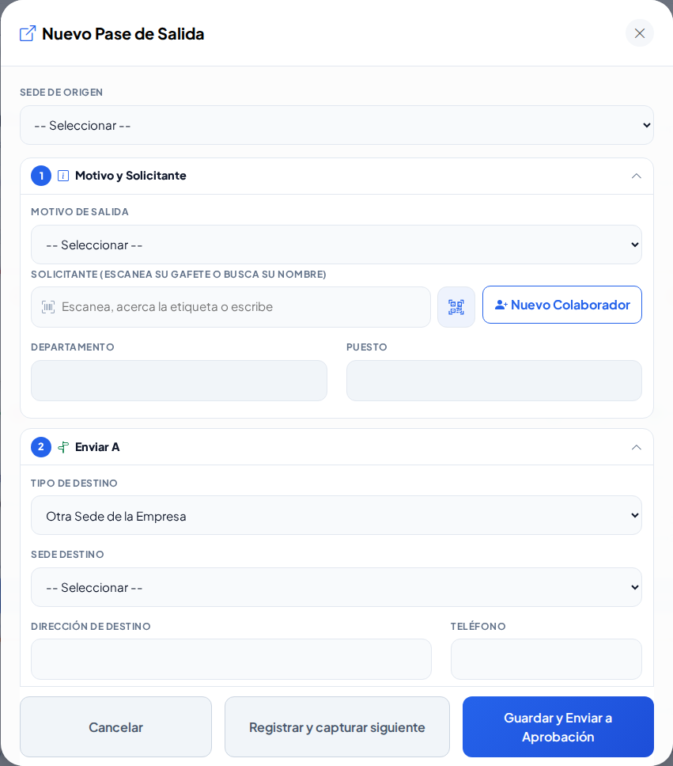
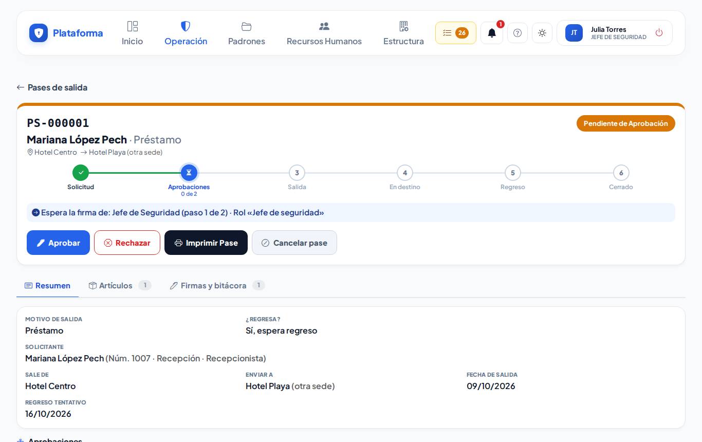
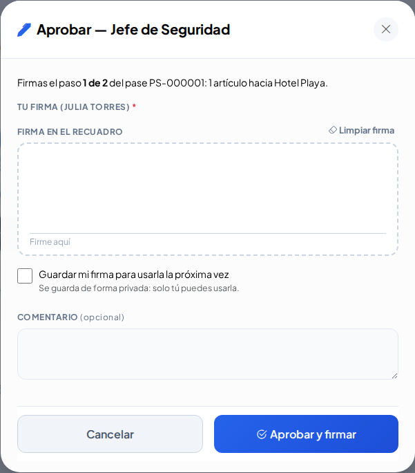
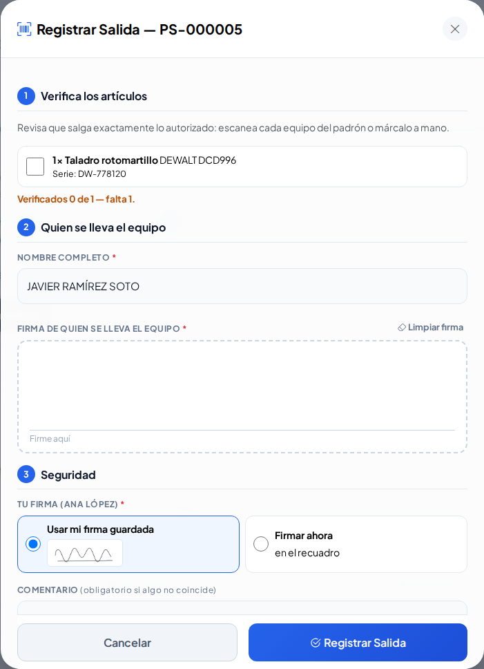
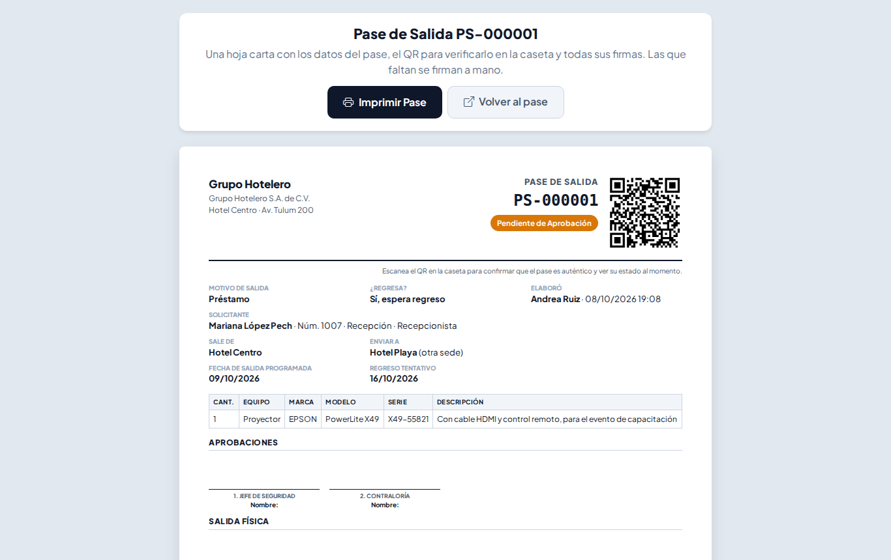
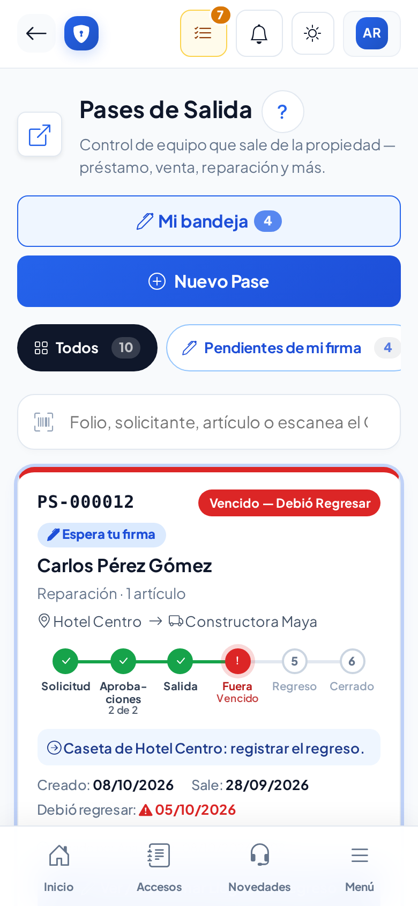

# Pases de salida

**¿Para qué sirve?** Para autorizar y seguir todo equipo que **sale de la sede**: un préstamo, una venta, una reparación, un traspaso a otra sede. Cada pase pasa por **aprobaciones** (en orden) y por la **caseta**; si el equipo debe volver, el pase no se cierra hasta que regresa.

**Antes de empezar:** según lo que hagas necesitas un permiso distinto en Pases de salida: **crear** (pedir pases), **aprobar** (firmar aprobaciones), **firmar** (caseta: salida, llegada y regreso) e **imprimir**. Si no ves un botón, tu rol no tiene ese permiso: pide ayuda a tu administrador.

## Cómo leer la lista

1. Entra a **Operación → Caseta → Pases de salida**.
2. Cada ficha tiene el **folio** (por ejemplo `PS-000123`), una **etiqueta de color** con el estado, el solicitante, el motivo y la **línea de pasos**: **Solicitud → Aprobaciones → Salida → En destino / Fuera → Regreso → Cerrado**.
3. El recuadro azul dice **quién debe actuar ahora** (por ejemplo «Espera la firma de: Contraloría (paso 2 de 3)»).
4. Usa las **píldoras** para filtrar: **Pendientes de mi firma**, **Vencidos**, **Fuera de la propiedad**, etc. En **Buscar** escribe el folio, el solicitante, el equipo o su serie, o escanea el QR de la hoja impresa.

**Qué debes ver:** los pases que te tocan llevan la etiqueta azul **Espera tu firma** y borde azul.

| Etiqueta | Qué quiere decir |
|---|---|
| **Pendiente de Aprobación** | Le faltan firmas de aprobación. |
| **Rechazado — devuelto al solicitante** | Hay que corregirlo y reenviarlo, o cancelarlo. |
| **Aprobado, listo para salir** | La caseta ya puede registrar la salida. |
| **Salió — Espera Regreso** | Ya salió y debe volver. |
| **Regreso parcial — faltan artículos** | Regresó una parte; falta lo demás. |
| **Vencido — Debió Regresar** | Pasó su fecha de regreso y no ha vuelto. ¡Dale seguimiento! |
| **Regresado / Cerrado** | Terminó. |
| **Cancelado** | Se canceló antes de aprobarse. |

## Cómo pedir un pase nuevo

1. Toca **Nuevo Pase**. Si trabajas en una sola sede, la **Sede de Origen** ya viene elegida.
2. En **1. Motivo y Solicitante**: elige el **motivo** (la ventana te dice si el equipo debe regresar). Escanea el gafete del solicitante o escribe su nombre y elígelo. Si no aparece, toca **Nuevo Colaborador**.
3. En **2. Enviar A**: elige otra sede, un proveedor (si no está, **Nuevo Proveedor**) o un colaborador que se lo lleva. Si el equipo regresa, escribe la **Fecha Tentativa de Regreso**.
4. En **3. Artículos que Salen**: escanea la etiqueta del equipo del padrón (se llena solo) o escribe cantidad, equipo, marca, modelo, serie y descripción.
5. Toca **Guardar y Enviar a Aprobación** (o **Registrar y capturar siguiente** si harás otro).

**Qué debes ver:** el pase aparece como **Pendiente de Aprobación** y quien firma el primer paso recibe un aviso. Cada apartado (1, 2, 3) se puede cerrar tocando su título; si falta algo, se abre solo.

## Cómo aprobar o rechazar un pase

1. Toca **Mis pendientes** (arriba) o la píldora **Pendientes de mi firma** y abre el pase.
2. Revisa el **Resumen** y la pestaña **Artículos**.
3. Toca **Aprobar**. Firma con **Usar mi firma guardada** o **Firmar ahora** en el recuadro (marca «Guardar mi firma» para la próxima vez). Si quieres, escribe un comentario.
4. Toca **Aprobar y firmar**.
5. Si no estás de acuerdo, toca **Rechazar** y escribe el **motivo** (obligatorio).

**Qué debes ver:** el pase pasa al siguiente paso y la siguiente persona recibe su aviso. Si rechazaste, regresa al solicitante con tu motivo en rojo.

Reglas: los pasos van **en orden**; no puedes aprobar tu propio pase ni firmar dos pasos del mismo pase. Un paso **opcional** que no aplica se puede saltar con **Omitir paso**.

## Cómo corregir un pase rechazado

1. Abre el pase: el motivo del rechazo sale en rojo.
2. Toca **Corregir y reenviar**, cambia lo que te pidieron y escribe qué corregiste.
3. Toca **Guardar y Reenviar a Aprobación**. Si ya no se necesita, toca **Cancelar pase**.

**Qué debes ver:** las aprobaciones empiezan otra vez desde el primer paso.

## Cómo registrar en caseta la salida, la llegada y el regreso

1. Abre el pase (aparece en **Mis pendientes**) y toca el botón de la caseta: **Registrar Salida**, **Confirmar Llegada**, **Autorizar Salida de Regreso** o **Registrar Regreso**.
2. **Verifica los artículos**: escanea cada equipo del padrón o márcalo con el dedo. Para la salida deben estar **todos**.
3. Escribe el **nombre** de quien se lleva o entrega el equipo y pídele que **firme** en el recuadro.
4. Firma tú como Seguridad (con tu firma guardada es un solo toque) y guarda.
5. En el **regreso**, escribe cuántos regresan de cada artículo. Si lo que falta ya no volverá, marca **Cerrar el pase aunque falten artículos**.

**Qué debes ver:** la línea de pasos avanza. Si faltan artículos en el regreso, queda **Regreso parcial** y sigue esperando lo demás.

## Cómo imprimir y verificar un pase

1. En la ficha toca **Imprimir Pase**. Sale una hoja carta con el folio, un **código QR**, los artículos y las firmas.
2. En la caseta, escanea el QR con el celular: se abre una página que dice si el **pase es auténtico** y su estado en ese momento.

**Qué debes ver:** las firmas que faltan quedan con línea para firmar a mano.

## Cómo configurar quién aprueba (administrador)

1. Toca **Circuito** en la lista (o **Estructura → Configuración → Pases de salida**).
2. Para cada paso escribe su **nombre** (por ejemplo «Contraloría») y elige **quién firma**: cualquiera con permiso Aprobar, los usuarios de un **rol**, o **usuarios específicos**.
3. Indica si es **obligatorio** y a qué **motivos** aplica. Usa las flechas para el orden.
4. Toca **Guardar circuito**.

**Qué debes ver:** los pases nuevos siguen el circuito nuevo; los que ya están en curso conservan sus pasos.

## En el celular

## Si algo sale mal

| Mensaje o síntoma | Qué significa | Qué hacer |
|---|---|---|
| «Elige al solicitante: escanea su gafete, busca su nombre o regístralo con «Nuevo Colaborador».» | Falta el solicitante. | Escanea su gafete o búscalo. |
| «Agrega al menos un artículo que salga en el pase.» | No hay artículos. | Escanea o escribe al menos uno. |
| «Eres el solicitante de este pase: no puedes aprobarlo tú.» | No se aprueba lo propio. | Lo aprueba otra persona del circuito. |
| «Escribe el motivo del rechazo: el solicitante lo verá para corregir su pase.» | El rechazo necesita motivo. | Escribe qué hay que corregir. |
| «Marca o escanea cada artículo que sale: faltan …» | No verificaste todos los artículos. | Escanea o marca los que faltan. |
| «Escribe el nombre de quien se lleva el equipo.» | Falta quién recibe. | Escribe su nombre y pide su firma. |
| Recuadro amarillo «Espera la firma de …» | No te toca firmar este paso. | Espera a que firme la persona indicada. |

## Preguntas frecuentes

- **¿Cómo sé qué pases me tocan?** Abre **Mis pendientes** o la píldora **Pendientes de mi firma**.
- **¿Qué pasa si el equipo no regresa a tiempo?** El pase se marca **Vencido — Debió Regresar** y se envía un recordatorio.
- **¿Puedo hacer el pase desde el celular?** Sí, todo funciona igual.
- **¿Puedo borrar un pase?** No; si ya no se necesita, se cancela antes de aprobarse.

## Relacionado

- [Menús, Mis pendientes y modos de pantalla](menus.md)
- [Equipos de seguridad](equipos.md)
- [Bitácora de accesos](accesos.md)
