# Pases de salida

Operación → Caseta y Control → **Pases de salida**. Aquí se autoriza y se sigue todo equipo que **sale de la sede**: un préstamo, una venta, una reparación, un traspaso… Cada pase pasa por varias **firmas** y, si el equipo debe volver, no se cierra hasta que regresa.

## Cómo se lee una tarjeta

- **PS-000123 — Nombre**: el folio del pase y quién lo pidió (el solicitante).
- Debajo: el motivo, cuántos artículos salen, cuándo se creó, cuándo sale y cuándo debe regresar.
- **Sede → destino**: de dónde sale y a dónde va (otra sede, un proveedor o un colaborador).
- La **etiqueta de color** dice en qué va:

| Etiqueta | Qué quiere decir |
|---|---|
| **Pendiente de Aprobación** (naranja) | Falta que lo aprueben Jefe de Departamento, Contraloría y Gerencia. |
| **Aprobado, listo para salir** (azul) | Ya puede salir; en caseta se firma la salida. |
| **Salió — Espera Regreso** (naranja) | Ya salió y debe volver. |
| **Salió — Cerrado** (verde) | Salió y no regresa (venta o traspaso definitivo). Terminó. |
| **En destino, espera regreso** (turquesa) | Llegó a la otra sede. |
| **En tránsito de regreso** (naranja fuerte) | Viene de vuelta. |
| **Regresado / Cerrado** (verde) | Regresó. Terminó. |
| **Rechazado** (rojo) | No se aprobó. |
| **Vencido — Debió Regresar** (rojo) | Ya pasó su fecha de regreso y no ha vuelto. ¡Hay que dar seguimiento! |

## Buscar y filtrar

- Toca un filtro: **Todos**, **Pendientes de Aprobación**, **Aprobados, listos para salir**, **Fuera de la propiedad**, **Esperando Regreso** o **Vencidos**. El número dice cuántos hay.
- Escribe en **Buscar** el folio, el nombre o número de empleado del solicitante, o el equipo o su número de serie, y toca **Buscar**. **Limpiar** quita la búsqueda.
- Si ves varias sedes, elige una en la lista.

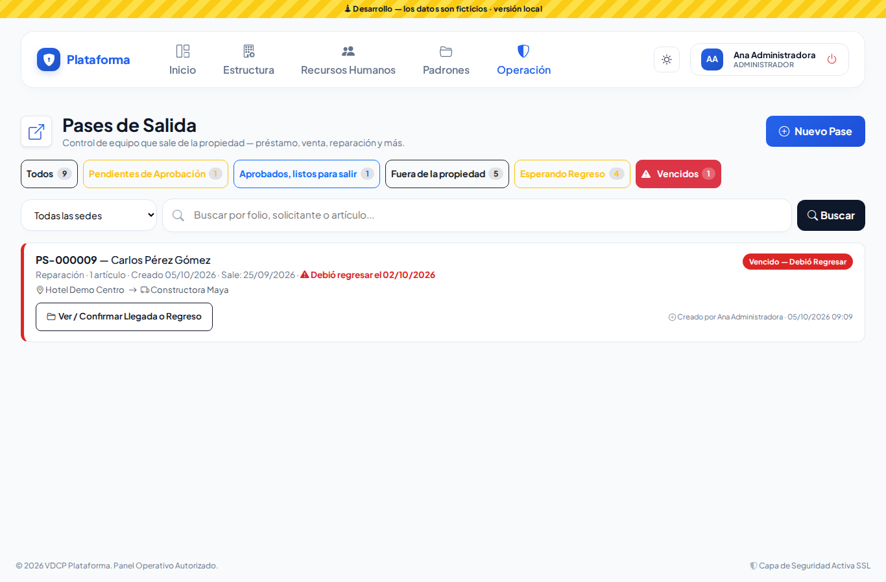

## Hacer un pase nuevo

1. Toca **Nuevo Pase**. Si trabajas en una sola sede, la **Sede de Origen** ya viene elegida.
2. **1. Motivo y Solicitante**
   - Elige el **Motivo de Salida**. El sistema te dice si el equipo debe regresar.
   - **Solicitante**: escanea su gafete (o acerca su tarjeta) o escribe su nombre y elígelo de la lista. Se llenan solos su **Departamento** y **Puesto**.
   - ¿No aparece? Toca **Nuevo Colaborador**: lo registras en el momento (alta provisional) y Recursos Humanos lo revisa después.

   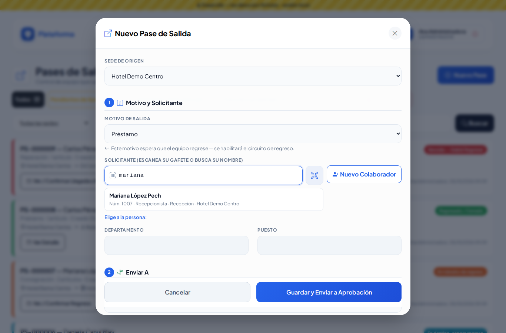
3. **2. Enviar A**
   - Elige el **Tipo de Destino**: otra sede, un proveedor o un colaborador que se lo lleva.
   - Al elegir la sede o el proveedor, la **dirección** y el **teléfono** se llenan solos (puedes corregirlos).
   - ¿El proveedor no está? Toca **Nuevo Proveedor**.
   - La **Fecha de Salida** trae la de hoy. Si el equipo regresa, escribe la **Fecha Tentativa de Regreso**: con ella el sistema te avisa cuando se venza.

   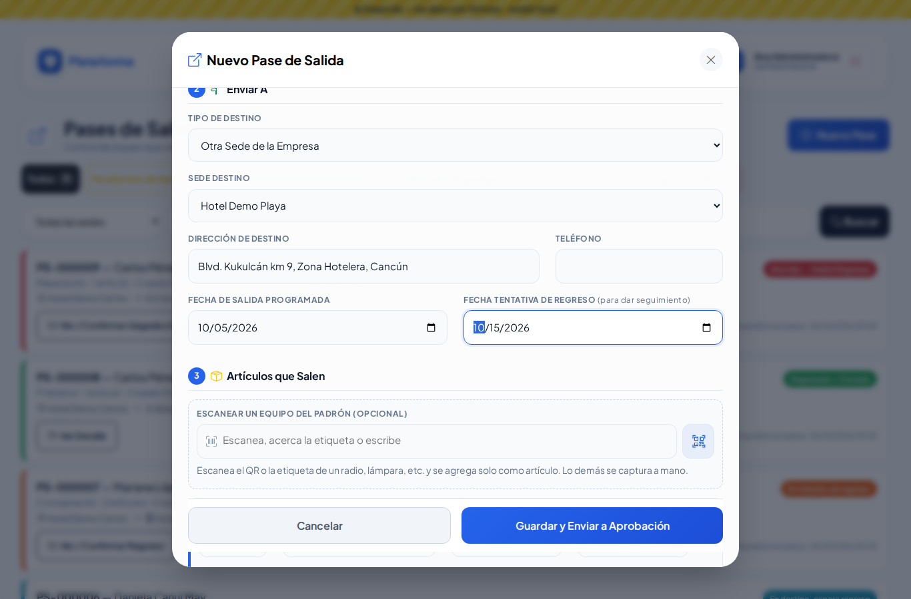
4. **3. Artículos que Salen**
   - Si es un radio, una lámpara u otro equipo del padrón, **escanea su etiqueta**: se llena el renglón solo.
   - Si no, escribe cantidad, equipo, marca, modelo, serie y descripción. **Agregar artículo** suma otro renglón; el bote de basura lo quita.

   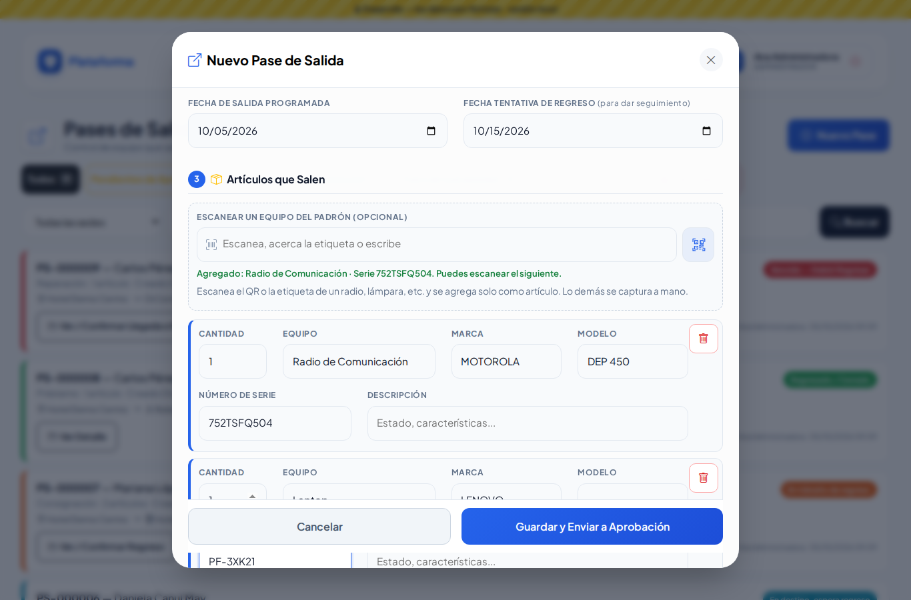
5. Toca **Guardar y Enviar a Aprobación**. El pase queda **Pendiente de Aprobación** con su folio.

Si falta algo, el mensaje aparece en rojo **dentro de la ventana** y no pierdes lo capturado.

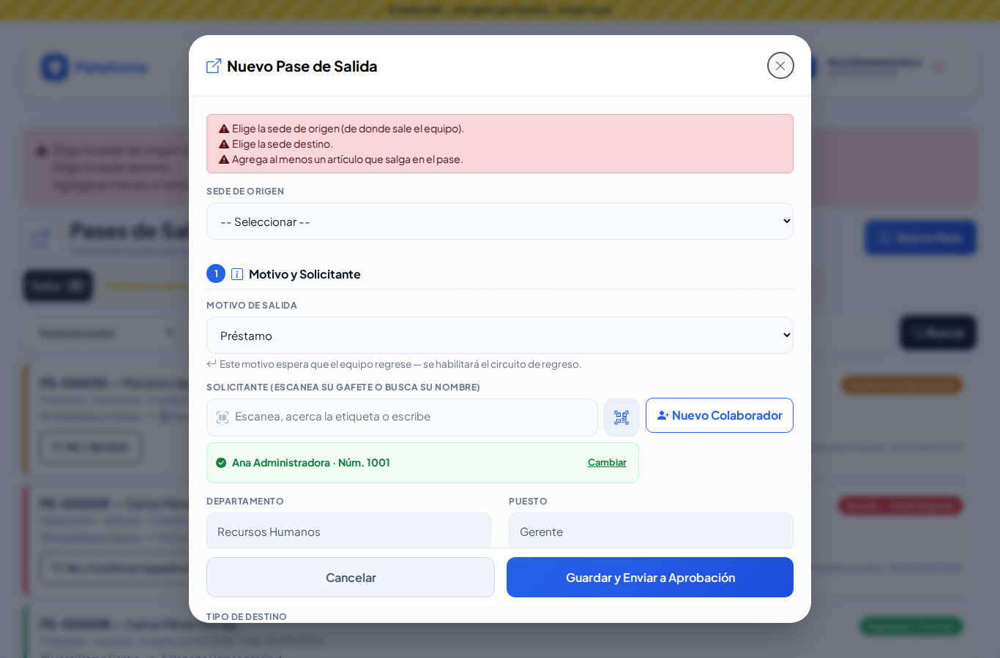

## Firmar

1. En la tarjeta toca el botón (**Ver / Aprobar**, **Ver / Registrar Salida**…). Se abre **Firmas del pase**.
2. Revisa los **artículos**: deben coincidir con lo que sale, llega o regresa.
3. En la sección que está **En curso**, toca **Firmar** junto al rol (por ejemplo **Gerencia** o **Seguridad**).
4. Firma con el dedo o el mouse en el recuadro (**Limpiar firma** para repetir) y revisa el **nombre completo** de quien firma (a veces ya viene escrito).
5. Toca **Guardar Firma**. Cuando firman **todos** los de la sección, el pase avanza solo.

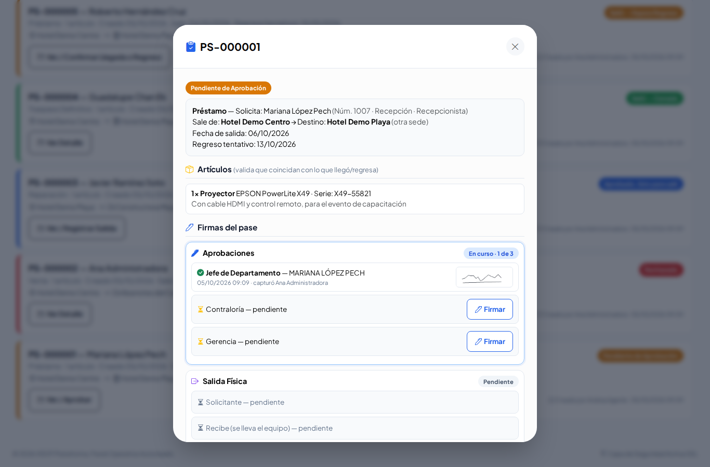
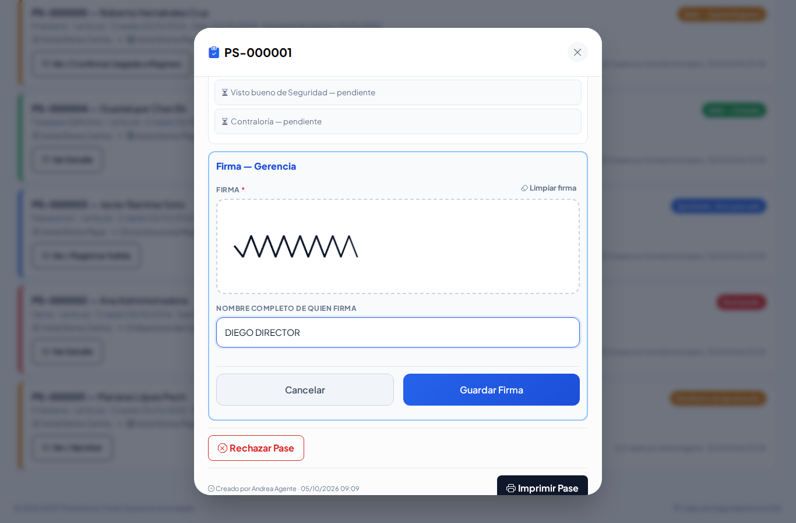

### Quién firma cada parte

| Sección | Quién | Dónde |
|---|---|---|
| **Aprobaciones** | Jefe de Departamento, Contraloría, Gerencia | Sede de origen (requiere permiso **Aprobar**) |
| **Salida Física** | Solicitante, quien se lo lleva, Seguridad | Caseta de la sede de origen |
| **Recepción en Destino** | Quien lo trasladó, quien recibe, Seguridad, Contraloría | La otra sede (solo si va a otra sede) |
| **Salida de Regreso** | Jefe, Contraloría, Gerencia, Solicitante, Seguridad y quien lo trae de vuelta | La otra sede |
| **Recepción de Regreso** | Quien recibe, quien lo entrega, Seguridad, Contraloría | Sede de origen |

Si tu usuario no puede firmar una parte, el sistema te lo dice en un recuadro amarillo.

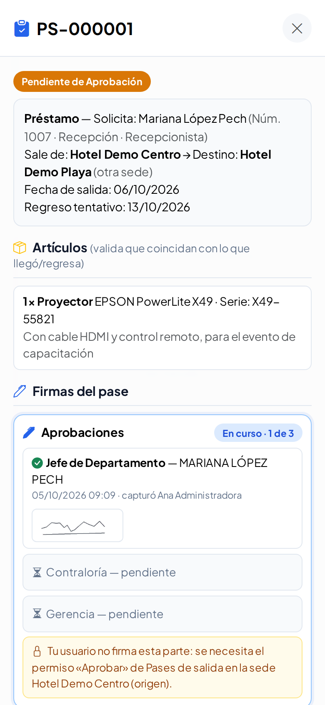

## Rechazar

Solo mientras está **Pendiente de Aprobación**: toca **Rechazar Pase**, escribe el motivo y **Confirmar Rechazo**. Ya no podrá aprobarse.

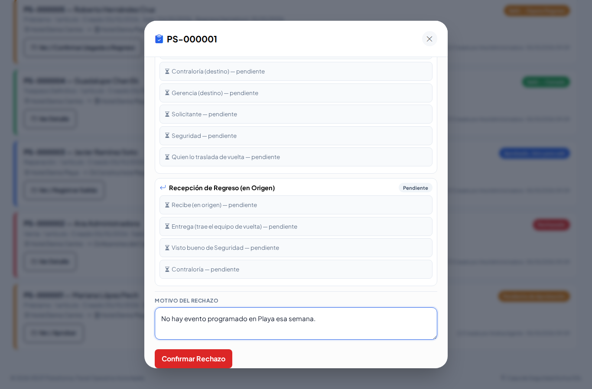

## Imprimir

En **Firmas del pase** toca **Imprimir Pase**: sale una hoja carta con los datos, los artículos y todas las firmas. Las que faltan quedan con línea para firmar a mano.

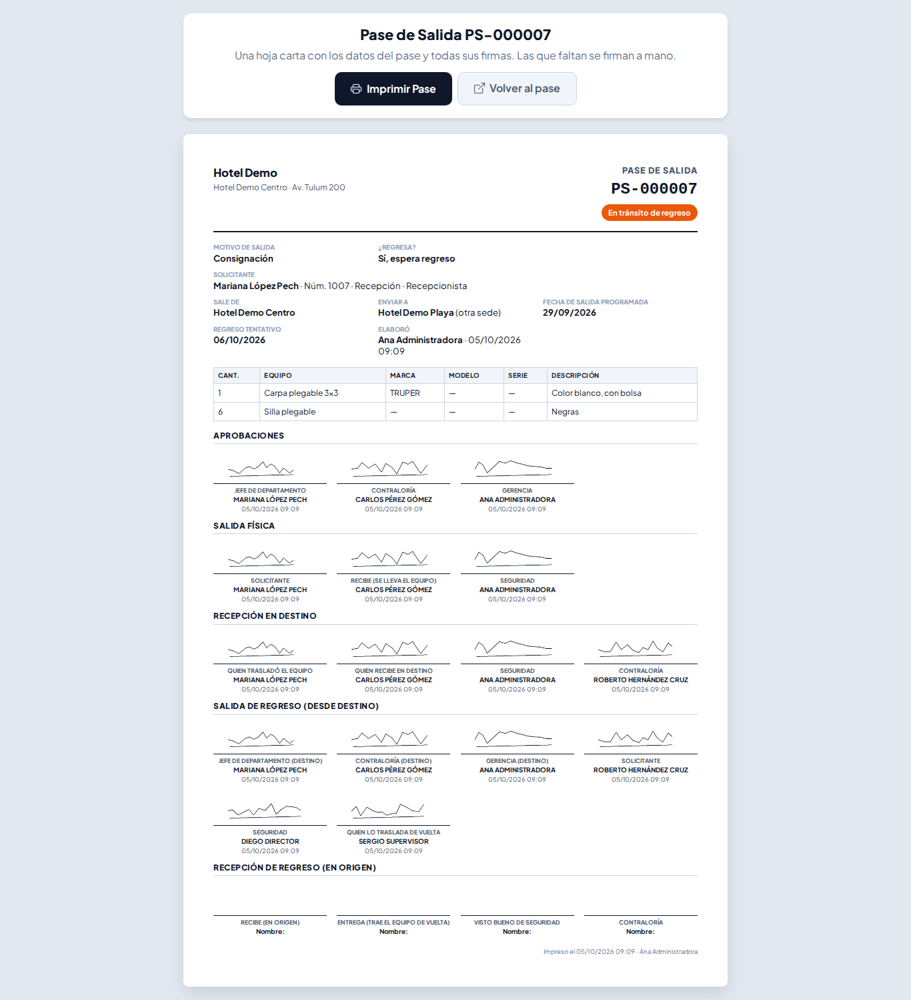

## En el celular y de noche

Todo funciona igual en el celular. Con el botón del sol eliges **Sol** (alto contraste para exteriores) o **Noche**.

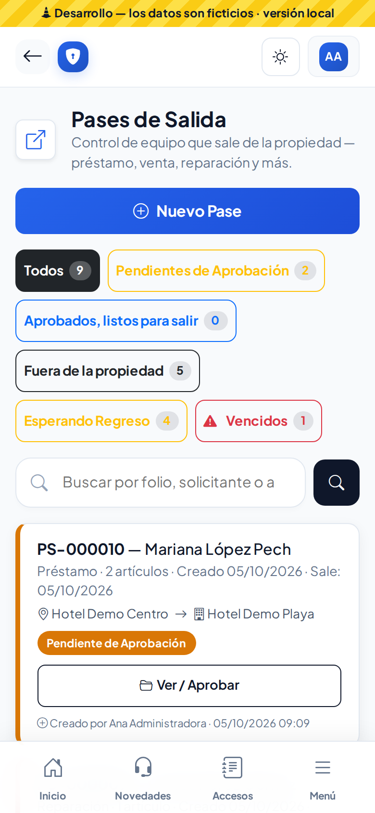
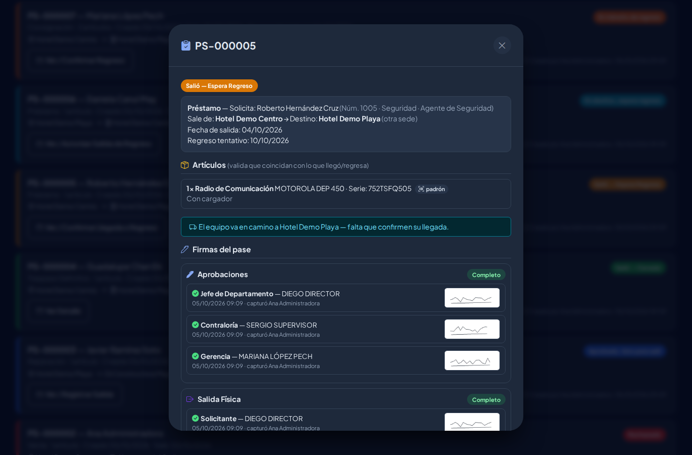

