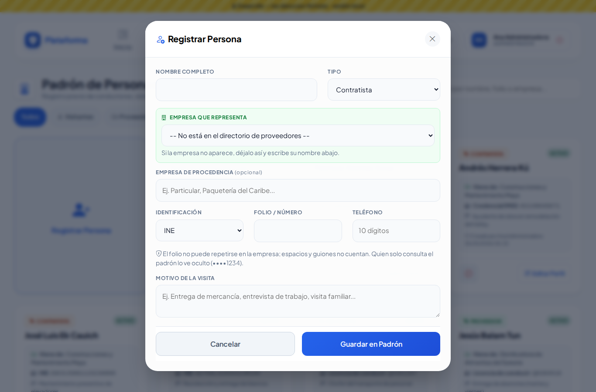
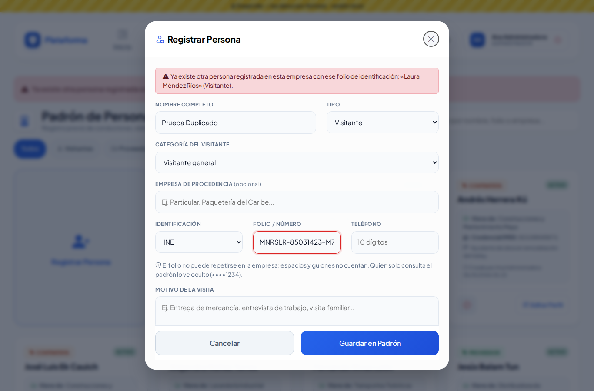
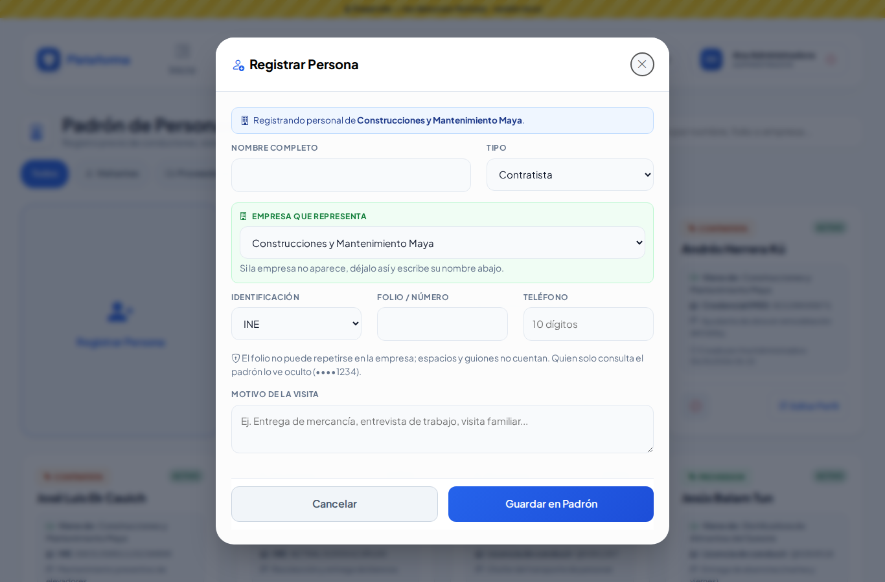
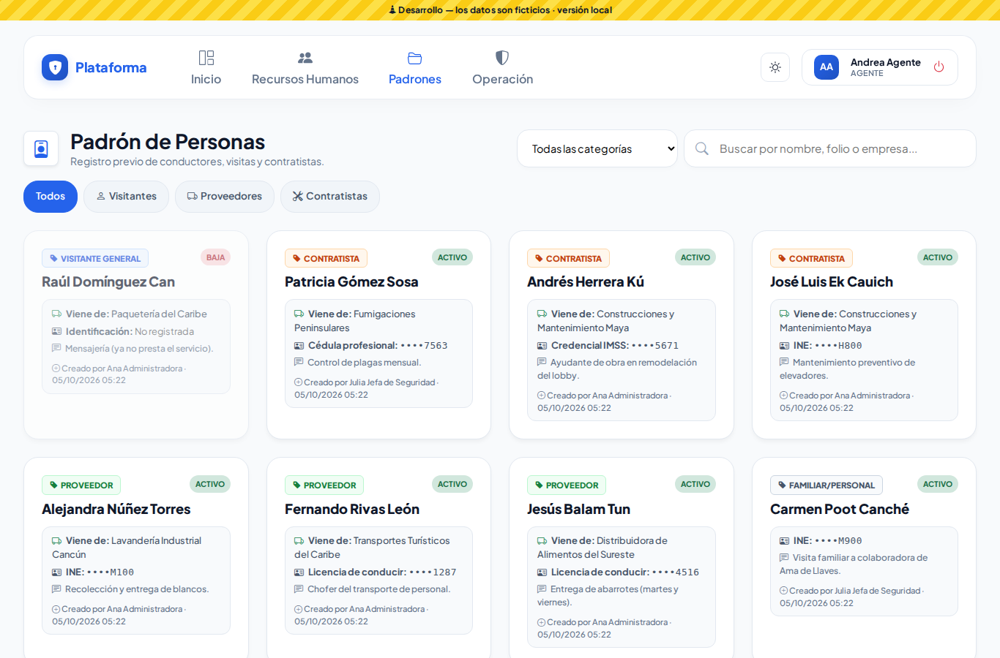
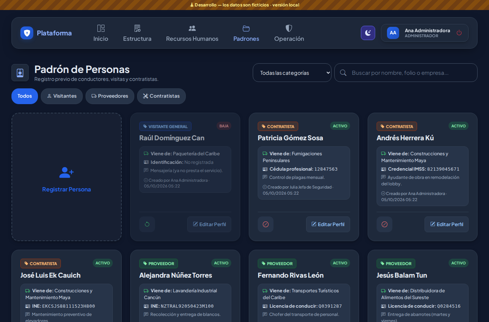
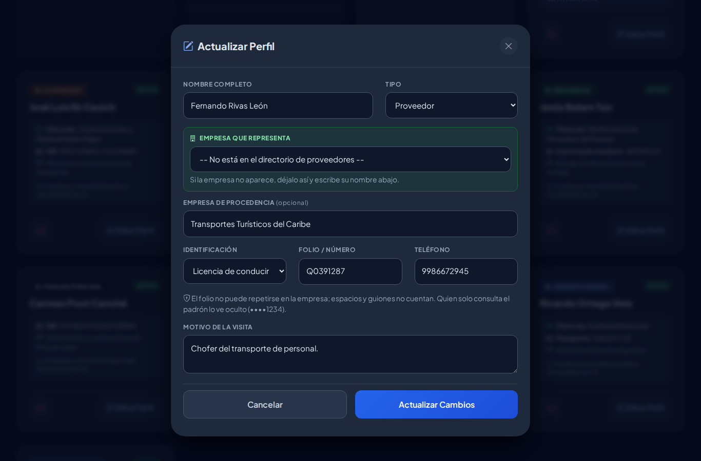
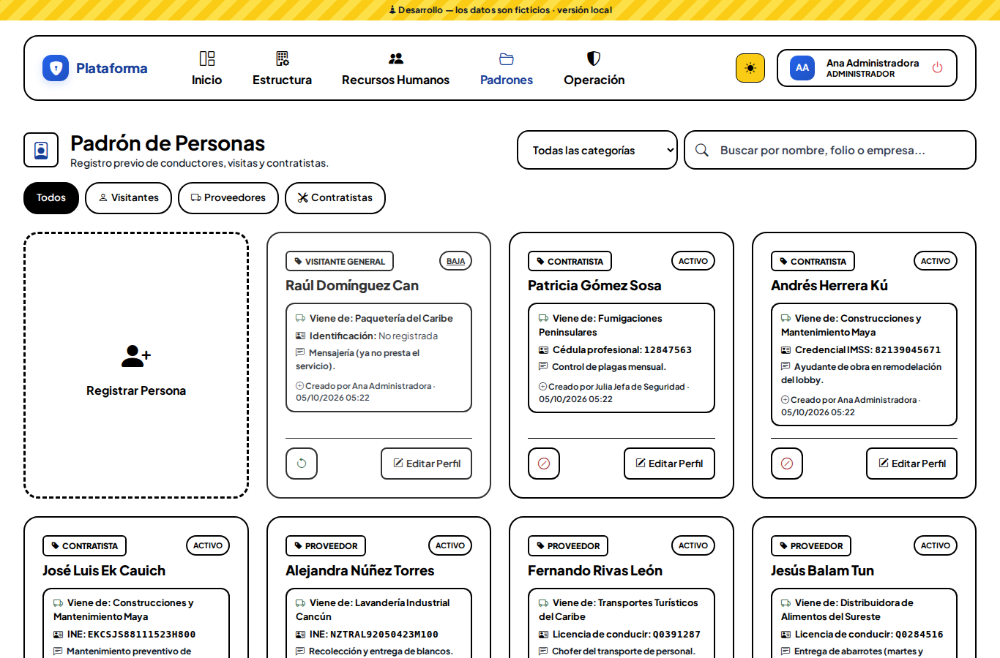

# Padrón de personas

El registro previo de las personas externas que entran a la empresa: **Padrones → Padrón de personas**. Aquí están los visitantes (generales, candidatos de Recursos Humanos y familiares), el personal de los proveedores y los contratistas. La caseta los busca aquí para registrar su acceso sin capturar todo cada vez.

Cada ficha muestra:

- **Tipo** (arriba a la izquierda): *Visitante general*, *Candidato/Prospecto*, *Familiar/Personal*, *Proveedor* o *Contratista*, cada uno con su color.
- **ACTIVO** o **BAJA**.
- **Viene de:** la empresa que representa o de donde viene.
- **Identificación:** tipo y folio. Si tu rol solo consulta el padrón, el folio se ve oculto (por ejemplo, `INE: ••••H800`).
- El motivo de la visita y quién la registró o editó, con fecha y hora.

## Buscar y filtrar

- Escribe en el buscador un nombre, una empresa o un folio.
- Toca **Visitantes**, **Proveedores** o **Contratistas** para ver solo ese tipo; **Todos** los vuelve a mostrar.
- Con la lista de categorías ves solo a los *Visitantes generales*, *Candidatos/prospectos* o *Familiares*.

## Registrar una persona

1. Toca **Registrar Persona**.
2. Escribe el **Nombre Completo** y elige el **Tipo**.
3. Si es **Visitante**, elige su **Categoría**: visitante general, candidato/prospecto (viene a una entrevista) o familiar/personal.
4. Si es **Proveedor** o **Contratista**, elige en **Empresa que representa** la empresa del directorio de proveedores. Si no aparece, déjalo en *No está en el directorio* y escribe su nombre en **Empresa de procedencia**.
5. **Identificación:** elige el tipo (INE, pasaporte, licencia…) y escribe el **folio**. Puedes escribirlo con espacios o guiones: se guardan solos sin ellos.
6. **Teléfono** (opcional): de 10 a 15 dígitos; puedes escribir espacios, guiones o paréntesis.
7. **Motivo de la Visita** (opcional).
8. Toca **Guardar en Padrón**. La lista se recarga y la ficha nueva queda resaltada.

### Si el folio ya existe

Un folio de identificación no puede repetirse en tu empresa. Si ya lo tiene alguien, el aviso te dice **quién** (por ejemplo, «Laura Méndez Ríos» (Visitante)). Búscala en la lista: probablemente ya está registrada.

## Registrar al personal de un proveedor

Desde la ficha de un proveedor, el botón para agregar personal abre aquí el alta con la empresa y el tipo ya elegidos (contratista o proveedor, según la empresa) y el aviso «Registrando personal de …». Al guardar regresas a la ficha del proveedor. Si cierras el diálogo sin guardar, te quedas en el padrón.

## Editar

Toca **Editar Perfil** en la ficha, corrige y toca **Actualizar Cambios**. Si tu rol solo puede editar lo que tú registraste, el botón aparece solo en tus fichas.

## Dar de baja y reactivar

- **⊘** da de baja a la persona (ya no aparece al buscarla en la caseta). No se borra: su historial se conserva.
- **↺** la reactiva.

Editar el perfil nunca cambia si está activa o de baja.

## Lo que ve cada rol

| Rol (plantilla) | Puede |
|---|---|
| Administrador, Jefe de seguridad | Todo: registrar, editar, dar de baja y reactivar |
| Asistente | Registrar y editar |
| Supervisor | Registrar y editar |
| Director, Agente | Solo consultar (folio oculto) |

## En el celular y en modo Noche

La pantalla se acomoda al celular y respeta los modos **Sol** y **Noche**.

