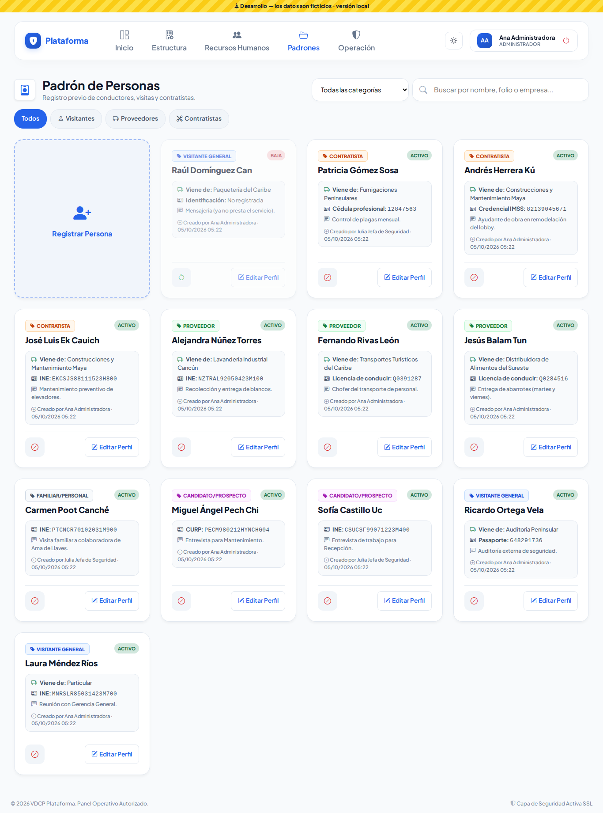
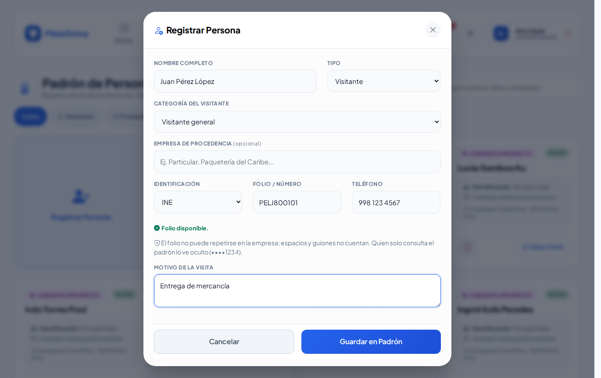
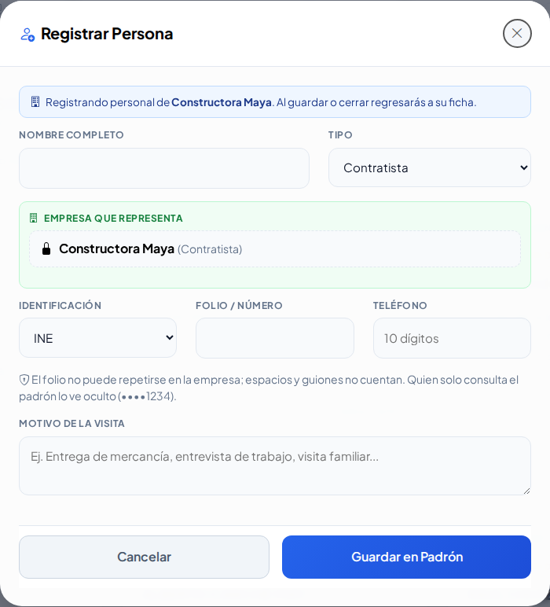
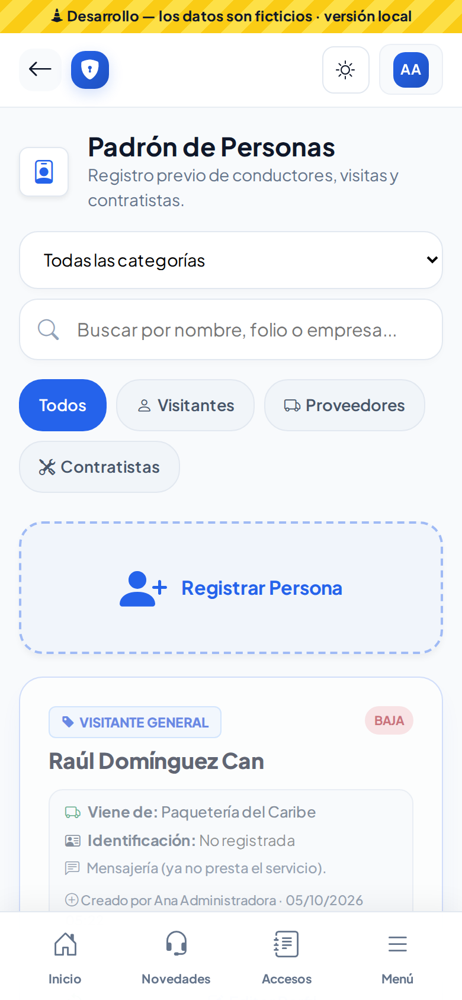
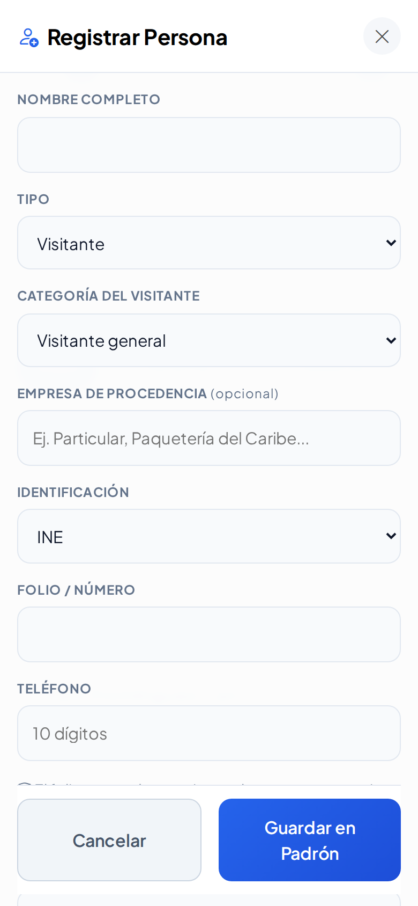
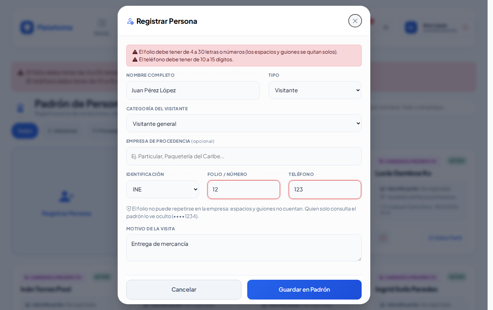

# Padrón de personas

**¿Para qué sirve?** Aquí se registran **antes de que lleguen** las personas externas que entran a la sede: visitantes (generales, candidatos de Recursos Humanos y familiares), el personal de los proveedores y los contratistas. Así, en la caseta solo se buscan y se registra su entrada sin volver a capturar todo.

## Antes de empezar

- Para **ver** el padrón necesitas que tu rol pueda consultar el *Padrón de personas*. Si no lo ves en el menú, pide a tu administrador que te dé ese permiso.
- Para **registrar**, **editar** o **dar de baja** necesitas además esos permisos. Si no ves el botón **Registrar Persona** o el botón **Editar Perfil**, tu rol solo puede consultar.
- Si tu rol solo consulta, el folio de la identificación se ve oculto (por ejemplo `INE: ••••1234`). Es normal: protege los datos de la persona.

## Cómo encontrar a una persona

1. Entra a **Padrones → Padrón de personas**.
2. Escribe en el buscador **Buscar por nombre, folio o empresa...** parte del nombre, el folio o la empresa.
3. Si quieres ver solo un tipo, toca **Visitantes**, **Proveedores** o **Contratistas**. **Todos** vuelve a mostrar a todos.
4. Para los visitantes, usa la lista **Todas las categorías** y elige *Visitante general*, *Candidato/prospecto* o *Familiar/personal*.
5. El botón **Pendientes de verificar** muestra las personas que la caseta registró al momento y que aún nadie revisa (ver [Altas por verificar](altas-por-verificar.md)).

**Qué debes ver:** solo las fichas que coinciden. Cada ficha muestra el **tipo** (con su color), si está **ACTIVO** o en **BAJA**, la identificación, el motivo de la visita y quién la registró o editó, con fecha y hora.

## Cómo registrar una persona

1. Toca la tarjeta **Registrar Persona** (la primera de la lista).
2. Escribe el **Nombre Completo**.
3. Elige el **Tipo**: *Visitante*, *Proveedor* o *Contratista*.
4. Si es **Visitante**, elige la **Categoría del Visitante**: *Visitante general*, *Candidato/prospecto* (viene a una entrevista) o *Familiar/personal*.
5. Si es **Proveedor** o **Contratista**, elige en **Empresa que representa** su empresa. La lista cambia según el tipo:
   - *Contratista*: solo aparecen las empresas registradas como contratistas.
   - *Proveedor*: aparecen proveedores, transporte, agencias y taxis.
   - Si la empresa no aparece, deja **-- No está en el directorio de proveedores --** y escribe su nombre en **Empresa de procedencia**.
6. En **Identificación** elige el documento (INE, Pasaporte, Licencia de conducir, CURP, Cédula profesional, Credencial IMSS u Otra) y escribe el **Folio / Número**. Puedes escribirlo con espacios o guiones: se quitan solos.
7. **Teléfono** (opcional): de 10 a 15 dígitos. Puedes escribir espacios, guiones o paréntesis.
8. **Motivo de la Visita** (opcional): por ejemplo «Entrega de mercancía».
9. Toca **Guardar en Padrón**.

**Qué debes ver:** el mensaje verde «Persona «Juan Pérez» registrada correctamente.» y la ficha nueva resaltada en la lista.

### Avisos mientras escribes

No tienes que esperar a guardar para saber si la persona ya existe:

- **Caja roja debajo del folio:** «Ese folio ya está registrado en la empresa (los espacios y guiones no cuentan). No se puede repetir.» Abajo dice de quién es. No podrás guardar: busca a esa persona en la lista. Si está dada de baja y puedes reactivarla, aparece el botón **Reactivar**: úsalo en lugar de registrarla otra vez.
- **Caja amarilla debajo del nombre:** «Ya hay personas con un nombre parecido. Revisa que no sea la misma antes de registrarla:». Es solo un aviso (dos personas pueden llamarse igual): revisa la lista y, si no es la misma, guarda normalmente.
- **Verde:** «Folio disponible.»

## Cómo registrar al personal de una empresa externa

1. Entra a **Padrones → Empresas externas** y toca **Ficha** en la empresa.
2. En la parte de personal toca **Agregar persona**.
3. Se abre **Registrar Persona** con la empresa ya puesta y el aviso «Registrando personal de …». La empresa queda fija (no se puede cambiar).
4. Llena el resto de los datos y toca **Guardar en Padrón**.

**Qué debes ver:** al guardar **o al cerrar** la ventana regresas a la ficha de la empresa, con la persona en su personal.

## Cómo editar una persona

1. Busca la ficha y toca **Editar Perfil**.
2. Corrige los datos en la ventana **Actualizar Perfil**.
3. Toca **Actualizar Cambios**.

**Qué debes ver:** «Perfil de «Juan Pérez» actualizado correctamente.» Editar nunca cambia si la persona está activa o de baja.

> Si tu rol solo puede editar lo que tú registraste, el botón **Editar Perfil** solo aparece en tus fichas.

## Cómo dar de baja o reactivar a una persona

1. En la ficha toca el botón rojo de **Dar de baja** (círculo con raya).
2. Confirma con **Aceptar** el mensaje «¿Dar de baja este registro? Podrás reactivarlo con un clic.».
3. Para volver a activarla, toca el botón **Reactivar** (flecha circular) y confirma.

**Qué debes ver:** la ficha cambia a **BAJA**. Ya no aparece al buscarla en la caseta, pero **no se borra**: su historial de entradas se conserva.

## En el celular

La pantalla se acomoda al celular: los botones son grandes y la ventana de registro ocupa toda la pantalla. También respeta los modos **Sol** (alto contraste) y **Noche**.

 

## Si algo sale mal

Los mensajes aparecen dentro de la misma ventana, arriba, en rojo. Lo que ya escribiste se conserva.

| Mensaje o síntoma | Qué significa | Qué hacer |
|---|---|---|
| El nombre completo es obligatorio. | Dejaste vacío el nombre. | Escribe nombre y apellidos. |
| El folio debe tener de 4 a 30 letras o números (los espacios y guiones se quitan solos). | El folio es muy corto, muy largo o tiene signos. | Revisa el folio en la identificación. |
| El teléfono debe tener de 10 a 15 dígitos. | Faltan o sobran números. | Escribe el teléfono con lada (10 dígitos). |
| Ya existe otra persona registrada en esta empresa con ese folio de identificación: «…». | Ese folio ya es de otra persona. | Búscala en la lista; si está de baja, reactívala. |
| «…» no está registrada como Contratista: elige el tipo Proveedor o una empresa contratista. | El tipo y la empresa no coinciden. | Cambia el tipo o elige otra empresa. |
| «…» está registrada como Contratista: elige el tipo Contratista. | Elegiste *Proveedor* con una empresa contratista. | Cambia el tipo a *Contratista*. |
| El proveedor no existe en esta empresa o está desactivado. | La empresa se dio de baja mientras capturabas. | Elige otra o pide que la reactiven en Empresas externas. |
| No veo **Registrar Persona** ni **Editar Perfil**. | Tu rol solo consulta. | Pide el permiso a tu administrador. |
| El folio se ve con puntos (••••). | Tu rol solo consulta y el folio está protegido. | Es normal; quien puede editar lo ve completo. |

## Preguntas frecuentes

**¿Se puede borrar a una persona?** No. Se da de baja para que no aparezca en la caseta; su historial se conserva y la puedes reactivar cuando quieras.

**¿Por qué no me deja guardar el mismo folio dos veces?** Porque un folio identifica a una sola persona. Si ya existe, usa esa ficha.

**Dos personas se llaman igual, ¿puedo registrarlas?** Sí. El aviso amarillo solo te pide revisar; si son distintas, guarda normalmente.

**¿Qué pasa con las personas que registra la caseta al momento?** Quedan **pendientes de verificar** hasta que alguien con permiso las revise. Ver [Altas por verificar](altas-por-verificar.md).

**¿El folio tiene que llevar guiones?** No. Escríbelo como venga; los espacios y guiones se quitan solos.

## Relacionado

- [Empresas externas](proveedores.md)
- [Padrón vehicular](vehiculos.md)
- [Altas por verificar](altas-por-verificar.md)
- [Bitácora de accesos](accesos.md)
