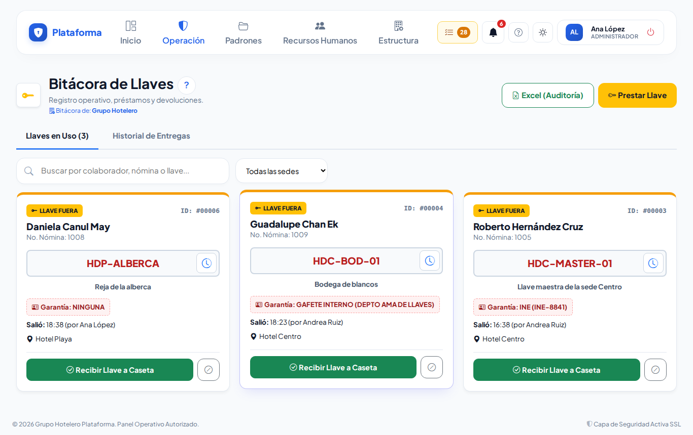
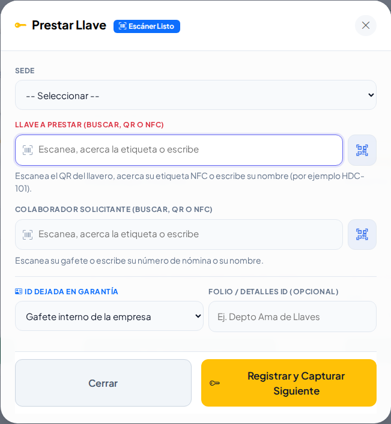
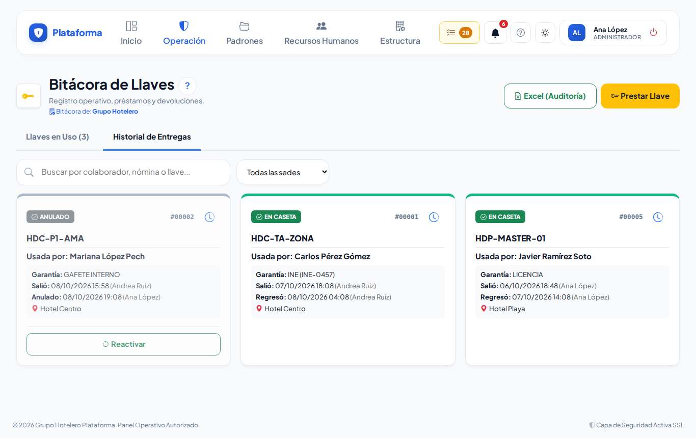
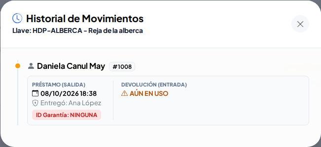
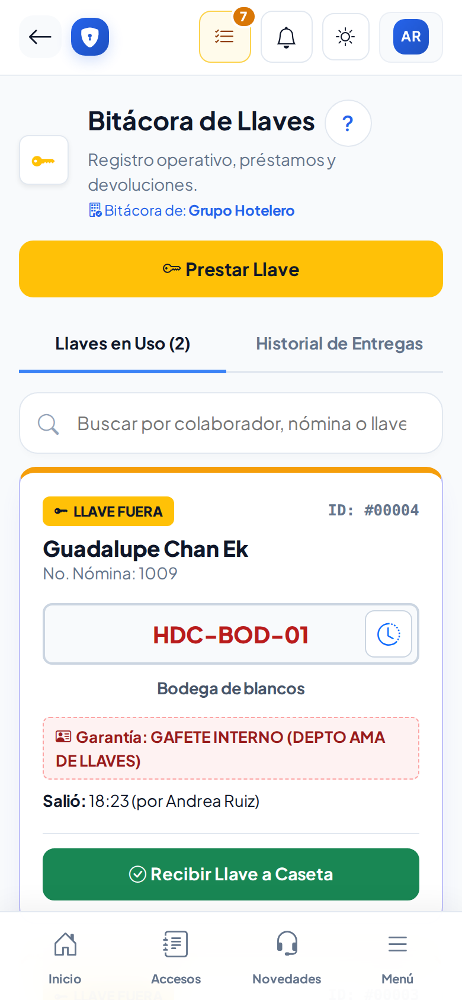

# Préstamo de llaves

**¿Para qué sirve?** Aquí la caseta anota **quién se lleva una llave**, qué identificación deja **en garantía** y **cuándo la regresa**. Así siempre sabes dónde está cada llave.

**Antes de empezar:** necesitas que tu rol pueda **ver** y **crear** en Préstamo de llaves. Las llaves se dan de alta antes en el [Catálogo de llaves](llaves.md); aquí solo se prestan y se reciben. Si no ves el botón **Prestar Llave**, pide a tu administrador que revise tu rol.

## Cómo leer la pantalla

1. Entra a **Operación → Caseta → Préstamo de llaves**.
2. Tienes dos pestañas:

| Pestaña | Qué ves |
|---|---|
| **Llaves en Uso** | Las llaves que están **fuera** ahora (borde ámbar, **LLAVE FUERA**). |
| **Historial de Entregas** | Las que ya regresaron (**EN CASETA**, borde verde) y los préstamos **ANULADOS** (gris). |

**Qué debes ver:** en cada ficha, el colaborador y su número de nómina, el nombre de la llave en rojo, lo que abre, la garantía que dejó y a qué hora salió y quién se la entregó.

## Cómo prestar una llave

1. Toca **Prestar Llave**. El cursor ya está en **Llave a Prestar**.
2. Revisa la **Sede**; si solo tienes una, ya viene elegida.
3. **Escanea la llave**: el QR del llavero con la cámara, su etiqueta NFC, el lector USB, o escribe su nombre (por ejemplo `HDC-101`) y elígela.
4. **Escanea el gafete** del colaborador, o escribe su número de nómina o su nombre y elígelo.
5. Elige la **ID Dejada en Garantía**: Gafete interno, INE, Licencia, Pasaporte o **Ninguna (Riesgo)**. Si quieres, escribe el folio o un detalle.
6. Toca **Registrar y Capturar Siguiente**.

**Qué debes ver:** el aviso verde «Llave … entregada a …». La ventana **no se cierra**: queda limpia para la siguiente persona. Cuando termines, toca **Cerrar**. La llave aparece en **Llaves en Uso**.

Reglas: solo se prestan llaves **activas**, de la **sede elegida** y que **no estén fuera**. El colaborador debe estar activo y trabajar en esa sede (un colaborador provisional dado de alta en caseta también puede llevarse una llave).

## Cómo recibir una llave

1. Busca su ficha en **Llaves en Uso** (puedes escribir el nombre, la nómina o la llave en **Buscar**).
2. Toca **Recibir Llave a Caseta** y confirma.
3. **Devuelve la identificación** que dejó en garantía.

**Qué debes ver:** la ficha pasa a **Historial de Entregas** con la hora de regreso y quién la recibió.

## Cómo anular un préstamo capturado por error

1. En la ficha, toca el botón gris **⊘** (Anular préstamo) y confirma.
2. Si después necesitas deshacerlo, en el historial toca **Reactivar**.

**Qué debes ver:** la llave queda disponible de inmediato y el préstamo aparece como **ANULADO**. Solo se anula una llave **en uso**; esta opción la tienen el Jefe de seguridad y el Administrador.

## Cómo ver el historial de una llave

1. Toca el **reloj** junto al nombre de la llave.
2. Revisa sus últimos movimientos: quién la usó, quién la entregó y quién la recibió.

**Qué debes ver:** si la llave sigue fuera, dice **AÚN EN USO**.

## Cómo descargar el reporte

1. Toca **Excel (Auditoría)**.
2. Si elegiste una sede en el filtro, solo baja esa sede.

**Qué debes ver:** un archivo de Excel (CSV) con folio, sede, llave, colaborador, garantía, salida, regreso, guardias y estado.

## En el celular

La pantalla se acomoda al celular: una ficha por renglón y la ventana de préstamo a pantalla completa.

## Si algo sale mal

| Mensaje o síntoma | Qué significa | Qué hacer |
|---|---|---|
| «Esa llave ya está fuera — la tiene … en este momento.» | Alguien no la ha regresado. | Pide que la regresen y recíbela antes de prestarla otra vez. |
| «La llave … es de otra sede. Elige la sede correcta o escanea otra llave.» | La llave no es de la sede elegida. | Cambia la sede o usa otra llave. |
| «La llave … está dada de baja: no se puede prestar.» | La llave ya no se usa. | Avisa a tu supervisor. |
| «Escanea el gafete o busca al colaborador que se lleva la llave.» | Falta el colaborador. | Escanea su gafete o búscalo. |
| «Elige la identificación que deja en garantía (o «Ninguna»).» | Falta la garantía. | Elige una opción de la lista. |
| «No se puede reactivar — esa llave ya se volvió a prestar…» | La llave ya tiene otro préstamo. | Deja el préstamo anulado. |
| No veo el botón **⊘** | Tu rol no puede anular. | Pide a tu jefe de seguridad que lo anule. |

## Preguntas frecuentes

- **¿Puedo prestar varias llaves seguidas?** Sí: la ventana se queda abierta con **Registrar y Capturar Siguiente**.
- **¿Qué pasa si el colaborador no deja identificación?** Elige **Ninguna (Riesgo)**; queda anotado.
- **¿Dónde veo quién tiene una llave desde el catálogo?** En el [Catálogo de llaves](llaves.md) la llave dice **EN USO** y **Usada por**.
- **¿Puedo borrar un préstamo?** No; se anula para que quede constancia.

## Relacionado

- [Catálogo de llaves](llaves.md)
- [Vouchers de reposición](vouchers.md)
- [Bitácora de accesos](accesos.md)
