# Préstamo de llaves

Operación → Caseta y Control → **Préstamo de llaves**. Aquí la caseta anota **quién se lleva una llave**, qué identificación deja **en garantía** y **cuándo la regresa**. Es la "Bitácora de Llaves" de siempre.

Las llaves se dan de alta en el [Catálogo de llaves](llaves.md). Aquí solo se prestan y se reciben.

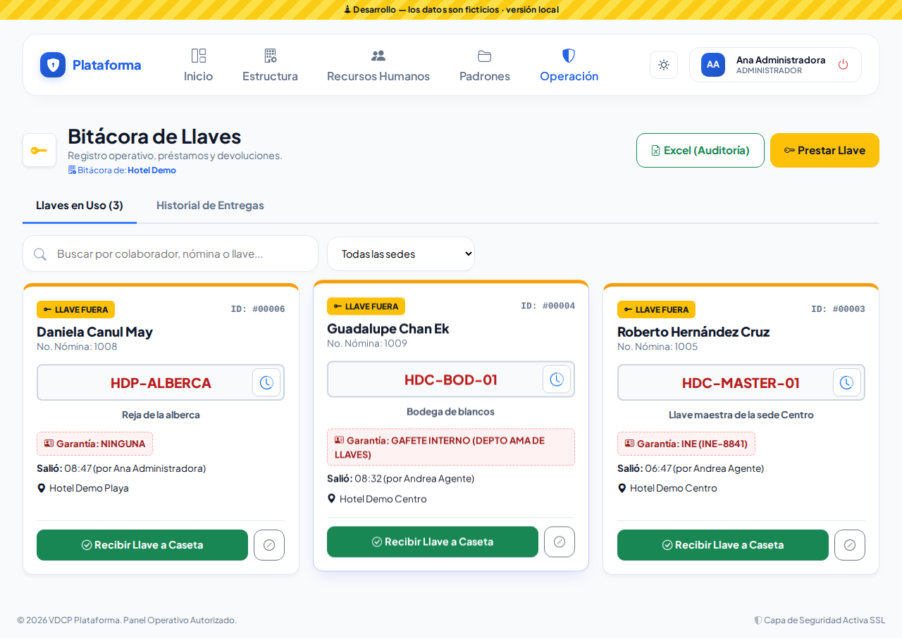

## Las dos pestañas

| Pestaña | Qué ves |
|---|---|
| **Llaves en Uso (N)** | Las llaves que están **fuera** de la caseta ahora mismo (ficha con borde **ámbar** y la etiqueta **LLAVE FUERA**). El número dice cuántas son. |
| **Historial de Entregas** | Las que ya regresaron (**EN CASETA**, borde verde) y los préstamos **ANULADOS** (gris). |

En cada ficha ves: el **colaborador** y su **No. Nómina**, el **nombre de la llave** en rojo, lo que abre, la **garantía** que dejó y a qué hora **salió** y quién se la entregó.

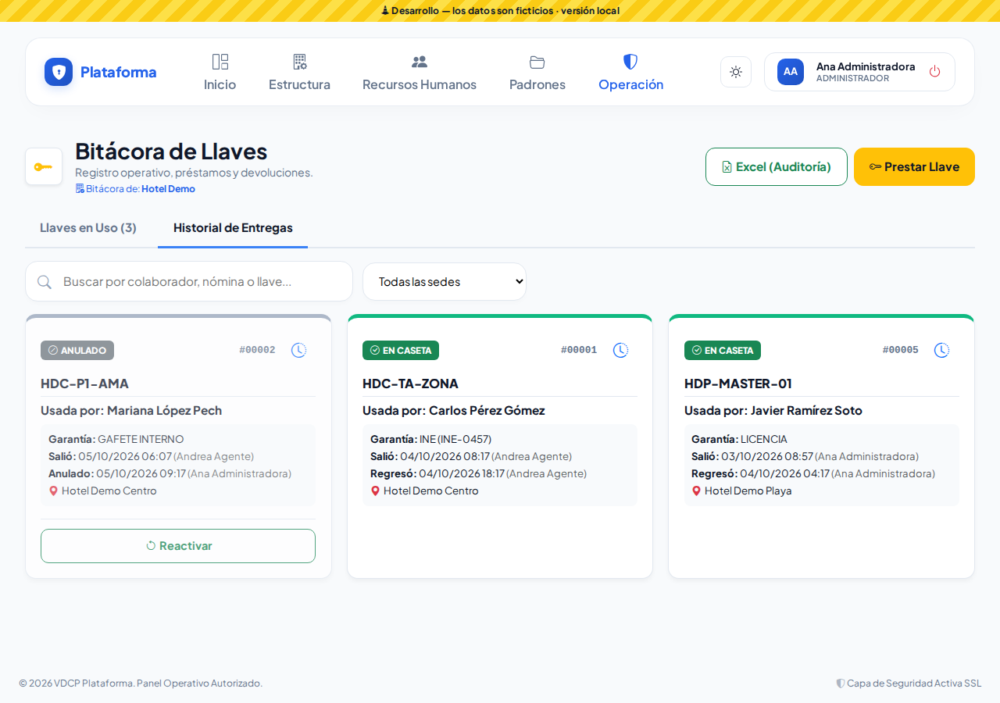

### Buscar

- Escribe en **Buscar** el nombre del colaborador, su número de nómina o el nombre de la llave. Busca en la pestaña que tengas abierta.
- Si trabajas en varias sedes, elige una en **Todas las sedes**.

## Prestar una llave (rápido, con el escáner)

1. Toca **Prestar Llave**. El cursor ya está listo en **Llave a Prestar**.
2. **Sede**: si solo tienes una, ya viene elegida.
3. **Escanea la llave**: el QR del llavero con la cámara (botón del código QR), acerca su etiqueta NFC, usa el lector USB o escribe su nombre (por ejemplo `HDC-101`): aparece solo, sin Enter.
   - Si esa llave **ya está fuera**, o es **de otra sede**, el sistema te avisa en rojo y no la deja elegida.
4. **Escanea el gafete** del colaborador (o escribe su número de nómina o su nombre).
5. Elige la **ID Dejada en Garantía**: Gafete interno, INE, Licencia, Pasaporte o **Ninguna (Riesgo)**. Si quieres, escribe el **folio** o un detalle (por ejemplo «Depto Ama de Llaves»).
6. Toca **Registrar y Capturar Siguiente**.

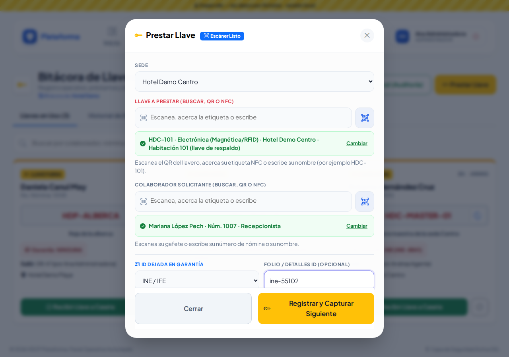

El cuadro **no se cierra**: aparece el aviso verde «Llave … entregada a …», la ficha nueva se agrega a **Llaves en Uso** y el cuadro queda limpio para la siguiente persona. Arriba ves cuántos préstamos llevas en esta captura. Cuando termines, toca **Cerrar**.

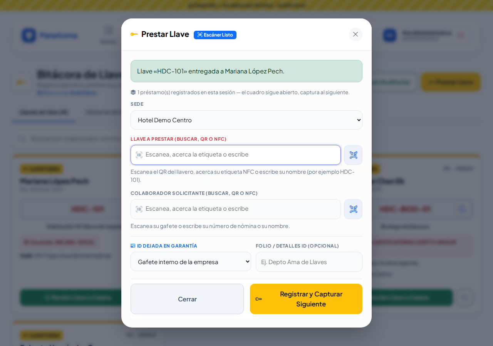

Si algo no está bien, el aviso rojo sale **dentro del cuadro** y lo que capturaste se queda:

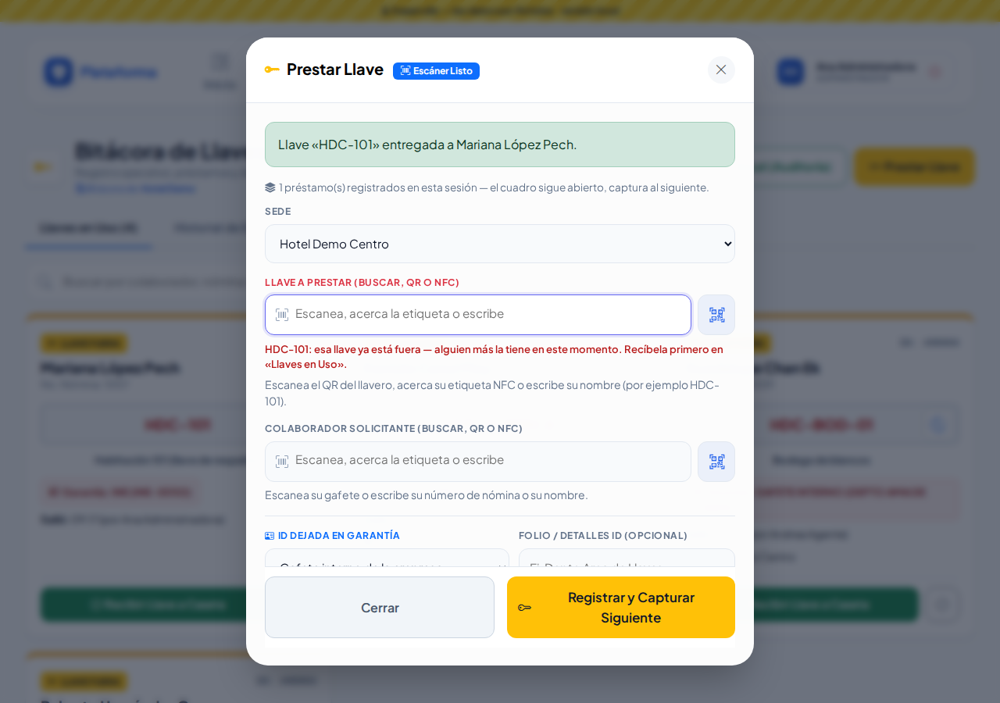
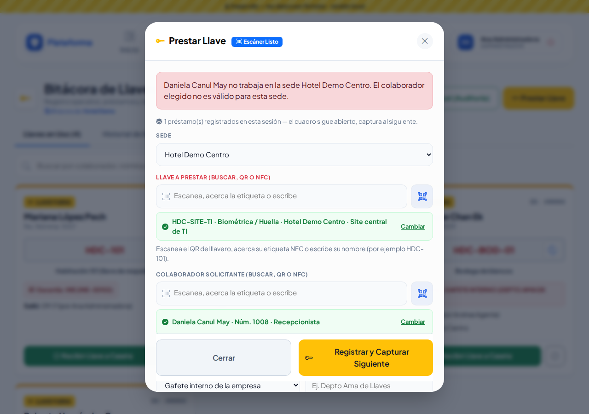

**Reglas:**

- Solo se prestan llaves **activas**, de la **sede** elegida y que **no estén fuera**.
- El colaborador debe estar **activo** y trabajar en esa sede (o ser corporativo). Un colaborador provisional que dio de alta la caseta también puede llevarse una llave.

## Recibir una llave

Cuando la regresan:

1. Busca su ficha en **Llaves en Uso**.
2. Toca **Recibir Llave a Caseta** y confirma.
3. **Devuelve la identificación** que dejó en garantía.

La ficha pasa al **Historial de Entregas** con la hora de regreso y quién la recibió.

## Anular un préstamo (error de captura)

Si te equivocaste de llave o de persona, **no se borra**: se anula.

1. En la ficha, toca el botón gris **⊘** (Anular préstamo) y confirma.
2. La llave queda **disponible de inmediato** y el préstamo pasa al historial como **ANULADO**.

Solo se anula una llave que está **en uso**. Esta opción la tienen el Jefe de seguridad y el Administrador (el Agente no).

**Reactivar**: en el historial, un préstamo anulado tiene el botón **Reactivar**. Si mientras tanto esa llave se volvió a prestar, el sistema no lo permite.

## Historial de una llave

Toca el **reloj** junto al nombre de la llave: ves sus últimos 15 movimientos, quién la usó, quién la entregó y la recibió, y si sigue **AÚN EN USO**.

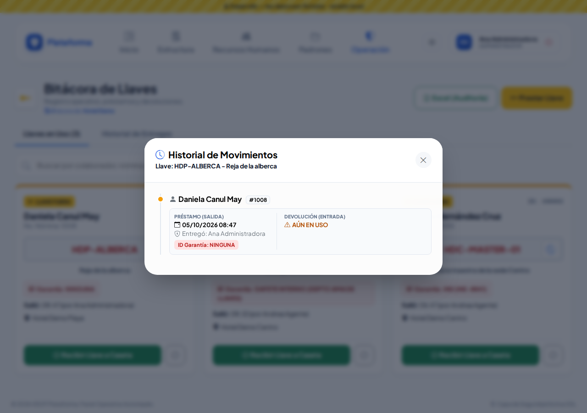

En el **Catálogo de llaves**, una llave prestada muestra **EN USO** y **Usada por**; el enlace **Historial de préstamos** abre esta misma ventana.

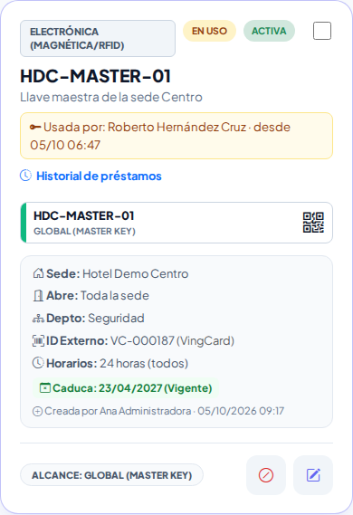

## Excel (Auditoría)

El botón **Excel (Auditoría)** descarga todos los préstamos que puedes ver (si elegiste una sede en el filtro, solo de esa sede): folio, sede, llave, colaborador, garantía, salida, regreso, guardias, estado y anulaciones.

## En el celular

La pantalla se acomoda al celular: botones grandes, una ficha por renglón y el cuadro de préstamo a pantalla completa.

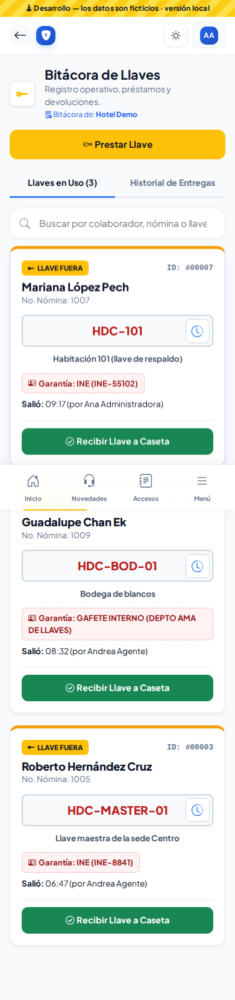
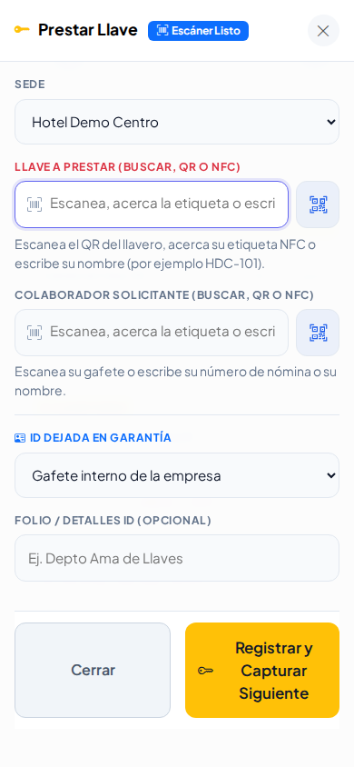

Con el modo **Noche** o **Sol** (botón junto a tu nombre) los colores se adaptan:

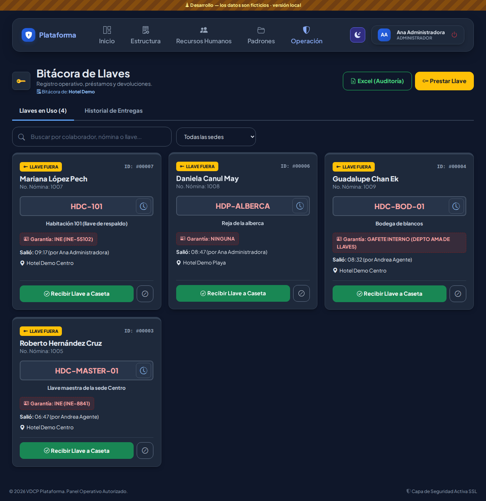
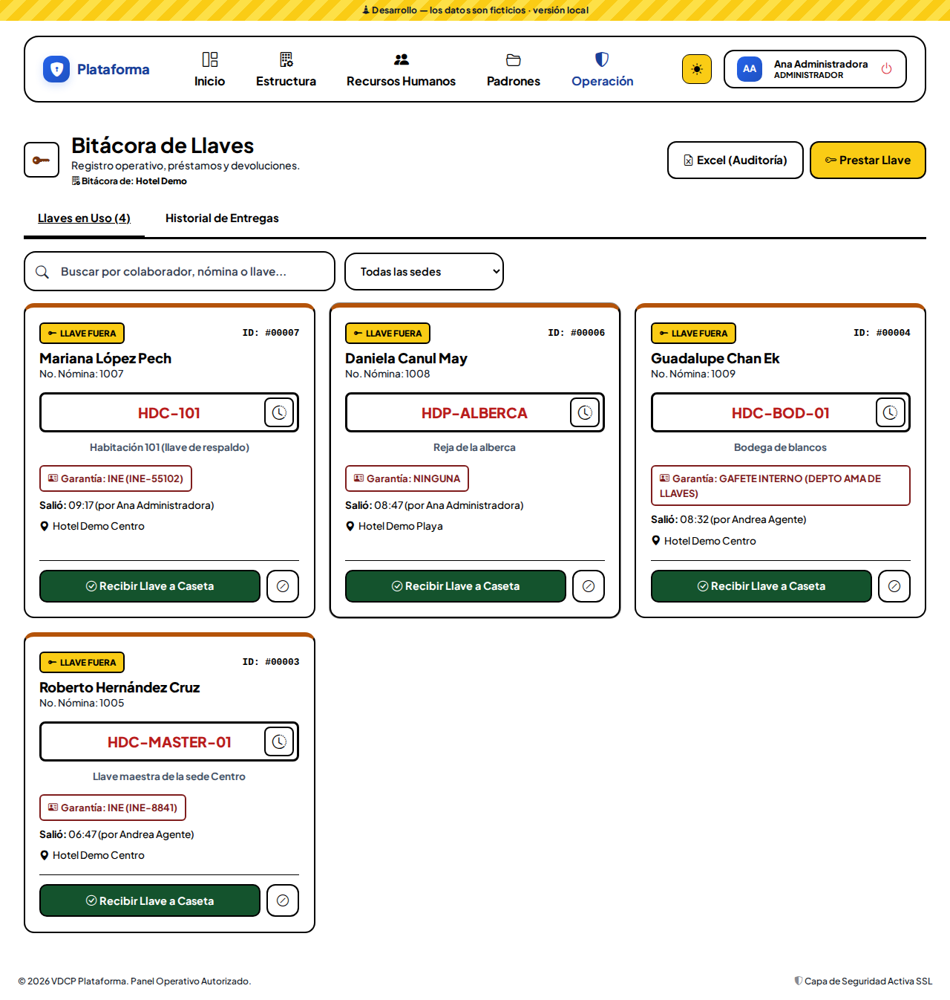

## ¿Quién puede hacer qué?

| Acción | Quién (plantillas) |
|---|---|
| Ver la bitácora y el historial | Todos los roles de Seguridad |
| Prestar y recibir | Administrador, Jefe de seguridad, Asistente, Supervisor y Agente (en su sede) |
| Anular y reactivar | Administrador y Jefe de seguridad |
| Excel (Auditoría) | Administrador, Director, Jefe de seguridad, Asistente y Supervisor |

Cada quien ve solo los préstamos de **sus sedes**.
